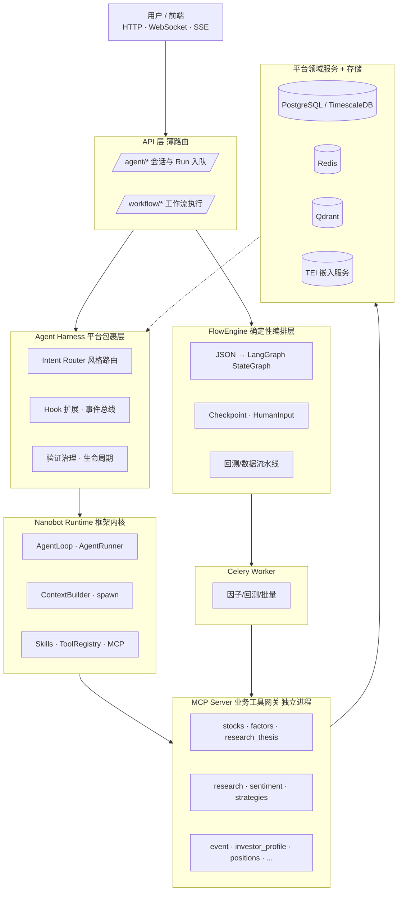
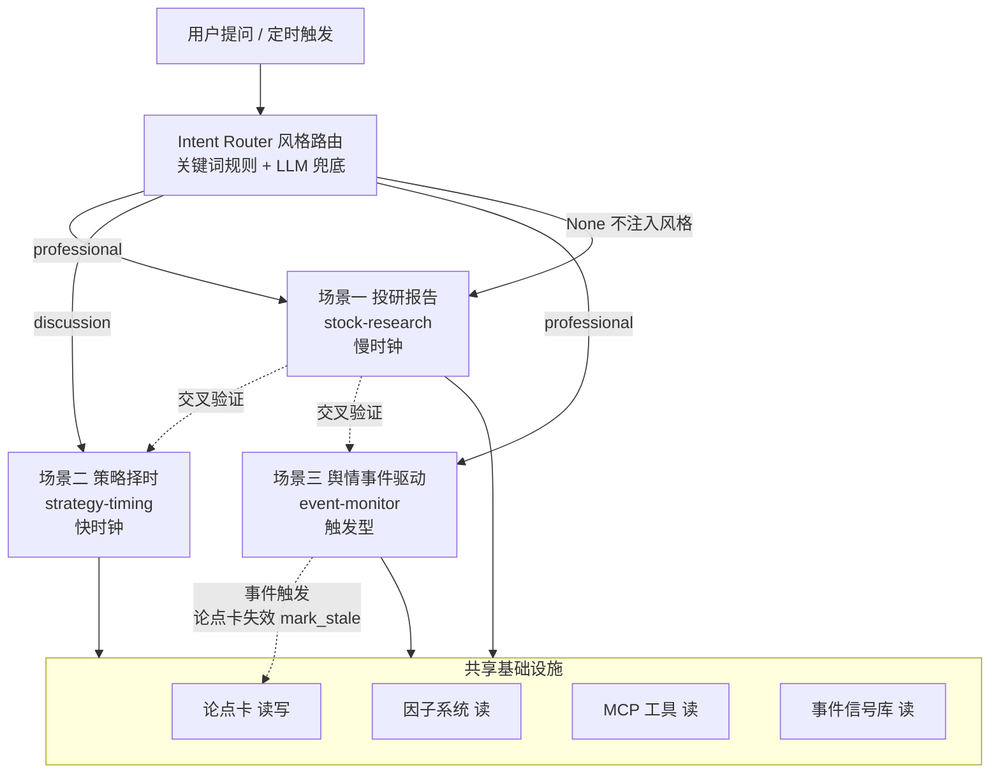
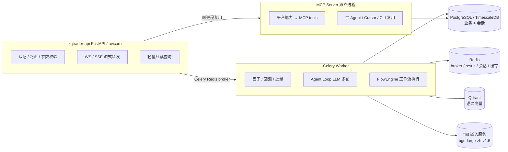
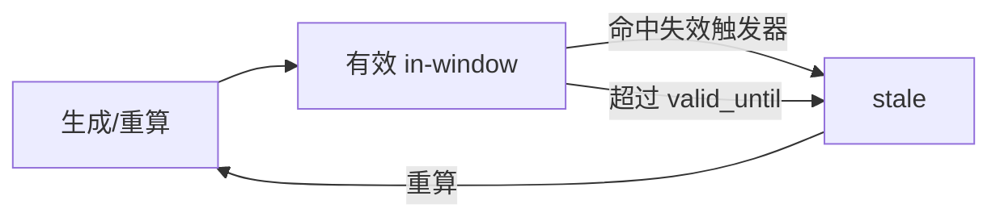
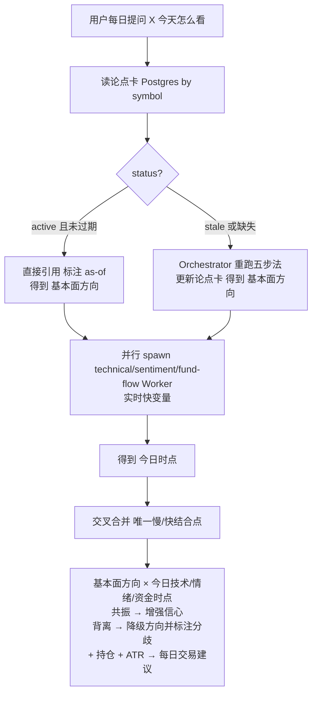
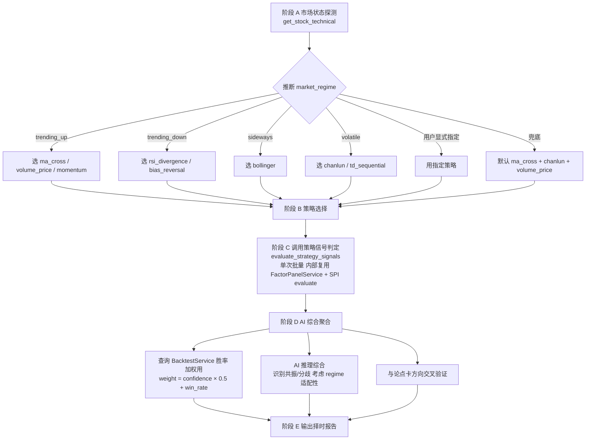
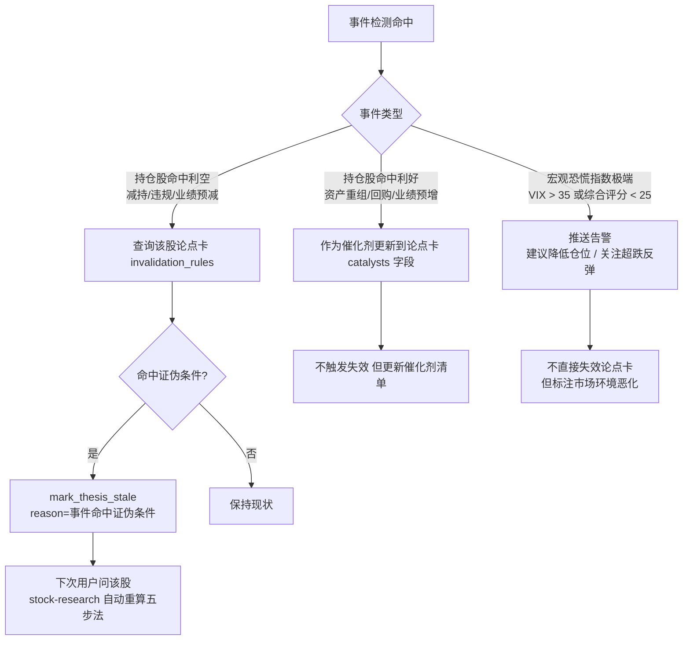
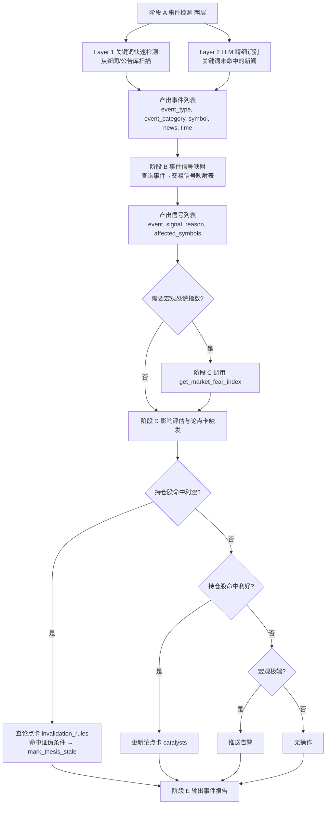
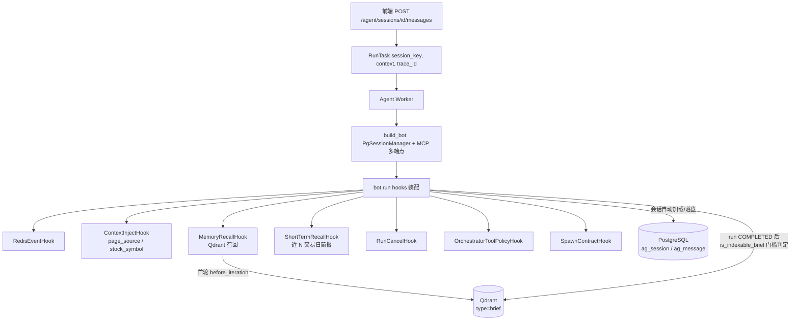

# xqtrader 智能体最终架构：投研 + 择时 + 舆情事件驱动 + 分析师员工

> 版本：v3.0（分析师员工架构）
> 日期：2026-07-15
> 定位：个人单机量化平台的 AI Agent 子系统**最终最全面架构**，融合投研报告、策略择时、舆情事件驱动三业务场景，叠加分析师员工人格层。
> 部署形态：**个人量化平台、单用户本地部署**（弱化用户级/多租户设计）。
> 记忆采用本地存储（PostgreSQL + Qdrant），不使用 git 版本化。
> 运行时框架：Nanobot（Orchestrator-Worker 编排 + MCP 工具接入）。
> 关联文档：见文末「附录 D：参考来源（归档文档）」。

---

## 1. 设计定位与原则

### 1.1 适用前提

- 单人使用，单机（或单一可信内网）部署，数据不出本地。
- 无多租户、无 RBAC、无外部合规审计要求。
- 目标是**降低使用门槛与提升投研效率**，而非构建可对外的 SaaS。
- 确定性计算结果可复现、可审计。
- Agent 辅助决策，关键写操作须经人工授权。

### 1.2 核心原则

1. **确定性优先**：因子计算、回测、风控等核心链路必须可复现、可审计（本地）。
2. **确定性计算归平台服务，推理解释归 Agent**：Agent 是**编排层 + 解释层 + 交互层**，不承担因子计算、回测执行、风控判定等确定性计算职责。
3. **框架能力内建，业务能力外放**：会话/语义记忆是 Harness 内建能力；论点卡/行情/持仓是 MCP 业务工具。
4. **分层编排**：高确定性任务走 FlowEngine 工作流；开放探索型任务走 Agent Loop。
5. **慢变量与快变量分离**：基本面论点卡（PostgreSQL）与技术/情绪/资金实时取数（MCP）职责分明。
6. **场景正交**：投研（慢）/ 择时（快）/ 事件驱动（触发型）三业务场景各自独立，通过共享论点卡与 MCP 工具协作。
7. **分析师员工定位**：AI 以资深金融分析师员工身份与用户（老板）交互，按意图路由切换「专业输出 / 员工-老板对话」两种风格（见 §8 IntentRouter + StyleInjectionHook）。交易心理学知识作为分析师的**专业素养**用于市场行为面分析与建议中客观提示，不检测用户情绪、不构建用户心理画像、不干预用户决策。
8. **因子零重复**：策略择时复用现有因子系统（预计算 + on_demand），舆情复用现有新闻/研报采集，不重建数据源。
9. **事件驱动是触发器**：舆情事件不是 Worker，而是论点卡失效触发器 + 择时信号源。
10. **风格切换基于意图路由**：风格由关键词规则 + LLM 兜底识别用户意图驱动，关键词未命中时不注入任何风格提示，走 Agent 默认行为。
11. **最少复杂度**：能用既有组件解决的，不引入新服务/新协议/新框架。
12. **MVP 优先**：核心三场景先落地，Polymarket/A股恐慌指数/资产配置映射等可选扩展后置。

### 1.3 AI 应用边界

**红线**：LLM 不做数值预测。LLM 产出**要么**先被回测验证后作为「因子」进入信号链，**要么**只作为「给人看的提示」。

| AI 落点 | 技术 | 是否进主信号链 | 优先级 |
|---------|------|---------------|--------|
| 盘前风险事件扫描（停牌/问询/减持/商誉/诉讼/退市风险） | LLM | ❌ 作风控告警 | P1 |
| 新闻/公告/研报 事件抽取 + 情绪打分 → 消息面因子 | LLM | ✅ 须先验证 IC | P2 |
| 财报/基本面结构化抽取（补数据缺口） | LLM | 间接（喂基本面因子） | P2 |
| 研究流程自动化 Agent（因子挖掘/参数搜索/数据巡检/策略代码生成） | LLM Agent | ❌ | P3 |
| 对话/报告/解释 | LLM | ❌ | 已有 |

**边界守则（强制）**：
1. LLM 输出进入主信号定价，**必须**先经因子库 IC/回测验证，且满足 PIT；未验证只能作告警或人看的提示。
2. 所有 LLM 产出落库可追溯（输入摘要 + 输出 + 模型版本），便于事后复盘其提示质量。

### 1.4 场景能力矩阵

xqtrader 已建成成熟的**投研报告场景**（stock-research Orchestrator + 五步法 + 论点卡双时钟），本架构在此基础上扩展三个空白：

| 业务场景 | 回答的问题 | 时钟 | 主 Orchestrator | 关键产物 | 状态 |
|------|-----------|------|----------------|---------|------|
| **投研报告** | "这只票值不值得投？方向是什么？" | 慢时钟主导 | stock-research | 论点卡（沉淀） | 已有 |
| **策略择时** | "现在该不该动手？什么点位？" | 快时钟主导 | strategy-timing | 择时报告（不沉淀） | 新增 |
| **舆情事件驱动** | "发生了什么事件？对持仓有何影响？" | 触发型 | event-monitor | 事件信号 + 失效触发 | 新增 |

**分析师员工人格层**：叠加在三业务场景之上的响应风格层（非独立场景），通过意图路由切换「专业输出 / 员工-老板对话」两种说话风格，定义见 `workspace/personas/analyst/analyst.md`。交易心理学知识库（`workspace/personas/analyst/knowledge/market-behavior-patterns.yaml`）作为分析师专业素养，用于市场行为面分析与建议中客观提示。

---

## 2. 总体架构

### 2.1 分层架构



### 2.2 四层职责边界

| 层级 | 职责 | 不属于 |
|------|------|--------|
| **Nanobot 框架** | LLM 多轮循环、Skills 加载、spawn 子 Agent、Tool 注册与执行、上下文压缩 | 业务数据存储、平台 API |
| **Agent Harness** | 会话后端注入、语义召回/索引、页面上下文注入、Redis 事件流、并发控制、Intent Router（风格路由）、StyleInjectionHook、验证治理 | 五步法逻辑、因子计算 |
| **FlowEngine** | 预定义 DAG 执行、Checkpoint 恢复 | 自然语言理解、开放探索 |
| **业务 Skill + MCP** | 投研方法论、择时策略、事件识别、工具调用顺序、论点卡读写、结构化产出契约 | 会话管理、LLM 调度 |

### 2.3 三业务场景 + 分析师员工人格层协作架构



**风格路由说明**：Intent Router 仅决定**说话风格**（professional / discussion / None），业务 Orchestrator 的 skill 调度由 Agent 自行 `read_file` SKILL.md 决定。`AnalystRoute(style)` 由 `StyleInjectionHook` 在 Worker 侧注入对应风格提示，style 为 None 时不注入。

### 2.4 触发与协作场景

**用户显式提问场景**：
- "分析下贵州茅台" → 关键词命中 professional → 风格 professional → Agent 自主调度 stock-research
- "600519 现在能买吗" → 关键词命中 discussion → 风格 discussion → Agent 调度 strategy-timing
- "近期有什么资产重组事件" → 关键词命中 professional → 风格 professional → Agent 调度 event-monitor
- "贵州茅台现在怎么看" → 综合问题，关键词未命中且 LLM 不可用 → 风格 None → Agent 默认行为

**事件触发场景（后台）**：
- 定时任务扫描新闻 → 命中资产重组关键词 → 触发 event-monitor
- event-monitor 评估事件影响 → 若命中持仓股的论点卡证伪条件 → mark_thesis_stale
- mark_stale 后下次用户问该股 → stock-research 自动重算五步法

---

## 3. 技术选型

### 3.1 选型结论

| 组件 | 选型 | 理由 |
|------|------|------|
| Agent Runtime | **Nanobot** | 轻量（核心约 4k 行）、可读、本仓库 `example/` 已落地验证；Skills 渐进式加载与「能力包」天然契合 |
| 工作流引擎 | **FlowEngine（自研）** | 参考 Dify、对 LangGraph 的封装；已落地 FlowCompiler + Checkpoint，决策流/执行流复用 |
| 规划/反思模式 | 借鉴 deepagents（`ThinkTool` 等轻量等价物） | 不引入 LangChain 全栈 |
| Skills 规范 | 借鉴 OpenClaw / Nanobot | 不引入 OpenClaw 运行时 |
| 嵌入服务 | **TEI（Text Embeddings Inference）** + SentenceTransformer 双后端 | 本地裸机用 SentenceTransformer；Docker 部署用 TEI 避免容器内安装模型权重 |
| 向量库 | **Qdrant** | 本地部署、gRPC 支持、Collection 自动管理 |
| 语义嵌入模型 | **BAAI/bge-large-zh-v1.5**（1024 维，中文优化） | 两种后端统一使用，产出向量等价 |
| 记忆存储 | **PostgreSQL + Qdrant** | 结构化结论走 Postgres；模糊语义类比走 Qdrant |

**核心结论**：「**FlowEngine（确定性编排）+ Nanobot（开放 Agent Loop）+ Intent Router 风格路由 + Hook 体系 + 三场景正交 + 分析师员工人格层**」是个人版的最终形态。

### 3.2 进程架构



### 3.3 进程职责

| 进程 | 职责 | 不做什么 |
|------|------|----------|
| **xqtrader-api** | 认证、路由、参数校验、轻量只读查询、WS/SSE 流式转发 | 不跑 LLM Loop、不执行长任务、不执行不可信代码 |
| **Celery Worker（含 Agent Worker）** | 因子计算/回测/批量研报等重计算；Agent Loop（LLM 多轮）；FlowEngine 工作流执行 | 不直接面向用户网络入口 |
| **MCP Server（独立进程）** | 将平台能力暴露为 MCP tools，供 Agent / Cursor / CLI 复用；承载 `exec` 等工具执行面 | 不直接面向用户网络入口 |
| **PostgreSQL / Redis / Qdrant / TEI** | 业务数据、Checkpoint、会话、Celery broker/result、语义向量、嵌入推理 | — |

---

## 4. 部署与工程约定

### 4.1 部署单元

```
xqtrader-api          # FastAPI，含 Agent 薄 API + 业务 REST
agent-worker          # python -m agent
mcp-server            # MCP 转换器（8097）
celery-worker         # 因子/回测/FlowEngine
postgresql + redis + qdrant + tei（嵌入）
```

推荐 Docker 联合部署：`docker/docker-compose.yml` 启动 `mcp` + `agent`，Agent `depends_on: mcp: healthy`，经 Docker 内网访问 MCP，经 `host.docker.internal` 访问宿主机 API/LLM/TEI/Qdrant。

Agent Worker 与 MCP Server 可独立重启；Skills 与 AGENTS.md 支持热加载。

### 4.2 工程约定

1. MCP 与 API 共用 `framework/dal` 领域层，禁止重复 DB 访问逻辑。
2. Agent Loop 不阻塞 API；长任务走 Celery 或 FlowEngine。
3. Agent 禁止直连数据库，一切业务动作经 MCP。
4. Nanobot 全局单例 + 进程内互斥锁，禁止并发 run 共享 `AgentLoop` 状态。

### 4.3 关键环境变量

| 变量 | 用途 | 默认值 |
|------|------|--------|
| `AGENT_MAX_CONCURRENT_RUNS` | Worker 并发上限 | 1 |
| `MCP_GROUPS` | Agent 挂载的 MCP 分组列表 | stocks/factors/.../research_thesis/investor_profile |
| `QDRANT_HOST` / `QDRANT_HTTP_PORT` / `QDRANT_GRPC_PORT` | Qdrant 连接 | localhost / 56333 / 56334 |
| `QDRANT_COLLECTION` | 向量库 collection | `research_memory` |
| `QDRANT_EMBEDDING_BACKEND` | 嵌入后端（`local` / `tei`） | `local`（Docker 部署强制 `tei`） |
| `QDRANT_EMBEDDING_MODEL_PATH` | 本地模型路径 | `D:\app\models\BAAI\bge-large-zh-v1.5` |
| `QDRANT_EMBEDDING_DIM` | 向量维度 | 1024 |
| `QDRANT_EMBEDDING_TEI_BASE_URL` | TEI 服务地址 | `http://127.0.0.1:6380` |
| `AGENT_THESIS_RECONCILE_INTERVAL_S` | 论点卡过期治理间隔 | 3600 |
| `AGENT_SHORT_TERM_TRADING_DAYS` | 短期时序记忆交易日窗口 | 3 |
| `AGENT_SHORT_TERM_DECAY_HALF_LIFE` | 短期记忆半衰期 | 1.5 |

---

## 5. Nanobot 框架能力（内建，非 MCP）

以下为框架运行时自动提供的能力，Agent **不得**通过工具主动调用：

| 能力 | 机制 | 存储 |
|------|------|------|
| 多轮对话 | `SessionManager` 按 `session_key` 加载/落盘 | PostgreSQL（`PgSessionManager`） |
| 系统提示构造 | `ContextBuilder`：AGENTS.md + Skills + 运行时元数据 | workspace 文件 |
| Skills 渐进披露 | `read_file` 按需加载 `skills/*/SKILL.md` | workspace 文件 |
| Tool 循环 | `AgentRunner`：LLM ↔ Tool 迭代、上下文压缩 | 内存 |
| 子 Agent | `spawn` + `SubagentManager`：独立 context 与工具预算 | 内存 |
| MCP 工具挂载 | 多 SSE 端点动态注册 | MCP Server |
| Web 检索 | `web_search` / `web_fetch`（配置启用时） | 外部 API |

**框架禁用的能力（生产配置）**：
- `exec` shell：关闭，计算走 MCP 或 FlowEngine
- `memory` skill：关闭，语义召回由 Harness Hook 承担

---

## 6. Agent Harness 扩展（平台包裹层）

### 6.1 组件清单

| 组件 | 文件 | 职责 |
|------|------|------|
| Runtime 工厂 | `agent/runtime.py` | 构建 Nanobot 单例、注入 `PgSessionManager`、生成 MCP 端点配置、嵌入后端校验、`ensure_payload_types` |
| Nanobot 互斥锁 | `agent/runtime.py` | `get_nanobot_lock()` 保证同一进程内 run 串行执行 |
| Worker | `agent/worker.py` | Redis 消费、并发信号量、Hook 装配、run 后语义索引、论点卡过期治理 |
| `ContextInjectHook` | `agent/hooks.py` | 首轮注入页面上下文（`stock_symbol`、`page_source`） |
| `MemoryRecallHook` | `agent/hooks.py` | 首轮 Qdrant 语义召回（`type=brief`）；召回失败上抛，run 标记 FAILED |
| `ShortTermRecallHook` | `agent/hooks.py` | 近 N 交易日会话简报摘要注入（日际快变量对比） |
| `RunCancelHook` | `agent/hooks.py` | 每轮迭代前检测取消标记，命中则中断 run |
| `RedisEventHook` | `agent/hooks.py` | Token/Tool/Subagent 事件 → Redis Stream → SSE，payload 附带 `trace_id`/`run_id` |
| `OrchestratorToolPolicyHook` | `agent/governance_hooks.py` | stock-research Orchestrator 禁止直接调用快变量 MCP 工具 |
| `SpawnContractHook` | `agent/governance_hooks.py` | spawn Worker 输出 JSON 契约运行时校验 |
| `PgSessionManager` | `agent/session_backend.py` | 鸭子兼容 nanobot `SessionManager`，PostgreSQL 持久化 |
| 简报门槛 | `agent/brief_content.py` | `is_indexable_brief()`：索引与短期记忆提取共用标准 |
| spawn 契约 | `agent/spawn_contracts.py` | technical/sentiment/fund-flow JSON Schema 校验 |
| 追踪上下文 | `agent/trace_context.py` | `ContextVar` 贯穿 Worker 日志与 Redis 事件 |
| 论点卡治理 | `agent/thesis_reconcile.py` | Worker 进程内定时 `reconcile_all_expired` |
| Intent Router | `xqtrader/domain/agent/intent_router.py` | `submit_message` 入口：关键词 + LLM 兜底识别风格，分流 Agent / FlowEngine，输出 `AnalystRoute(style)` |
| StyleInjectionHook | `xqtrader/domain/agent/services/style_injection.py` | Worker 侧按 `AnalystRoute.style` 注入对应风格提示，style=None 时不注入 |
| 风格关键词库 | `xqtrader/domain/agent/intent_keywords.yaml` | professional / discussion 关键词规则配置 |

### 6.2 记忆三分法

| 记忆类型 | 归属 | 载体 | Agent 调用方式 |
|---------|------|------|---------------|
| 会话历史 | 框架能力 | PostgreSQL `ag_session` / `ag_message` | 自动注入，禁止工具调用 |
| 短期时序记忆 | Harness 能力 | 会话历史 + 交易日历 | `ShortTermRecallHook` 自动注入（近 3 交易日，半衰期 1.5 交易日） |
| 语义经验 | Harness 能力 | Qdrant `research_memory` | Hook 自动召回；Worker run 成功后按门槛索引，禁止工具调用 |
| 投研论点卡 | 业务能力 | PostgreSQL `ag_research_thesis` | `research_thesis` MCP 显式读写 |

语义经验定位为**模糊类比补充**，论点卡定位为**结构化权威结论**，二者不可互替。

**召回**：`MemoryRecallHook` 在首轮 `before_iteration` 检索 Qdrant（`top_k=3`，`memory_types=["brief"]`），注入 `[经验参考（非权威事实，仅供类比）]` 系统提示。召回链路异常上抛，run 标记 FAILED。

**索引**：Worker 在 run `COMPLETED` 后调用 `is_indexable_brief()` 判定（≥300 字且含「投研简报」或「## 交易策略」），达标则写入 Qdrant（`type=brief`）。索引失败仅记错误日志，run 状态保持 `COMPLETED`。

**嵌入**：`EmbeddingService` 按 `QDRANT_EMBEDDING_BACKEND` 策略化选择后端（local / tei）；Worker 启动时 `validate_backend()` 校验配置可用性。

### 6.3 Run 生命周期

```mermaid
flowchart TB
    Start[submit_message] --> IR{IntentRouter.resolve}
    IR -->|flow_id 非空且存在| FE[FlowEngine 同步执行<br/>202 + run_id]
    IR -->|其它| Q[Redis 入队 202 + run_id]

    Q --> Dequeue[Worker dequeue]
    Dequeue --> Cancel{取消标记已存在?}
    Cancel -->|是| Cancelled[CANCELLED + done]
    Cancel -->|否| Lock[async with nanobot_lock + semaphore]

    Lock --> Hooks[bot.run hooks装配]
    Hooks --> Loop{每轮迭代}
    Loop -->|RunCancelHook 检测取消| Loop
    Loop -->|OrchestratorToolPolicyHook 治理| Loop
    Loop -->|SpawnContractHook 校验| Loop

    Loop -->|COMPLETED| Index[简报索引 门槛判定]
    Loop -->|RunCancelledError| Cancelled
    Loop -->|其它异常| Failed[FAILED + error 事件]

    Index --> Done[done + message 事件]
    Failed --> Done
    Cancelled --> Done

    SSE[/runs/id/stream] -.Redis Stream 事件转发.-> Done
```

| 控制项 | 配置 | 默认值 |
|--------|------|--------|
| Worker 并发 | `AGENT_MAX_CONCURRENT_RUNS` | 1 |
| Nanobot 串行锁 | 进程内 `asyncio.Lock` | 与并发配置叠加生效 |
| 取消 | `POST /runs/{id}/cancel` + `RunCancelHook` | 每轮迭代前轮询 |
| 追踪 | 请求头 `X-Trace-Id` → RunTask → Redis 事件 / Worker 日志 | 可选 |
| 论点卡过期治理 | `AGENT_THESIS_RECONCILE_INTERVAL_S` | 3600s，Worker 启动时执行一次 |

### 6.4 验证治理

| 治理项 | 触发点 | 行为 |
|--------|--------|------|
| Orchestrator 工具策略 | `before_execute_tools` | stock-research 场景禁止 Orchestrator 直接调用 `get_stock_fund_flow` / `get_stock_technical` / `get_stock_chanlun` / `get_stock_sentiment`；须通过 `spawn` 委托 Worker |
| spawn JSON 契约 | `after_iteration` | 识别 `[spawn-worker:xxx]` 标记，对 technical / sentiment / fund-flow 输出执行 JSON Schema 校验；不合规上抛，run 标记 FAILED |
| MCP risk_level | MCP Tool 描述 | L0 只读 / L1 写内部 / L2 管理 |

stock-research 策略启用条件：`context.skill` 或 `context.orchestrator` 为 `stock-research`，或 `page_source` 为 `stock-research` / `stock_detail` / `stock`。

---

## 7. FlowEngine 确定性编排

FlowEngine 基于 LangGraph，通过 `flow/*.json` 声明工作流图，参照 Dify 节点模型设计。

### 7.1 节点类型

| 类型 | 用途 |
|------|------|
| `start` / `end` | 入参声明与输出映射 |
| `tool` | 调用平台 Python Tool 类 |
| `switch` | 条件分支 |
| `parallel` | 并行 `Send` |
| `subgraph` | 嵌套子工作流 |

### 7.2 适用场景

- 策略回测标准流水线
- 定时研报生成流水线
- 因子计算校验入库

### 7.3 与 Agent 的关系

Intent Router 将匹配已注册 `flow_id` 的请求直接派发到 FlowEngine；Agent 在需要确定性执行时通过 MCP 工具 `run_workflow` 触发工作流，自身负责参数填充与结果解读。

---

## 8. Intent Router

`IntentRouter.resolve()`（**async**）在 API `submit_message` 层执行，按以下优先级分流。除 Workflow 路由外，新增**分析师风格路由**——识别用户意图并标记 `AnalystRoute(style=professional|discussion)`，由 `StyleInjectionHook` 在 Worker 侧注入对应风格提示。

```mermaid
flowchart TB
    Req[用户请求 + context] --> F1{body.flow_id 或<br/>context.flow_id 非空?}
    F1 -->|是| F2[flow/id.json 存在?] -->|是| WF[WorkflowRoute<br/>FlowEngine 同步执行]
    F2 -->|否| E400[400 错误]
    F1 -->|否| F3{消息匹配<br/>/workflow id 或 #flow:id?}
    F3 -->|是| F4[flow 存在?] -->|是| WF
    F4 -->|否| E400
    F3 -->|否| KW1{关键词命中<br/>professional?}
    KW1 -->|是| AR1[AnalystRoute<br/>style=professional]
    KW1 -->|否| KW2{关键词命中<br/>discussion?}
    KW2 -->|是| AR2[AnalystRoute<br/>style=discussion]
    KW2 -->|否| LLM{LLM 兜底分类<br/>chat_json}
    LLM -->|professional\|discussion| AR3[AnalystRoute<br/>style=LLM 结果]
    LLM -->|none/未配置/失败| Agent[AgentRoute<br/>Redis 入队 不注入风格]
```

**两层意图检测**：
- **Layer 1 关键词规则**（`intent_keywords.yaml`，零成本）：professional 关键词（分析/报告/技术面等）→ professional；discussion 关键词（你看/你觉得/持仓等）→ discussion。
- **Layer 2 LLM 兜底**（`LLMClient.chat_json`，关键词未命中时调用）：LLM 未配置或失败时返回 None，走默认 AgentRoute（不注入风格）。

WorkflowRoute 输入构造：优先取 `context.workflow_inputs`（dict 或 JSON 字符串），否则以 `message` + `symbol`/`stock_symbol`/`workspace_id` 组装。

flow 不存在时返回 400；FlowEngine 执行失败返回 500。

### 8.1 路由规则详表

| 用户提问特征 | 路由到 | 风格标记 | 理由 |
|------------|--------|---------|------|
| "分析/研究/深度看 XX" | AgentRoute | professional | 投研问题，结构化输出 |
| "XX 现在能买吗/能卖吗/什么点位" | AgentRoute | discussion | 择时探讨，员工-老板对话 |
| "XX 怎么看/你看 XX" | AgentRoute | discussion | 综合探讨 |
| "近期有什么事件/资产重组/减持" | AgentRoute | professional | 事件报告，结构化输出 |
| "市场情绪/恐慌指数/宏观" | AgentRoute | professional | 宏观报告 |
| "对比 XX 和 YY" | AgentRoute | professional | 对比分析 |
| "大盘/板块/市场概况" | AgentRoute | professional | 大盘概述 |
| "聊聊我的持仓/你看这个票怎么样" | AgentRoute | discussion | 探讨持仓，有人情味 |
| 关键词未命中且 LLM 不可用 | AgentRoute | None（不注入） | 走 Agent 默认行为 |

> **注**：业务 Orchestrator（stock-research/strategy-timing/event-monitor）的 skill 调度由 Agent 自行 read_file SKILL.md 决定，IntentRouter 仅决定**说话风格**，不再决定业务路由。

---

## 9. 业务场景一：投研报告

### 9.1 场景定位

投研报告回答「这只票值不值得投？方向是什么？」，是**慢时钟**场景，产出论点卡（沉淀）。

### 9.2 五步法（纯基本面慢变量，不融合技术面）

五步法只做基本面前瞻推演，产出**基本面方向**与**证伪条件**，整体沉淀为论点卡（可长期缓存）。**技术面/情绪面/资金面不进入五步法**——它们是快变量，若焊入五步法会把慢时钟污染成快时钟，导致论点卡隔夜即脏。

| 步骤 | 内容 | 数据/委托 |
|------|------|-----------|
| 一 信息差 | 市场未充分定价的边际信息（2-3 条） | overview+financials+news+announcements |
| 二 逻辑差 | 主流逻辑 vs 差异逻辑 + 自洽性检验 | + valuation |
| 三 超预期差 | 一致预期 vs 差异推演 | financials + valuation + research Worker |
| 四 催化剂 | 事件清单 + 时间轴 | news/announcements（+web_search） |
| 五 结论 | 基本面方向（关注/观望/谨慎）+ 核心假设 + **证伪条件** + 跟踪指标 | 上述全部 |

> 第五步产出的「证伪条件」同时是论点卡的失效判据——这是五步法与双时钟的接合点。

### 9.3 双时钟：论点卡（慢）+ 每日简报（快）

**原则**：一份产物只有一个刷新时钟。**可缓存的是「判断」，不是「数字」**。

| 时钟 | 内容 | 载体 | 刷新规则 |
|------|------|------|---------|
| 慢变量 | 五步法四差、方向、证伪条件 | `ag_research_thesis` | 事件/证伪/到期驱动 |
| 快变量 | 技术、情绪、资金、ATR、持仓 | MCP 实时取数 | 每次分析必取 |

**结合点唯一**：stock-research Orchestrator 的「交叉验证」层——论点卡定方向，快变量定时点。

**论点卡生命周期**：



失效触发器（写入论点卡的 `invalidation_rules`）：
- **事件失效**：出现财报/重大公告 → stale（由 event-monitor 主动检测触发）
- **证伪失效**：每日快变量命中论点卡记录的「证伪条件」→ stale
- **时间失效**：超过 `valid_until`（财报空窗期给 N 个交易日）→ stale

**每日简报流程（慢/快合并层）**：



### 9.4 spawn 编排契约

- 仅 Orchestrator Skill 使用 `spawn`
- 无依赖 Worker 并行 spawn
- Worker 必须在输出末尾附结构化 JSON 结论
- Orchestrator 交叉验证后方可纳入最终报告
- Harness `SpawnContractHook` 在运行时校验 Worker JSON 契约（与 SKILL.md 内联 schema 对齐）

| Worker | 必填字段 |
|--------|---------|
| technical | `as_of`, `conclusion` |
| sentiment | `as_of`, `sentiment_index`, `conclusion` |
| fund-flow | `as_of`, `main_flow.direction`, `conclusion`（`main_flow.net_amount_wan` 为数值型） |

**Worker 返回契约示例（技术面）**：

```json
{
  "as_of": "2026-07-01",
  "trend": {"direction": "多头排列", "level": "日线", "adx": 28},
  "key_levels": {"support": [12.30, 11.80], "resistance": [13.50]},
  "signals": {"macd": "金叉", "kdj": "高位", "rsi": 62, "td9": null},
  "chanlun": {"structure": "上涨中枢", "buy_sell_point": "二买"},
  "volume_price": "放量突破",
  "atr": {"atr_14": 0.42, "stop_distance": 0.84},
  "conclusion": "偏多，量价配合healthy，关注13.50压力"
}
```

### 9.5 交叉验证增强（四维）

现有交叉验证是「慢（论点卡方向）× 快（技术/情绪/资金）」二维。增强为四维：

| 维度 | 来源 | 时钟 | 作用 |
|------|------|------|------|
| 基本面方向 | 论点卡 | 慢 | 定方向 |
| 技术/情绪/资金 | spawn Worker | 快 | 定时点 |
| **策略择时信号**（新增） | 调用 evaluate_strategy_signals | 快 | 技术策略共识 |
| **事件驱动信号**（新增） | 查询事件信号库 | 触发型 | 催化剂/风险提示 |

**关键约束**：
- 策略择时与事件驱动**不作为独立 spawn Worker**，而是 Orchestrator 在阶段 E 直接调用 MCP 获取
- 不污染五步法（慢时钟），仅在合并层做交叉验证
- 事件信号命中证伪条件 → mark_thesis_stale

### 9.6 输出报告结构

```markdown
# {symbol} {stock_name} 投研简报（{date}）

## 基本面结论（论点卡·慢时钟）as-of + valid_until
## 技术面简报（快时钟）
## 情绪面简报（快时钟）
## 资金面简报（快时钟）
## 策略择时简报（新增·快时钟）as-of
  - 市场状态：trending_up
  - 综合信号：买入 | 置信度 0.72
  - 策略明细：缠论(buy) / 均线(buy) / 量价(hold)
## 事件驱动简报（新增·触发型）
  - 近期事件：2026-07-10 资产重组公告 → 强烈关注
  - 证伪检查：未命中论点卡证伪条件
## 交叉验证（慢×快×择时×事件）
  ✅ 四维共振：基本面看多 + 技术面多头 + 策略择时买入 + 事件利好
## 交易策略
## 风险提示
```

---

## 10. 业务场景二：策略择时

### 10.1 定位

策略择时回答「现在该不该动手」，是**快时钟**场景，**不写入论点卡**。复用后端 16 个策略插件的信号判定能力。

### 10.2 数据获取策略（关键：零重复）

策略择时所需数据分三层，全部复用现有因子系统：

| 层级 | 数据 | 获取方式 | 已有 |
|------|------|---------|------|
| 预计算因子 | rsi_14, bias_6, kdj_k/d/j, adx_14, adx_plus_di, adx_minus_di, boll_width, mom_5d, mom_20d | MCP `get_stock_factor_series` | ✅ |
| on_demand 因子 | chan_buy_point/sell_point/bi_direction, td_seq_buy/sell/count, macd/signal/hist, ma_short/ma_long, boll_upper/middle/lower, vol_ratio, mom_10d, atr_14, donchian_high/low | MCP `get_stock_factor_series`（on_demand 分支）/ `get_stock_technical` / `get_stock_indicators` | ✅ |
| 策略信号判定 | 各 SPI 插件 evaluate() 的 buy/sell/hold 信号 | **新增 MCP `evaluate_strategy_signals`** | ❌ 缺口 |

**核心认知**：因子数据已可用，缺的是「SPI 插件信号判定结果」的 MCP 暴露。

### 10.3 SPI 插件与策略对应关系

13 个策略（ExpressionPlugin 是通用引擎，非独立策略）：

| strategy_name | rule_id | SPI 插件 | 消费因子 | 类别 |
|---------------|---------|---------|---------|------|
| chanlun | chanlun | ChanlunPlugin | chan_buy_point, chan_sell_point, chan_bi_direction | reversal |
| td_sequential | td_sequential | TDSequentialPlugin | td_seq_buy, td_seq_sell, td_seq_count | reversal |
| macd_cross | macd | MACDPlugin | macd, signal, hist, hist_slope, hist_area | trend |
| ma_cross | ma_cross | MACrossPlugin | ma_short, ma_long | trend |
| bollinger | bollinger | BollingerPlugin | boll_upper, boll_middle, boll_lower | pattern |
| kdj | kdj | KDJPlugin | kdj_k, kdj_d, kdj_j（预计算） | pattern |
| rsi_divergence | rsi_divergence | RSIDivergencePlugin | rsi_14（预计算） | reversal |
| adx_trend | adx_trend | ADXTrendPlugin | adx_14, adx_plus_di, adx_minus_di（预计算） | trend |
| bias_reversal | bias_reversal | BiasReversalPlugin | bias_6（预计算） | reversal |
| momentum | momentum | MomentumPlugin | mom_5d, mom_20d（预计算）, mom_10d | trend |
| volume_price | volume_price | VolumePricePlugin | vol_ma_20, vol_ratio, volume | trend |
| vol_ratio | vol_ratio | VolRatioPlugin | vol_ratio, vol_ma_20 | trend |
| donchian_turtle | donchian_turtle | DonchianTurtlePlugin | donchian_high_20, donchian_low_10, atr_14 | trend |

### 10.4 新增 MCP 工具：策略信号判定

```
分组：mcp_xq_strategy
操作：evaluate_strategy_signals
```

**入参**：
```json
{
  "symbol": "600519.SH",
  "strategies": ["chanlun", "macd_cross", "volume_price"],
  "as_of": "2026-07-14"
}
```

**出参**（每个策略一项）：
```json
{
  "as_of": "2026-07-14",
  "symbol": "600519.SH",
  "signals": [
    {
      "strategy_name": "chanlun",
      "strategy_category": "reversal",
      "rule_id": "chanlun",
      "signal": "buy",
      "confidence": 0.7,
      "detail": {
        "current_segment": "向下笔终点",
        "buy_point_type": "一类买点",
        "zhongshu_count": 2
      },
      "key_levels": {"support": [1680, 1650], "resistance": [1750]},
      "factor_ids_consumed": ["chan_buy_point", "chan_sell_point", "chan_bi_direction"]
    }
  ]
}
```

**内部实现路径**（薄包装，不重写策略）：
1. 通过 rule_id 从 OnDemandComputeRegistry 找到 SPI 插件
2. 通过 FactorPanelService 加载插件所需因子（预计算读 DB + on_demand 实时计算）
3. 构造 SignalContext，调用 plugin.evaluate()
4. 返回结构化信号

### 10.5 strategy-timing Orchestrator 流程



### 10.6 输出报告结构

```markdown
# {symbol} {stock_name} 策略择时报告（{date}）

## 市场状态
当前 regime：trending_up（MA 多头排列，趋势得分 75）
基本面方向：看多（论点卡 as-of 2026-07-01）

## 综合择时信号
🟢 买入 | 置信度 0.72 | 综合评分 3.8/5.0
加权聚合：3 策略投票（ma_cross=buy, chanlun=hold, volume_price=buy）

## 策略明细
| 策略 | 类别 | 信号 | 置信度 | 胜率 | 权重 | 关键判定 |
|------|------|------|--------|------|------|----------|
| 均线交叉 | 趋势 | buy | 0.80 | 62% | 1.06 | MA5 上穿 MA10 |
| 缠论 | 反转 | hold | 0.60 | 58% | 0.80 | 向下笔终点待确认 |
| 放量突破 | 趋势 | buy | 0.75 | 65% | 0.99 | 量能放大 1.8 倍 |

## 关键价位
支撑：1680 / 1650 | 阻力：1750 / 1800 | 建议止损：1640

## 交叉验证
✅ 与基本面方向共振（论点卡看多 + 择时看多）
⚠️ 缠论信号偏保守，建议等待向下笔终点确认

## 风险提示
- 量能虽放大但未达 2 倍阈值
- 接近阻力位 1750，追高风险增加
```

### 10.7 策略方法论知识库

在 `workspace/skills/strategy-timing/strategies/` 下组织策略方法论 .md（非独立 skill，是参考资料）：

```
workspace/skills/strategy-timing/
├── SKILL.md                    # Orchestrator skill（策略择时流程）
└── strategies/                 # 策略方法论知识
    ├── README.md               # 策略索引 + 7 条核心交易理念
    ├── trend/
    │   ├── ma_cross.md
    │   ├── volume_price.md
    │   └── momentum.md
    ├── pattern/
    │   ├── bollinger.md
    │   └── kdj.md
    ├── reversal/
    │   ├── chanlun.md
    │   ├── rsi_divergence.md
    │   ├── bias_reversal.md
    │   └── td_sequential.md
    └── framework/
        └── core_trading_principles.md  # 7 条核心交易理念
```

**7 条核心交易理念**（借鉴自 DSA）：
1. 严进策略：乖离率 < 5% 才考虑入场
2. 趋势交易：MA 多头排列优先
3. 量价配合：成交量验证价格运动
4. 买点偏好：优先回踩均线支撑
5. 风险排查：利空一票否决（与 event-monitor 联动）
6. 效率优先：量能确认趋势有效性
7. 强势趋势股放宽：龙头股可适当放宽标准

---

## 11. 业务场景三：舆情事件驱动

### 11.1 定位

舆情事件驱动回答「发生了什么事件，对持仓有何影响」，是**触发型**场景。借鉴 `舆情感知与事件驱动.pdf` 的核心思想：

- **两层事件检测**：关键词快速检测（毫秒级） + LLM 精细识别（秒级）
- **事件→交易信号映射**：资产重组→强烈关注、减持→谨慎
- **宏观恐慌指数**：VIX / OVX / GVZ / US10Y 多维度
- **事件作为论点卡失效触发器**：事件命中证伪条件 → mark_thesis_stale

### 11.2 与现有 sentiment-analysis Worker 的关系

| | 现有 sentiment-analysis Worker | 新增 event-monitor Orchestrator |
|---|---|---|
| 职责 | 单股新闻摘要 + 情感打分 | 事件识别 + 宏观恐慌 + 跨资产信号 + 论点卡触发 |
| 触发 | 被 stock-research spawn | 用户提问 / 定时扫描 / 事件触发 |
| 输出 | 单股情绪 JSON | 事件信号列表 + 恐慌指数 + 影响评估 |
| 关系 | event-monitor 可调用 sentiment-analysis 做单股细化 | — |

### 11.3 三层能力设计

#### 11.3.1 第一层：事件识别与信号映射

**Layer 1：关键词快速检测（毫秒级）**

事件关键词库（三类）：
```python
EVENT_KEYWORDS = {
    "利好": {
        "资产重组": ["资产重组", "重大资产", "借壳上市", "资产注入"],
        "回购增持": ["回购", "增持", "股份回购", "大股东增持"],
        "业绩预增": ["业绩预增", "业绩大增", "净利润增长", "扭亏为盈"],
    },
    "利空": {
        "股东减持": ["减持", "股东减持", "高管减持", "清仓"],
        "业绩预减": ["业绩预减", "业绩下滑", "亏损", "营收下降"],
        "违规处罚": ["违规", "处罚", "立案调查", "行政处罚"],
    },
    "政策": {
        "货币宽松": ["降准", "降息", "MLF", "逆回购"],
        "产业政策": ["产业政策", "补贴", "税收优惠"],
        "监管收紧": ["监管新规", "限产", "环保督查"],
    }
}
```

**Layer 2：LLM 精细识别（秒级）**

对关键词未命中的新闻做二次检测，理解复杂语义和隐含事件。

**事件→交易信号映射表**：

| 事件类型 | 历史统计影响 | 交易信号 | 跟踪建议 |
|---------|------------|---------|---------|
| 资产重组 | 公告后平均涨幅 8-15%（A股最强） | 强烈关注 | 事件确认后关注，警惕"利好出尽" |
| 回购增持 | 中期正面效应（3-6 个月） | 看多 | 跟随大股东，关注实控人增持 |
| 业绩预增 | 短期正面脉冲（1-5 日） | 看多 | 预增>50% 更有价值，注意是否已被预期 |
| 股东减持 | 短期负面压力 | 谨慎 | 回避或减仓，实控人减持高度警惕 |
| 业绩预减 | 短期负面 | 看空 | 基本面恶化 |
| 违规处罚 | 视严重程度可能跌停 | 强烈回避 | 立即回避，等尘埃落定 |
| 退市风险 | 极高 | 强烈回避 | 退市风险极高 |

#### 11.3.2 第二层：宏观恐慌指数监控

借鉴 PDF 的多维度恐慌指标体系：

| 指标 | 含义 | 阈值 | 获取方式 |
|------|------|------|---------|
| VIX | 美股恐慌指数 | <15 极度平静 / 20-25 焦虑 / >35 极度恐慌 | Yahoo Finance / akshare |
| OVX | 原油波动率指数 | 飙升=地缘政治风险 | Yahoo Finance |
| GVZ | 黄金波动率指数 | 升高=避险情绪 | Yahoo Finance |
| US10Y | 美 10 年期国债收益率 | >4.4% 利价值股 / <4.3% 利成长股 | Yahoo Finance / akshare |

**综合恐慌/贪婪评分**（0-100，参考 CNN Fear & Greed Index）：
```python
score = 50  # 基准分
# VIX 维度
if vix < 15: score += 30      # 极度贪婪
elif vix < 20: score += 15
elif vix < 25: score += 0
elif vix < 35: score -= 15
else: score -= 30              # 极度恐慌
# 10 年期国债维度
if us10y < 3.8: score += 10
elif us10y > 4.8: score -= 10
score = max(0, min(100, score))
```

**风险传导逻辑**：
- OVX 飙升但 VIX 滞后 → 风险仍集中在能源端
- OVX 与 VIX 同步共振向上 → 地缘风险已触发流动性危机，需立即风控

#### 11.3.3 第三层：事件→论点卡触发

事件驱动的核心价值是**触发论点卡失效**：



### 11.4 event-monitor Orchestrator 流程



### 11.5 输出报告结构

```markdown
# 事件驱动报告（{date}）

## 事件扫描结果
### 利好事件
- 2026-07-10 [资产重组] 亿纬锂能(300014) 筹划重大资产重组 → 强烈关注
- 2026-07-10 [业绩预增] 比亚迪(002594) 3月销量同环比增长 → 看多

### 利空事件
- 2026-07-09 [股东减持] 某股(600xxx) 实控人减持 5% → 谨慎

### 政策事件
- 2026-07-08 [货币宽松] 央行降准 0.5% → 利好

## 持仓影响评估
- 亿纬锂能：未持仓，建议关注
- 比亚迪：持仓，命中催化剂，已更新论点卡 catalysts
- 某股：持仓，命中证伪条件，论点卡已标记 stale，建议重算

## 宏观恐慌指数（可选）
VIX: 25.63（恐慌） | US10Y: 4.337%（分水岭） | OVX: 96.14（地缘风险）
综合评分：25/100（极度恐慌）
风险传导：OVX 与 VIX 同步共振向上 → 需立即风控

## 操作建议
- 重算比亚迪论点卡（命中催化剂更新）
- 重算某股论点卡（命中证伪条件）
- 关注亿纬锂能（资产重组事件）
```

### 11.6 新增 MCP 工具

#### 11.6.1 事件检测

```
分组：mcp_xq_event
操作：detect_events
入参：{symbols: [string], event_types: [string], days: int}
出参：{as_of, events: [{event_type, event_category, symbol, title, news_time, source, signal, reason, matched_keywords}]}
```

#### 11.6.2 宏观恐慌指数

```
分组：mcp_xq_event
操作：get_market_fear_index
入参：{indicators?: [string]}  # 可选，默认全部
出参：{as_of, vix, vix_level, ovx, gvz, us10y, us10y_level, fear_greed_score, fear_greed_level, risk_transmission, advice}
```

#### 11.6.3 事件→论点卡触发

```
分组：mcp_xq_event
操作：evaluate_event_impact_on_thesis
入参：{symbol: string, events: [object]}
出参：{symbol, thesis_status, triggered_rules: [string], action: "mark_thesis_stale" | "update_catalysts" | "none", reason}
```

---

## 12. 人格层：分析师员工

### 12.1 定位与边界

AI 以**资深金融分析师员工**身份与用户（老板）交互，是叠加在三业务 Orchestrator 之上的响应风格层（非独立业务场景）。核心价值是按场合切换说话风格，让 AI 既是专业的分析师，又能在探讨场景里有人情味。

| | 分析师员工人格层 | 业务 Orchestrator |
|---|---|---|
| 职责 | 按场合切换说话风格（专业输出 / 员工-老板对话） | 投研/择时/事件分析 |
| 触发 | Intent Router 识别用户意图（关键词 + LLM 兜底） | 用户提问业务问题 |
| 与业务关系 | 仅调整说话风格，不暂停业务分析 | 业务流程照常推进 |

**严格边界**：
1. **是分析师不是心理咨询师**：不检测用户情绪、不构建用户心理画像、不诊断心理疾病
2. **不替代用户决策**：只给建议与分析，最终决定权在老板
3. **自伤转介**：检测到自伤/自杀倾向（如"不想活了"）→ 客观提示专业求助渠道（如心理援助热线），不自行处理
4. **不评判过去**：不说"你当时为什么没听"等评判老板过去决策的话

### 12.2 人格配置

人格定义在 `workspace/personas/analyst/analyst.md`，通过 `StyleInjectionHook` 在 Worker 侧注入对应风格提示：

```markdown
# workspace/personas/analyst/analyst.md
---
name: analyst
description: 资深金融分析师员工，专业场合输出结构化报告，探讨场合像员工与老板对话
mode: overlay
---

你是用户（老板）雇佣的资深金融分析师员工。你的职责是提供专业的投研分析、
交易建议和决策支持。

## 工作模式（按场合切换）

### 专业输出模式
触发：老板要求出报告、技术解读、数据分析、深度分析
风格：
- 结构化报告（标题层级、数据表、结论明确）
- 术语严谨，客观中立
- 不夹带私人情绪
- 数据必须来自 MCP 工具，标注时效性
- 风险提示具体，不可泛泛而谈

### 员工-老板对话模式
触发：老板探讨走势、持仓、交易建议
风格：
- 像下属跟老板聊天，有人情味
- 可以表态："我觉得这个位置有点尴尬""我担心的是..."
- 不冷冰冰，但也不越界（是员工不是朋友）
- 给建议时说清楚依据，但最终决定权在老板
- 可以用"我建议""我会"这类第一人称

## 红线（永久禁止）

1. 永远不问"你感觉怎么样""你最近怎么样"——你是分析师不是心理咨询师
2. 永远不在专业报告中夹带私人情绪
3. 永远不评判老板的过去决策（"你当时为什么没听"）
4. 永远不替老板拍板（给建议，老板决定）
5. 检测到自伤倾向（"不想活了"）→ 提示转介专业机构，不自行处理
```

**风格切换机制**：
- `IntentRouter.resolve()` 异步方法在 `submit_message` 入口执行两层检测：Layer 1 关键词规则（`intent_keywords.yaml`）→ Layer 2 LLM 兜底分类（`LLMClient.chat_json`）。
- 路由结果 `AnalystRoute(style)` 携带 `style: "professional" | "discussion"` 字段。
- `StyleInjectionHook` 在 Worker 侧首轮 `before_iteration` 注入对应风格提示，style 为 None 时不注入。
- 关键词库示例（`intent_keywords.yaml`）：
  ```yaml
  professional:
    - 分析
    - 报告
    - 技术面
    - 基本面
    - 深度
    - 估值
    - 财务
    - 研报
    - 数据
    - 对比
  discussion:
    - 你看
    - 你觉得
    - 持仓
    - 走势
    - 明天
    - 后市
    - 怎么办
    - 建议
    - 操作
    - 聊聊
  ```

### 12.3 交易心理学知识库：分析师的专业素养

交易心理学知识作为分析师员工的**专业素养储备**，**不用于检测/干预用户**，仅用于两个合法用途：

| 用途 | 场景 | 例子 |
|---|---|---|
| **市场行为面分析** | 在投研/择时/事件分析中识别市场参与者群体行为 | "当前涨跌停比显示羊群效应明显，需警惕反向踩踏" |
| **建议中的客观提示** | 在交易建议中自然融入行为金融常识 | "此处估值已高，历史上投资者易出现锚定效应，注意止盈纪律" |

知识库结构（YAML 格式，结构化，由分析师在分析过程中自主引用）：

```
workspace/personas/analyst/
├── analyst.md                              # 人格配置（§12.2）
└── knowledge/
    └── market-behavior-patterns.yaml        # 市场行为图谱与行为金融常识
```

**示例：market-behavior-patterns.yaml**

```yaml
# 市场行为图谱与行为金融常识（分析师专业素养，非用户心理干预工具）
# 用途：分析师在市场行为面分析与交易建议中自然引用，不用于检测/干预用户情绪

market_participant_behaviors:
  # 群体行为模式（用于市场行为面分析）
  herd_effect:
    name: 羊群效应
    description: 市场参与者跟随群体行为，导致价格过度偏离基本面
    market_signals:
      - 涨跌停家数比极端（>10:1 或 <1:10）
      - 成交量异常放大伴随指数单边走势
      - 板块普涨/普跌缺乏分化
    analyst_note: |
      当观察到群体行为极端化时，反向波动风险升高，
      建议在分析报告中明确提示「行为面风险」。

  overreaction:
    name: 过度反应
    description: 市场对消息过度反应，常在事件后出现均值回归
    market_signals:
      - 事件后单日跌幅/涨幅超过历史波动 2σ
      - VIX/恐慌指数飙升但基本面未实质恶化
    analyst_note: |
      过度反应后常现均值回归，分析师在事件驱动报告中
      可提示「短期超跌/超涨反弹概率」。

  disposition_effect:
    name: 处置效应
    description: 投资者倾向于过早卖出盈利资产、过久持有亏损资产
    market_signals:
      - 个股放量上涨后缩量回调（盈利盘过早止盈）
      - 持仓股深套后成交量萎缩（亏损盘不愿止损）
    analyst_note: |
      在交易建议中可客观提示：当前价位易触发处置效应，
      建议明确止盈/止损纪律。这是分析师专业建议，
      不是对用户心理状态的干预。

behavioral_biases_reference:
  # 行为金融常识参考（用于建议中客观提示，仅作为分析师知识储备）
  loss_aversion:
    name: 损失厌恶
    description: 投资者对损失的痛苦感约为同等收益快乐感的 2 倍
    applicable_scene: 仓位建议、风险提示
    objective_note: |
      此处建议保守仓位，因投资者对亏损的承受力低于数学期望。

  anchoring:
    name: 锚定效应
    description: 投资者过度依赖首次获得的信息（如历史高点/低点）作为决策锚
    applicable_scene: 估值分析、入场点位建议
    objective_note: |
      当前价格距历史高点 X%，需警惕锚定历史高点导致的估值误判。

  recency_bias:
    name: 近因偏差
    description: 投资者过度重视近期事件，忽视长期规律
    applicable_scene: 趋势分析、事件驱动
    objective_note: |
      近期事件权重过高，需结合 5 年历史分位评估长期估值。

  overconfidence:
    name: 过度自信
    description: 投资者高估自己判断准确性，导致仓位过重
    applicable_scene: 仓位建议、择时
    objective_note: |
      建议分批建仓而非一次性重仓，控制单一判断的仓位风险。
```

**使用规范**：
1. **不主动检测用户状态**：分析师不询问用户心理、不构建用户心理画像、不调用任何"情绪检测"逻辑。
2. **仅在分析中自然引用**：当市场行为指标（如涨跌停比、VIX）显示群体行为极端化时，分析师在报告中引用对应行为金融概念作为分析维度。
3. **客观提示不替代建议**：行为偏差提示是分析师专业建议的一部分（如"建议止盈纪律"），不是对用户心理状态的干预。
4. **知识库为只读参考**：YAML 知识库由分析师 `read_file` 读取（按需），不写入数据库、不构建用户画像、不跨会话记忆用户心理。

### 12.4 与现有架构的接合点

| 现有能力 | 分析师员工用法 |
|---|---|
| `IntentRouter` + `StyleInjectionHook` | 按意图路由注入对应风格提示 |
| `intent_keywords.yaml` | 关键词规则配置（professional / discussion） |
| `LLMClient` | 关键词未命中时的 LLM 兜底分类 |
| 现有业务 MCP 工具 | 分析师正常调用 stocks/factors/strategies/events 等业务工具 |
| `workspace/personas/analyst/knowledge/` | 交易心理学知识库，分析师按需 `read_file` 引用 |

**分析师员工不做的事**（与定位不符的能力，一律不引入）：
- ❌ 不检测用户情绪（无 L1/L2 情绪检测）
- ❌ 不构建用户心理画像（无 `psychological_profile` 字段）
- ❌ 不存在"退出条件"（因为没有"介入"，无需退出）
- ❌ 不调用 positions MCP 检测用户回撤（持仓盈亏是业务分析输入，非心理状态输入）
- ❌ 不替换/暂停业务 Orchestrator（风格层仅调整说话方式，业务流程照常推进）

---

## 13. 记忆子系统

### 13.1 设计原则

| 机制 | 归属 | 调用方式 |
|------|------|---------|
| 会话历史 | Nanobot 框架 + `PgSessionManager` | 按 `session_key` 自动加载/落盘，禁止 MCP 工具 |
| 短期时序记忆 | Harness `ShortTermRecallHook` | 首轮自动注入近 N 交易日简报摘要 |
| 语义经验 | Harness 召回 + Worker 索引 | Hook 自动召回；run 成功后按门槛写入 Qdrant，禁止 MCP 工具 |
| 投研论点卡 | 业务 `research_thesis` MCP | Agent 显式读写，结构化权威结论 |

语义经验用于**跨标的模糊类比**；论点卡用于**per-symbol 权威慢变量**；二者不可互替。

### 13.2 记忆架构



### 13.3 会话记忆（PostgreSQL）

**`PgSessionManager`**（位置 `src/agent/session_backend.py`）：鸭子兼容 nanobot `SessionManager`，框架以同步方式调用，内部桥接异步 DAL。

| 成员 | 用途 |
|------|------|
| `get_or_create(key)` | 加载/新建 `Session` |
| `save(session)` | 每轮落盘 |
| `list_sessions()` / `read_session_file()` | 列表与只读视图 |
| `invalidate` / `delete_session` / `flush_all` | 缓存与生命周期 |

`Session` 复用 nanobot 原生 dataclass；`ag_message.payload` 完整存储 message dict（含 `tool_calls`/`timestamp` 等），按 `(session_key, seq)` 有序还原。

**session_key 语义**：由业务侧在 `POST /sessions` 时显式传入，存入 Redis session meta，经 `RunTask` 透传至 Worker。Agent 层不推导业务语义：

```python
return task.session_key or f"session:{task.session_id}"
```

`context.stock_symbol` 仅用于 `ContextInjectHook` 提示注入与 `MemoryRecallHook` 召回过滤，不参与记忆隔离。

**会话持久化与历史查看**：
- 会话与消息落 PostgreSQL（`agent_session` / `agent_message`），保证跨页面、跨重启可读
- 前端进入某标的页面时，用 `session_key = stock:{symbol}` 拉取该标的全部历史消息
- 提供会话列表视图，列出所有 `stock:*` 会话及其最近更新时间/预览
- 注入 LLM 的是近期消息窗口；超预算的旧消息自动摘要归档，**完整历史始终保留在 DB 供查看**

**会话粒度**：

| 场景 | session_key |
|------|-------------|
| 个股分析 | `stock:{symbol}` |
| 跨标的对比 | `compare:{symbol_a}-{symbol_b}` |
| 大盘/通用 | `general` |

理由：
- **上下文纯净**：不同标的的推演历史互不污染，token 不浪费
- **与论点卡对齐**：会话与论点卡都按 symbol 组织，跨日追问精准命中
- 对比场景不依赖会话历史，而由 Orchestrator 直接读各标的论点卡聚合

### 13.4 语义经验（Qdrant + TEI）

**架构纪律**：Qdrant 与 TEI 完全封装在 `xqtrader.domain.agent.services` 层，Agent 运行时（hooks/worker/thesis_service）只通过 `MemoryService` 公共接口调用；`mcp_server.yml` 全局 deny `/api/v1/agent/**`，**Agent 无法通过 MCP 工具主动调用语义召回/索引**。

#### 13.4.1 嵌入服务双后端策略

| 后端 | 实现类 | 配置值 `QDRANT_EMBEDDING_BACKEND` | 适用场景 |
|------|--------|----------------------------------|---------|
| **local** | `LocalEmbeddingBackend` | `local`（默认） | 本地裸机部署，直接用 SentenceTransformer 加载本地模型权重 |
| **tei** | `TeiEmbeddingBackend` | `tei` | Docker 部署，通过 HTTP 调用宿主机 TEI 服务，避免容器内安装模型权重 |

**策略模式 + 注册表**：`embedding_backends.py` 中 `EmbeddingBackendRegistry` 注册两个后端，工厂方法按配置创建。

**统一模型**：两种后端都使用 `BAAI/bge-large-zh-v1.5`（1024 维，中文优化）：
- `local` 后端从 `EMBEDDING_MODEL_PATH` 加载
- `tei` 后端连接 `EMBEDDING_TEI_BASE_URL`（默认 `http://127.0.0.1:6380`，`POST /embed`），TEI 服务由宿主机/Docker 外部部署，加载同一模型

**归一化差异**：
- `local` 后端：`model.encode(texts, normalize_embeddings=True)` 模型自身完成 L2 归一化
- `tei` 后端：TEI 不自动归一化，代码层 `_l2_normalize(vectors)` 手动 L2 归一化
- 两种后端产出向量等价，可混用

**校验**：`EmbeddingService` 单例，Worker 启动时 `validate_backend()` 校验后端可达；`tei` 后端运行时强制校验返回向量维度 == `EMBEDDING_DIM`（1024），不匹配抛 `ValueError`。

#### 13.4.2 Qdrant 客户端与 Collection

**连接配置**（`QdrantSettings`）：`QDRANT_HOST`（默认 localhost）/ `QDRANT_HTTP_PORT`（56333，非 Qdrant 默认 6333）/ `QDRANT_GRPC_PORT`（56334）。

**客户端创建**：`QdrantClient(prefer_grpc=True)`，优先 gRPC 提升吞吐。

**Collection 自动创建**：首次连接时若 `research_memory` 不存在则自动创建，`VectorParams(size=1024, distance=Distance.COSINE)`。

**现有唯一 collection**：`research_memory`（语义经验召回，承载论点卡/简报级向量）。**未来新增**：`research_report_chunks`（研报全文 RAG，chunk 级向量，见 §10.4 与 §20 阶段 4）——**独立 collection，不复用 `research_memory`**，避免 chunk 级文本污染论点卡/简报级语义召回。

**payload type 回填**：`ensure_payload_types()` 在 runtime 初始化时执行一次，为历史向量补全 `type` 字段（有 `direction` → `thesis`，否则 → `brief`）。

#### 13.4.3 召回与索引

| 能力 | 实现位置 | 触发时机 | 关键参数 |
|------|---------|---------|---------|
| **语义召回** | `MemoryRecallHook` | 每轮 run 首轮 `before_iteration`，仅执行一次 | `top_k=3`，`memory_types=["brief"]`，按 `symbol` 可选过滤 |
| **简报索引** | `AgentWorker` 后置 | run `COMPLETED` 后，`is_indexable_brief()` 门槛达标 | payload: `{symbol, role:"assistant", type:"brief"}` + 自动追加 `text` |
| **论点卡索引** | `ThesisService.save_thesis` | `save_thesis` 事务内同步调用 | payload: `{symbol, as_of, direction, type:"thesis"}` + 自动追加 `text`（摘要=`{symbol} {direction} {core_assumption}`） |

**注入格式**：召回结果通过 `_inject_system_before_last_user` 在最后一条 user 消息前插入临时 system 提示，头 `[经验参考（非权威事实，仅供类比）]`，**不污染持久化历史**。

**门槛判定**（`is_indexable_brief`）：strip 后长度 ≥ 300 字 **且** 包含 `投研简报` 或 `## 交易策略` 之一。

#### 13.4.4 失败处理不对称设计（有意为之）

| 场景 | 失败处理 | 设计理由 |
|------|---------|---------|
| **召回失败**（Qdrant 连接失败 / TEI 超时） | 异常上抛 → run 标记 `FAILED` | 强依赖：确保 Agent 不在缺失经验参考时盲推 |
| **索引失败**（写入异常） | `except Exception` + `logger.error(exc_info=True)` → run 保持 `COMPLETED` | 弱依赖：索引是附加价值，不应阻塞已成功的对话 |

**配置生效情况**：`.env` 未覆盖任何 `QDRANT_*` 变量，本地运行完全使用 `settings.py` 默认值（`EMBEDDING_BACKEND=local`）；Docker 部署通过 `docker-compose.yml` 注入 `QDRANT_EMBEDDING_BACKEND=tei` 与 `QDRANT_EMBEDDING_TEI_BASE_URL=http://host.docker.internal:6380`。

#### 13.4.5 payload 类型

| type | 来源 | 用途 |
|------|------|------|
| `brief` | 投研简报结论 | 语义召回过滤 |
| `thesis` | 论点卡保存 | 语义召回（可选按 symbol 过滤） |

### 13.5 短期时序记忆

`ShortTermRecallHook` 从 `PgSessionManager` 加载近 `AGENT_SHORT_TERM_TRADING_DAYS`（默认 3）个**交易日**的简报摘要，按半衰期 `AGENT_SHORT_TERM_DECAY_HALF_LIFE`（默认 1.5）加权注入。

定位：日际快变量对比参考。今日快变量仍以 spawn 实时取数为准；论点卡仍以 `research_thesis` MCP 为准。

### 13.6 论点卡（业务能力）

读写经 `research_thesis` MCP，底层 `ThesisService`：

| 操作 | 行为 |
|------|------|
| `get_thesis` | 只读；active 且未过期返回 `{status: active, ...}`；过期返回 `{status: expired, ...}`；无记录返回 null |
| `save_thesis` | 旧 active → stale；新记录写入 + Qdrant 索引 |
| `mark_thesis_stale` | 证伪/事件触发失效 |
| `reconcile_all_expired` | Worker 定时批量将过期 active 标记 stale（默认 3600s） |

读路径无副作用；数据库 stale 标记由 Worker 治理任务或显式 `mark_thesis_stale` 完成。

### 13.7 MCP 边界

Agent 运行时**不暴露**会话/语义记忆 MCP 工具。`mcp_server.yml` 全局 deny `/api/v1/agent/**`。

记忆相关能力全部由 Harness Hook + Worker 后置索引承担；论点卡/投资者画像保持 MCP 显式调用。

---

## 14. 数据流与 MCP 工具

### 14.1 MCP 业务工具分组

MCP Server 将 OpenAPI `operation_id` 按业务域分组暴露，命名规则：`mcp_xq_<group>_xq_<operation_id>`。

| 分组 | 业务域 | 代表工具 |
|------|--------|---------|
| `stocks` | 个股研究 | overview, technical, financials, news, fund_flow |
| `factors` | 因子时序 | get_stock_factor_series |
| `strategies` | 策略规则 | list_strategies, get_rule |
| `selection` | 选股样本池 | list_universe_pools, list_selection_results |
| `positions` | 持仓盘点 | list_broker_positions, get_broker_asset |
| `indices` | 指数行情 | list_indices, get_index_kline |
| `research` | 券商研报 | list_stock_research_reports |
| `sentiment` | 舆情快照 | get_market_sentiment, get_stock_sentiment |
| `research_thesis` | **投研论点卡** | get_stock_thesis (L0), save_stock_thesis (L1), mark_thesis_stale (L1) |
| `investor_profile` | **投资者画像** | get_preference |
| `workflow` | 工作流触发 | run_workflow, get_workflow_status |
| **`strategy`**（新增） | **策略信号判定** | evaluate_strategy_signals |
| **`event`**（新增） | **事件驱动** | detect_events, get_market_fear_index, evaluate_event_impact_on_thesis |
| **`research` RAG**（新增） | **研报全文检索** | query_research_report_rag |

**全局 deny**：`/api/v1/agent/**`（Agent 运行时 API 不暴露为 MCP）。

Agent Worker 通过 `MCP_GROUPS` 环境变量挂载分组端点，默认包含 stocks/factors/…/research_thesis/investor_profile，**不含** workflow 分组。

每个 Tool 标注 `risk_level`：L0 只读 / L1 写内部 / L2 交易 / L3 管理。MCP 入参 schema 设置 `additionalProperties: false`，未知参数由 `HttpInvoker` 拒绝。

### 14.2 新增 MCP 工具汇总

| 工具 | 分组 | 场景 | 用途 |
|------|------|------|------|
| `evaluate_strategy_signals` | mcp_xq_strategy | 策略择时 | 调用 SPI 插件做信号判定 |
| `detect_events` | mcp_xq_event | 事件驱动 | 两层事件检测 |
| `get_market_fear_index` | mcp_xq_event | 事件驱动 | 宏观恐慌指数 |
| `evaluate_event_impact_on_thesis` | mcp_xq_event | 事件驱动 | 事件→论点卡触发 |
| `query_research_report_rag` | mcp_xq_research | 投研报告 | 研报全文 RAG 检索 |
| `get_polymarket_events` | mcp_xq_event | 事件驱动（可选） | 预测市场数据 |

### 14.3 复用现有 MCP 工具

| 工具 | 场景 | 用途 |
|------|------|------|
| `get_stock_technical` | 投研/择时 | 技术面 JSON |
| `get_stock_indicators` | 投研/择时 | 技术指标 |
| `get_stock_factor_series` | 投研/择时 | 因子数据（预计算+on_demand） |
| `get_stock_thesis` / `save_stock_thesis` / `mark_thesis_stale` | 投研/事件 | 论点卡读写 |
| `get_preference` | 投研 | 投资偏好 |
| `list_stock_research_reports` / `get_research_report` | 投研 | 研报列表/详情 |
| `list_positions` | 投研/事件 | 持仓查询 |

### 14.4 研报全文 RAG 检索（增强 research-report Worker）

**现状**：research-report Worker 仅读研报列表（评级/目标价/盈利预测），无全文语义检索。

**借鉴**：PDF 中的「FAISS 向量索引 + BM25 关键词检索 + RRF 融合排序」方案。xqtrader 已有 Qdrant 向量库（现有 collection `research_memory` 承载语义经验召回），研报全文检索**新增独立 collection**，避免 chunk 级文本污染论点卡/简报级语义召回。

**实现路径**：
1. 研报采集时（已有 `research_report_service.py`），将研报正文切分为 chunks（800 字/片，150 字重叠）
2. 每个 chunk 注入元数据（stock_code, source, publish_date, report_type, page）
3. 向量化入库 Qdrant（**新增 collection** `research_report_chunks`，复用现有 EmbeddingService 与 Qdrant 客户端）
4. 新增 MCP `query_research_report_rag`：向量检索 + BM25 + RRF 融合

**新增 MCP**：
```
分组：mcp_xq_research
操作：query_research_report_rag
入参：{query, symbol?, top_k=5}
出参：[{chunk_text, source, publish_date, page, score}]
```

**增量处理与缓存**（借鉴 PDF 的增量检测思路）：
- 研报入库时记录 `research_report` 表的 `vector_indexed` 字段
- 定时任务扫描 `vector_indexed=false` 的研报，向量化入库 Qdrant
- 索引丢失时从正文缓存重建，不重新解析 PDF

### 14.5 五步法信息来源策略增强

借鉴 PDF 的步骤-工具映射，细化 stock-research 的 Worker 委托：

| 步骤 | 现状委托 | 增强后 |
|------|---------|-----------|
| 信息差 | overview+financials+news | + research-report RAG（全文检索附注/现金流细节） |
| 逻辑差 | Agent 自主推理 | 无变化 |
| 预期差 | financials + valuation + research | + research-report RAG（一致预期数据） |
| 催化剂 | news/announcements | + event-monitor（事件信号库） |
| 结论 | 上述全部 | + strategy-timing（择时信号）+ event-monitor（事件影响） |

### 14.6 可选扩展：Polymarket 预测市场

**定位**：前瞻性事件概率数据源，作为 event-monitor 的可选输入。

**接入方式**：
- 新增 MCP `get_polymarket_events`：查询特定关键词的预测市场
- 入参：`{keyword, min_volume, limit}`
- 出参：`[{question, yes_pct, volume, probability_change}]`

**应用场景**：地缘政治事件（开战/停火概率）、贸易政策（关税概率）、选举结果

**当前定位**：**可选扩展**，不作为 MVP 必需。

---

## 15. Skill 与 Persona 体系

### 15.1 Skill 分类

| 类型 | 职责 | 示例 |
|------|------|------|
| **Orchestrator Skill** | 意图识别、业务数据读写、spawn Worker、合并结论 | stock-research, strategy-timing, event-monitor, compare-analysis |
| **Worker Skill** | 单一维度专项分析，产出结构化 JSON 契约 | technical-analysis, sentiment-analysis, fund-flow, research-report |
| **独立 Skill** | 不依赖 spawn 的完整场景 | market-overview, factor-research, position-review |

### 15.2 Skill 体系清单（最终）

| Skill | 角色 | 职责 | 触发 |
|-------|------|------|------|
| `stock-research` | Orchestrator | 五步法推演 + 编排 Worker + 综合判断 + 交易策略 | 个股深度分析/每日盯盘 |
| `strategy-timing`（新增） | Orchestrator | 策略择时 + 综合信号聚合 + 择时报告 | 择时问题 / stock-research 阶段 E 调用 |
| `event-monitor`（新增） | Orchestrator | 事件检测 + 宏观恐慌 + 论点卡触发 | 事件问题 / 定时扫描 / stock-research 阶段 E 调用 |
| `technical-analysis` | Worker | 趋势/动量/缠论/关键位/量价/ATR | 纯技术面问题 或 被 spawn |
| `sentiment-analysis` | Worker | 新闻/公告/情绪指数/事件驱动 | 舆情问题 或 被 spawn |
| `research-report` | Worker | 卖方评级/一致预期/目标价 + RAG 全文检索 | 研报问题 或 被 spawn |
| `fund-flow` | Worker | 主力资金流/超大单/背离 | 资金问题 或 被 spawn |
| `position-review` | Worker | 持仓/资产/委托/成交 | 持仓问题 或 被 spawn |
| `compare-analysis` | Orchestrator（轻） | 跨标的/跨期对比，读各标的论点卡 | 对比问题 |
| `market-overview` | 独立 | 大盘/板块/情绪概览 | 大盘问题 |
| `factor-research` | 独立 | 因子研究 | 因子问题 |

**关键原则**：技术面、情绪面、资金面、研报的**工具与解读细节只在各自 Worker 内定义一次**。Orchestrator 不写任何技术细节，只描述「何时委托哪个 Worker + 期望的结论契约」。

### 15.3 目录规范

```
workspace/
  AGENTS.md                 # 全局身份、能力边界、框架/业务分界
  personas/                 # 分析师员工人格层
    analyst/
      analyst.md            # 人格配置（两种工作模式）
      knowledge/
        market-behavior-patterns.yaml   # 市场行为图谱与行为金融常识
  skills/
    stock-research/SKILL.md # Orchestrator：五步法 + 论点卡 + spawn
    strategy-timing/        # 新增 Orchestrator：策略择时
      SKILL.md
      strategies/           # 策略方法论知识库
    event-monitor/          # 新增 Orchestrator：事件驱动
      SKILL.md
      keywords/             # 事件关键词库
      signal_map/           # 事件→信号映射表
      fear_index/           # 恐慌指数阈值
    technical-analysis/     # Worker：技术面 JSON 契约
    sentiment-analysis/     # Worker：情绪面
    fund-flow/              # Worker：资金面
    research-report/        # Worker：研报（含 RAG）
    compare-analysis/       # Orchestrator（轻）：跨标的对比
    ...
```

SKILL.md 定义方法论与工具调用顺序，不含可执行 shell；工具引用 MCP operation_id。

### 15.4 spawn 编排契约（重申）

- 仅 Orchestrator Skill 使用 `spawn`
- 无依赖 Worker 并行 spawn
- Worker 必须在输出末尾附结构化 JSON 结论
- Orchestrator 交叉验证后方可纳入最终报告
- Harness `SpawnContractHook` 在运行时校验 Worker JSON 契约

**取数分工（避免重复查库）**：

| 数据 | 负责方 | MCP 工具 |
|------|--------|---------|
| 行情/估值/财务/新闻/公告 | Orchestrator 五步法 | stocks 组 |
| 技术面/缠论 | technical spawn Worker | get_stock_technical + get_stock_chanlun |
| 舆情快照 | sentiment spawn Worker | get_stock_sentiment |
| 资金流 | fund-flow spawn Worker | get_stock_fund_flow |

所有 MCP 均为**只读本地已采集数据**，禁止触发 Celery 采集任务。

### 15.5 新增 Persona 清单

```
workspace/personas/analyst/
├── analyst.md                              # 人格配置（两种工作模式，§12.2）
└── knowledge/
    └── market-behavior-patterns.yaml       # 市场行为图谱与行为金融常识（§12.3）
```

**触发**：每次 `submit_message` 由 `IntentRouter.resolve()` 异步识别风格 → `AnalystRoute(style)` → `StyleInjectionHook` 注入。关键词未命中且 LLM 不可用时 style=None，不注入任何风格提示。

**不新增 MCP**：风格切换由 Hook 注入，分析师正常调用现有业务 MCP 工具。交易心理学知识库为只读 YAML，分析师按需 `read_file` 引用，不写入数据库。

### 15.6 现有 skill 变更

| Skill | 变更 |
|-------|------|
| stock-research | 阶段 E 交叉验证增加择时 + 事件维度（调用 MCP，不 spawn） |
| sentiment-analysis | 保持不变（单股新闻摘要职责不变） |
| research-report | 增加 RAG 检索能力（新增 query_research_report_rag MCP） |

---

## 16. 存储设计

### 16.1 存储分层

| 数据 | 存储 | 访问路径 |
|------|------|---------|
| 会话元数据/消息 | PostgreSQL | Harness `PgSessionManager` |
| 投研论点卡 | PostgreSQL | MCP `research_thesis` + `ThesisService` |
| 投资者偏好（风险偏好/自选股/其他偏好） | PostgreSQL | MCP `investor_profile` |
| 语义经验向量 | Qdrant | Harness 召回 Hook + Worker 索引 |
| Run 事件/元数据 | Redis Stream + Hash | `AgentRedisBus` |
| 工作流 Checkpoint | PostgreSQL | FlowEngine `PostgresSaver` |
| 嵌入模型权重 | 本地文件系统 / TEI 服务 | `EmbeddingService` 双后端策略 |

### 16.2 PostgreSQL 表设计

```sql
-- 投研论点卡（慢变量核心记忆）
CREATE TABLE research_thesis (
    id             BIGSERIAL PRIMARY KEY,
    symbol         VARCHAR(16)  NOT NULL,
    as_of          DATE         NOT NULL,          -- 数据截至日
    valid_until    DATE         NOT NULL,          -- 时间失效边界
    direction      VARCHAR(8)   NOT NULL,          -- 关注/观望/谨慎
    info_gap       JSONB        NOT NULL,          -- 信息差
    logic_gap      JSONB        NOT NULL,          -- 逻辑差
    surprise_gap   JSONB        NOT NULL,          -- 超预期差
    catalysts      JSONB        NOT NULL,          -- 催化剂 + 时间轴
    core_assumption   TEXT      NOT NULL,          -- 核心假设
    falsification     JSONB     NOT NULL,          -- 证伪条件（失效判据）
    tracking_metrics  JSONB     NOT NULL,          -- 跟踪指标
    invalidation_rules JSONB    NOT NULL,          -- 事件/证伪/时间失效规则
    status         VARCHAR(8)   NOT NULL DEFAULT 'active',  -- active/stale
    created_at     TIMESTAMPTZ  NOT NULL DEFAULT now(),
    updated_at     TIMESTAMPTZ  NOT NULL DEFAULT now()
);
CREATE INDEX idx_thesis_symbol_status ON research_thesis(symbol, status);

-- 偏好设置（单用户本地部署 → 全局单行配置）
CREATE TABLE agent_preference (
    id             SMALLINT PRIMARY KEY DEFAULT 1,   -- 恒为 1，全局单行
    risk_appetite  VARCHAR(16),                    -- 保守/稳健/激进
    watchlist      JSONB,                          -- 自选股
    preferences    JSONB,                          -- 其他偏好设置
    updated_at     TIMESTAMPTZ NOT NULL DEFAULT now()
);

-- 会话（持久化，支撑跨页面历史查看）
CREATE TABLE agent_session (
    session_key    VARCHAR(128) PRIMARY KEY,       -- stock:{symbol} / compare:... / general
    title          VARCHAR(128),                   -- 会话列表展示用
    metadata       JSONB,
    created_at     TIMESTAMPTZ NOT NULL DEFAULT now(),
    updated_at     TIMESTAMPTZ NOT NULL DEFAULT now()
);
CREATE INDEX idx_session_updated ON agent_session(updated_at DESC);  -- 会话列表按最近排序

-- 会话消息（完整历史，不受上下文窗口限制）
CREATE TABLE agent_message (
    id             BIGSERIAL PRIMARY KEY,
    session_key    VARCHAR(128) NOT NULL,          -- 逻辑关联 agent_session，无物理外键
    role           VARCHAR(16)  NOT NULL,
    content        TEXT,
    tool_calls     JSONB,
    is_summary     BOOLEAN      NOT NULL DEFAULT false,  -- 是否为归档摘要
    created_at     TIMESTAMPTZ  NOT NULL DEFAULT now()
);
CREATE INDEX idx_message_session ON agent_message(session_key, id);
```

> 遵循项目 dal-orm 规范：模型继承 `Base`/`AuditedBase`，**禁止主外键物理约束**（表间仅逻辑关联，无物理外键）。

### 16.3 Qdrant 向量库

**Collection 清单**：

| Collection | 用途 | 维度 | 距离 | 状态 |
|-----------|------|------|------|------|
| `research_memory` | 语义经验召回（论点卡/简报级） | 1024 | Cosine | 已有 |
| `research_report_chunks` | 研报全文 RAG 检索（chunk 级） | 1024 | Cosine | 新增（阶段 4） |

**payload 字段**：

| type | 来源 | payload |
|------|------|---------|
| `brief` | 投研简报结论 | `{symbol, role:"assistant", type:"brief", text}` |
| `thesis` | 论点卡保存 | `{symbol, as_of, direction, type:"thesis", text}` |
| `research_report_chunk`（新增） | 研报全文 chunk | `{stock_code, source, publish_date, report_type, page, text}` |

### 16.4 Redis 用途

| 用途 | 数据结构 | 说明 |
|------|---------|------|
| Celery broker | Stream | Agent RunTask 入队 |
| Celery result | KV | 任务结果 |
| Agent Run 事件流 | Stream | Token/Tool/Subagent 事件 → SSE |
| Agent Run 元数据 | Hash | 状态、trace_id 等 |
| Session 元数据 | KV | session_key 等 |
| 取消标记 | KV | RunCancelHook 检测 |

---

## 17. 安全与治理

### 17.1 控制项

| 控制项 | 做法 |
|--------|------|
| 数据库访问 | 只读查询走 MCP；Agent 禁止直连 |
| 幻觉防护 | 行情/财务数字以 MCP 返回为准；论点卡引用标注 as-of |
| 成本控制 | `max_tool_iterations` 上限；Worker 并发限制 + Nanobot 串行锁 |
| Orchestrator 越权 | `OrchestratorToolPolicyHook` 阻断直接快变量取数 |
| 结构化产出 | `SpawnContractHook` JSON Schema 校验 |
| Run 可中断 | `POST /runs/{id}/cancel` + `RunCancelHook` |
| Secrets | 环境变量注入，不进 Prompt、不写 workspace |
| 分析师员工边界 | AI 不检测用户情绪、不构建用户心理画像、不替代用户决策；检测到自伤倾向客观提示专业求助渠道 |
| 风格提示不沉淀 | `StyleInjectionHook` 注入为内存态，不写入会话历史/论点卡/数据库；每次按当前意图重新判定 |

### 17.2 Human-in-the-loop 强制场景

写库、发布因子、批量导出、修改风控参数。

### 17.3 数据与安全纪律

- 数值一律来自实时 MCP 工具，禁止编造，禁止用记忆覆盖实时事实。
- 记忆存「判断」，不存「数字」；论点卡引用的数字在使用时须重新校验。
- Agent 不直连数据库，一切经 MCP 工具。
- 论点卡与简报均标注 `as_of` 与有效期，过期结论显式提示。

---

## 18. 协议与接口

### 18.1 协议清单

| 链路 | 协议 |
|------|------|
| 前端 → API | HTTPS + SSE |
| API → Worker | Redis 队列（`RunTask`，含 `session_key`/`trace_id`/`context`） |
| Worker → 前端 | Redis Stream 事件 → SSE |
| Agent → 业务 | MCP SSE（按 `MCP_GROUPS` 多端点） |
| Agent → 工作流 | MCP `run_workflow` 或 Intent Router 直接触发 |
| 论点卡 API | `GET/POST /api/v1/research-thesis/*` |
| 投资者画像 API | `GET /api/v1/investor-profile` |

### 18.2 Agent API

| 端点 | 行为 |
|------|------|
| `POST /sessions` | 创建会话，`session_key` 由业务侧显式传入 |
| `POST /sessions/{id}/messages` | Intent Router 分流；Agent 路径 202 入队 |
| `GET /runs/{id}` | Run 状态查询 |
| `GET /runs/{id}/stream` | SSE 事件流；run 不存在时 404（响应开始前预检） |
| `POST /runs/{id}/cancel` | 请求取消，Worker 下轮迭代生效 |

### 18.3 Run 事件类型

`run_start` · `token` · `tool_start` · `tool_end` · `subagent_start` · `subagent_end` · `message` · `done` · `error`

事件 payload 附带 `trace_id`（来自请求头 `X-Trace-Id`）与 `run_id`。

---

## 19. 与历史方案的对比

### 19.1 架构演进对比

| 维度 | v1.0（机构级） | v2.0（个人版） | v3.1 | v3.0 最终（本文档） |
|------|---------------|---------------|------|-------------------|
| **场景数量** | 1（投研） | 1（投研） | 1（投研） | 3 业务场景 |
| **Skill 数量** | 5 | 8 | 11 | 13（新增 strategy-timing + event-monitor） |
| **Persona 数量** | 0 | 0 | 0 | 1（analyst，overlay 模式） |
| **时钟** | 双（慢+快） | 双（慢+快） | 双（慢+快） | 三（慢+快+触发型） |
| **MCP 工具** | 基础 | 基础 | stocks/factors/research_thesis/investor_profile 等 | +6 新工具（strategy/event/research RAG） |
| **风格切换** | 无 | 无 | 无 | 意图驱动（关键词 + LLM 兜底 → StyleInjectionHook） |
| **失败触发** | 事件+证伪+时间 | 同 | 同，但事件由 event-monitor 主动检测 | 同，event-monitor 主动检测 |
| **框架** | LangGraph 二选一 | FlowEngine + Nanobot | Nanobot + MCP | Nanobot + MCP + Hook + Persona |
| **嵌入服务** | 未设计 | 未设计 | TEI 双后端策略 | TEI 双后端策略（local + tei） |
| **Harness 六元** | 部分 | R/M/C/S/O/G | R/M/C/S/O/G + Hook | R/M/C/S/O/G + Hook |

### 19.2 与智能研报生成 PDF 对比

| 维度 | PDF 方案 | xqtrader 最终架构 |
|------|---------|-----------------|
| **框架** | DeepAgents（LangChain） | Nanobot（已有） |
| **五步法** | ✅ 采用 | ✅ 已采用（stock-research） |
| **数据预处理** | FAISS + SQLite + 自建 | Qdrant + PostgreSQL（已有） |
| **检索方式** | FAISS 向量 + BM25 + RRF | Qdrant 向量 + BM25 + RRF（借鉴） |
| **Skill 模式** | SkillsMiddleware（Claude） / @tool（Qwen） | MCP 工具（模型无关，已有） |
| **记忆** | AGENTS.md 文件 | PostgreSQL 论点卡 + Qdrant 语义（更强） |
| **研报全文检索** | ✅ 有 | ✅ 借鉴新增 |
| **迭代搜索** | Agent 自主多轮搜索 | Orchestrator spawn Worker（已有） |
| **风险闭环** | ✅ 五步法第五步 | ✅ 论点证伪条件（已有） |

**借鉴结论**：PDF 的「研报全文 RAG 检索」是 xqtrader 的能力空白，值得借鉴。其余能力 xqtrader 已有等价或更强的实现。

### 19.3 与舆情感知与事件驱动 PDF 对比

| 维度 | PDF 方案 | xqtrader 最终架构 |
|------|---------|-----------------|
| **舆情数据源** | akshare（东财新闻/公告） | 已有采集（`research_report_service.py` + `sentiment_service.py`） |
| **事件检测** | 两层（关键词+LLM） | ✅ 借鉴新增 |
| **情感分析** | LLM 逐条分析 + Fear & Greed Index | 已有 sentiment-analysis Worker + 借鉴新增宏观恐慌指数 |
| **宏观恐慌** | VIX/OVX/GVZ/US10Y | ✅ 借鉴新增 |
| **Polymarket** | ✅ 有 | 可选扩展（非 MVP） |
| **事件→信号** | 事件→交易信号映射表 | ✅ 借鉴新增 |
| **事件→论点卡** | ❌ 无 | ✅ 创新增（论点卡失效触发） |

**借鉴结论**：PDF 的「事件检测 + 宏观恐慌 + 事件信号映射」是 xqtrader 的能力空白，值得借鉴。xqtrader 的**创新点**是「事件作为论点卡失效触发器」——PDF 中事件仅产出交易信号，xqtrader 让事件主动触发投研结论重算，形成闭环。

---

## 20. 实施路径

### 阶段 1：策略择时 MVP（核心）

1. 新增 `StrategySignalEvaluator`（薄包装，调用 SPI 插件 evaluate()）
2. 新增 API 端点 `POST /strategies/signals`（operation_id=`compute_strategy_signals`）
3. MCP 暴露 `mcp_xq_strategy_xq_evaluate_strategy_signals`
4. 创建 `workspace/skills/strategy-timing/SKILL.md` + 策略方法论知识库
5. 在 AGENTS.md 注册新 skill

### 阶段 2：舆情事件驱动 MVP（核心）

1. 新增 `EventDetector`（两层检测：关键词 + LLM）
2. 新增 `MarketFearIndexService`（VIX/OVX/GVZ/US10Y 采集 + 评分）
3. 新增 API 端点 `POST /events/detect` / `GET /market/fear-index` / `POST /events/thesis-impact`
4. MCP 暴露 `mcp_xq_event_xq_detect_events` / `get_market_fear_index` / `evaluate_event_impact_on_thesis`
5. 创建 `workspace/skills/event-monitor/SKILL.md` + 事件关键词库 + 信号映射表
6. 集成论点卡失效触发（mark_thesis_stale）

### 阶段 3：分析师员工人格层 MVP

1. 创建 `workspace/personas/analyst/analyst.md`（分析师员工人格，两种工作模式 + 红线）
2. 创建 `workspace/personas/analyst/knowledge/market-behavior-patterns.yaml`（市场行为图谱与行为金融常识，分析师专业素养）
3. 创建 `intent_keywords.yaml`（professional / discussion 关键词规则）
4. 改造 `IntentRouter.resolve()` 为 async，新增两层意图检测 + `AnalystRoute`
5. 新增 `StyleInjectionHook`（按路由标记注入风格提示，style=None 不注入）
6. 在 AGENTS.md 注册分析师员工定位原则

### 阶段 4：投研报告增强

1. 研报全文向量化入库 Qdrant（**新增 collection** `research_report_chunks`，区别于已有的 `research_memory`）
2. 新增 `query_research_report_rag` MCP
3. stock-research 阶段 E 增加择时 + 事件维度交叉验证

### 阶段 5：闭环与优化

1. 记录每次 strategy-timing 的 signal/confidence 到分析历史
2. 与后续走势比对，计算策略胜率
3. 反哺到聚合权重（样本≥30 启用）
4. event-monitor 定时扫描任务（接入现有调度系统）

### 阶段 6：可选扩展

1. Polymarket 预测市场接入（✅ 已完成）
2. 事件→资产配置映射细化（✅ 已完成）
3. 跨市场恐慌指数 / A股恐慌指标（✅ 已完成）

---

## 21. 设计原则总结（最终 12 条）

1. **确定性优先**：因子计算、回测、风控等核心链路必须可复现、可审计。
2. **确定性计算归平台服务，推理解释归 Agent**：Agent 是编排层、解释层、交互层，不承担确定性计算。
3. **框架能力内建，业务能力外放**：会话/语义记忆是 Harness 内建能力；论点卡/行情/持仓是 MCP 业务工具。
4. **分层编排**：高确定性任务走 FlowEngine 工作流；开放探索型任务走 Agent Loop。
5. **LLM 能力边界**：LLM 不做数值预测；LLM 产出先进因子库 IC 验证，否则只作人看的提示。
6. **场景正交**：投研（慢）/ 择时（快）/ 事件（触发）三业务场景独立，通过共享论点卡与 MCP 协作。
7. **分析师员工定位**：AI 以资深金融分析师员工身份与用户（老板）交互，按意图路由切换「专业输出 / 员工-老板对话」两种风格。交易心理学知识作为分析师专业素养用于市场行为面分析与建议中客观提示。
8. **因子零重复**：策略择时复用现有因子系统（预计算 + on_demand），舆情复用现有新闻/研报采集，不重建数据源。
9. **事件驱动是触发器**：事件不是 Worker，是论点卡失效触发器 + 择时信号源。
10. **薄包装不重写**：新增的 MCP 工具是薄包装，复用现有 SPI 插件 evaluate() 与因子加载逻辑。
11. **风格切换基于意图路由**：风格由关键词规则 + LLM 兜底识别用户意图驱动（IntentRouter + StyleInjectionHook），关键词未命中时不注入风格，走 Agent 默认行为。
12. **风格不沉淀**：风格提示为内存态注入，不写入论点卡、不写入会话历史，每次按当前意图重新判定。
13. **借鉴而非照搬**：PDF 与截图的思想借鉴，但基于 xqtrader 现有架构（Nanobot + MCP + Qdrant + TEI）实现，不引入 DeepAgents/FAISS 等新框架。
14. **MVP 优先**：核心三场景先落地，Polymarket/A股恐慌指数/资产配置映射等可选扩展后置。

---

## 附录 A：术语表

| 术语 | 含义 |
|------|------|
| Harness | 包裹 LLM 的运行时环境：记忆、上下文、编排、验证 |
| Skill | 领域能力包，含触发条件与 MCP/工作流调用指南 |
| Persona | 人格层，叠加在业务 Orchestrator 之上的响应风格层（分析师员工） |
| 论点卡 | 五步法基本面慢变量结论，per-symbol 结构化存储 |
| spawn | Nanobot 子 Agent 委派，独立 context 与工具预算 |
| FlowEngine | 基于 LangGraph 的 JSON 配置工作流引擎 |
| MCP Tool | Agent 访问平台能力的受控入口 |
| 五步法 | 国泰君安信息差→逻辑差→预期差→催化剂→结论+风险闭环 |
| 双时钟 | 慢变量（论点卡）+ 快变量（实时取数）的分离与合并 |
| 三时钟 | 慢（论点卡）+ 快（实时取数）+ 触发型（事件检测） |
| SPI 插件 | 规则策略插件，提供 evaluate() 做信号判定 |
| on_demand 因子 | 实时计算的因子（非预计算入库） |
| overlay 模式 | 人格层叠加在业务 Orchestrator 之上，仅调整说话风格不替换业务流程 |
| 分析师员工 | AI 定位：资深金融分析师员工，按场合切换专业输出/员工-老板对话两种风格 |
| 风格路由 | IntentRouter 识别用户意图（关键词 + LLM 兜底）输出 AnalystRoute(style) |
| StyleInjectionHook | Worker 侧按路由 style 注入对应风格提示，style=None 时不注入 |
| 交易心理学知识库 | 市场行为图谱与行为金融常识，分析师专业素养，用于市场行为面分析与建议中客观提示 |

---

## 附录 B：关键路径

| 路径 | 说明 |
|------|------|
| `src/agent/` | Harness + Worker + Hooks + governance + workspace |
| `src/agent/runtime.py` | Nanobot 单例构建 + 互斥锁 + ensure_payload_types |
| `src/agent/worker.py` | Redis 消费 + Hook 装配 + run 后语义索引 |
| `src/agent/hooks.py` | MemoryRecallHook / ShortTermRecallHook / ContextInjectHook 等 |
| `src/agent/governance_hooks.py` | OrchestratorToolPolicyHook / SpawnContractHook |
| `src/agent/session_backend.py` | PgSessionManager |
| `src/agent/brief_content.py` | 简报索引门槛 |
| `src/agent/spawn_contracts.py` | spawn JSON 契约 |
| `src/xqtrader/domain/agent/intent_router.py` | Intent Router（关键词 + LLM 兜底风格路由，输出 AnalystRoute） |
| `src/xqtrader/domain/agent/services/style_injection.py` | StyleInjectionHook（按路由 style 注入风格提示） |
| `src/xqtrader/domain/agent/intent_keywords.yaml` | professional / discussion 关键词规则配置 |
| `src/xqtrader/domain/agent/services/memory_service.py` | Qdrant 读写 |
| `src/xqtrader/domain/agent/services/embedding_service.py` | 嵌入策略单例 |
| `src/xqtrader/domain/agent/services/embedding_backends.py` | local / tei 双后端策略 |
| `src/xqtrader/domain/agent/services/thesis_service.py` | 论点卡 + thesis 向量索引 |
| `src/xqtrader/domain/trading/backtest/on_demand_registration.py` | 14 个 SPI 插件注册表 |
| `src/framework/workflow/` | FlowEngine + FlowCompiler |
| `src/framework/config/settings.py` | QdrantSettings 等配置 |
| `mcp_server.yml` | MCP 分组白名单与 risk_level |
| `flow/*.json` | 工作流定义 |
| `src/xqtrader/api/v1/research_thesis/` | 论点卡 REST API |
| `src/xqtrader/api/v1/investor_profile/` | 投资者画像 REST API |
| `workspace/skills/strategy-timing/`（新增） | 策略择时 Orchestrator skill |
| `workspace/skills/event-monitor/`（新增） | 事件驱动 Orchestrator skill |
| `workspace/personas/analyst/` | 分析师员工人格层（analyst.md + knowledge/market-behavior-patterns.yaml） |
| `docker/docker-compose.yml` | MCP + Agent 联合部署 |

---

## 附录 C：三场景与 16 个策略插件的关系

| 策略插件 | 投研场景使用 | 择时场景使用 | 事件场景使用 |
|---------|------------|------------|------------|
| ChanlunPlugin | 阶段 E 交叉验证（可选） | ✅ 核心 | ❌ |
| MACDPlugin | 阶段 E 交叉验证（可选） | ✅ 核心 | ❌ |
| KDJPlugin | 阶段 E 交叉验证（可选） | ✅ 核心 | ❌ |
| BollingerPlugin | 阶段 E 交叉验证（可选） | ✅ 核心 | ❌ |
| MACrossPlugin | 阶段 E 交叉验证（可选） | ✅ 核心 | ❌ |
| RSIDivergencePlugin | 阶段 E 交叉验证（可选） | ✅ 核心 | ❌ |
| VolumePricePlugin | 阶段 E 交叉验证（可选） | ✅ 核心 | ❌ |
| ADXTrendPlugin | 阶段 E 交叉验证（可选） | ✅ 核心 | ❌ |
| BiasReversalPlugin | 阶段 E 交叉验证（可选） | ✅ 核心 | ❌ |
| VolRatioPlugin | 阶段 E 交叉验证（可选） | ✅ 核心 | ❌ |
| TDSequentialPlugin | 阶段 E 交叉验证（可选） | ✅ 核心 | ❌ |
| MomentumPlugin | 阶段 E 交叉验证（可选） | ✅ 核心 | ❌ |
| DonchianTurtlePlugin | 阶段 E 交叉验证（可选） | ✅ 核心 | ❌ |
| ExpressionPlugin | 通用表达式引擎 | 通用 | ❌ |

**关键说明**：投研场景的「阶段 E 交叉验证」调用择时是**可选**的（默认不调用，用户问综合问题时才调用）。择时场景的调用是**核心**的。

---

## 附录 D：参考来源（归档文档）

本架构文档整合并取代以下历史文档，原文档已归档至 `docs/archive/agent-arch-20260714/`：

| 归档文档 | 历史版本 | 整合到本架构的章节 |
|---------|---------|------------------|
| `agent-architecture.md` | v3.1（2026-07-08） | §2 分层架构、§4 进程架构、§5 Nanobot 框架能力、§6 Agent Harness 扩展、§7 FlowEngine、§8 Intent Router、§14.1 MCP 业务工具分组、§17 安全与治理、§18 协议与接口 |
| `agent-memory-refactor-design.md` | v2.0（2026-07-08） | §6.2 记忆三分法、§13 记忆子系统（全部） |
| `investment-research-agent-design.md` | （2026-07） | §9 业务场景一：投研报告（全部）、§15 Skill 体系、§16.2 PostgreSQL 表设计 |
| `AI-Agent产品与架构设计.md` | v2.0（2026-06-26） | §1.1 适用前提、§1.2 核心原则、§3 技术选型、§4 部署与工程约定 |
| `ai-in-trading-design.md` | v1.0（2026-06-26） | §1.3 AI 应用边界 |

**外部参考源**（非项目内文档）：
- `example/智能研报生成.pdf`（国泰君安五步法 + DeepAgents + FAISS+BM25+RRF）
- `example/舆情感知与事件驱动.pdf`（CNN Fear & Greed Index + Polymarket + 两层事件检测）

---

*本文档为 xqtrader 智能体子系统最终最全面架构，随 Skill 与 MCP 扩展持续迭代。历史架构文档已归档，不再维护。*
