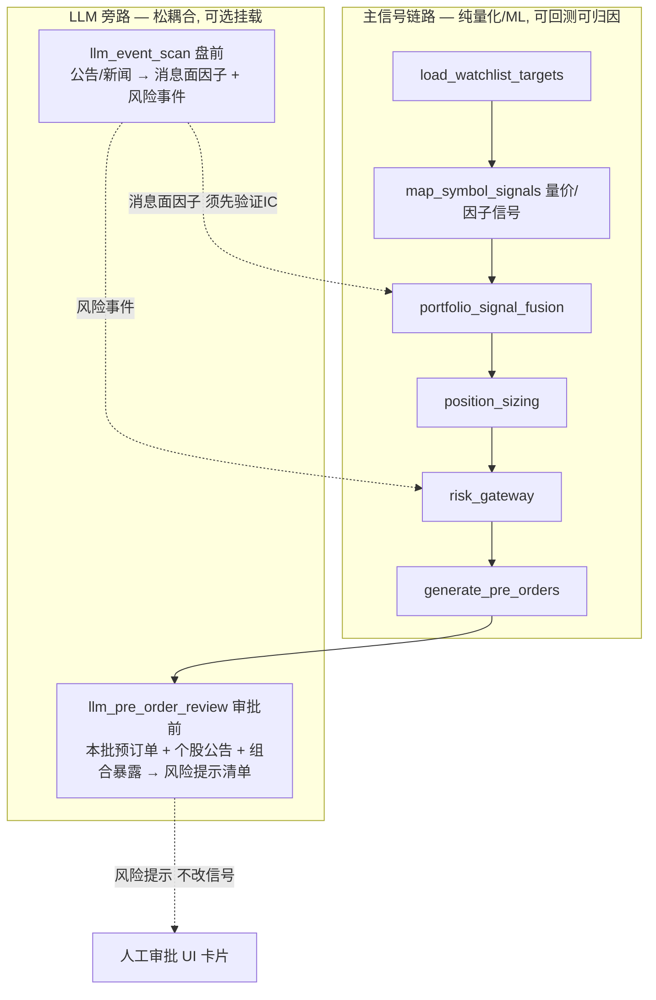

# AI 在量化交易平台的应用设计（个人版）

> **版本**: v1.0
> **更新**: 2026-06-26
> **定位**: 界定 AI（LLM / ML / Agent）在**个人**量化平台中的应用边界，重点是**决策流中的 LLM 旁路设计**
> **关联**: [trading-system-design.md](./trading-system-design.md)（决策流/执行流）、[factor-architecture.md](./factor-architecture.md)（因子管线）、[AI-Agent产品与架构设计.md](./AI-Agent产品与架构设计.md)（Agent 运行时与产品形态）

---

## 0. 核心原则（一句话）

> **让 LLM 干「读非结构化信息 + 守门提示」，让 ML 干「因子合成 alpha」，主信号链路保持可回测纯净——而不是让大模型去猜 T+1 涨跌。**

LLM 产出**要么**先被回测验证后作为「因子」进入信号链，**要么**只作为「给人看的提示」用于人工审批；**绝不直接等于交易指令**。

---

## 1. 红线：不要让 LLM 直接预测 T+1 / 输出买卖建议作为主决策

把「信号 + OHLC + 因子」喂给 LLM 让它判断 T+1 交易建议，作为主决策链路是**错误用法**，三条硬伤：

| 硬伤 | 说明 |
|------|------|
| **LLM 不是数值预测器** | 让语言模型做数值时序外推，是其最不擅长的事：无概率校准、结果不可复现（温度/版本漂移）、易生成「看似合理实则幻觉」的理由 |
| **不可回测、不可归因** | 量化生命线是可回测/可 IC 归因/可压力测试；LLM 建议进不了因子归因，且训练数据极可能泄漏未来信息，**PIT 无法保证**，一旦混入主信号会污染整个评估体系 |
| **过拟合叙事** | 给 LLM 看 K 线必然「讲故事」（头肩顶/放量突破），对收益无统计显著性，只制造虚假信心 |

> 结论：**LLM 不进主信号链路做数值预测。** 这一红线是后续所有设计的前提。

---

## 2. AI 在平台各环节的落点（LLM vs ML vs Agent）

先厘清常被混淆的概念：**严肃的「AI 量化」主体是 ML（树模型/神经网络）做因子合成与组合预测，不是 LLM**。三者各有其位：

| 落点 | 技术 | 是否进主信号链 | 个人价值 | 优先级 |
|------|------|----------------|----------|--------|
| 审批守门：为本批预订单生成风险 checklist | LLM | ❌ 辅助 HITL | 高（契合现有审批架构、零回测负担） | **P0** |
| 盘前风险事件扫描（停牌/问询/减持/商誉/诉讼/退市风险） | LLM | ❌ 作风控告警 | **极高**（个人最易死在踩雷） | **P1** |
| 新闻/公告/研报 事件抽取 + 情绪打分 → 消息面因子 | LLM | ✅ 须先验证 IC | 高（真·另类 alpha） | **P2** |
| 财报/基本面结构化抽取（补数据缺口） | LLM | 间接（喂基本面因子） | 中 | P2 |
| 因子合成 / 组合打分 | ML（LightGBM/树模型）+ 时序交叉验证 + IC 评估 | ✅ 正统 alpha 端 | 中高（「AI 量化」主体） | P3 |
| 研究流程自动化 Agent（因子挖掘/参数搜索/数据巡检/策略代码生成） | LLM Agent | ❌ 不碰下单 | 中（提研究效率） | P3 |
| 对话/报告/解释（现有） | LLM | ❌ | 低~中 | 已有 |

> 关键区分：**LLM 适合「非结构化信息 → 结构化信号」与「读材料 + 提醒」；ML 适合「结构化因子 → alpha」。** 把两者用反是绝大多数 AI 量化翻车的根因。

---

## 3. 决策流中的 LLM 旁路设计

遵循「松耦合积木」哲学：**主信号链路保持纯量化/ML，LLM 作为可选挂载的旁路节点**，不侵入主链。

### 3.1 `llm_pre_order_review`（审批守门，P0）

| 项 | 内容 |
|----|------|
| 位置 | `generate_pre_orders` 之后、人工审批之前 |
| 输入 | 本批 `td_pre_order` + 各标的近期公告/新闻 + 组合暴露（行业/集中度/现金占用） |
| 输出 | **风险提示清单**（如「某标的明日除权」「昨发减持公告」「组合行业集中度过高」「某票明日停牌」） |
| 约束 | **不产生买卖信号、不改价、不自动下单**；仅把 checklist 挂到审批卡片上 |
| 价值 | 风险最低、价值最高、零回测负担；同时补上「审批缺组合层视图/守门」缺口 |

> LLM 的「读材料 + 提醒」正是其所长，且完美契合 HITL 审批架构——这是 AI 介入决策流最安全、最该先做的一步。

### 3.2 `llm_event_scan`（盘前事件扫描，P1/P2）

| 项 | 内容 |
|----|------|
| 位置 | 决策流之前（盘前）或独立 Celery 任务 |
| 输入 | 自选池标的的公告/新闻/研报 |
| 输出 a（P1，风险事件） | 停牌/问询函/减持/商誉减值/诉讼/退市风险 → 进 `risk_gateway` 作预检/告警，**不进信号** |
| 输出 b（P2，消息面因子） | 事件类型/利空利好/超预期程度/情绪分 → **必须先在因子库走 IC/回测验证**，验证通过才参与 `portfolio_signal_fusion` 加权；否则只做告警不参与定价 |

> 输出 a 先做（防踩雷，无污染风险）；输出 b 后做（须验证后才允许影响信号定价）。

---

## 4. 落地优先级与边界守则

| 优先级 | 项 | 为什么 |
|--------|-----|--------|
| **P0** | `llm_pre_order_review` 审批守门（风险提示，不进信号） | 风险最低、价值最高、零回测负担 |
| **P1** | `llm_event_scan` 风险事件告警 | 个人防踩雷，作告警不污染信号 |
| **P2** | 消息面情绪因子（须 IC 验证后才进 fusion） | 真·另类 alpha，但先验证 |
| **P3** | 轻量 ML 因子合成（LightGBM 综合打分 + 时序 CV + IC 评估） | 「AI 量化」主体，需评估框架支撑 |
| **P3** | 研究 Agent（因子/回测/数据巡检助手） | 提研究效率，不碰实盘下单 |

**边界守则（强制）**：

1. LLM 输出进入主信号定价，**必须**先经因子库 IC/回测验证，且满足 PIT；未验证只能作告警或人看的提示。
2. LLM/Agent **永不**直接触发下单或修改已生成订单价格/数量；下单始终经人工审批或显式全自动策略（`live_auto`）的确定性规则。
3. LLM 旁路节点失败**不得**阻断主决策流（降级为「无提示」继续），符合松耦合原则。
4. 所有 LLM 产出落库可追溯（输入摘要 + 输出 + 模型版本），便于事后复盘其提示质量。

---

*本文档界定 AI 在交易决策中的应用边界；Agent 运行时/进程架构见 [AI-Agent产品与架构设计.md](./AI-Agent产品与架构设计.md)，决策流细节见 [trading-system-design.md](./trading-system-design.md)。*
