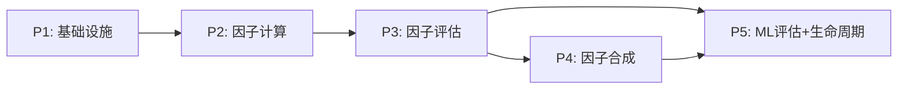

# xqtrader 因子系统实施计划

> **更新**: 2026-06-07
> **依赖**: [factor-architecture.md](./factor-architecture.md) 技术架构 | [factor-catalog.md](./factor-catalog.md) 因子分类
> **约定**: dal-orm（模型+CRUD） | celery-plugin（任务插件）

---

## 总体阶段划分

| 阶段 | 名称 | 核心交付 | 预计工作量 |
|------|------|---------|-----------|
| P1 | 基础设施 | 表模型 + 注册表同步 + 样本池 | 中 |
| P2 | 因子计算管线 | CalcStage + FactorPlugin + 日频调度 | 大 |
| P3 | 因子评估管线 | EvaluateStage + IC/ICIR + 分层回测 | 大 |
| P4 | 因子合成管线 | SynthesizeStage + Alpha因子 | 中 |
| P5 | ML评估与生命周期 | ML评估 + 因子升降级 + 信号引擎 | 中 |

每个阶段遵循：**设计 → 实施 → 测试 → 修复 → 验收 → 更新计划** 闭环。

---

## P1: 基础设施 — 表模型 + 注册表同步 + 样本池

### P1.1 目标

建立因子系统的数据基础：ORM 模型、因子注册表同步机制、样本池管理。

### P1.2 交付物

| # | 交付物 | 路径 | 说明 |
|---|--------|------|------|
| 1 | FacFactorValue 模型 | `src/xqtrader/domain/factor/models/factor_value.py` | 因子值窄表，含 pool_id |
| 2 | FacFactorRegistry 模型 | `src/xqtrader/domain/factor/models/factor_registry.py` | 因子注册表，含 factor_grade/update_freq/report_lag_days |
| 3 | FacFactorStats 模型 | `src/xqtrader/domain/factor/models/factor_stats.py` | 因子统计指标表 |
| 4 | FacFactorPool 模型 | `src/xqtrader/domain/factor/models/factor_pool.py` | 样本池配置表 |
| 5 | FacSignalValue 模型 | `src/xqtrader/domain/factor/models/signal_value.py` | 信号值表 |
| 6 | domain __init__ 导出 | `src/xqtrader/domain/factor/__init__.py` | 模块导出 |
| 7 | models __init__ 导出 | `src/xqtrader/domain/factor/models/__init__.py` | 模型导出 |
| 8 | 因子定义声明 | `src/xqtrader/domain/factor/definitions/` | 代码声明（唯一真相源） |
| 9 | 注册表同步服务 | `src/xqtrader/domain/factor/services/registry_sync.py` | 启动时 upsert 注册表 |
| 10 | 样本池初始化服务 | `src/xqtrader/domain/factor/services/pool_initializer.py` | 初始化默认样本池 |

### P1.3 目录结构

```
src/xqtrader/domain/factor/
├── __init__.py
├── models/
│   ├── __init__.py
│   ├── factor_value.py        # FacFactorValue (TimescaleDB)
│   ├── factor_registry.py     # FacFactorRegistry
│   ├── factor_stats.py        # FacFactorStats
│   ├── factor_pool.py         # FacFactorPool
│   └── signal_value.py        # FacSignalValue
├── definitions/
│   ├── __init__.py
│   ├── risk.py                # A类: 风险因子定义
│   ├── fundamental.py         # B类: 基本面因子定义
│   ├── technical.py           # C类: 技术因子定义
│   ├── quantitative.py        # D类: 量价因子定义
│   ├── chan.py                 # E类: 缠论因子定义
│   ├── candlestick.py         # F类: K线聚合因子定义
│   └── alpha.py               # G类: 复合Alpha因子定义
└── services/
    ├── __init__.py
    ├── registry_sync.py       # 代码声明 → DB注册表同步
    └── pool_initializer.py    # 默认样本池初始化
```

### P1.4 验收标准

| # | 验收项 | 验证方式 | 通过条件 |
|---|--------|---------|---------|
| 1 | 建表成功 | db_tools 查询 `SELECT tablename FROM pg_tables WHERE schemaname IN ('stock','research') AND tablename LIKE 'fac_%'` | 返回 5 行（fac_factor_value, fac_factor_registry, fac_factor_stats, fac_factor_pool, fac_signal_value） |
| 2 | FacFactorValue 是 TimescaleDB 超表 | db_tools 查询 `SELECT hypertable_name FROM timescaledb_information.hypertables WHERE hypertable_name='fac_factor_value'` | 返回 1 行 |
| 3 | 因子定义声明完整性 | 运行同步脚本 | 所有 factor-catalog.md 中的因子均有对应 FactorDefinition |
| 4 | 注册表同步正确 | 同步后查询 `SELECT count(*) FROM research.fac_factor_registry` | 行数 = factor-catalog.md 中定义的因子总数 |
| 5 | 注册表同步幂等 | 连续执行 2 次同步 | 第 2 次无 INSERT，仅 UPDATE |
| 6 | 样本池初始化 | 查询 `SELECT count(*) FROM research.fac_factor_pool` | ≥ 3 行（all, idx_300, idx_1000） |
| 7 | DAL CRUD 可用 | 单元测试 | create/filter/update/delete 全部通过 |

### P1.5 实施步骤

```
1. 创建 domain/factor/ 目录结构
2. 实现 FacFactorRegistry 模型（普通表，research schema）
3. 实现 FacFactorPool 模型（普通表，research schema）
4. 实现 FacFactorStats 模型（普通表，research schema）
5. 实现 FacFactorValue 模型（TimescaleDB 超表，stock schema）
6. 实现 FacSignalValue 模型（普通表，stock schema）
7. 实现因子定义声明（FactorDefinition dataclass）
8. 实现注册表同步服务（upsert_to_registry）
9. 实现样本池初始化服务
10. 编写单元测试
11. 执行验收检查
```

---

## P2: 因子计算管线 — CalcStage + FactorPlugin + 日频调度

### P2.1 目标

实现因子日频计算管线：从数据源读取原始数据 → 按 FactorPlugin 计算因子值 → 预处理 → 持久化到因子值窄表。

### P2.2 交付物

| # | 交付物 | 路径 | 说明 |
|---|--------|------|------|
| 1 | FactorPlugin 基类 | `src/xqtrader/domain/factor/plugins/base.py` | 因子计算插件策略模式基类 |
| 2 | 技术因子插件 | `src/xqtrader/domain/factor/plugins/technical.py` | C类因子（MA/RSI/MACD等） |
| 3 | 量价因子插件 | `src/xqtrader/domain/factor/plugins/quantitative.py` | D类因子（Alpha101/158） |
| 4 | 基本面因子插件 | `src/xqtrader/domain/factor/plugins/fundamental.py` | B类因子（PIT取值） |
| 5 | 估值因子插件 | `src/xqtrader/domain/factor/plugins/valuation.py` | B类子类（PE/PB/PS，从daily_indicator读取） |
| 6 | 风险因子插件 | `src/xqtrader/domain/factor/plugins/risk.py` | A类因子（Beta/波动率/流动性） |
| 7 | 资金流因子插件 | `src/xqtrader/domain/factor/plugins/fund_flow.py` | 从fund_flow_individual读取 |
| 8 | PIT取值服务 | `src/xqtrader/domain/factor/services/pit_reader.py` | ann_date精确模式 + report_lag_days兜底 |
| 9 | 预处理服务 | `src/xqtrader/domain/factor/services/preprocessor.py` | 去极值/标准化/行业中性化 |
| 10 | 因子计算Celery任务 | `src/worker/plugins/factor_compute/` | CalcStage管线 + plugin.yaml |
| 11 | 每日调度编排更新 | `schedules/daily_pipeline.yml` | 新增 factor_compute 步骤 |

### P2.3 目录结构

```
src/xqtrader/domain/factor/
├── plugins/
│   ├── __init__.py
│   ├── base.py                # FactorPlugin 基类
│   ├── technical.py           # C类: 技术因子
│   ├── quantitative.py        # D类: 量价因子
│   ├── fundamental.py         # B类: 基本面因子（PIT）
│   ├── valuation.py           # B类: 估值因子（daily_indicator）
│   ├── risk.py                # A类: 风险因子
│   └── fund_flow.py           # 资金流因子
├── services/
│   ├── pit_reader.py          # PIT截面取值服务
│   └── preprocessor.py        # 因子预处理服务

src/worker/plugins/factor_compute/
├── __init__.py
├── plugin.yaml
└── task.py                    # FactorComputeTask(BaseTask)
```

### P2.4 验收标准

| # | 验收项 | 验证方式 | 通过条件 |
|---|--------|---------|---------|
| 1 | 技术因子计算正确 | 对 5 只标的计算 RSI_14，与 CASE-C factor_lib.py 结果对比 | 偏差 < 1e-6 |
| 2 | 估值因子读取正确 | 对 3 只标的读取 pe_ttm，与 sdc_daily_indicator 原值对比 | 完全一致 |
| 3 | 基本面因子PIT正确 | 对 1 只标的，截面日=2026-01-15，验证 roe 取的是 ann_date ≤ 2026-01-15 的最新记录 | 与手动SQL查询结果一致 |
| 4 | 预处理正确 | 对 10 只标的做 Z-score 标准化，验证均值≈0、标准差≈1 | 均值 < 0.01，标准差 0.99~1.01 |
| 5 | 因子值写入 | 执行计算任务后查询 `SELECT count(*) FROM stock.fac_factor_value WHERE trade_date = '<当日>'` | 行数 = 标的数 × 当日活跃因子数 |
| 6 | Celery任务可调度 | 手动触发 factor.compute_daily 任务 | 任务状态 SUCCESS |
| 7 | 编排依赖正确 | daily_pipeline 执行 | collect → factor_compute 顺序执行 |

### P2.5 实施步骤

```
1. 实现 FactorPlugin 基类（compute 接口 + 注册机制）
2. 实现 PIT 取值服务（ann_date 精确模式 + report_lag_days 兜底）
3. 实现估值因子插件（最简单，从 daily_indicator 直接读取）
4. 实现技术因子插件（参考 CASE-C factor_lib.py）
5. 实现基本面因子插件（使用 PIT 取值服务）
6. 实现风险因子插件
7. 实现量价因子插件（参考 CASE-C Alpha101）
8. 实现资金流因子插件
9. 实现预处理服务（去极值 + 标准化 + 行业中性化）
10. 实现 FactorComputeTask（CalcStage 管线）
11. 更新 daily_pipeline.yml 编排
12. 编写单元测试 + 集成测试
13. 执行验收检查
```

---

## P3: 因子评估管线 — EvaluateStage + IC/ICIR + 分层回测

### P3.1 目标

实现因子评估管线：按样本池计算 IC/ICIR/换手率/衰减半衰期等统计指标，产出因子等级评定。

### P3.2 交付物

| # | 交付物 | 路径 | 说明 |
|---|--------|------|------|
| 1 | IC计算服务 | `src/xqtrader/domain/factor/services/ic_calculator.py` | Spearman IC + 滚动窗口 |
| 2 | 分层回测服务 | `src/xqtrader/domain/factor/services/layered_backtest.py` | 5分组多空回测 |
| 3 | 因子等级评定服务 | `src/xqtrader/domain/factor/services/grade_evaluator.py` | ICIR → A/B/C/D 等级 |
| 4 | 因子评估Celery任务 | `src/worker/plugins/factor_evaluate/` | EvaluateStage 管线 |
| 5 | 评估调度编排 | `schedules/factor_evaluate_pipeline.yml` | 周度评估 |

### P3.3 验收标准

| # | 验收项 | 验证方式 | 通过条件 |
|---|--------|---------|---------|
| 1 | IC计算正确 | 对已知因子（如 mom_20d）计算 IC，与 CASE-C 结果对比 | 偏差 < 0.01 |
| 2 | ICIR计算正确 | IC_mean / IC_std | 与手动计算一致 |
| 3 | 多样本池评估 | 对 idx_300 和 idx_1000 分别评估 | 产出 2 组独立的统计指标 |
| 4 | 因子等级写入 | 评估后查询 `SELECT factor_grade FROM research.fac_factor_stats` | 非 NULL，值为 A/B/C/D 之一 |
| 5 | 分层回测正确 | 5分组多空年化收益 | 与 CASE-C layered_backtest.py 结果偏差 < 5% |
| 6 | Celery任务可调度 | 手动触发 factor.evaluate 任务 | 任务状态 SUCCESS |

### P3.4 实施步骤

```
1. 实现 IC 计算服务（Spearman rank IC + 滚动窗口）
2. 实现分层回测服务（5分组 + 多空组合）
3. 实现因子等级评定服务（ICIR → A/B/C/D）
4. 实现 FactorEvaluateTask（EvaluateStage 管线）
5. 创建评估调度编排 YAML
6. 编写单元测试
7. 执行验收检查
```

---

## P4: 因子合成管线 — SynthesizeStage + Alpha因子

### P4.1 目标

实现多因子合成管线：从 A/B 级因子中选因子 → 按样本池合成 Alpha 因子 → 持久化到因子值窄表。

### P4.2 交付物

| # | 交付物 | 路径 | 说明 |
|---|--------|------|------|
| 1 | 合成方法实现 | `src/xqtrader/domain/factor/services/synthesizer.py` | 等权/IC加权/ICIR加权 |
| 2 | 因子合成Celery任务 | `src/worker/plugins/factor_synthesize/` | SynthesizeStage 管线 |
| 3 | 合成调度编排 | `schedules/factor_synthesize_pipeline.yml` | 周度合成（依赖评估完成） |

### P4.3 验收标准

| # | 验收项 | 验证方式 | 通过条件 |
|---|--------|---------|---------|
| 1 | 等权合成正确 | 3个因子等权合成，验证结果 = mean(f1, f2, f3) | 偏差 < 1e-6 |
| 2 | IC加权合成正确 | 权重归一化验证 | 权重之和 = 1.0 |
| 3 | Alpha因子写入 | 合成后查询 `SELECT count(*) FROM stock.fac_factor_value WHERE factor_id LIKE 'alpha_%'` | 行数 = 标的数 × Alpha因子数 × 样本池数 |
| 4 | 多样本池合成 | 对 idx_300 和 idx_1000 分别合成 | 产出独立的 Alpha 值 |
| 5 | Celery任务可调度 | 手动触发 factor.synthesize 任务 | 任务状态 SUCCESS |

### P4.4 实施步骤

```
1. 实现合成方法（等权/IC加权/ICIR加权）
2. 实现 FactorSynthesizeTask（SynthesizeStage 管线）
3. 创建合成调度编排 YAML
4. 编写单元测试
5. 执行验收检查
```

---

## P5: ML评估与生命周期 — ML评估 + 因子升降级 + 信号引擎

### P5.1 目标

实现 ML 辅助因子评估、因子生命周期管理（升降级/淘汰/复活）、信号引擎。

### P5.2 交付物

| # | 交付物 | 路径 | 说明 |
|---|--------|------|------|
| 1 | ML特征重要性服务 | `src/xqtrader/domain/factor/services/ml_feature_importance.py` | XGBoost/LightGBM gain |
| 2 | 非线性IC检测服务 | `src/xqtrader/domain/factor/services/ml_nonlinear_ic.py` | 2层MLP |
| 3 | 因子共线性诊断服务 | `src/xqtrader/domain/factor/services/ml_collinearity.py` | AutoEncoder + HDBSCAN |
| 4 | 因子生命周期服务 | `src/xqtrader/domain/factor/services/lifecycle_manager.py` | 降级/淘汰/复活 |
| 5 | 信号引擎 | `src/xqtrader/domain/factor/services/signal_engine.py` | 缠论/K线形态离散信号 |
| 6 | ML评估Celery任务 | `src/worker/plugins/factor_ml_evaluate/` | ML评估管线 |
| 7 | 信号计算Celery任务 | `src/worker/plugins/signal_compute/` | 信号计算管线 |
| 8 | ML评估调度编排 | `schedules/ml_evaluate_pipeline.yml` | 周六调度 |

### P5.3 验收标准

| # | 验收项 | 验证方式 | 通过条件 |
|---|--------|---------|---------|
| 1 | 特征重要性产出 | 对 10 个因子计算 gain_importance | 返回非零重要性值 |
| 2 | 非线性IC检测 | 对含非线性关系的因子检测 | NL_IC > 线性IC 的因子被标记 |
| 3 | 因子降级 | 将某因子 ICIR 模拟为 < 0.3，触发降级 | factor_grade 更新为 D |
| 4 | 因子淘汰 | 连续4期 D 级因子 | status 更新为 deprecated |
| 5 | 因子复活 | deprecated 因子 ICIR 恢复 > 0.5 | status 恢复为 active |
| 6 | 信号写入 | 缠论买卖点信号计算 | 写入 fac_signal_value 表 |
| 7 | Celery任务可调度 | 手动触发 factor.ml_evaluate 和 signal.compute | 任务状态 SUCCESS |

### P5.4 实施步骤

```
1. 实现因子生命周期服务（降级/淘汰/复活规则）
2. 实现信号引擎（缠论离散信号 + K线形态信号）
3. 实现信号计算 Celery 任务
4. 实现 ML 特征重要性服务
5. 实现非线性 IC 检测服务
6. 实现因子共线性诊断服务
7. 实现 ML 评估 Celery 任务
8. 创建 ML 评估调度编排 YAML
9. 编写单元测试
10. 执行验收检查
```

---

## 阶段依赖关系



- P1 是所有后续阶段的前置条件
- P2 依赖 P1（表模型）
- P3 依赖 P2（需要因子值才能评估）
- P4 依赖 P3（需要因子等级才能选因子合成）
- P5 依赖 P3 + P4（需要评估结果 + Alpha因子）

---

## 编排调度总览

| 编排 | Cron | 队列 | 依赖 |
|------|------|------|------|
| daily_factor_pipeline | 0 17 * * 1-5 | celery | collect → daily_factor_compute + quarterly_factor_compute → signal_compute |
| weekly_factor_pipeline | 0 8 * * 6 | celery | factor_evaluate → alpha_synthesize |
| ml_factor_evaluate | 0 10 * * 6 | celery | factor_evaluate（周六ML评估） |

---

## 风险与缓解

| 风险 | 影响 | 缓解措施 |
|------|------|---------|
| 全市场5500标的计算耗时 | 日频任务超时 | 分批并行 + 超时保护 + 增量计算 |
| 财务PIT ann_date缺失 | 未来函数 | 三级回退：ann_date → f_ann_date → report_lag_days |
| TimescaleDB压缩后查询慢 | 回测性能差 | 热数据在线 + 分层索引 + 预处理值直接可用 |
| ML模型训练耗时 | 阻塞调度 | 训练独立任务，预测随合成管线 |
| 因子数量多导致窄表膨胀 | 存储压力大 | 分层存储 + 按类别差异化保留 + 压缩 |
