# xq-trader 交易系统 — 完整架构与交互设计

> **更新**: 2026-06-23
> **定位**: A 股量化私募轻量级交易终端
> **前置**: [factor-architecture.md](./factor-architecture.md)（因子管线）

---

## 一、设计目标

| 目标 | 说明 |
|------|------|
| 生产级 | 数据、状态、结果全落库（`trading` schema），禁止 JSON 文件契约 |
| 四套环境统一 | 研究 / 回测 / 模拟 / 实盘共享同一策略语义与执行链路 |
| 两流分离 | 日频决策流与盘内执行流独立，pre_order 表为交接契约 |
| 风控常驻 | 三层可见性（StatusBar + 驾驶舱风险卡 + 风控 Tab），秒级感知 |
| 一站式驾驶舱 | 实盘/模拟盘核心操作不跳页，6 Tab 覆盖完整链路 |
| 仓位管理显式化 | 选股信号与仓位 sizing 分离，8 种可插拔策略 |
| 决策/执行分层 | 日频因子决策（收盘后）+ 盘内执行监控（分钟级），二者不混用 |
| 人机协同默认 | 实盘默认人工审批，全自动需显式开启 |
| Kill Switch | 紧急全平能力，绕过 Workflow 直连 Broker |

---

## 二、系统上下文

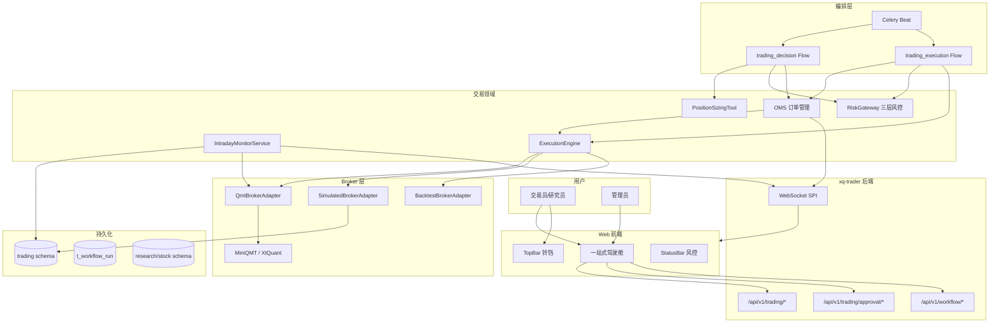

---

## 三、两流分离架构

### 3.1 核心设计

决策流与执行流独立运行，以 `pre_order` 表为交接契约，确保审批灵活性、执行独立性和故障隔离。

### 3.2 Flow 1: trading_decision（日频决策流）

**触发**: Celery Beat T 日 18:00（depends_on: `alpha_signal_compute`）或手动触发

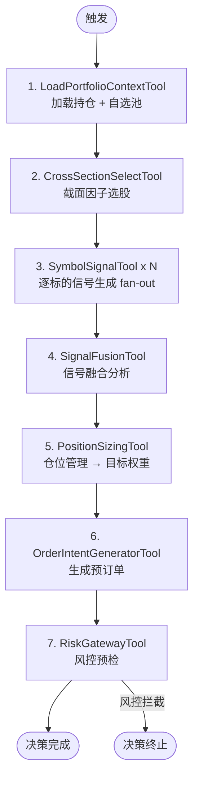

**产出**: `pre_order` 表记录（`status=pending_approval`）+ `position_sizing_result` + `trading_signal`

**完成时机**: T 日 18:00~18:30，秒~分钟级完成

### 3.3 Flow 2: trading_execution（盘内执行流）

**触发**: Celery Beat T+1 日 09:25 或手动触发

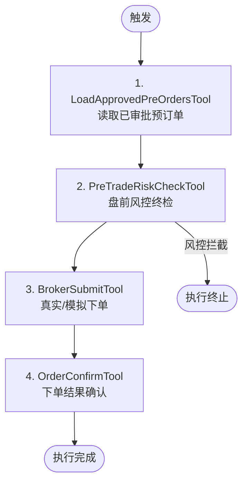

**输入**: `pre_order` 表中 `status=approved AND execution_date=T+1` 的记录

**完成时机**: T+1 09:25~15:00，取决于成交速度

### 3.4 交接契约：pre_order 表

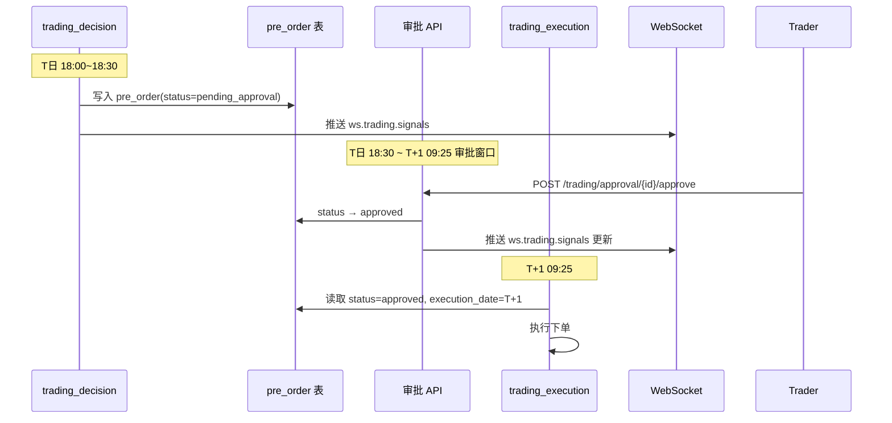

### 3.5 审批机制（独立 API）

审批是**即时 API 操作**，独立于工作流执行：

| 操作 | API | 说明 |
|------|-----|------|
| 逐条审批 | `POST /trading/approval/{pre_order_id}` | body: `{action: approve/reject, comment: "..."}` |
| 批量审批 | `POST /trading/approval/batch` | body: `{items: [{id, action, comment}]}` |
| 修改后审批 | `PUT /trading/pre-orders/{id}` + `POST /trading/approval/{id}` | 修改数量/价格后再审批 |
| 查询待审批 | `GET /trading/pre-orders?status=pending_approval` | 审批抽屉数据源 |

**审批记录**: 写入 `pre_order.approval_status` + `pre_order.approved_by` + `pre_order.approved_at` + `pre_order.approval_comment`

### 3.6 日频时间轴

```mermaid
gantt
    title T 交易日 — 决策与执行分离
    dateFormat HH:mm
    axisFormat %H:%M

    section T日收盘后决策
    15:00 收盘           :milestone, m1, 15:00, 0min
    17:00 数据采集+因子计算 :crit, a1, 17:00, 60min
    17:30~18:00 Alpha信号  :crit, a2, after a1, 30min
    18:00~18:30 trading_decision :active, a3, after a2, 30min
    18:30~次日09:25 人工审批 :a4, after a3, 900min

    section T+1日盘内执行
    09:25 执行流启动       :milestone, m2, 09:25, 0min
    09:30~15:00 下单+监控  :active, b1, 09:30, 330min
```

---

## 四、领域模型（trading schema）

### 4.1 ER 关系

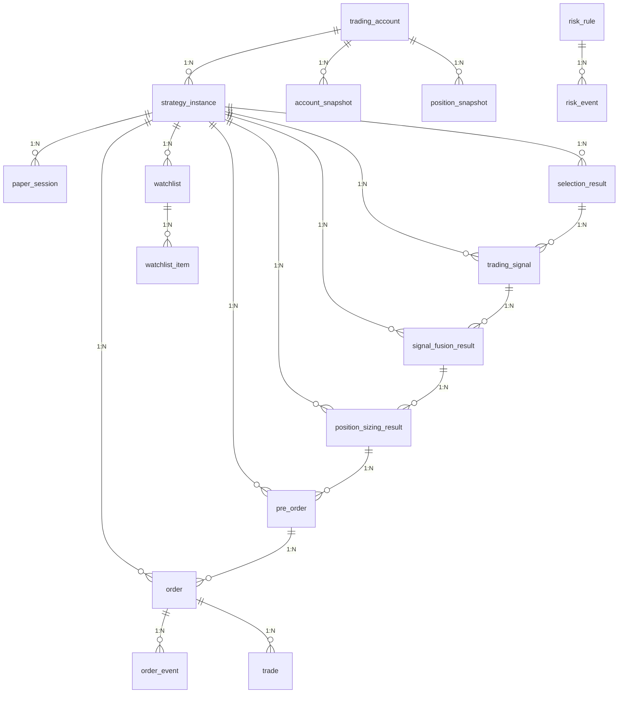

### 4.2 表定义

#### trading_account（交易账户）

| 字段 | 类型 | 说明 |
|------|------|------|
| id | UUID PK | |
| account_code | String(32) unique | 账户编码（如 live-001, paper-001） |
| account_type | Enum | `live` / `paper` |
| broker_type | String(16) | `qmt` / `simulated` / `backtest` |
| broker_config | JSON | 券商连接参数（QMT path/account_id 等） |
| fee_rate | JSON | 费率配置 `{commission, stamp_tax, slippage}` |
| initial_capital | Numeric | 初始资金 |
| is_active | Boolean | 是否启用 |
| workspace_id | String(64) | 工作空间 |

#### strategy_instance（策略实例）

| 字段 | 类型 | 说明 |
|------|------|------|
| id | UUID PK | |
| instance_code | String(64) unique | 实例编码 |
| name | String(128) | 实例名称 |
| account_id | UUID FK → trading_account | 所属账户 |
| run_mode | Enum | `live_manual` / `live_auto` / `paper` / `backtest` |
| status | Enum | `draft` / `running` / `paused` / `stopped` |
| decision_flow_id | String(64) | 决策流 flow_id |
| execution_flow_id | String(64) | 执行流 flow_id |
| schedule_cron | String(64) | 调度表达式（如 `0 18 * * 1-5`） |
| config | JSON | 策略配置（含 position_sizing, signal_source 等） |
| watchlist_id | UUID FK → watchlist | 关联自选池 |

**config 结构**:

```json
{
  "signal_source": {
    "factors": ["alpha158", "fund_flow", "tech_trend"],
    "signal_method": "composite_score"
  },
  "position_sizing": {
    "strategy": "atr_risk",
    "params": {
      "atr_period": 14,
      "risk_budget_pct": 0.02,
      "atr_multiplier": 2.0,
      "max_single_weight": 0.10
    },
    "fallback": "equal_weight"
  },
  "risk_overrides": {
    "max_position_pct": 0.10,
    "daily_loss_limit_pct": -0.02
  },
  "universe": {
    "pool": "hs300",
    "exclude_st": true,
    "min_market_cap": 5e9
  }
}
```

#### watchlist / watchlist_item（自选池）

| 字段 | 类型 | 说明 |
|------|------|------|
| id | UUID PK | |
| name | String(64) | 池名称 |
| strategy_instance_id | UUID FK | 所属策略实例 |

| 字段 | 类型 | 说明 |
|------|------|------|
| id | UUID PK | |
| watchlist_id | UUID FK | 所属池 |
| symbol | String(16) | 标的代码 |
| signal_config | JSON | 个股级信号源配置（覆盖实例默认） |
| sizing_config | JSON | 个股级配仓配置（覆盖实例默认） |
| added_at | DateTime | 加入时间 |
| added_reason | String | 加入原因 |

#### paper_session（模拟盘会话）

| 字段 | 类型 | 说明 |
|------|------|------|
| id | UUID PK | |
| instance_id | UUID FK → strategy_instance | 所属实例 |
| session_code | String(64) | 会话编码 |
| started_at | DateTime | 开始时间 |
| ended_at | DateTime | 结束时间 |
| initial_capital | Numeric | 初始资金 |
| cycle_count | Integer | 已执行循环次数 |
| status | Enum | `active` / `completed` / `abandoned` |
| promote_to_live | Boolean | 是否已晋升实盘 |
| promote_account_id | UUID FK | 晋升目标账户 |

#### selection_result（截面选股结果）

| 字段 | 类型 | 说明 |
|------|------|------|
| id | UUID PK | |
| instance_id | UUID FK | 策略实例 |
| workflow_run_id | String(64) | 决策流 Run ID |
| signal_date | Date | 信号日 |
| symbols | JSON | 选出标的列表 |
| scores | JSON | 各标的得分 |
| method | String | 选股方法 |
| node_id | String(64) | 工作流节点 ID |

#### trading_signal（逐标的交易信号）

| 字段 | 类型 | 说明 |
|------|------|------|
| id | UUID PK | |
| instance_id | UUID FK | 策略实例 |
| workflow_run_id | String(64) | 决策流 Run ID |
| signal_date | Date | 信号日 |
| symbol | String(16) | 标的 |
| direction | Enum | `long` / `short` / `neutral` |
| strength | Float | 信号强度 0-1 |
| signal_type | String | 信号类型（alpha158/fund_flow/...） |
| raw_values | JSON | 原始因子值快照 |
| node_id | String(64) | 工作流节点 ID |

#### signal_fusion_result（信号融合结果）

| 字段 | 类型 | 说明 |
|------|------|------|
| id | UUID PK | |
| instance_id | UUID FK | 策略实例 |
| workflow_run_id | String(64) | 决策流 Run ID |
| signal_date | Date | 信号日 |
| symbol | String(16) | 标的 |
| composite_score | Float | 融合得分 |
| direction | Enum | `long` / `short` / `neutral` |
| contributing_signals | JSON | 参与融合的信号列表及权重 |
| node_id | String(64) | 工作流节点 ID |

#### position_sizing_result（仓位管理输出）

| 字段 | 类型 | 说明 |
|------|------|------|
| id | UUID PK | |
| instance_id | UUID FK | 策略实例 |
| workflow_run_id | String(64) | 决策流 Run ID |
| signal_date | Date | 信号日 |
| symbol | String(16) | 标的 |
| target_weight | Float | 目标权重 0-1 |
| target_qty | Integer | 目标股数（100 整数倍） |
| current_weight | Float | 当前权重 |
| sizing_strategy | String | 使用的策略 ID |
| sizing_params | JSON | 策略参数快照 |
| raw_score | Float | 策略中间量 |
| node_id | String(64) | 工作流节点 ID |

#### pre_order（预订单 — 核心交接契约）

| 字段 | 类型 | 说明 |
|------|------|------|
| id | UUID PK | |
| instance_id | UUID FK | 策略实例 |
| workflow_run_id | String(64) | 决策流 Run ID |
| signal_date | Date | 信号日 T |
| execution_date | Date | 执行日 T+1 |
| symbol | String(16) | 标的 |
| side | Enum | `open` / `add` / `reduce` / `close` |
| target_weight | Float | 目标权重 |
| current_weight | Float | 当前权重 |
| target_qty | Integer | 目标数量 |
| order_type | Enum | `limit` / `market` |
| limit_price | Numeric | 限价 |
| sizing_strategy | String | 配仓策略 |
| status | Enum | 见下方状态机 |
| risk_check_passed | Boolean | 风控预检是否通过 |
| risk_check_detail | JSON | 风控检查详情 |
| approval_status | Enum | `pending` / `approved` / `rejected` / `expired` |
| approved_by | String(64) | 审批人 |
| approved_at | DateTime | 审批时间 |
| approval_comment | String(256) | 审批意见 |
| expired_at | DateTime | 过期时间 |
| idempotency_key | String(128) unique | 幂等键 `{instance_id}:{signal_date}:{symbol}:{side}` |
| node_id | String(64) | 工作流节点 ID |

**pre_order 状态机**:

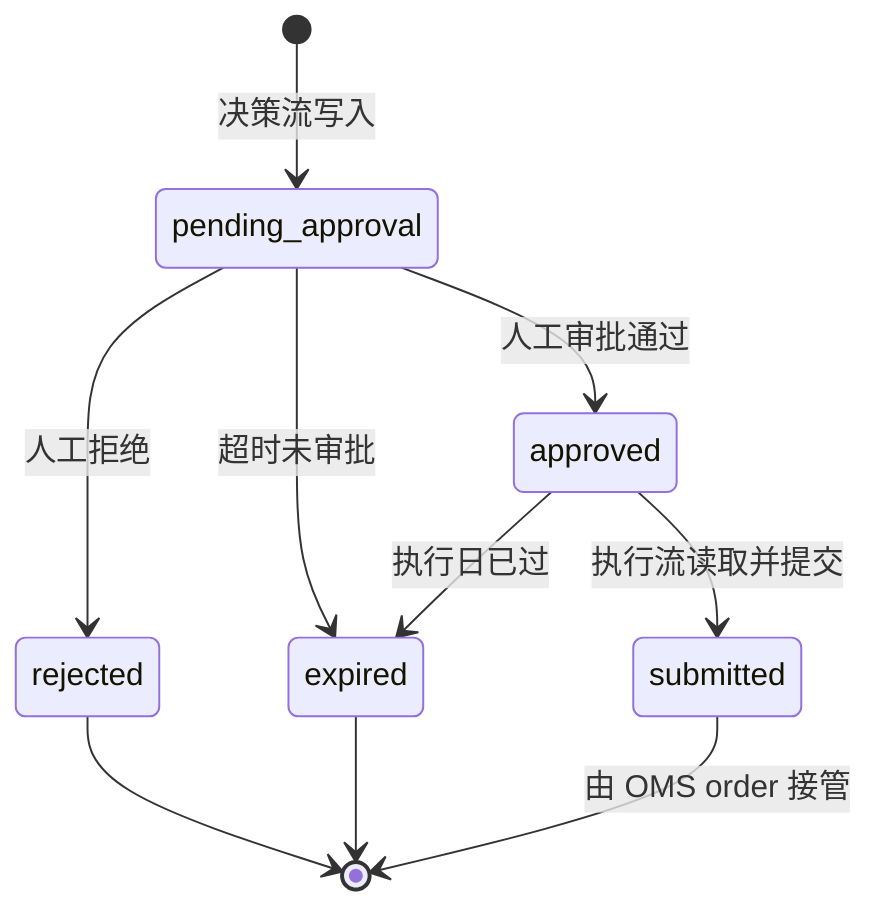

#### order / order_event（订单 + 事件溯源）

**order**:

| 字段 | 类型 | 说明 |
|------|------|------|
| id | UUID PK | |
| platform_order_id | UUID unique | 平台内部订单 ID |
| broker_order_id | String(64) | 券商委托号 |
| instance_id | UUID FK | 策略实例 |
| pre_order_id | UUID FK → pre_order | 来源预订单 |
| account_id | UUID FK → trading_account | 账户 |
| symbol | String(16) | 标的 |
| side | Enum | `buy` / `sell` |
| order_type | Enum | `limit` / `market` |
| price | Numeric | 委托价格 |
| quantity | Integer | 委托数量 |
| filled_quantity | Integer | 成交数量 |
| avg_fill_price | Numeric | 成交均价 |
| status | Enum | 见 OMS 状态机 |
| idempotency_key | String(128) unique | `{instance_id}:{signal_id}:{symbol}:{side}` |
| signal_date | Date | 信号日 |
| execution_date | Date | 执行日 |

**order_event**:

| 字段 | 类型 | 说明 |
|------|------|------|
| id | UUID PK | |
| order_id | UUID FK → order | 订单 |
| event_type | Enum | `created` / `risk_checked` / `submitted` / `partial_filled` / `filled` / `cancelled` / `rejected` / `expired` |
| quantity | Integer | 本次变动数量 |
| price | Numeric | 本次变动价格 |
| detail | JSON | 事件详情 |
| created_at | DateTime | 事件时间 |

#### trade（成交记录）

| 字段 | 类型 | 说明 |
|------|------|------|
| id | UUID PK | |
| order_id | UUID FK → order | 订单 |
| account_id | UUID FK | 账户 |
| symbol | String(16) | 标的 |
| side | Enum | `buy` / `sell` |
| quantity | Integer | 成交数量 |
| price | Numeric | 成交价格 |
| amount | Numeric | 成交金额 |
| commission | Numeric | 手续费 |
| stamp_tax | Numeric | 印花税 |
| traded_at | DateTime | 成交时间 |
| broker_trade_id | String(64) | 券商成交号 |

#### position_snapshot（持仓快照）

| 字段 | 类型 | 说明 |
|------|------|------|
| id | UUID PK | |
| account_id | UUID FK | 账户 |
| symbol | String(16) | 标的 |
| quantity | Integer | 持仓数量 |
| available_qty | Integer | 可用数量（T+1） |
| cost_price | Numeric | 成本价 |
| current_price | Numeric | 最新价 |
| market_value | Numeric | 市值 |
| weight | Float | 权重 |
| unrealized_pnl | Numeric | 浮动盈亏 |
| unrealized_pnl_pct | Float | 浮动盈亏% |
| target_weight | Float | 目标权重（来自 position_sizing_result） |
| weight_deviation | Float | 权重偏离 |
| snapshot_date | Date | 快照日期 |
| snapshot_time | Time | 快照时间（盘内分钟级） |

#### account_snapshot（资金快照）

| 字段 | 类型 | 说明 |
|------|------|------|
| id | UUID PK | |
| account_id | UUID FK | 账户 |
| total_asset | Numeric | 总资产 |
| cash | Numeric | 可用资金 |
| frozen_cash | Numeric | 冻结资金 |
| market_value | Numeric | 持仓市值 |
| daily_pnl | Numeric | 当日盈亏 |
| daily_pnl_pct | Float | 当日盈亏% |
| cumulative_pnl | Numeric | 累计盈亏 |
| cumulative_pnl_pct | Float | 累计盈亏% |
| max_drawdown_pct | Float | 最大回撤% |
| snapshot_date | Date | 快照日期 |

#### risk_rule（风控规则）

| 字段 | 类型 | 说明 |
|------|------|------|
| id | UUID PK | |
| rule_code | String(64) unique | 规则编码 |
| name | String(128) | 规则名称 |
| category | Enum | `position` / `capital` / `timing` / `circuit_breaker` |
| level | Enum | `info` / `warn` / `critical` / `fatal` |
| is_enabled | Boolean | 是否启用 |
| params | JSON | 规则参数 |
| scope | Enum | `global` / `account` / `instance` |
| scope_id | UUID | 作用域 ID |
| description | String(256) | 规则说明 |

#### risk_event（风控事件）

| 字段 | 类型 | 说明 |
|------|------|------|
| id | UUID PK | |
| rule_id | UUID FK → risk_rule | 触发规则 |
| account_id | UUID FK | 账户 |
| instance_id | UUID FK | 策略实例 |
| event_type | Enum | `blocked` / `warning` / `circuit_breaker` / `kill_switch` |
| level | Enum | `info` / `warn` / `critical` / `fatal` |
| detail | JSON | 事件详情 |
| action_taken | String | 采取的措施 |
| resolved | Boolean | 是否已处理 |
| resolved_by | String(64) | 处理人 |
| resolved_at | DateTime | 处理时间 |
| created_at | DateTime | 事件时间 |

### 4.3 公共关联字段

所有业务表携带以下审计字段：

| 字段 | 说明 |
|------|------|
| `workflow_run_id` | 产出该记录的工作流 Run ID |
| `strategy_instance_id` | 所属策略实例 |
| `signal_date` | 信号日 T |
| `execution_date` | 执行日 T+1（仅 pre_order / order） |
| `node_id` | 工作流节点 ID |

---

## 五、OMS 订单状态机

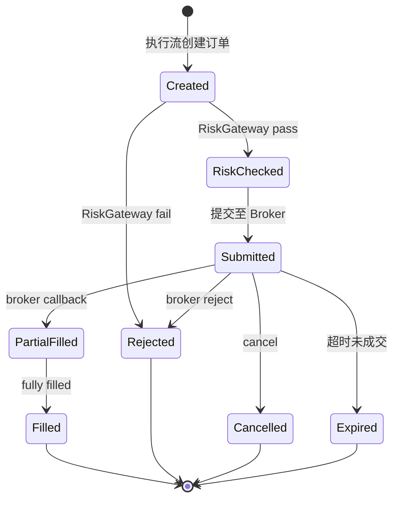

**与 pre_order 状态的关系**:

```
pre_order(approved) → order(Created) → order(RiskChecked) → order(Submitted) → ...
```

pre_order 在执行流读取后转为 order，后续生命周期由 OMS 管理。

---

## 六、Broker 适配层

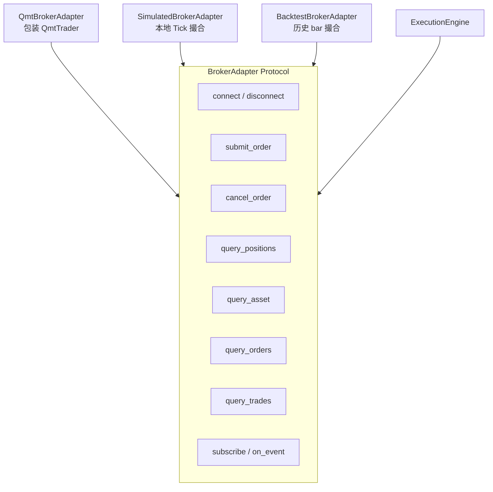

| 实现 | 场景 | 撮合 | 回调 |
|------|------|------|------|
| `QmtBrokerAdapter` | 实盘 | 券商真实 | QMT callback → OMS event |
| `SimulatedBrokerAdapter` | 模拟盘 | 本地 Tick 撮合 | 内部撮合 → OMS event |
| `BacktestBrokerAdapter` | 回测 | 历史 bar/tick | 事件驱动 → OMS event |

**关键设计**：所有 Adapter 的回调统一路由到 OMS 事件链路，保证三套环境订单生命周期一致。

---

## 七、风控体系（三层）

### 7.1 架构

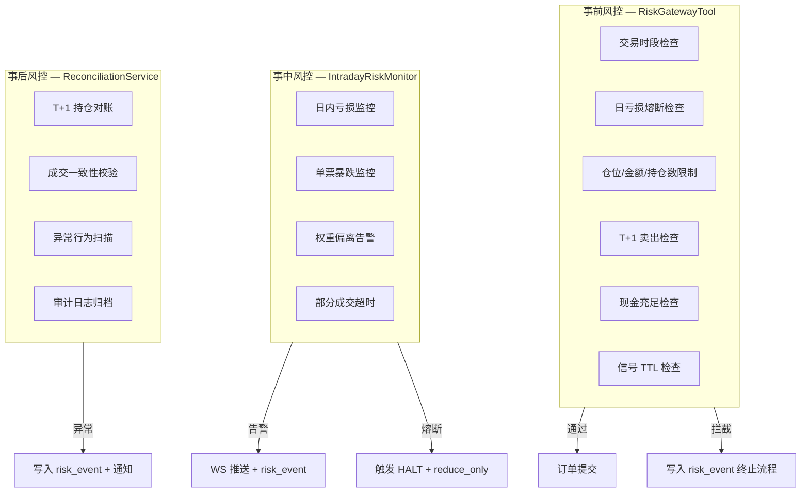

### 7.2 内置风控规则

| 规则编码 | 类别 | 默认参数 | 说明 |
|----------|------|---------|------|
| `trading_session` | timing | 09:30-11:30, 13:00-15:00 | 交易时段限制 |
| `daily_loss_circuit` | circuit_breaker | -2% | 日亏损熔断 |
| `max_position_pct` | position | 10% | 单票仓位上限 |
| `max_positions` | position | 10 | 持仓数量上限 |
| `max_order_amount` | capital | 50 万 | 单笔金额上限 |
| `t_plus_1_sell` | capital | available_qty | T+1 卖出限制 |
| `cash_sufficient` | capital | cash ≥ buy_amount | 现金充足检查 |
| `signal_ttl` | timing | 5 分钟 | 信号有效期 |

### 7.3 Kill Switch（紧急全平）

**触发方式**:
- 前端驾驶舱"紧急全平"按钮
- API: `POST /trading/accounts/{id}/kill-switch`
- 风控规则自动触发（`fatal` 级别）

**执行逻辑**:
1. 写入 `risk_event(type=kill_switch)`
2. 设置账户 `reduce_only=true`
3. 取消所有 `submitted` 订单
4. 生成 reduce/close 预订单，**绕过 Workflow 直连 QmtBrokerAdapter**
5. 前端 StatusBar 红色闪烁 + 驾驶舱风险卡红色边框

### 7.4 Fallback 审计

PositionSizingTool 的 fallback 策略触发时：
1. 写入 `risk_event(type=warning, detail={strategy, fallback, symbol, reason})`
2. WS 推送 `ws.trading.risk`
3. 前端驾驶舱风险卡显示"配仓降级"告警

---

## 八、仓位管理（PositionSizingTool）

### 8.1 架构

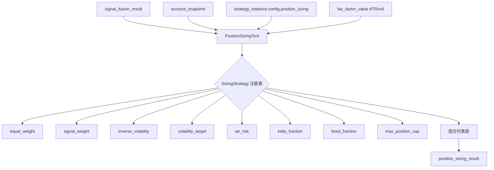

### 8.2 内置策略

| 策略 ID | 名称 | 公式 | 业界参考 |
|---------|------|------|---------|
| `equal_weight` | 等权 | `w_i = 1/N` | QuantConnect EqualWeighting |
| `signal_weight` | 信号加权 | `w_i ∝ max(score_i, 0)` 归一化 | WorldQuant 分层权重 |
| `inverse_volatility` | 逆波动率 | `w_i ∝ 1/σ_i` | Risk Parity 简化版 |
| `volatility_target` | 波动率目标 | 缩放全组合使预测波动 → target_vol | AQR / Barra |
| `atr_risk` | ATR 风险平价 | `w_i = (risk_budget/N) / (ATR_i × price_i × multiplier)` | Turtle Trading |
| `kelly_fraction` | 凯利分数 | `f* = (p×b - q)/b, w_i = fraction × f*` | Kelly Criterion |
| `fixed_fraction` | 固定比例 | 每标的固定 `fixed_pct` | 经典固定分数法 |
| `max_position_cap` | 上限截断 | `w_i = min(w_i, max_position_pct)` | 券商合规 |

### 8.3 组合约束层

在单标的 sizing 之后，增加组合级约束：

| 约束 | 参数 | 说明 |
|------|------|------|
| 行业集中度 | `max_industry_weight` | 单行业权重上限（如 30%） |
| 组合波动率 | `max_portfolio_vol` | 组合预测波动率上限 |
| 权重总和 | `max_total_weight` | 全组合权重之和上限（≤1，预留现金） |
| 流动性约束 | `min_avg_volume` | 最低日均成交额 |

### 8.4 策略配置

```json
{
  "strategy": "atr_risk",
  "params": {
    "atr_period": 14,
    "risk_budget_pct": 0.02,
    "atr_multiplier": 2.0,
    "max_single_weight": 0.10
  },
  "fallback": "equal_weight",
  "portfolio_constraints": {
    "max_industry_weight": 0.30,
    "max_portfolio_vol": 0.15,
    "max_total_weight": 0.95,
    "min_avg_volume": 5000000
  }
}
```

---

## 九、盘内监控服务

### 9.1 架构

监控服务是**独立轻量级后台任务**，非 Workflow 节点，仅在交易时段运行。

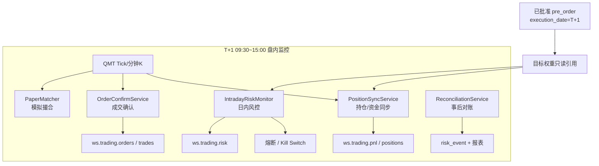

### 9.2 信号与监控协作模型

**核心原则**：信号是"剧本"（只读），监控是"演出"（同步+对比+告警）

| 组件 | 频率 | 职责 | 数据流向 |
|------|------|------|---------|
| `PositionSyncService` | 1~5 分钟 | 从 QMT 同步持仓/资金，计算实际 vs 目标偏离 | QMT → position_snapshot → WS |
| `OrderConfirmService` | 事件 + 30s 轮询 | 跟踪订单状态变更 | QMT callback → order_event → WS |
| `IntradayRiskMonitor` | 1 分钟 | 日内亏损、单票暴跌、权重偏离告警 | position_snapshot + pre_order → risk_event → WS |
| `PaperMatcher` | Tick | 模拟盘撮合定价 | QMT Tick → trade → WS |
| `ReconciliationService` | T+1 16:00 | 持仓对账、成交校验 | QMT vs trading 表 → risk_event |

### 9.3 监控服务生命周期

```python
# 伪代码示意
class IntradayMonitorService:
    """盘内监控服务，交易时段运行。"""

    async def start(self, account_id: str):
        """09:25 启动。"""
        # 加载当日 approved pre_orders 作为"剧本"
        self.targets = await self.load_targets(account_id)
        # 启动定时任务
        schedule(self.sync_positions, interval=60)
        schedule(self.check_risk, interval=60)
        schedule(self.confirm_orders, interval=30)

    async def sync_positions(self):
        """从 QMT 同步持仓，计算实际 vs 目标偏离。"""
        actual = await self.broker.query_positions()
        for symbol, target in self.targets.items():
            deviation = actual[symbol].weight - target.target_weight
            if abs(deviation) > DEVIATION_THRESHOLD:
                await self.ws.publish("ws.trading.positions", deviation_alert)

    async def stop(self):
        """15:00 停止，触发 ReconciliationService。"""
        await self.reconcile()
```

---

## 十、WebSocket Topics

| Topic | 数据 | 推送频率 |
|-------|------|---------|
| `ws.broker.status` | QMT 连接状态 | 变更时 |
| `ws.trading.pnl` | 账户资产（总资产/可用/市值/盈亏） | 2s 轮询 + 变更推送 |
| `ws.trading.signals` | 待审批信号 / 审批状态变更 | 变更时 |
| `ws.trading.orders` | 订单状态变更 | 变更时 |
| `ws.trading.trades` | 成交流 | 变更时 |
| `ws.trading.positions` | 持仓变更 / 权重偏离告警 | 1~5 分钟 |
| `ws.trading.workflow` | 工作流 run 状态 | 变更时 |
| `ws.trading.risk` | 风控事件 / 熔断 / Kill Switch | 变更时 |

---

## 十一、页面交互设计

### 11.1 导航结构

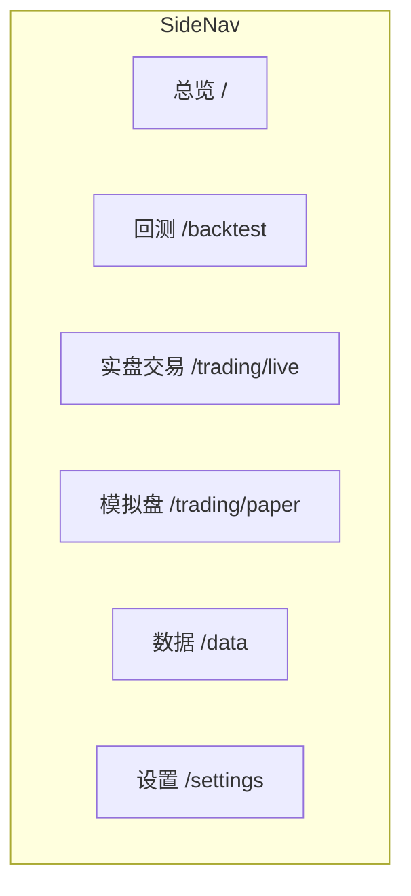

**精简为 2 个交易入口**：实盘驾驶舱 + 模拟盘驾驶舱。订单管理、风控、工作流均内嵌为驾驶舱 Tab。

### 11.2 一站式驾驶舱 — 实盘 `/trading/live`

**核心理念**：所有日常操作不跳页，风控常驻可见。

```
┌──────────────────────────────────────────────────────────────────────────────┐
│ [≡] XQ Trader  [🔍]                              [📓] [🌙] [🔔 3] [Agent] │
├──────┬───────────────────────────────────────────────────────────────────────┤
│      │  实盘交易                          [账户 ▼ 实盘-001] [● Live]         │
│      ├───────────────────────────────────────────────────────────────────────┤
│ Side │  ┌─ 驾驶舱 ─────────────────────────────────────────────────────────┐│
│ Nav  │  │                                                                    ││
│      │  │  ┌──────────┐ ┌──────────┐ ┌──────────┐ ┌──────────┐             ││
│      │  │  │总资产     │ │可用资金   │ │持仓市值   │ │当日收益   │             ││
│      │  │  │¥1.23M    │ │¥456K     │ │¥778K     │ │+1.2% ↑   │             ││
│      │  │  └──────────┘ └──────────┘ └──────────┘ └──────────┘             ││
│      │  │                                                                    ││
│      │  │  ┌─ 风险状态 ──────────────────────────────────────────────────┐  ││
│      │  │  │ ● 正常  日亏损 -0.3%/-2%  仓位 5/10  熔断:未触发  [紧急全平]│  ││
│      │  │  └────────────────────────────────────────────────────────────┘  ││
│      │  │                                                                    ││
│      │  │  ┌─ Workflow ──────────────────────────────────────────────────┐  ││
│      │  │  │ ● decision succeeded 18:30  ○ execution pending 09:25      │  ││
│      │  │  └────────────────────────────────────────────────────────────┘  ││
│      │  └──────────────────────────────────────────────────────────────────┘│
│      ├───────────────────────────────────────────────────────────────────────┤
│      │  [自选&策略] [持仓&收益] [信号&审批] [订单&成交] [风控详情] [工作流] │
│      ├───────────────────────────────────────────────────────────────────────┤
│      │                                                                       │
│      │  （Tab 内容区）                                                         │
│      │                                                                       │
│      └───────────────────────────────────────────────────────────────────────┘
├──────┴───────────────────────────────────────────────────────────────────────┤
│ ● QMT 已连接 │ 总资产 ¥1,234,567 │ 当日 +1.2% │ 风控:正常 │ WF: pending    │
└──────────────────────────────────────────────────────────────────────────────┘
```

### 11.3 驾驶舱区域详解

#### KPI 四卡

| 卡片 | 数据源 | WS Topic |
|------|--------|----------|
| 总资产 | `account_snapshot.total_asset` | `ws.trading.pnl` |
| 可用资金 | `account_snapshot.cash` | `ws.trading.pnl` |
| 持仓市值 | `account_snapshot.market_value` | `ws.trading.pnl` |
| 当日收益 | `account_snapshot.daily_pnl_pct` | `ws.trading.pnl` |

#### 风险状态卡（常驻，不可关闭）

```
┌─ 风险状态 ─────────────────────────────────────────────────────────────┐
│  ● 正常 │ 日亏损 -0.3%/限-2% │ 仓位 5/10 │ 熔断:未触发 │ [紧急全平] │
└────────────────────────────────────────────────────────────────────────┘
```

| 指标 | 数据源 | 告警阈值 | 视觉反馈 |
|------|--------|---------|---------|
| 状态灯 | `risk_event` 最新 | — | 绿=正常，黄=告警，红=熔断 |
| 日亏损 | `account_snapshot.daily_pnl_pct` | ≥-1.5% 黄，≥-2% 红 | 数字变色 |
| 仓位 | `position_snapshot` count | ≥8/10 黄 | 数字变色 |
| 熔断 | `risk_event(type=circuit_breaker)` | 已触发 | 红色背景闪烁 |
| 紧急全平 | Kill Switch API | — | 红色危险按钮 |

**熔断触发时**：
- 风险卡边框 `--color-rise`，背景 `color-mix(--color-rise 8%)`
- StatusBar 风控段红色闪烁
- TopBar 铃铛 +1 告警

#### Workflow 状态行

```
┌─ Workflow ────────────────────────────────────────────────────────────┐
│  ● trading_decision succeeded 18:30  ○ trading_execution pending 09:25 │
└──────────────────────────────────────────────────────────────────────┘
```

| 状态 | 颜色 |
|------|------|
| succeeded | `--color-fall` |
| running | `--accent-primary` |
| pending | `--text-secondary` |
| failed | `--color-rise` |

### 11.4 StatusBar 扩展

```
┌──────────────────────────────────────────────────────────────────────────────┐
│ ● QMT 已连接 │ 总资产 ¥1.23M │ 当日 +1.2% │ 风控:正常 │ WF: pending @审批 │
└──────────────────────────────────────────────────────────────────────────────┘
```

新增"风控"段和"WF"段，点击可跳转驾驶舱对应区域。

### 11.5 Tab 1：自选 & 策略

```
┌─ 自选股池 ─────────────────────────────┐  ┌─ 策略实例 ──────────────────────────┐
│ [🔍 搜索添加]                           │  │                                     │
│ ┌─────────────────────────────────────┐│  │ ┌─ Alpha-Rebalance-01 ────────────┐│
│ │ 600519.SH 贵州茅台  [ATR风险] [×]  ││  │ │ [Live] [运行中]  昨日信号: 3     ││
│ │ 000858.SZ 五粮液    [等权]   [×]  ││  │ │ 账户: live-001  配仓: ATR风险    ││
│ │ 601318.SH 中国平安  [ATR风险] [×]  ││  │ │ 待审批: 1  累计收益: +8.3%       ││
│ │ 000001.SZ 平安银行  [—]     [×]  ││  │ │ [查看信号] [暂停] [停止]         ││
│ └─────────────────────────────────────┘│  │ └─────────────────────────────────┘│
│                                        │  │                                     │
│ ┌─ 个股策略配置（点击自选股展开）──────┐│  │ ┌─ Momentum-Weekly ──────────────┐│
│ │ 600519.SH 贵州茅台                  ││  │ │ [Paper] [运行中]                ││
│ │ 所属策略: [Alpha-Rebalance-01 ▼]   ││  │ │ 账户: paper-001  配仓: 等权      ││
│ │ 信号源: [alpha158 + 资金流 ▼]      ││  │ │ 运行: 30d  收益: +5.1%          ││
│ │ 配仓策略: [ATR风险 ▼]              ││  │ │ [Promote → Live] [停止]         ││
│ │ ATR周期: [14] 风险预算: [2%]       ││  │ └─────────────────────────────────┘│
│ │ [保存]                              ││  │                                     │
│ └─────────────────────────────────────┘│  │ [+ 新建策略实例]                     │
└────────────────────────────────────────┘  └─────────────────────────────────────┘
```

**关键交互**：

| 操作 | 流程 |
|------|------|
| 添加自选 | 搜索股票 → 加入自选池 → 可选：立即配置策略参数 |
| 个股策略配置 | 点击自选股 → 展开配置面板 → 选择策略实例 + 信号源 + 配仓参数 |
| 策略上线 | 策略实例卡片 → 启动 → Celery Beat 按调度运行 trading_decision |
| 策略下线 | 策略实例卡片 → 停止 → 取消 Beat 调度 |
| Promote | Paper 实例 → Promote → 确认 Modal（含验证检查清单）→ 创建 Live 实例 |
| 查看信号 | 策略实例卡片 → "查看信号" → 自动切换到"信号&审批" Tab |

**Promote 验证检查清单**：

| 检查项 | 条件 |
|--------|------|
| 运行天数 | ≥ 30 天 |
| 最大回撤 | ≤ 配置阈值 |
| Sizing 策略 | 已显式配置（非默认等权） |
| 风控规则 | 已设置 |
| 信号胜率 | ≥ 配置阈值 |

### 11.6 Tab 2：持仓 & 收益

```
┌─ 持仓明细 ───────────────────────────────────────────────────────────────────┐
│  代码   名称    目标权重  实际权重  偏离    成本    现价    盈亏     盈亏%     │
│  600519 贵州茅台  12.0%    11.8%   -0.2%  ¥1680  ¥1720  +4,000  +2.4%    │
│  000858 五粮液    8.0%     8.1%   +0.1%  ¥145   ¥142   -600    -1.4%    │
│  601318 中国平安  6.0%     6.0%    0.0%  ¥48    ¥49    +1,000  +2.1%    │
│  ...                                                                          │
│  偏离超阈值行: 左边框 --color-warning                                         │
├──────────────────────────────────────────────────────────────────────────────┤
│  ┌─ 收益曲线 ───────────────────────────┐  ┌─ 收益日历 ─────────────────┐  │
│  │  ▁▂▃▄▅▆▇█▇▆▅▄▃▂▁                   │  │  ■ ■ □ ■ ■ □ ■ ■ ■ □ ■ ■ │  │
│  │  累计收益 +8.3%  最大回撤 -2.1%       │  │  6月收益 +1.2%             │  │
│  │  时间范围: [1M] [3M] [6M] [1Y] [ALL] │  │                             │  │
│  └──────────────────────────────────────┘  └─────────────────────────────┘  │
└──────────────────────────────────────────────────────────────────────────────┘
```

**持仓表关键列**：

| 列 | 数据来源 | 说明 |
|----|---------|------|
| 目标权重 | `position_sizing_result.target_weight` | 决策层计算的目标 |
| 实际权重 | `position_snapshot.weight` | 盘内实时同步 |
| 偏离 | 实际 - 目标 | 超阈值(±1%)黄色高亮 |

### 11.7 Tab 3：信号 & 审批

```
┌─ 待审批信号 (3) ─────────────────────────────────────────────────────────────┐
│  筛选: [策略▼] [信号日▼]                                                     │
│                                                                              │
│  ┌─ 600519.SH 贵州茅台 ──────────────────────────────────────────────────┐  │
│  │  [开仓] Tag红底   信号日: 2026-06-09 → 执行日: 2026-06-10            │  │
│  │  目标权重 12%  当前 0%  目标数量 100股  限价 ¥1680                    │  │
│  │  配仓: ATR风险(14)  可用现金 ¥500K  依据: Alpha信号 Top1              │  │
│  │  [修改数量/价格]  [拒绝]  [批准]                                       │  │
│  └───────────────────────────────────────────────────────────────────────┘  │
│  ┌─ 000858.SZ 五粮液 ────────────────────────────────────────────────────┐  │
│  │  [减仓] Tag绿底   信号日: 2026-06-09 → 执行日: 2026-06-10            │  │
│  │  目标权重 5%  当前 8%  建议卖出 200股  市价                            │  │
│  │  [拒绝]  [批准]                                                        │  │
│  └───────────────────────────────────────────────────────────────────────┘  │
│  ┌─ 601318.SH 中国平安 ──────────────────────────────────────────────────┐  │
│  │  [平仓] Tag绿底   目标权重 0%  建议全部卖出                            │  │
│  │  [拒绝]  [批准]                                                        │  │
│  └───────────────────────────────────────────────────────────────────────┘  │
│                                                                              │
│  [全部拒绝]                                      [批量批准 (3)]             │
├──────────────────────────────────────────────────────────────────────────────┤
│  ┌─ 历史信号 ────────────────────────────────────────────────────────────┐  │
│  │  信号日   标的      方向   状态      审批人  结果                       │  │
│  │  06-08   600519    开仓   已成交    张三    +2.4%                      │  │
│  │  06-07   000858    加仓   已成交    张三    -1.4%                      │  │
│  │  06-06   601318    开仓   已拒绝    张三    —                          │  │
│  └───────────────────────────────────────────────────────────────────────┘  │
└──────────────────────────────────────────────────────────────────────────────┘
```

**审批交互**：

| 操作 | API | 说明 |
|------|-----|------|
| 逐条批准 | `POST /trading/approval/{id}` body: `{action: approve}` | 单条审批 |
| 逐条拒绝 | `POST /trading/approval/{id}` body: `{action: reject, comment: "..."}` | 拒绝需填原因 |
| 修改后批准 | `PUT /trading/pre-orders/{id}` → `POST /trading/approval/{id}` | 修改数量/价格后审批 |
| 批量批准 | `POST /trading/approval/batch` body: `{items: [{id, action: approve}]}` | 批量操作 |
| 全部拒绝 | `POST /trading/approval/batch` body: `{items: [...], action: reject_all}` | 批量拒绝 |

**side 标签配色**：`open/add` → Tag 红底（`--color-rise`），`reduce/close` → Tag 绿底（`--color-fall`）

### 11.8 Tab 4：订单 & 成交

```
┌─ 订单 & 成交 ───────────────────────────────────────────────────────────────┐
│  [当日委托] [当日成交] [历史订单]                                              │
│  筛选: [策略▼] [状态▼] [日期范围]  [刷新]                                     │
├──────────────────────────────────────────────────────────────────────────────┤
│  委托号   代码    方向   数量  价格   成交量  状态      时间    策略    [撤单] │
│  24001   600519  买入   100  ¥1680  100    已成交    09:31   Alpha   —      │
│  24002   000858  卖出   200  市价   120    部分成交  09:35   Alpha   [撤单] │
│  24003   601318  卖出   300  市价   0      已报      09:36   Alpha   [撤单] │
└──────────────────────────────────────────────────────────────────────────────┘
```

- 方向列：买入行左边框红（`--color-rise`），卖出行左边框绿（`--color-fall`）
- 状态 Tag：复用 `STATUS_COLOR` 映射
- 撤单：仅 `submitted` / `partial_filled` 可撤

### 11.9 Tab 5：风控详情

```
┌─ 风控详情 ──────────────────────────────────────────────────────────────────┐
│  ┌─ 熔断器 ─────────────────────┐  ┌─ 风控指标 ───────────────────────────┐│
│  │ ● 正常运行                    │  │ 今日拦截: 0  告警: 1  活跃规则: 7   ││
│  │ 日亏损: -0.3% (限 -2%)       │  │                                       ││
│  │ [解除熔断]  [紧急全平]        │  │ 单票仓位: 12%/10% ⚠ 超限            ││
│  └──────────────────────────────┘  │ 持仓数量: 5/10                        ││
│                                    │ 日亏损: -0.3%/-2%                     ││
│                                    └───────────────────────────────────────┘│
│  [规则配置] [事件日志] [对账记录]                                             │
├──────────────────────────────────────────────────────────────────────────────┤
│  规则配置:                                                                   │
│  规则代码        名称          类别      级别    启用   参数          [编辑] │
│  daily_loss     日亏损熔断     熔断      critical  ✓    -2%           [编辑] │
│  max_position   单票仓位上限   仓位      warn      ✓    10%           [编辑] │
│  max_positions  持仓数量上限   仓位      warn      ✓    10            [编辑] │
│  trading_session 交易时段     时段      info      ✓    09:30-15:00   [编辑] │
│  ...                                                                         │
└──────────────────────────────────────────────────────────────────────────────┘
```

**规则按类别分组**：仓位限制 / 资金限制 / 时段限制 / 熔断器

### 11.10 Tab 6：工作流

```
┌─ 工作流 ────────────────────────────────────────────────────────────────────┐
│  [+ 手动触发 trading_decision]                                               │
├──────────────────────────────────────────────────────────────────────────────┤
│  Run 列表:                                                                   │
│  Flow              信号日    状态       当前节点     耗时    [详情]          │
│  trading_decision  06-09    succeeded  —            3m20s   [详情]          │
│  trading_execution 06-10    running    BrokerSubmit 1m05s   [详情]          │
├──────────────────────────────────────────────────────────────────────────────┤
│  Run 详情: trading_decision 06-09                                            │
│  ● LoadContext → ● CrossSelect → ● SymbolSignal → ● Fusion → ● Sizing     │
│  → ● OrderIntent → ● RiskCheck → ● End                                     │
│  ┌─ 节点输出 ───────────────────────────────────────────────────────────┐  │
│  │  position_sizing: { 600519: 12%, 000858: 5%, 601318: 0% }           │  │
│  └──────────────────────────────────────────────────────────────────────┘  │
└──────────────────────────────────────────────────────────────────────────────┘
```

### 11.11 模拟盘驾驶舱 `/trading/paper`

结构与实盘驾驶舱完全一致，差异点：

| 差异 | 实盘 | 模拟盘 |
|------|------|--------|
| 账户类型 | `live` | `paper` |
| Live 标签 | `Tag color=--color-live` | `Tag default` |
| Broker | QmtBrokerAdapter | SimulatedBrokerAdapter |
| 审批 | 默认必须 | 可跳过 |
| Promote | — | 有"Promote → Live"按钮 |
| 策略实例 | 无创建限制 | 需验证检查才能 Promote |

### 11.12 TopBar 信号铃铛

```
┌─────────────────────────────────────────────────────────────────────┐
│ [≡] XQ Trader  [🔍]                        [📓] [🌙] [🔔 3] [Agent]│
└─────────────────────────────────────────────────────────────────────┘
                                              │
                                              ▼ Popover
                              ┌───────────────────────────────┐
                              │ 待审批信号 (3)    [查看全部 →] │
                              ├───────────────────────────────┤
                              │ ● 600519.SH  开仓  +12%  2分钟前│
                              │ ● 000858.SZ  减仓  -3%   5分钟前│
                              │ ● 601318.SH  平仓       1分钟前│
                              ├───────────────────────────────┤
                              │        [批量审批 →]            │
                              └───────────────────────────────┘
```

- 徽章数：`pre_order.approval_status=pending` 计数
- 点击条目 → 打开驾驶舱"信号&审批" Tab
- WS `ws.trading.signals` 实时更新

---

## 十二、关键交互流

### 12.1 日频交易完整流程

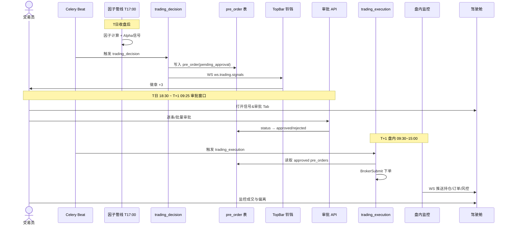

### 12.2 Paper → Live Promote

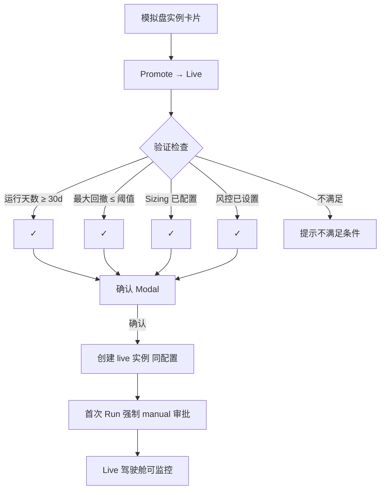

### 12.3 Kill Switch 紧急全平

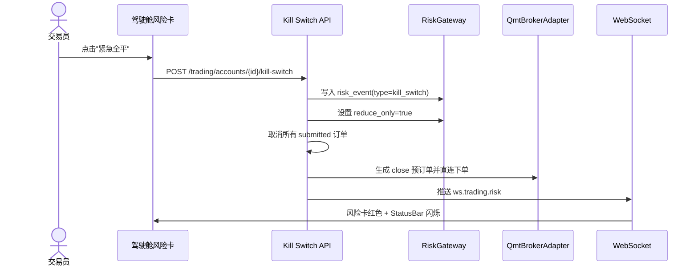

### 12.4 盘内权重偏离告警

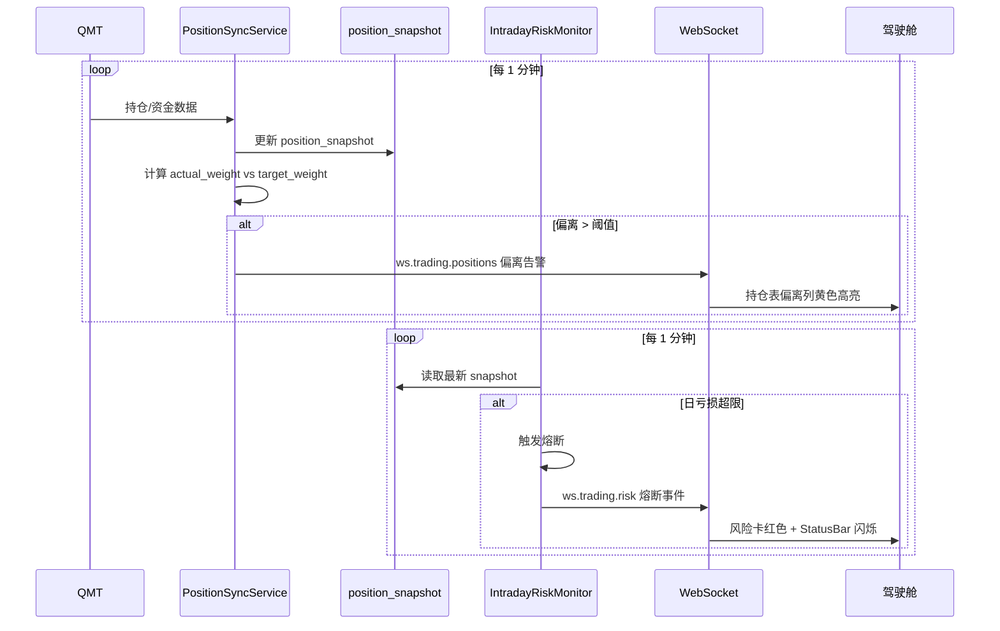

---

## 十三、API 设计

### 13.1 交易账户

| 方法 | 路径 | 说明 |
|------|------|------|
| GET | `/trading/accounts` | 账户列表 |
| POST | `/trading/accounts` | 创建账户 |
| GET | `/trading/accounts/{id}` | 账户详情 |
| GET | `/trading/accounts/{id}/snapshot` | 最新资金快照 |

### 13.2 策略实例

| 方法 | 路径 | 说明 |
|------|------|------|
| GET | `/trading/instances` | 实例列表 |
| POST | `/trading/instances` | 创建实例 |
| PUT | `/trading/instances/{id}` | 更新实例配置 |
| POST | `/trading/instances/{id}/start` | 启动实例 |
| POST | `/trading/instances/{id}/pause` | 暂停实例 |
| POST | `/trading/instances/{id}/stop` | 停止实例 |
| PUT | `/trading/instances/{id}/position-sizing` | 更新配仓配置 |
| POST | `/trading/instances/{id}/promote` | Paper → Live 晋升 |

### 13.3 自选池

| 方法 | 路径 | 说明 |
|------|------|------|
| GET | `/trading/watchlists/{instance_id}` | 获取自选池 |
| POST | `/trading/watchlists/{instance_id}/items` | 添加自选 |
| DELETE | `/trading/watchlists/{instance_id}/items/{item_id}` | 删除自选 |
| PUT | `/trading/watchlists/items/{item_id}/config` | 更新个股配置 |

### 13.4 预订单 & 审批

| 方法 | 路径 | 说明 |
|------|------|------|
| GET | `/trading/pre-orders` | 预订单列表（支持 status/instance_id 筛选） |
| GET | `/trading/pre-orders/{id}` | 预订单详情 |
| PUT | `/trading/pre-orders/{id}` | 修改预订单（数量/价格） |
| POST | `/trading/approval/{id}` | 逐条审批 |
| POST | `/trading/approval/batch` | 批量审批 |

### 13.5 订单 & 成交

| 方法 | 路径 | 说明 |
|------|------|------|
| GET | `/trading/orders` | 订单列表 |
| GET | `/trading/orders/{id}` | 订单详情 |
| POST | `/trading/orders/{id}/cancel` | 撤单 |
| GET | `/trading/trades` | 成交列表 |

### 13.6 持仓

| 方法 | 路径 | 说明 |
|------|------|------|
| GET | `/trading/positions` | 持仓列表 |
| GET | `/trading/positions/snapshot` | 最新持仓快照（含目标权重偏离） |

### 13.7 风控

| 方法 | 路径 | 说明 |
|------|------|------|
| GET | `/trading/risk/rules` | 风控规则列表 |
| PUT | `/trading/risk/rules/{id}` | 更新风控规则 |
| GET | `/trading/risk/events` | 风控事件列表 |
| POST | `/trading/accounts/{id}/kill-switch` | 紧急全平 |
| POST | `/trading/accounts/{id}/circuit-breaker/reset` | 解除熔断 |

### 13.8 工作流

| 方法 | 路径 | 说明 |
|------|------|------|
| POST | `/workflow/run` | 启动工作流 |
| GET | `/workflow/run/{run_id}` | 查询状态 |
| POST | `/workflow/run/{run_id}/stop` | 停止工作流 |
| GET | `/workflow/list` | 可用工作流列表 |

### 13.9 仓位管理结果

| 方法 | 路径 | 说明 |
|------|------|------|
| GET | `/trading/position-sizing` | 仓位管理结果（支持 run_id/instance_id 筛选） |

---

## 十四、目录结构

### 后端

```
src/xqtrader/domain/trading/
├── backtest/                            # ✅ 回测引擎（已实现）
│   ├── core.py                          # RuleContext, RuleResult, RuleConfig, StrategyConfig, RulePlugin ABC
│   ├── engine.py                        # SignalEngine — 规则评估 + 融合
│   ├── runner.py                        # run_backtest — 数据准备 + cerebro 运行
│   ├── service.py                       # BacktestService — API 入口 + 数据加载 + 内置因子计算
│   ├── performance.py                   # 绩效指标提取
│   ├── backtrader_ext.py                # Backtrader 适配层
│   ├── fusion/                          # 信号融合策略
│   │   ├── base.py, and_or.py, weighted.py, ic_weighted.py
│   ├── plugins/                         # SPI 规则插件
│   │   ├── macd.py, expression.py
│   └── sizer/                           # 仓位管理
│       ├── engine.py, config.py, context.py, plugin.py
│       └── plugins/atr_position.py, kelly.py
├── rules/                               # ✅ 规则引擎（已实现）
│   ├── base.py                          # RulePlugin ABC
│   ├── expression/                      # 表达式引擎 (lexer, parser, evaluator, operators)
│   └── plugins/multi_factor_resonance.py
├── selection/                           # ✅ 截面选股引擎（已实现）
│   └── engine.py
├── loaders/                             # ✅ 策略配置加载器（已实现）
│   └── strategy_loader.py              # StrategyConfigLoader — DB → StrategyConfig
├── models/                              # ✅ 数据模型（已实现）
│   ├── account.py                       # trading_account, account_snapshot
│   ├── strategy.py                      # td_strategy (单表 JSONB)
│   ├── rule.py                          # td_rule_registry (单表 JSONB)
│   ├── backtest.py                      # td_backtest_run, td_backtest_result
│   ├── instance.py                      # strategy_instance
│   ├── watchlist.py                     # watchlist, watchlist_item
│   ├── order.py                         # order, order_event
│   ├── position.py                      # position_snapshot
│   ├── risk.py                          # risk_rule, risk_event
│   └── decision.py                      # pre_order, decision
├── broker.py                            # 🔧 Broker 适配层骨架
├── enums.py                             # ✅ 所有枚举定义
│
│   # ──── 以下模块待实现 ────
│   # services/                          # ⏳ account_service, approval_service, reconciliation_service
│   # oms/                               # ⏳ OMS 订单管理 + 状态机
│   # risk/                              # ⏳ 事前/事中/事后风控 + Kill Switch
│   # execution/                         # ⏳ ExecutionEngine
│   # paper/                             # ⏳ 模拟盘引擎 + 撮合
│   # monitor/                           # ⏳ 持仓同步 + 订单确认 + 对账

src/xqtrader/api/v1/
├── backtest/                            # ✅ 回测 API (router.py, schemas.py)
├── strategies/                          # ✅ 策略管理 API
├── rules/                               # ✅ 规则管理 API
├── selection/                           # ✅ 截面选股 API
├── broker/                              # ✅ Broker 连接 API
│   # ──── 以下 API 待实现 ────
│   # trading/                           # ⏳ 交易域 API (accounts, instances, pre_orders, approval, orders, positions, risk)

flow/
├── trading_decision.json                # ⏳ 决策流定义
└── trading_execution.json               # ⏳ 执行流定义
```

### 前端

```
web/src/
├── pages/
│   ├── backtest/                        # ✅ 回测页（已实现）
│   │   ├── BacktestPage.tsx
│   │   └── components/                  # BasicConfigPanel, BuiltinStrategyPicker, EquityCurveChart,
│   │                                    # PerformanceGrid, TradeListTable, PositionListTable
│   ├── trading/                         # 🔧 交易页（骨架已搭建）
│   │   ├── LiveCockpitPage.tsx          # 实盘驾驶舱
│   │   └── components/                  # AccountKpiCards, CockpitDashboard, PreOrderApprovalDrawer,
│   │                                    # PositionPnLTab, SignalApprovalTab, OrderFlowTab, ...
│   │   # ⏳ PaperTradingPage, OrdersPage, RiskPage, WorkflowMonitorPage 待实现
│   ├── strategy/                        # ✅ 策略管理页
│   └── stock/                           # ✅ 个股详情页
├── api/
│   ├── backtest/index.ts                # ✅ 回测 API 类型
│   └── trading/                         # ⏳ 交易 API 类型待实现
└── components/stock/
    └── StockKlineChart.tsx              # ✅ K线组件（支持交易标记叠加）
```

---

## 十五、设计令牌

沿用 `themes.css`，不引入新色板：

| 令牌 | 用途 |
|------|------|
| `--accent-primary` | 主操作、Live 标签、running 状态 |
| `--color-rise` | 涨/盈利/买入/open/add、熔断红色 |
| `--color-fall` | 跌/亏损/卖出/reduce/close、succeeded 状态 |
| `--color-warning` | 告警、paused 状态、偏离超阈值 |
| `--color-live` | 实盘标识 |
| `--bg-card` | 卡片背景 |
| `--bg-workspace` | 工作区背景 |
| `--border-subtle` | 卡片边框 |

---

## 十六、四套环境 Promotion


| 阶段 | Broker | 撮合 | 审批 |
|------|--------|------|------|
| 回测 | BacktestBrokerAdapter | 历史 bar/tick | 无 |
| 模拟 | SimulatedBrokerAdapter | 实时 Tick 本地 | 可跳过 |
| 实盘人工 | QmtBrokerAdapter | 券商真实 | 必须 |
| 实盘自动 | QmtBrokerAdapter | 券商真实 | 自动（需显式开启） |

同一 `trading_decision.json` + `trading_execution.json`，通过 `run_mode` 切换 Adapter 与审批模式。

---

## 十七、与因子管线衔接

### 17.1 管线依赖图

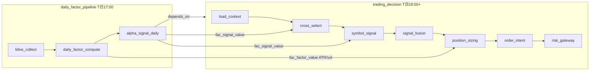

### 17.2 决策层 vs 执行层

| 层次 | 频率 | 职责 | 是否重算因子 |
|------|------|------|-------------|
| **决策层** | 日频（收盘后 1 次） | 选股、信号融合、仓位管理、生成预订单 | 是 |
| **执行层** | 盘内（秒~分钟） | 下单、成交确认、持仓同步、日内风控 | **否** |

---

## 十八、业界参考

| 平台 | 借鉴点 |
|------|--------|
| QuantConnect LEAN | 同一 Algorithm 环境切换；PortfolioConstruction 仓位层 |
| VeighNa | Gateway 适配器 + PaperAccount；TargetPosModule |
| Bloomberg Terminal | 多面板平铺 + 状态栏实时推送；TOMS 订单全生命周期 |
| 衡泰 xQuant | 策略全生命周期 + 三层风控（内置+对接+旁路） |
| IB TWS | Pre-Trade Compliance；Mosaic 可定制工作区 |
| 专业交易台 | OMS/EMS 分离；多角色审批；Kill Switch |
| CASE-AI | Sim/Real 双视图；信号 → 人工授权 → 下单 |
