# xqtrader 因子系统技术架构设计

> **版本**: v1.0 | **更新**: 2026-06-07
> **依赖**: [factor-catalog.md](./factor-catalog.md) 因子分类体系
> **框架**: Pipeline引擎 + Celery插件 + DAL/ORM

***

## 一、系统定位

因子系统是 xqtrader 平台的量化研究基础设施，负责因子的**计算、存储、评估、融合**全生命周期管理。系统需将示例代码中的研究型脚本（CASE-C/ML/网格）重构为生产级服务，同时遵循项目已有的 Pipeline + Celery 插件架构。

### 1.1 设计目标

| 目标      | 说明                            |
| ------- | ----------------------------- |
| 生产化     | 将研究脚本转为可调度、可监控、可重试的 Celery 任务 |
| 可扩展     | 新因子通过注册表+插件机制接入，无需修改核心流程      |
| 可评估     | 每个因子自动产出 IC/ICIR/分层回测等统计指标    |
| 可融合     | 多因子经预处理后合成为复合 Alpha 因子        |
| 截面/信号分离 | 截面因子走因子管线，非截面信号走信号引擎          |

### 1.2 与示例代码的映射

| 示例代码                         | 核心能力                | 目标架构组件                          |
| ---------------------------- | ------------------- | ------------------------------- |
| CASE-C `factor_lib.py`       | 10个技术因子计算           | FactorPlugin 因子计算插件             |
| CASE-C `preprocessor.py`     | 去极值/Z-score/行业中性化   | PreprocessStage 预处理阶段           |
| CASE-C `synthesizer.py`      | 等权/IC加权/Lasso合成     | SynthesizeStage 合成阶段            |
| CASE-C `layered_backtest.py` | 分层回测+IC时序           | EvaluateStage 评估阶段              |
| CASE-ML `feature_engine.py`  | 50+因子+分类体系          | FactorPlugin + FACTOR\_TAXONOMY |
| CASE-ML `ml_engine.py`       | XGBoost/LightGBM/集成 | MLSynthesizeStage ML合成阶段        |
| CASE-网格 `factor_engine.py`   | 因子打分+选股             | ScoreStage 打分阶段                 |

***

## 二、系统架构总览

### 2.1 架构层次

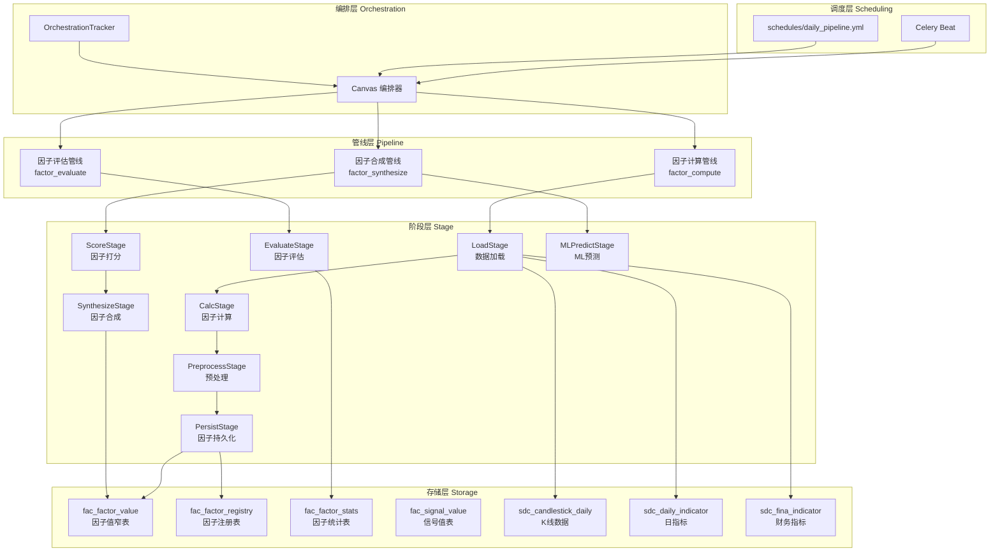

### 2.2 数据流全景

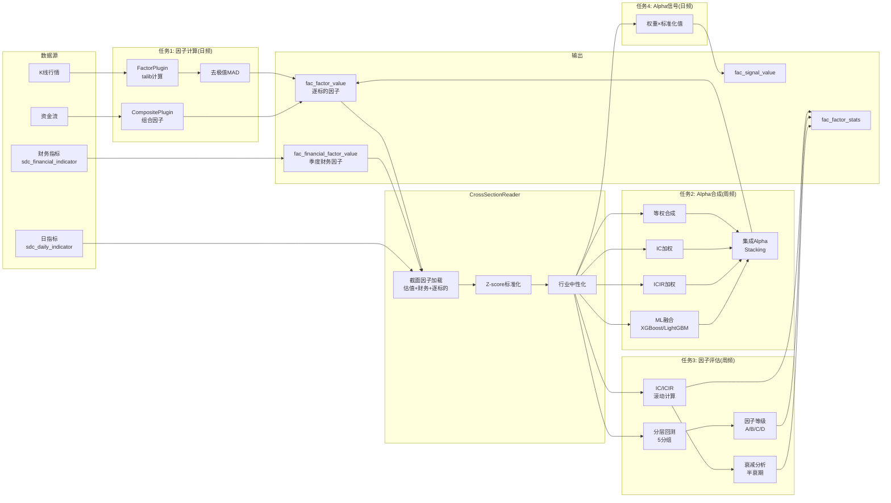

***

## 三、四大独立计算任务

因子系统按数据流拆分为四个独立 Celery 任务，各自有独立的调度频率、数据加载策略和持久化逻辑。

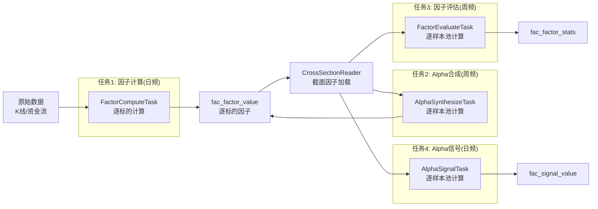

**任务依赖关系**：

- 因子计算 → Alpha信号（信号需逐标的因子 + 截面因子）
- 因子计算 → 因子评估（评估需逐标的因子 + 截面因子）
- 因子评估 → Alpha合成（合成需评估结果确定因子等级）
- Alpha合成 → Alpha信号（信号需合成权重）
- 因子评估 与 Alpha合成 **串行**（评估先执行，合成使用评估结果）

### 3.1 任务1：因子计算 (FactorComputeTask)

**调度**：日频（工作日 17:00）
**粒度**：逐标的，批量计算
**输入**：原始数据（K线、资金流）
**输出**：fac\_factor\_value（pool\_id='all'，仅逐标的可独立计算的因子）

> **设计原则**：因子计算任务只处理**逐标的可独立计算**的因子（技术因子、量价因子、资金流因子）。截面因子（估值指标、财务指标）不在本任务中处理，而是在评估/合成任务中按需加载并截面标准化。原因：截面标准化需要全市场标的的同日数据，与逐标的计算模式矛盾。

#### 3.1.1 数据加载策略

因子计算的关键在于数据加载范围——既要保证计算精度，又要控制内存和查询开销：

| 因子类型    | 加载策略                   | 原因                    | 示例           |
| ------- | ---------------------- | --------------------- | ------------ |
| 有状态技术因子 | **全量历史数据**，从第一根 bar 计算 | 依赖递推状态，截断导致前期值不准确     | MACD、EMA、SAR |
| 无状态技术因子 | **5年 + 前300条补充**       | 仅需固定窗口回溯，300条保证5年首日可算 | 动量20d、波动率20d |
| 资金流因子   | **5年 + 前300条补充**       | 部分需滚动窗口               | 主力净额MA5      |

> 估值因子（PE/PB/PS）和财务因子（ROE/ROA等）属于**截面因子**，不在此任务中加载，而是在评估/合成任务中通过 CrossSectionReader 按需加载。

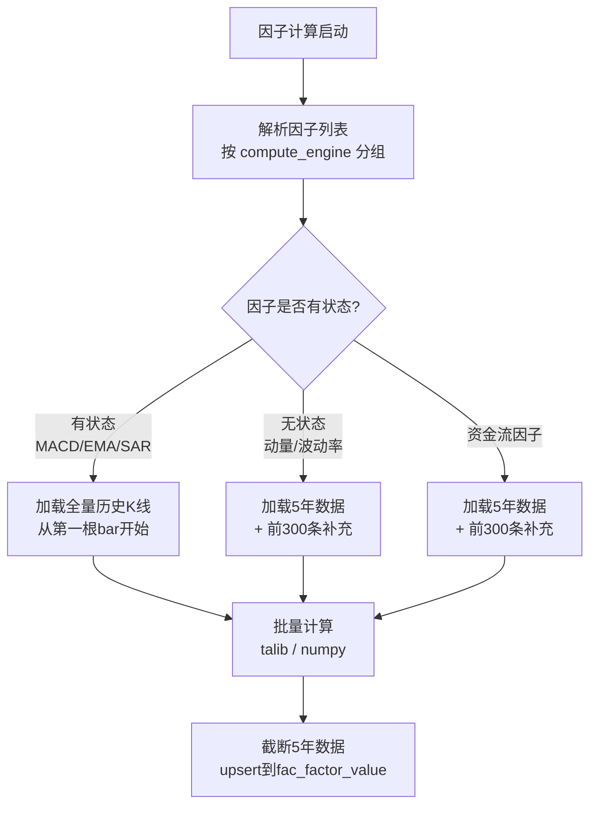

**前向补充300条的意义**：5年首日（如2021-01-04）计算20日动量需要前20个交易日的数据，计算MACD(12,26,9)需要前35个交易日的数据。300条覆盖约1.2年，足以满足所有无状态因子的回溯需求。

#### 3.1.2 计算流程

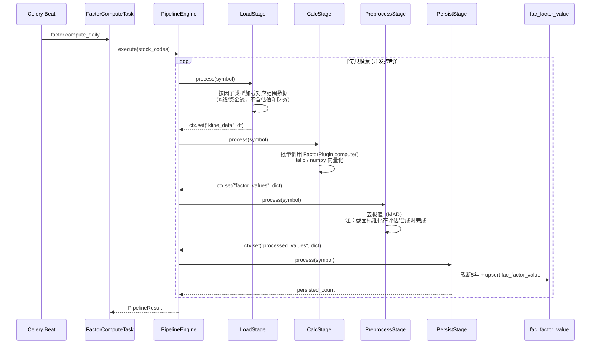

**管线定义**：

| 阶段              | 职责                                                                       | 输入           | 输出                                      |
| --------------- | ------------------------------------------------------------------------ | ------------ | --------------------------------------- |
| LoadStage       | 加载K线/资金流数据（不含估值和财务）                                                      | symbol       | ctx: kline\_df, flow\_df |
| CalcStage       | 批量调用 FactorPlugin.compute()                                              | ctx: 行情数据    | ctx: {factor\_id: value}                |
| PreprocessStage | 去极值（MAD）；截面标准化在评估/合成时完成                                                  | ctx: 因子值     | ctx: 处理后因子值                            |
| PersistStage    | 截断5年 + upsert fac\_factor\_value                                         | ctx: 处理后因子值 | 持久化行数                                   |

#### 3.1.3 因子分类与存储策略

因子按**计算独立性**分为两类，决定其存储位置和计算方式：

| 类型 | 特征 | 计算方式 | 存储位置 | 示例 |
|------|------|---------|---------|------|
| **逐标的因子** | 仅依赖自身时序数据 | 逐标的独立计算 | fac_factor_value | MACD、动量、波动率、资金流MA |
| **截面因子** | 依赖全市场截面数据 | 评估/合成时按需加载+标准化 | 源表（不重复存储） | PE/PB/PS、ROE/ROA/毛利率 |

**逐标的因子**：在因子计算任务中逐标的计算，写入 `fac_factor_value`。

**截面因子**：不在因子计算任务中处理。估值指标已存在于 `sdc_daily_indicator`，财务因子已存在于 `fac_financial_factor_value`（按 ann_date 存储）。评估/合成时通过 CrossSectionReader 按需加载并截面标准化。

**截面因子不存入 factor_value 的理由**：

| 维度 | 存入 factor_value | 按需加载（当前方案） |
|------|-----------------|---------------|
| 截面标准化 | 与逐标的计算矛盾（需全市场数据） | 在截面计算时自然完成 |
| 存储冗余 | 估值指标重复存储（daily_indicator + factor_value） | 无冗余，源表唯一 |
| 标准化灵活性 | 标准化结果固定，不同样本池无法差异化 | 按样本池动态标准化 |
| PIT精确性 | 财务因子需前向填充，冗余且可能不一致 | PIT 实时计算，天然精确 |
| 查询统一性 | 单表查询 | CrossSectionReader 统一接口 |

#### 3.1.4 CrossSectionReader — 截面因子按需加载

估值因子和财务因子都是截面因子，在评估/合成/信号任务中通过 **CrossSectionReader** 统一加载：

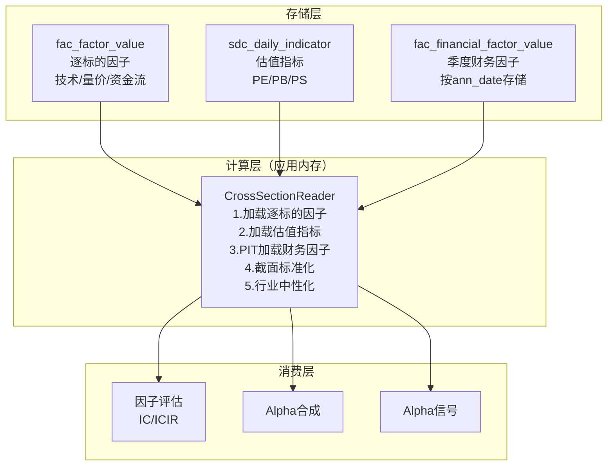

**CrossSectionReader 实现思路**：

```python
class CrossSectionReader:
    """截面因子统一加载器，评估/合成/信号任务共用"""

    async def load_cross_section(
        self, trade_date: date, pool_id: str, factor_ids: list[str]
    ) -> pd.DataFrame:
        # 1. 加载逐标的因子（fac_factor_value）
        ts_factors = await self._load_ts_factors(trade_date, pool_id, factor_ids)

        # 2. 加载估值指标（sdc_daily_indicator）→ 截面标准化
        val_factors = await self._load_valuation(trade_date)
        val_standardized = self._cross_section_zscore(val_factors)

        # 3. PIT加载财务因子（fac_financial_factor_value）→ 前向填充 + 截面标准化
        fina_factors = await self._pit_load_financial(trade_date)
        fina_standardized = self._cross_section_zscore(fina_factors)

        # 4. 合并所有因子 → 行业中性化
        merged = pd.concat([ts_factors, val_standardized, fina_standardized], axis=1)
        return self._industry_neutralize(merged)
```

**估值指标加载**：直接从 `sdc_daily_indicator` 读取截面日全市场数据，Z-score 标准化后使用。无需额外存储。

**财务因子 PIT 加载**：从 `fac_financial_factor_value` 读取 `ann_date ≤ 截面日` 的最新记录，前向填充后截面标准化。详见 3.1.5。

#### 3.1.5 财务因子的 PIT 前向填充

**结论：财务因子独立存储（按 ann_date），评估/合成时通过 CrossSectionReader 在应用层按截面日前向填充。**

财务数据按季度发布，但因子评估和Alpha合成需要每日截面数据。采用**应用层 PIT 前向填充**而非数据库层前向填充：

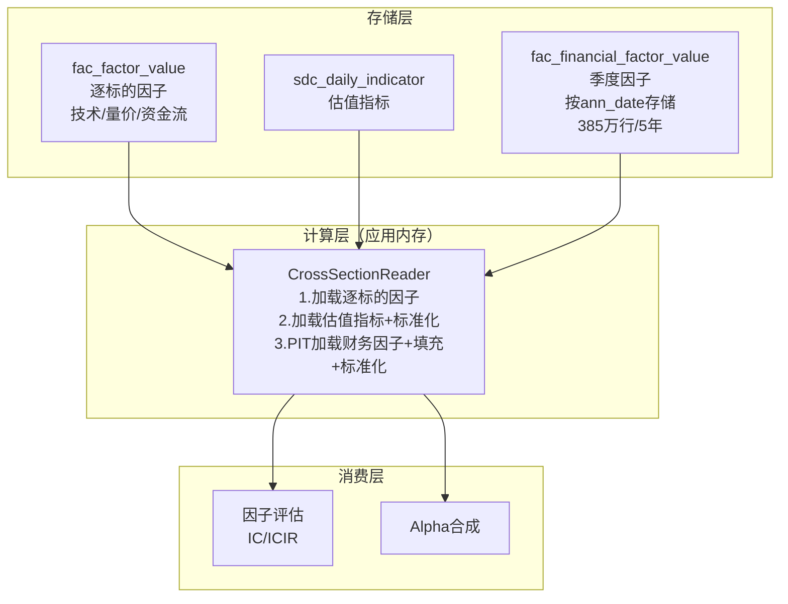

**PIT 前向填充逻辑**（由 CrossSectionReader 内部执行）：

```
截面日=2026-04-10 → 查 ann_date ≤ 2026-04-10 的最新财报 → roe=12.5
截面日=2026-04-11 → 同一条财报 → roe=12.5 (前向填充)
截面日=2026-05-05 → Q1季报 ann_date=2026-04-28 已发布 → roe=13.1 (更新)
```

**填充方式**：不是在数据库中预填充，而是在 CrossSectionReader 中按截面日实时计算。财务源表和 `fac_financial_factor_value` 均保持季度粒度不变。

**性能分析**：

- 5年财务因子仅 385万行，加载 < 2秒
- 内存中向量化前向填充 < 1秒
- 比 SQL LATERAL JOIN（每截面日×每标的子查询）快几个数量级
- 比预填充方案节省 98% 存储空间

### 3.2 任务2：Alpha合成 (AlphaSynthesizeTask)

**调度**：周频（周六 10:00）
**粒度**：逐样本池(pool_id)，批量计算
**输入**：fac_factor_value（逐标的因子）+ CrossSectionReader（截面因子）
**输出**：Alpha权重（更新 fac_factor_registry.params）+ fac_factor_value（alpha_* 因子，含 pool_id）

> **设计原则**：Alpha合成任务负责**权重优化**（周频），Alpha信号计算（日频）由独立任务 3.4 负责。合成任务更新权重后，信号任务每日用最新权重生成信号。

```mermaid
flowchart TD
    START[合成触发] --> SELECT[筛选因子<br/>仅A级+B级因子]
    SELECT --> LOAD_CSR[CrossSectionReader加载<br/>1.逐标的因子(fac_factor_value)<br/>2.估值指标(sdc_daily_indicator)<br/>3.财务因子(fac_financial_factor_value)]
    LOAD_CSR --> LOAD_STATS[加载统计指标<br/>fac_factor_stats]
    LOAD_STATS --> PREPROC[预处理<br/>截面标准化→行业中性化]

    PREPROC --> BRANCH_EQ[等权合成]
    PREPROC --> BRANCH_IC[IC加权合成]
    PREPROC --> BRANCH_ICIR[ICIR加权合成]
    PREPROC --> BRANCH_ML[ML融合]

    BRANCH_EQ --> alpha_eq
    BRANCH_IC --> alpha_ic
    BRANCH_ICIR --> alpha_icir
    BRANCH_ML --> alpha_xgb
    BRANCH_ML --> alpha_lgb

    alpha_eq --> ENS[集成合成<br/>Stacking]
    alpha_ic --> ENS
    alpha_icir --> ENS
    alpha_xgb --> ENS
    alpha_lgb --> ENS

    ENS --> alpha_ensemble
    alpha_ensemble --> EVAL_ALPHA[评估复合Alpha<br/>ICIR>1.5 / 多空年化>15%]
    EVAL_ALPHA --> PERSIST_WEIGHT[持久化Alpha权重<br/>更新fac_factor_registry.params]
    PERSIST_WEIGHT --> COMPUTE_ALPHA[计算Alpha因子值<br/>权重×标准化因子值]
    COMPUTE_ALPHA --> PERSIST_ALPHA[持久化Alpha因子<br/>fac_factor_value<br/>pool_id=目标样本池]
    PERSIST_ALPHA --> END[合成完成]
```

**关键设计**：

- 通过 CrossSectionReader 统一加载逐标的因子 + 估值指标 + 财务因子
- 按样本池(pool_id)批量计算，不同样本池的Alpha因子独立
- 合成结果写回 fac_factor_value，factor_id 以 `alpha_` 前缀标识
- Alpha权重持久化到 registry，供日频信号任务使用

### 3.3 任务3：因子评估 (FactorEvaluateTask)

**调度**：周频（周六 08:00，在Alpha合成前执行）
**粒度**：逐样本池(pool_id)，批量计算
**输入**：fac_factor_value（逐标的因子）+ CrossSectionReader（截面因子）
**输出**：fac_factor_stats + 更新 fac_factor_registry

```mermaid
flowchart TD
    START[评估触发<br/>周度] --> LOAD_CSR[CrossSectionReader加载<br/>1.逐标的因子(fac_factor_value)<br/>2.估值指标(sdc_daily_indicator)<br/>3.财务因子(fac_financial_factor_value)]
    LOAD_CSR --> LOAD_RET[加载收益率<br/>下期收益]
    LOAD_RET --> CALC_IC[计算IC序列<br/>Spearman秩相关]
    CALC_IC --> CALC_ICIR[计算ICIR<br/>IC_mean/IC_std]
    CALC_ICIR --> CALC_LAYER[分层回测<br/>5分组多空]
    CALC_LAYER --> CALC_DECAY[衰减分析<br/>IC半衰期]
    CALC_DECAY --> CALC_TURNOVER[换手率计算<br/>持仓变动]
    CALC_TURNOVER --> GRADE[因子等级评定<br/>A/B/C/D]
    GRADE --> PERSIST_STATS[持久化统计指标<br/>fac_factor_stats]
    PERSIST_STATS --> UPDATE_REGISTRY[更新注册表<br/>factor_grade/status]
    UPDATE_REGISTRY --> END[评估完成]
```

**评估指标计算逻辑**：

| 指标    | 计算方式                               | 说明               |
| ----- | ---------------------------------- | ---------------- |
| IC    | Spearman(factor\_t, return\_{t+1}) | 滚动252日，每截面日一个IC值 |
| ICIR  | mean(IC) / std(IC)                 | IC序列的夏普比率        |
| IC胜率  | count(IC>0) / T                    | IC为正的比例          |
| 多空年化  | (Q5-Q1) 年化收益                       | 5分组最高组-最低组       |
| 多空夏普  | (Q5-Q1) 年化 / 年化波动                  | 多空组合风险调整收益       |
| 换手率   | sum(\|w\_t - w\_{t-1}\|) / 2       | 因子持仓稳定性          |
| 衰减半衰期 | IC(h=1..20) 拟合指数衰减                 | 因子预测持续性          |

**关键设计**：

- 通过 CrossSectionReader 统一加载逐标的因子 + 估值指标 + 财务因子
- 按样本池(pool_id)批量计算，同一因子在不同样本池下有独立的统计指标
- 评估结果更新 fac_factor_stats 和 fac_factor_registry 的 factor_grade

### 3.4 任务4：Alpha信号计算 (AlphaSignalTask)

**调度**：日频（工作日 18:00，在因子计算后执行）
**粒度**：逐样本池(pool_id)，批量计算
**输入**：fac_factor_value（逐标的因子）+ CrossSectionReader（截面因子）+ Alpha权重（registry.params）
**输出**：fac_signal_value（每日Alpha信号）

> **设计原则**：Alpha合成（周频）负责权重优化，Alpha信号（日频）负责用最新权重生成每日交易信号。两者解耦，避免为了日频信号而日频运行昂贵的权重优化。

```mermaid
flowchart TD
    START[信号触发<br/>日频] --> LOAD_CSR[CrossSectionReader加载<br/>1.逐标的因子(fac_factor_value)<br/>2.估值指标(sdc_daily_indicator)<br/>3.财务因子(fac_financial_factor_value)]
    LOAD_CSR --> LOAD_WEIGHT[加载Alpha权重<br/>fac_factor_registry.params]
    LOAD_WEIGHT --> STANDARDIZE[截面标准化<br/>Z-score + 行业中性化]
    STANDARDIZE --> COMPUTE[计算Alpha信号<br/>权重 × 标准化因子值]
    COMPUTE --> PERSIST[持久化信号<br/>fac_signal_value]
    PERSIST --> END[信号计算完成]
```

**关键设计**：

- 通过 CrossSectionReader 统一加载所有因子（逐标的 + 估值 + 财务），与评估/合成任务使用相同的数据加载逻辑
- Alpha权重从 fac_factor_registry.params 读取（由周频合成任务更新）
- 信号计算是轻量级操作（权重×标准化值），适合日频运行
- 输出写入 fac_signal_value，供交易系统消费

## 四、插件体系设计

### 4.1 因子计算插件架构

每个因子类别对应一个 Celery 插件，插件内部使用 Pipeline 引擎并发计算。

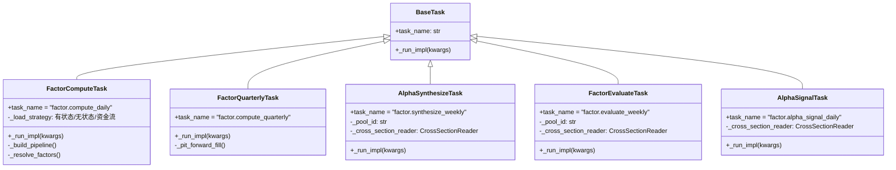

### 4.2 FactorPlugin 策略模式

因子计算采用策略模式，每个因子类别注册一个 FactorPlugin，CalcStage 遍历所有注册插件执行计算。

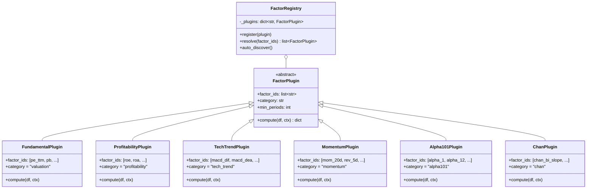

**FactorPlugin.compute() 规范**：

- 输入：K线 DataFrame + PipelineContext（含日指标、财务指标）
- 输出：`{factor_id: float}` 字典，一个插件可输出多个因子（组合因子）
- 注册：通过 `FactorPluginRegistry.register()` 手动注册（P2阶段），后续可扩展为自动扫描
- 依赖：插件声明 `dependencies`，CalcStage 按拓扑排序执行

### 4.3 分层目录结构

**设计原则**：严格区分计算引擎（worker 插件）与业务领域（domain 层）。计算引擎自包含所有计算逻辑，达到高内聚松耦合；domain 层向计算引擎提供基础能力，并为量化平台的选股、实盘等功能提供服务。

```
src/worker/plugins/factor_compute/     # 计算引擎（celery-plugin 自包含）
├── __init__.py
├── plugin.yaml                        # task_name=factor.compute_daily
├── task.py                            # FactorComputeTask
├── preprocessor.py                    # FactorPreprocessor (MAD/Z-score/中性化)
├── plugins/                           # FactorPlugin 策略模式
│   ├── __init__.py
│   ├── base.py                        # FactorPlugin ABC + FactorPluginRegistry
│   ├── valuation.py                   # B1 估值因子
│   ├── fundamental.py                 # B2-B5 基本面因子
│   ├── technical.py                   # C2-C4 技术因子
│   ├── momentum.py                    # C1 动量/反转因子
│   ├── risk.py                        # A1-A4 风险因子
│   ├── quantitative.py                # D1-D2 Alpha101/158因子
│   └── fund_flow.py                   # D3 资金流因子
└── pipeline/                          # Pipeline 阶段
    ├── __init__.py
    ├── load_stage.py                  # FactorLoadStage
    ├── calc_stage.py                  # FactorCalcStage
    ├── preprocess_stage.py            # FactorPreprocessStage
    └── persist_stage.py               # FactorPersistStage

src/xqtrader/domain/factor/            # 业务领域（数据契约 + 基础能力）
├── __init__.py
├── exceptions.py                      # 领域异常层级
├── models/                            # ORM 模型（全平台共享）
│   ├── factor_registry.py             # FacFactorRegistry
│   ├── factor_pool.py                 # FacFactorPool
│   ├── factor_stats.py                # FacFactorStats
│   ├── factor_value.py                # FacFactorValue (TimescaleDB)
│   └── signal_value.py                # FacSignalValue
├── definitions/                       # 因子定义（代码声明，唯一真相源）
│   ├── factor_def.py                  # FactorDefinition dataclass
│   ├── risk.py                        # A1-A4 风险因子定义
│   ├── fundamental.py                 # B1-B5 基本面因子定义
│   ├── technical.py                   # C1-C4 技术因子定义
│   ├── quantitative.py                # D1-D4 量价因子定义
│   ├── chan.py                         # E1-E2 缠论因子定义
│   ├── candlestick.py                 # F1 K线聚合因子定义
│   └── alpha.py                       # G1-G3 复合Alpha因子定义
└── services/                          # 领域服务（基础能力）
    ├── cross_section_reader.py        # CrossSectionReader (估值+财务截面加载)
    ├── registry_sync.py               # FactorRegistrySyncer
    └── pool_initializer.py            # FactorPoolInitializer

src/worker/plugins/                    # 其他计算引擎插件（P3-P5）
├── factor_evaluate/                   # 因子评估插件 (P3)
├── factor_synthesize/                 # 因子合成插件 (P4)
└── signal_compute/                    # 信号计算插件 (P5)
```

**依赖方向**：`worker/plugins/factor_compute/` → `xqtrader/domain/factor/`（单向依赖，domain 层不引用 worker 层）

***

## 五、任务调度编排

### 5.1 日频流水线：因子计算 + Alpha信号

```yaml
# schedules/daily_factor_pipeline.yml
name: daily_factor_pipeline
description: "每日因子计算+Alpha信号流水线"
mode: canvas
cron: "0 17 * * 1-5"          # 工作日17:00
queue: celery
enabled: true

steps:
  - name: kline_collect
    task: market.daily_kline_collect
    args: {}

  - name: indicator_collect
    task: market.indicator_collect
    depends_on: [kline_collect]
    args: {}

  - name: fund_flow_collect
    task: market.fund_flow_collect
    depends_on: [kline_collect]
    args: {}

  - name: daily_factor_compute
    task: factor.compute_daily
    depends_on: [indicator_collect, fund_flow_collect]
    args: {}

  - name: alpha_signal_compute
    task: factor.alpha_signal_daily
    depends_on: [daily_factor_compute]
    args: {}
```

### 5.2 周频流水线：评估 + 合成

```yaml
# schedules/weekly_factor_pipeline.yml
name: weekly_factor_pipeline
description: "周度因子评估+Alpha合成流水线"
mode: canvas
cron: "0 8 * * 6"            # 周六08:00
queue: celery
enabled: true

steps:
  - name: factor_evaluate
    task: factor.evaluate_weekly
    args: {}

  - name: alpha_synthesize
    task: factor.synthesize_weekly
    depends_on: [factor_evaluate]
    args: {}
```

### 5.3 季频流水线：财务因子计算

```yaml
# schedules/quarterly_factor_pipeline.yml
name: quarterly_factor_pipeline
description: "季度财务因子计算流水线"
mode: canvas
cron: "0 20 1 1,4,7,10 *"    # 每季度首月1号20:00
queue: celery
enabled: true

steps:
  - name: financial_collect
    task: market.financial_collect
    args: {}

  - name: quarterly_factor_compute
    task: factor.compute_quarterly
    depends_on: [financial_collect]
    args: {}
```

### 5.4 编排执行流程

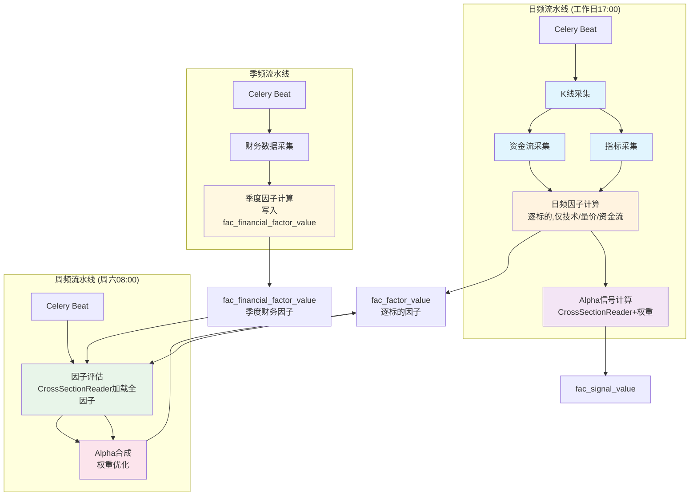

***

## 六、因子计算流程详解

### 6.1 单标的因子计算流程

```mermaid
flowchart TD
    START[输入: symbol] --> RESOLVE[解析因子列表<br/>从 fac_factor_registry]
    RESOLVE --> GROUP[按 compute_engine 分组]

    GROUP --> G1[cross_field 组<br/>截面直取]
    GROUP --> G2[cross_zscore 组<br/>截面标准化]
    GROUP --> G3[plugin 组<br/>FactorPlugin.compute]
    GROUP --> G4[composite 组<br/>组合因子]

    G1 --> MERGE[合并因子值]
    G2 --> MERGE
    G3 --> MERGE
    G4 --> MERGE

    MERGE --> PREPROC[预处理三件套]
    PREPROC --> P1[① 去极值 MAD]
    P1 --> P2[② Z-score 标准化]
    P2 --> P3[③ 行业中性化<br/>回归取残差]
    P3 --> OUTPUT[输出: {factor_id: value}]
```

### 6.2 compute\_engine 分组逻辑

| compute\_engine | 数据来源                                            | 计算方式                   | 示例                             |
| --------------- | ----------------------------------------------- | ---------------------- | ------------------------------ |
| cross\_field    | daily\_indicator / fina\_indicator / fund\_flow | 直接读取字段                 | pe\_ttm, roe, cs\_net\_mf\_amt |
| cross\_zscore   | 同上 + 截面标准化                                      | 读取字段 → Z-score         | z\_turnover, z\_main\_net\_pct |
| plugin          | candlestick\_daily                              | FactorPlugin.compute() | macd\_hist, rsi\_14, alpha\_1  |
| composite       | 依赖其他因子                                          | 组合因子子输出                | macd\_dif/dea/hist, kdj\_k/d/j |

***

## 七、因子评估流程详解

### 7.1 IC/ICIR 计算流程

```mermaid
flowchart LR
    subgraph "输入"
        FV[因子值<br/>fac_factor_value]
        RET[下期收益<br/>close_t+1/close_t - 1]
    end

    subgraph "滚动窗口 (252日)"
        LOOP[对每个截面日 t]
        IC_T[IC_t = Spearman<br/>(factor_t, return_t+1)]
        LOOP --> IC_T
    end

    subgraph "统计汇总"
        IC_MEAN[IC_mean = mean<br/>(IC序列)]
        IC_STD[IC_std = std<br/>(IC序列)]
        ICIR_VAL[ICIR = IC_mean<br/>/ IC_std]
        WIN_RATE[IC胜率 = count<br/>(IC>0) / T]
    end

    FV --> LOOP
    RET --> LOOP
    IC_T --> IC_MEAN
    IC_T --> IC_STD
    IC_MEAN --> ICIR_VAL
    IC_STD --> ICIR_VAL
    IC_T --> WIN_RATE
```

### 7.2 分层回测流程

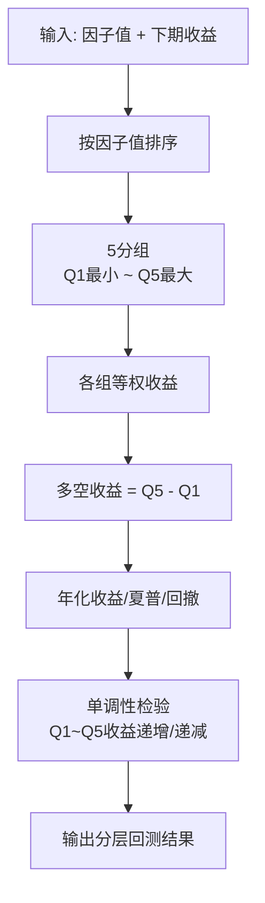

***

## 八、因子合成流程详解

### 8.1 合成方法对比

```mermaid
flowchart TD
    INPUT[预处理后因子矩阵<br/>index=股票, columns=因子] --> METHOD{选择合成方法}

    METHOD -->|等权| EQ[alpha_eq = mean<br/>(f1, f2, ..., fN)]
    METHOD -->|IC加权| IC[alpha_ic = Σ<br/>(IC_i × f_i) / Σ|IC_i|]
    METHOD -->|ICIR加权| ICIR[alpha_icir = Σ<br/>(ICIR_i × f_i) / Σ|ICIR_i|]
    METHOD -->|ML融合| ML[XGBoost / LightGBM<br/>滚动训练 predict_proba]

    EQ --> EVAL[评估复合Alpha]
    IC --> EVAL
    ICIR --> EVAL
    ML --> EVAL

    EVAL --> ENS[集成合成<br/>Stacking: alpha_eq + alpha_ic<br/>+ alpha_icir + alpha_xgb + alpha_lgb]
    ENS --> OUTPUT[alpha_ensemble]
```

### 8.2 ML融合 Walk-Forward 规范

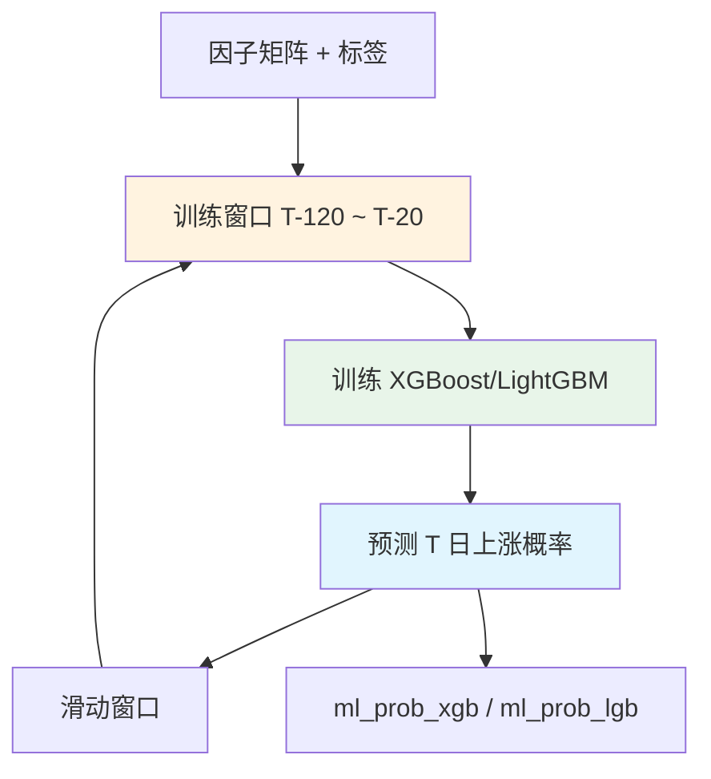

**Walk-Forward 关键约束**：

- 训练窗口：120个交易日（约6个月）
- 重训间隔：20个交易日
- Gap：5个交易日（防止信息泄露）
- 标签：二分类（涨=1/跌=0），基于次日收益

***

## 九、信号引擎设计

### 9.1 信号与因子的边界

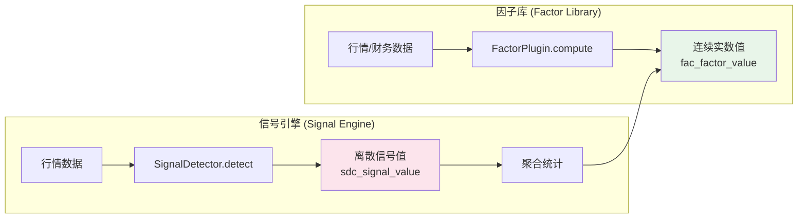

### 9.2 信号产出→因子升级路径

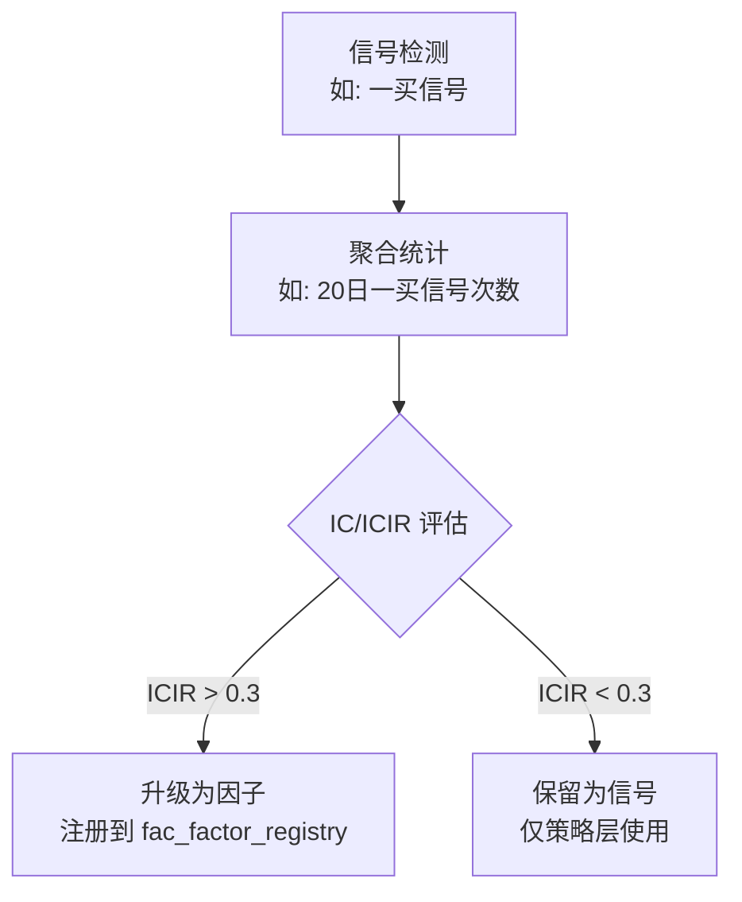

***

## 十、存储模型设计

### 10.1 新旧表隔离策略

**核心原则：旧表不动，新表独立建表，通过新 ORM 模型定义**

当前已存在的因子相关表：

| 旧表名                   | 模型类            | bind\_key | 状态       |
| --------------------- | -------------- | --------- | -------- |
| `sdc_factor_value`    | FactorValue    | stock     | **保留不动** |
| `sdc_factor_registry` | FactorRegistry | research  | **保留不动** |

新方案表命名规范：`fac_` 前缀（factor architecture 缩写），与旧表 `sdc_factor_` 前缀明确区分。

| 新表名                          | 用途                            | bind\_key | 对应旧表                  |
| ---------------------------- | ----------------------------- | --------- | --------------------- |
| `fac_factor_value`           | 逐标的因子值窄表（含 pool\_id，不含估值和财务）           | stock     | sdc\_factor\_value    |
| `fac_financial_factor_value` | 季度财务因子值（按 ann\_date 存储，无前向填充） | stock     | 无（新增）                 |
| `fac_factor_registry`        | 因子注册表（含 factor\_grade）        | research  | sdc\_factor\_registry |
| `fac_factor_stats`           | 因子统计指标表                       | research  | 无（新增）                 |
| `fac_factor_pool`            | 样本池配置表                        | research  | 无（新增）                 |
| `fac_signal_value`           | 信号值表                          | stock     | 无（新增）                 |

**迁移策略**：

- 旧表 `sdc_factor_value` / `sdc_factor_registry` 保持不变，现有代码继续使用
- 新表通过新 ORM 模型定义，新因子系统全部使用新表
- 数据迁移通过一次性 ETL 脚本完成（旧表数据转换写入新表）
- 新旧表并行期结束后，旧表可归档但**不删除**

### 10.2 新表 ER 关系

```mermaid
erDiagram
    FAC_FACTOR_REGISTRY ||--o{ FAC_FACTOR_VALUE : "1:N factor_id"
    FAC_FACTOR_REGISTRY ||--o{ FAC_FINANCIAL_FACTOR_VALUE : "1:N factor_id"
    FAC_FACTOR_REGISTRY ||--o{ FAC_FACTOR_STATS : "1:N factor_id"
    FAC_FACTOR_POOL ||--o{ FAC_FACTOR_STATS : "1:N pool_id"
    FAC_FACTOR_POOL ||--o{ FAC_FACTOR_VALUE : "1:N pool_id"

    FAC_FACTOR_REGISTRY {
        string factor_id PK
        string display_name
        string category
        string group_id
        string direction
        string scope
        string signal_type
        string base_factor
        string dependencies
        int min_periods
        string compute_module
        json params
        string data_origin
        string compute_engine
        string update_freq
        int report_lag_days
        string tags
        string status
        string factor_grade
        text description
    }

    FAC_FACTOR_VALUE {
        string symbol PK
        date trade_date PK
        string factor_id PK
        string pool_id PK
        float factor_value
    }

    FAC_FINANCIAL_FACTOR_VALUE {
        string symbol PK
        date end_date PK
        string factor_id PK
        date ann_date PK
        float factor_value
    }

    FAC_FACTOR_STATS {
        string factor_id PK
        string pool_id PK
        date calc_date PK
        int window
        float ic_mean
        float ic_std
        float icir
        float ic_win_rate
        float turnover
        float decay_half_life
        float long_short_annual_ret
        float long_short_sharpe
        float coverage
        string factor_grade
    }

    FAC_FACTOR_POOL {
        string pool_id PK
        string pool_name
        string pool_type
        json definition
        string refresh_freq
        string status
    }

    FAC_SIGNAL_VALUE {
        string symbol PK
        date trade_date PK
        string signal_id PK
        int signal_value
        float signal_strength
        string signal_context
    }
```

### 10.3 数据源表全景（已存在，只读引用）

因子计算所需的数据源表分布在 `stock` schema 下，新因子系统**只读引用**这些表，不做任何修改：

```mermaid
flowchart TD
    subgraph "stock schema — 数据源表（只读）"
        DI[sdc_daily_indicator<br/>每日估值指标<br/>PE/PB/PS/市值/换手率等]
        FI[sdc_financial_indicator<br/>财务指标<br/>ROE/ROA/毛利率/杠杆率等<br/>含 ann_date + end_date]
        FFI[sdc_fund_flow_individual<br/>个股资金流向<br/>主力/大单/中单/小单净额]
        FFS[sdc_fund_flow_sector<br/>板块资金流向]
        IS[sdc_income_statement<br/>利润表<br/>含 ann_date + f_ann_date + end_date]
        CF[sdc_cash_flow<br/>现金流量表<br/>含 ann_date + f_ann_date + end_date]
        BS[sdc_balance_sheet<br/>资产负债表<br/>含 ann_date + f_ann_date + end_date]
        SEC[t_security / sdc_security<br/>证券基础信息]
        IDX[sdc_index_weight<br/>指数成分权重]
        SW[sdc_sw_industry_member<br/>申万行业成分]
        TAG[sdc_stock_tag / sdc_tag_definition<br/>股票标签]
    end

    subgraph "stock schema — 旧因子表（保留不动）"
        FV_OLD[sdc_factor_value<br/>8.8亿行, 104因子, 5511标的]
        FS_OLD[sdc_factor_stats<br/>0行(空表)]
        SP_OLD[sdc_sample_pool<br/>0行(空表)]
        AS_OLD[sdc_alpha_signal<br/>alpha_id + alpha_score]
        AST_OLD[sdc_alpha_stats<br/>IC/ICIR统计]
    end

    subgraph "stock schema — 新因子表"
        FV_NEW[fac_factor_value<br/>逐标的因子值<br/>技术/量价/资金流]
        FFV_NEW[fac_financial_factor_value<br/>季度财务因子值<br/>按ann_date存储]
    end

    subgraph "research schema — 旧注册表（仅参考）"
        FR_OLD[sdc_factor_registry<br/>182条因子元数据<br/>23个category]
    end

    DI -->|daily_derived| CALC[因子计算引擎]
    FI -->|quarterly PIT| CALC
    FFI -->|daily| CALC
    IS -->|quarterly PIT| CALC
    CF -->|quarterly PIT| CALC
    BS -->|quarterly PIT| CALC

    CALC -->|日频因子| FV_NEW
    CALC -->|季度财务因子| FFV_NEW
```

#### 数据源表关键字段

| 表名                          | 时间维度                                 | PIT关键字段       | 说明                      |
| --------------------------- | ------------------------------------ | ------------- | ----------------------- |
| sdc\_daily\_indicator       | trade\_date                          | 无需PIT         | 每日更新，直接取当日值             |
| sdc\_financial\_indicator   | end\_date + ann\_date                | **ann\_date** | ann\_date = 实际发布日，PIT依据 |
| sdc\_income\_statement      | end\_date + ann\_date + f\_ann\_date | **ann\_date** | f\_ann\_date = 更正发布日    |
| sdc\_cash\_flow             | end\_date + ann\_date + f\_ann\_date | **ann\_date** | 同上                      |
| sdc\_balance\_sheet         | end\_date + ann\_date + f\_ann\_date | **ann\_date** | 同上                      |
| sdc\_fund\_flow\_individual | trade\_date                          | 无需PIT         | 每日更新                    |
| sdc\_fund\_flow\_sector     | trade\_date                          | 无需PIT         | 每日更新                    |

#### 数据源数据量现状

| 表名                        | 行数        | 时间范围               | 标的数   |
| ------------------------- | --------- | ------------------ | ----- |
| sdc\_factor\_value        | **8.85亿** | —                  | 5,511 |
| sdc\_financial\_indicator | 423,444   | 1990-06 \~ 2026-03 | 6,483 |
| sdc\_factor\_registry     | 182       | —                  | —     |
| sdc\_factor\_stats        | 0         | —                  | —     |
| sdc\_sample\_pool         | 0         | —                  | —     |

> 旧因子系统已有 8.85 亿行因子值数据，验证了窄表方案在大数据量下的可行性。新表 `fac_factor_value` 将沿用相同的窄表 + TimescaleDB 架构。

### 10.4 新表 vs 旧表字段差异

#### fac\_factor\_registry vs sdc\_factor\_registry

| 字段                | 旧表 | 新表         | 变更说明                               |
| ----------------- | -- | ---------- | ---------------------------------- |
| factor\_grade     | 无  | String(2)  | **新增**：因子等级 A/B/C/D                |
| update\_freq      | 无  | String(16) | **新增**：更新频率 daily/quarterly/annual |
| report\_lag\_days | 无  | Integer    | **新增**：财报发布滞后天数（防未来函数）             |
| 其余字段              | —  | —          | 与旧表一致                              |

#### fac\_factor\_value vs sdc\_factor\_value

| 字段       | 旧表       | 新表             | 变更说明                                           |
| -------- | -------- | -------------- | ---------------------------------------------- |
| pool\_id | 无        | String(16), PK | **新增**：样本池标识，单因子默认 `all`                       |
| 估值因子     | 包含       | **不含**         | **变更**：估值指标按需从 sdc\_daily\_indicator 加载 |
| 财务因子     | 包含（前向填充） | **不含**         | **变更**：财务因子独立存储到 fac\_financial\_factor\_value |
| 其余字段     | —        | —              | 与旧表一致                                          |

### 10.4 数据量评估

#### 单因子窄表数据量

```
单条记录 ≈ 46 bytes (symbol:10 + date:4 + factor_id:32 + pool_id:16 + value:4 + 对齐填充)
```

| 维度         | 数值    | 说明                        |
| ---------- | ----- | ------------------------- |
| 标的数        | 5,500 | 全A股（剔除ST/停牌后约4,800活跃）     |
| 交易日/年      | 242   | A股年交易日                    |
| 日频截面因子数 | 62 | 技术因子+量价因子+资金流因子（不含估值和财务） |
| 季度财务因子数    | 35    | B类基本面因子（ROE/ROA/毛利率等）     |
| 复合Alpha因子数 | 6     | G类                        |
| 日频因子总数 | 68 | 62逐标的 + 6 Alpha |

**年度数据量估算**：

| 数据类型     | 行数/年                          | 原始大小     | 压缩后(≈1/5) |
| -------- | ----------------------------- | -------- | --------- |
| 日频因子值 | 5,500 × 242 × 62 ≈ **8,260万行** | ≈ 3.5 GB | ≈ 0.7 GB |
| 季度财务因子值  | 5,500 × 4 × 35 ≈ **77万行**     | ≈ 37 MB  | ≈ 7 MB    |
| 复合Alpha值 | 5,500 × 242 × 6 ≈ **800万行**   | ≈ 35 MB  | ≈ 7 MB    |
| 因子统计     | 138 × 8池 × 12月 ≈ **13,000行**  | < 1 MB   | < 1 MB    |

**累积数据量（含压缩）**：

| 年限 | 日频因子值(压缩) | 财务因子值(压缩) | 复合Alpha(压缩) | 因子统计   | 合计       |
| -- | --------- | --------- | ----------- | ------ | -------- |
| 1年 | 0.7 GB    | 7 MB      | 7 MB        | < 1 MB | ≈ 0.7 GB |
| 3年 | 2.1 GB    | 21 MB     | 21 MB       | < 1 MB | ≈ 2.2 GB |
| 5年 | 3.5 GB    | 35 MB     | 35 MB       | < 1 MB | ≈ 3.6 GB |

> 对比旧方案（估值+财务全部存入 factor_value）：5年合计 7.6 GB → 3.6 GB，节省 53%。截面因子按需加载不仅减少存储，更消除了逐标的计算与截面标准化的架构矛盾。

> TimescaleDB 压缩比通常 5:1 \~ 10:1，上表取保守 5:1。

#### 多样本池Alpha因子数据量

| pool\_id      | 标的数   | 因子数 | 年行数         | 年压缩大小         |
| ------------- | ----- | --- | ----------- | ------------- |
| all           | 4,800 | 6   | 700万        | 52 MB         |
| idx\_300      | 300   | 6   | 44万         | 3 MB          |
| idx\_1000     | 1,000 | 6   | 145万        | 11 MB         |
| idx\_500      | 500   | 6   | 73万         | 5 MB          |
| style\_growth | \~800 | 6   | 116万        | 9 MB          |
| style\_value  | \~600 | 6   | 87万         | 7 MB          |
| **8池合计**      | —     | —   | **≈1,200万** | **≈ 93 MB/年** |

### 10.5 分层存储策略

**核心原则：热数据在线、温数据压缩、冷数据归档，按因子类型差异化保留**

```mermaid
flowchart LR
    subgraph "热层 Hot (在线查询)"
        HOT_FV[因子值 近6个月<br/>未压缩 TimescaleDB]
        HOT_ALPHA[Alpha值 近1年<br/>未压缩 TimescaleDB]
        HOT_STATS[因子统计 全量<br/>数据量极小]
    end

    subgraph "温层 Warm (压缩存储)"
        WARM_FV[因子值 6月~3年<br/>TimescaleDB压缩]
        WARM_ALPHA[Alpha值 1年~5年<br/>TimescaleDB压缩]
    end

    subgraph "冷层 Cold (归档)"
        COLD_FV[因子值 3年以上<br/>Parquet归档<br/>按年分片]
        COLD_ALPHA[Alpha值 5年以上<br/>Parquet归档]
    end

    HOT_FV -->|6个月后| WARM_FV
    WARM_FV -->|3年后| COLD_FV
    HOT_ALPHA -->|1年后| WARM_ALPHA
    WARM_ALPHA -->|5年后| COLD_ALPHA
```

### 10.6 因子值保留策略

不同类别因子的数据价值和使用频率差异显著，需差异化保留：

| 因子类别       | 在线保留   | 压缩保留   | 归档保留 | 理由                   |
| ---------- | ------ | ------ | ---- | -------------------- |
| A. 风险因子    | 6个月    | **5年** | 永久   | 风险模型需长历史，Barra回测需5年+ |
| B. 基本面因子   | 6个月    | **5年** | 永久   | 财务数据季度更新，长周期研究必需     |
| C. 技术因子    | 6个月    | **3年** | 5年   | 技术因子衰减快，3年足够回测       |
| D. 量价因子    | 6个月    | **3年** | 5年   | 同上，Alpha101/158衰减较快  |
| E. 缠论连续值   | 6个月    | **3年** | 5年   | 缠论因子历史短，3年足够验证       |
| F. K线聚合    | 6个月    | **3年** | 5年   | 同上                   |
| G. 复合Alpha | **1年** | **5年** | 永久   | Alpha因子是最终产出，价值最高    |

Alpha因子按样本池的保留策略：

| pool\_id 类型                | 在线保留 | 压缩保留 | 归档 | 说明     |
| -------------------------- | ---- | ---- | -- | ------ |
| all / idx\_300 / idx\_1000 | 1年   | 5年   | 永久 | 高频使用   |
| 其他指数池 / 行业风格池              | 6个月  | 3年   | 5年 | 使用频率较低 |

### 10.7 截面因子独立存储与 CrossSectionReader

#### 设计决策：截面因子不存入 fac_factor_value

| 维度       | 前向填充入 fac\_factor\_value | 独立存储 + CrossSectionReader |
| -------- | ------------------------ | --------------------------------- |
| 5年存储(压缩) | \~2.1 GB                 | \~35 MB                           |
| 年写入量     | \~4800万行                 | \~76万行                            |
| 信息熵      | 极低（同一值重复\~60次/季度）        | 高（每行独立信息）                         |
| PIT精确性   | 依赖计算时点，可能不一致             | 天然精确（按 ann\_date 原始存储）            |
| 数据一致性    | 需每日重算填充                  | 源头唯一，无冗余                          |
| 查询方式     | 直接读统一表                   | CrossSectionReader 应用层合并                   |

**结论**：截面因子（估值+财务）不存入 fac_factor_value。估值指标直接从 `sdc_daily_indicator` 按需加载，财务因子独立存储到 `fac_financial_factor_value`。评估/合成/信号任务通过 CrossSectionReader 统一加载并截面标准化。

#### 财务因子 Point-in-Time 截面取值

#### 问题本质

财务因子与技术因子的时间结构完全不同：

| 维度     | 技术因子   | 财务因子                 |
| ------ | ------ | -------------------- |
| 更新频率   | 每个交易日  | 季度（Q1/Q2/Q3/Q4）      |
| 数据时效   | 当日即可用  | 财报发布滞后 30\~120 天     |
| 截面取值   | 直接取当日值 | 取截面日之前**最新已发布**的财报数据 |
| 未来函数风险 | 无      | 高（误用未发布财报 = 未来函数）    |

#### 数据库中的 PIT 关键字段

数据库中财务相关表已包含发布日期字段，无需估算滞后天数：

| 表名                        | PIT字段                        | 含义                                  |
| ------------------------- | ---------------------------- | ----------------------------------- |
| sdc\_financial\_indicator | **ann\_date**                | 实际发布日期                              |
| sdc\_income\_statement    | **ann\_date** + f\_ann\_date | ann\_date=首次发布日, f\_ann\_date=更正发布日 |
| sdc\_cash\_flow           | **ann\_date** + f\_ann\_date | 同上                                  |
| sdc\_balance\_sheet       | **ann\_date** + f\_ann\_date | 同上                                  |

> `ann_date` 是数据源（Tushare）提供的实际公告日期，比估算 `report_lag_days` 更精确。使用 `ann_date` 可以精确到每只标的每份财报的真实发布时间，避免统一滞后天数的过严/过松问题。

#### A股财报发布滞后参考

| 报告期    | 截止日    | 通常发布日   | 最大滞后       |
| ------ | ------ | ------- | ---------- |
| Q1 一季报 | 3月31日  | 4月30日   | \~30天      |
| Q2 中报  | 6月30日  | 8月31日   | \~62天      |
| Q3 三季报 | 9月30日  | 10月31日  | \~31天      |
| Q4 年报  | 12月31日 | 次年4月30日 | **\~120天** |

> CASE-C 示例代码 `bonus_fundamental.py` 已验证：使用 lag\_days=60 会在1\~4月误用年报数据（未来函数），导致策略虚高。严控 lag\_days=120 后效果回归真实水平。但 `ann_date` 方案比固定 lag\_days 更优：精确到个股级别，既不过严也不遗漏。

#### Point-in-Time 双模式取值规则

**模式一：ann\_date 精确模式（推荐，默认）**

直接使用数据源提供的 `ann_date`，精确判断截面日该财报是否已发布：

```mermaid
flowchart TD
    INPUT[截面日 trade_date] --> STEP1[查询该标的<br/>ann_date ≤ trade_date 的<br/>最新一条财务记录]
    STEP1 --> STEP2{找到记录?}
    STEP2 -->|是| STEP3[将该记录的财务指标<br/>作为截面日因子值]
    STEP2 -->|否| STEP4[因子值 = NULL<br/>该标的无可用财报]
    STEP3 --> OUTPUT[写入 fac_factor_value<br/>trade_date = 截面日<br/>factor_value = 财务指标值]
    STEP4 --> OUTPUT

    style STEP1 fill:#e8f5e9
```

**核心公式**：

```sql
-- ann_date 精确模式
SELECT * FROM sdc_financial_indicator
WHERE symbol = ? AND ann_date <= ?
ORDER BY end_date DESC LIMIT 1
```

**模式二：report\_lag\_days 保守模式（备选）**

当 `ann_date` 缺失或数据质量存疑时，回退到固定滞后天数：

```sql
-- report_lag_days 保守模式
SELECT * FROM sdc_financial_indicator
WHERE symbol = ? AND end_date <= (trade_date - interval '120 days')
ORDER BY end_date DESC LIMIT 1
```

> `fac_factor_registry` 中 `report_lag_days` 字段仅在 ann\_date 缺失时作为兜底策略使用。

#### 财务因子截面取值流程

```mermaid
sequenceDiagram
    participant Calc as CalcStage
    participant Reg as fac_factor_registry
    participant FI as sdc_financial_indicator
    participant IS as sdc_income_statement
    participant BS as sdc_balance_sheet
    participant CF as sdc_cash_flow
    participant OutDaily as fac_factor_value
    participant OutFina as fac_financial_factor_value

    Calc->>Reg: 查询当日需计算的因子列表
    Reg-->>Calc: 返回因子定义 (含 update_freq, data_origin)

    loop 每只标的
        alt 技术因子 (update_freq=daily)
            Calc->>Calc: 直接计算
            Calc->>OutDaily: 写入 (symbol, trade_date, factor_id, pool_id='all', value)
        else 财务指标因子 (data_origin=fina_indicator)
            Calc->>FI: SELECT * WHERE symbol=? AND ann_date <= trade_date ORDER BY end_date DESC LIMIT 1
            FI-->>Calc: 最新已发布财务记录
            Calc->>OutFina: 写入 (symbol, end_date, factor_id, ann_date, value)
        else 财务报表因子 (data_origin=income/balance/cashflow)
            alt data_origin=income
                Calc->>IS: SELECT * WHERE symbol=? AND ann_date <= trade_date ORDER BY end_date DESC LIMIT 1
            else data_origin=balance
                Calc->>BS: SELECT * WHERE symbol=? AND ann_date <= trade_date ORDER BY end_date DESC LIMIT 1
            else data_origin=cashflow
                Calc->>CF: SELECT * WHERE symbol=? AND ann_date <= trade_date ORDER BY end_date DESC LIMIT 1
            end
            Calc->>Calc: 提取财务指标值
            Calc->>OutFina: 写入 (symbol, end_date, factor_id, ann_date, value)
        end
    end
```

#### 财务因子的截面填充效应

财务数据季度更新，评估/合成时需每日截面。同一财报期内的多个截面日，财务因子值**保持不变**（CrossSectionReader 应用层前向填充）：

```
fac_financial_factor_value 存储（季度粒度）：
  symbol=000001.SZ, end_date=2025-12-31, factor_id=roe, ann_date=2026-03-28, value=12.5
  symbol=000001.SZ, end_date=2026-03-31, factor_id=roe, ann_date=2026-04-28, value=13.1

CrossSectionReader 前向填充（应用内存，每日粒度）：
  截面日=2026-04-10 → ann_date=2026-03-28 的记录 → roe=12.5
  截面日=2026-04-11 → 同上 → roe=12.5 (填充)
  截面日=2026-05-05 → ann_date=2026-04-28 的记录 → roe=13.1 (更新)
```

> 注意：`sdc_daily_indicator` 中的估值指标（PE/PB/PS等）已由数据源按日更新（分子市值每日变化），这些属于 `cross_field` 引擎直接读取，不走 PIT 逻辑。PIT 仅适用于 `sdc_financial_indicator` 和财务三表中的纯财务指标（ROE/ROA/毛利率等，分子分母均来自财报）。

#### 因子注册表中 update\_freq 与 PIT 模式的联动

| update\_freq   | data\_origin            | PIT模式               | 截面取值逻辑                                     |
| -------------- | ----------------------- | ------------------- | ------------------------------------------ |
| daily          | computed                | 无PIT                | 直接取当日计算值                                   |
| daily\_derived | daily\_indicator        | 无PIT                | 从 sdc\_daily\_indicator 直接读取               |
| quarterly      | fina\_indicator         | **ann\_date精确**     | WHERE ann\_date <= trade\_date             |
| quarterly      | income/balance/cashflow | **ann\_date精确**     | WHERE ann\_date <= trade\_date             |
| quarterly      | fina\_indicator         | report\_lag\_days兜底 | WHERE end\_date <= trade\_date - lag\_days |

#### ann\_date 缺失处理

当 `ann_date` 为 NULL 时（数据源偶有缺失），回退策略：

1. 使用 `f_ann_date`（更正发布日）替代
2. 若 `f_ann_date` 也为 NULL，使用 `report_lag_days` 兜底（默认120天）
3. 若三种字段均缺失，该条记录**不参与截面取值**，因子值设为 NULL

### 10.8 fac\_factor\_value 表设计（仅逐标的因子）

> 此表仅存储**逐标的可独立计算**的因子（技术因子、量价因子、资金流因子）。截面因子（估值指标、财务指标）不在此表存储，通过 CrossSectionReader 按需加载。

```python
# 新表 ORM 模型（示意，非完整代码）
@timescale(
    time_column="trade_date",
    chunk_interval="6 month",
    compress_after="6 months",
    compress_segmentby="symbol"
)
class FacFactorValue(Base):
    __bind_key__ = "stock"
    __tablename__ = "fac_factor_value"

    symbol: Mapped[str]       # String(10), PK
    trade_date: Mapped[date]  # Date, PK
    factor_id: Mapped[str]    # String(32), PK
    pool_id: Mapped[str]      # String(16), PK, 默认 "all"
    factor_value: Mapped[float | None]  # Float
```

索引策略：

- `(trade_date, factor_id, pool_id)` — 截面查询主索引
- `(symbol, trade_date)` — 单标的时序查询
- `(trade_date, pool_id)` — 按池截面查询

### 10.8.1 fac\_financial\_factor\_value 表设计

财务因子独立存储，按公告日期（ann_date）持久化，**不做前向填充**。评估/合成/信号时通过 CrossSectionReader 在应用层按截面日实时填充。

```python
class FacFinancialFactorValue(Base):
    __bind_key__ = "stock"
    __tablename__ = "fac_financial_factor_value"

    symbol: Mapped[str]       # String(10), PK — 证券代码
    end_date: Mapped[date]    # Date, PK — 财报期（如2025-12-31）
    factor_id: Mapped[str]    # String(32), PK — 因子标识
    ann_date: Mapped[date]    # Date, PK — 公告日期（PIT依据）
    factor_value: Mapped[float | None]  # Float — 因子原始值（未标准化）
```

**与 fac\_factor\_value 的关键差异**：

| 维度       | fac\_factor\_value | fac\_financial\_factor\_value |
| -------- | ------------------ | ----------------------------- |
| 时间维度     | trade\_date（每日）    | end\_date + ann\_date（季度）     |
| 数据粒度     | 每日每因子每标的           | 每财报期每因子每标的                    |
| 前向填充 | 无需（已是每日） | **不填充**（CrossSectionReader 应用层负责） |
| pool\_id | 有（多样本池）            | 无（财务因子为全市场截面，无需池化）            |
| 因子值 | 去极值后（截面标准化在 CrossSectionReader 中完成） | 原始值（标准化在 CrossSectionReader 中完成） |
| 5年数据量 | \~3.5 GB（压缩后） | \~35 MB（压缩后） |

**索引策略**：

- `(ann_date, factor_id)` — PIT 查询主索引：`WHERE ann_date <= :截面日`
- `(symbol, end_date DESC)` — 单标的最新财报查询
- `(factor_id, end_date)` — 按因子查全部标的

**数据量估算**：

```
单条记录 ≈ 50 bytes (symbol:10 + end_date:4 + factor_id:32 + ann_date:4 + value:4 + 对齐填充)

5年数据量 = 5,500标的 × 20季度 × 35财务因子 = 385万行
5年存储 ≈ 385万 × 50字节 ≈ 178 MB（未压缩）≈ 35 MB（压缩后，5:1）
年写入量 = 5,500 × 4季度 × 35 = 77万行/年（vs 前向填充方案 4800万行/年）
```

**为何 factor\_value 存原始值而非标准化值**：

财务因子的截面标准化（Z-score/行业中性化）依赖截面日的标的集合和行业分布，不同截面日、不同样本池的标准化结果不同。因此：

- 存储层只存原始值，保证数据唯一性
- 标准化在 CrossSectionReader 中按需计算，支持不同截面日和样本池的灵活标准化

### 10.9 fac\_factor\_stats 表设计

```python
class FacFactorStats(AuditedBase):
    __bind_key__ = "research"
    __tablename__ = "fac_factor_stats"

    factor_id: Mapped[str]    # String(32)
    pool_id: Mapped[str]      # String(16)
    calc_date: Mapped[date]   # Date
    window: Mapped[int]       # 滚动窗口(交易日)
    ic_mean: Mapped[float | None]
    ic_std: Mapped[float | None]
    icir: Mapped[float | None]
    ic_win_rate: Mapped[float | None]
    turnover: Mapped[float | None]
    decay_half_life: Mapped[float | None]
    long_short_annual_ret: Mapped[float | None]
    long_short_sharpe: Mapped[float | None]
    coverage: Mapped[float | None]
    factor_grade: Mapped[str | None]  # String(2), A/B/C/D
```

- 按 `pool_id` 维度分别计算，每个 factor\_id × pool\_id 每月一条记录
- **数据量极小**：138因子 × 8池 × 12月 = 13,248行/年，永久保留

### 10.10 数据生命周期自动化

```mermaid
flowchart TD
    DAILY[日频因子计算] --> WRITE[写入 fac_factor_value<br/>pool_id=all]

    QUARTERLY[季度因子计算] --> WRITE_FIN[写入 fac_financial_factor_value<br/>按ann_date存储]

    EVAL[因子评估] --> WRITE_STATS[写入 fac_factor_stats<br/>含pool_id维度]
    EVAL -->|CrossSectionReader| READ_FIN[读取 fac_financial_factor_value<br/>+sdc_daily_indicator<br/>应用层截面标准化]

    SYNTH[因子合成] --> WRITE_ALPHA[写入 fac_factor_value<br/>pool_id=各样本池]
    SYNTH -->|CrossSectionReader| READ_FIN

    WRITE --> CHECK_HOT{数据龄 > 6月?}
    CHECK_HOT -->|否| ONLINE[在线查询]
    CHECK_HOT -->|是| COMPRESS[TimescaleDB<br/>自动压缩]

    COMPRESS --> CHECK_WARM{数据龄 > 保留期?}
    CHECK_WARM -->|否| WARM_QUERY[压缩查询<br/>解压后返回]
    CHECK_WARM -->|是| CHECK_TYPE{因子类别?}

    CHECK_TYPE -->|风险/基本面/Alpha| ARCHIVE[Parquet归档<br/>永久保留]
    CHECK_TYPE -->|技术/量价/缠论/K线| PURGE[清理chunk<br/>释放空间]

    WRITE_FIN --> FIN_KEEP[财务因子永久保留<br/>数据量极小]

    WRITE_STATS --> KEEP[永久保留<br/>数据量极小]
    WRITE_ALPHA --> CHECK_ALPHA{数据龄 > 1年?}
    CHECK_ALPHA -->|否| ONLINE
    CHECK_ALPHA -->|是| COMPRESS_ALPHA[压缩保留5年]
```

### 10.11 存储成本预估

| 项目           | 3年总量(压缩)     | 5年总量(压缩)     | 说明                             |
| ------------ | ------------ | ------------ | ------------------------------ |
| 日频因子值        | 2.1 GB       | 3.5 GB       | 仅逐标的因子（技术/量价/资金流）              |
| 季度财务因子值      | 21 MB        | 35 MB        | 永久保留，数据量极小                     |
| Alpha因子值(8池) | 280 MB       | 470 MB       | 增量小                            |
| 因子统计         | < 1 MB       | < 1 MB       | 永久保留                           |
| 因子注册表        | < 1 MB       | < 1 MB       | 永久保留                           |
| **合计**       | **≈ 2.4 GB** | **≈ 4.0 GB** | PostgreSQL + TimescaleDB 完全可承受 |

> 结论：即使5年全量保留，压缩后总存储约 4 GB，PostgreSQL 单实例轻松承载。截面因子按需加载节省了约 3.6 GB 的冗余存储。真正需要关注的是**查询性能**而非存储容量，因此分层压缩 + 索引优化是关键。

***

## 十一、关键设计决策

### 11.1 因子元数据持久化：DB注册表 + 代码声明双轨制

**决策：因子元数据必须持久化到** **`fac_factor_registry`** **数据库表，同时以代码声明为唯一真相源（Single Source of Truth）**

#### 为什么必须持久化

| 理由     | 说明                                                     |
| ------ | ------------------------------------------------------ |
| 运行时查询  | CalcStage 需查询注册表决定计算哪些因子、用什么引擎、什么参数                    |
| 评估驱动   | EvaluateStage 需按 factor\_grade 筛选评估范围，按 status 过滤已淘汰因子 |
| 合成选因子  | SynthesizeStage 需查询 A/B 级因子列表构建合成输入                    |
| 因子生命周期 | 等级升降、状态变更（active→deprecated）需要持久化记录                    |
| API 暴露 | 前端/研究平台需查询因子元数据（分类、方向、描述等）                             |
| 跨服务共享  | 调度层、计算层、研究层均需访问因子元数据，DB 是最自然的共享介质                      |

#### 双轨制设计

```mermaid
flowchart TD
    CODE[代码声明<br/>FactorDefinition<br/>唯一真相源] --> SYNC[启动时同步<br/>upsert_to_registry]
    SYNC --> DB[fac_factor_registry<br/>运行时查询]

    EVAL[因子评估<br/>EvaluateStage] --> UPDATE[更新等级/状态<br/>factor_grade / status]
    UPDATE --> DB

    API[API / 研究平台] --> DB
    CALC[CalcStage] --> DB
    SYNTH[SynthesizeStage] --> DB
```

**代码声明（FactorDefinition）** 定义因子的静态属性（factor\_id, category, direction, compute\_engine, params 等），是因子定义的唯一真相源。

**数据库注册表（fac\_factor\_registry）** 存储因子的运行时状态（factor\_grade, status, updated\_at 等），由评估管线动态更新。

同步策略：Worker 启动时，将代码声明 upsert 到注册表（静态属性以代码为准，运行时状态保留数据库值）。

#### 注册表字段补充

当前 [factor.py](file:///d:/ProgramData/xq-trader/src/xqtrader/domain/market/models/factor.py) 的 `FactorRegistry` 模型缺少 `factor_grade` 字段，需补充：

| 新增字段              | 类型         | 说明                                         |
| ----------------- | ---------- | ------------------------------------------ |
| factor\_grade     | String(2)  | 因子等级 A/B/C/D，默认空（未评估）                      |
| update\_freq      | String(16) | 更新频率 daily/daily\_derived/quarterly/annual |
| report\_lag\_days | Integer    | 财报发布滞后天数，默认0（仅quarterly因子需设置）              |

***

### 11.2 因子评估的标的样本选择：多维度样本池

**决策：因子评估按"样本池"维度分别计算，每个因子在多个样本池下产出独立的统计指标**

#### 为什么需要多维度样本池

同一因子在不同股票池中的预测力差异巨大。例如：

- **小盘股**中动量因子IC显著，但**大盘蓝筹**中几乎无效
- **成长股**中盈利增长因子有效，但**价值股**中不显著
- 上证50中流动性因子无区分度（全部高流动性），但全A中区分度极高

Barra CNE6 的做法是在**全A+行业中性化**下评估，但实际投资中组合往往限定在特定股票池内，因此需要多维度评估。

#### 样本池维度设计

```mermaid
flowchart TD
    UNIVERSE[全市场样本池] --> IDX[指数样本池]
    UNIVERSE --> IND[行业样本池]
    UNIVERSE --> STYLE[风格样本池]

    IDX --> IDX50[上证50]
    IDX --> IDX300[沪深300]
    IDX --> IDX500[中证500]
    IDX --> IDX1000[中证1000]
    IDX --> IDX2000[中证2000]

    IND --> IND_FIN[金融]
    IND --> IND_TMT[TMT]
    IND --> IND_CONS[消费]
    IND --> IND_MFG[制造]
    IND --> IND_CYC[周期]

    STYLE --> STYLE_GROWTH[成长股<br/>高营收增长+高PE]
    STYLE --> STYLE_VALUE[价值股<br/>低PE+高股息]
    STYLE --> STYLE_LARGECAP[大盘股<br/>总市值TOP300]
    STYLE --> STYLE_SMALLCAP[小盘股<br/>总市值>50亿+排名后1500]
    STYLE --> STYLE_BLUECHIP[蓝筹股<br/>高ROE+高股息+大盘]
```

#### 样本池配置表

| 字段            | 类型            | 说明                              |
| ------------- | ------------- | ------------------------------- |
| pool\_id      | String(32) PK | 样本池标识，如 idx\_300, style\_growth |
| pool\_name    | String(64)    | 展示名，如 "沪深300"                   |
| pool\_type    | String(16)    | index / industry / style        |
| definition    | JSONB         | 样本池定义规则                         |
| refresh\_freq | String(16)    | 刷新频率：daily/weekly/quarterly     |
| status        | String(8)     | active / deprecated             |

`definition` 示例：

```json
// 指数样本池
{"type": "index", "index_code": "000300.SH"}

// 行业样本池
{"type": "industry", "industry_code": "TMT"}

// 风格样本池
{"type": "style", "rules": [
  {"metric": "q_or_yoy", "op": ">", "value": 20},
  {"metric": "pe_ttm", "op": ">", "value": 30}
]}
```

#### 评估结果按样本池分表

FactorStats 表增加 `pool_id` 维度，同一因子在不同样本池下有独立的统计指标：

| factor\_id | pool\_id      | calc\_date | icir | factor\_grade |
| ---------- | ------------- | ---------- | ---- | ------------- |
| mom\_20d   | all           | 2026-06-07 | 0.82 | B             |
| mom\_20d   | idx\_1000     | 2026-06-07 | 1.35 | A             |
| mom\_20d   | idx\_50       | 2026-06-07 | 0.15 | D             |
| mom\_20d   | style\_growth | 2026-06-07 | 1.10 | A             |

**因子等级按"最优样本池"评定**：一个因子只要在任一样本池中达到 A 级，即标记为 A 级（全局等级 = max(各池等级)）。但合成时，按目标样本池的局部等级选择因子。

#### 默认评估样本池

| 优先级 | 样本池                            | 说明        |
| --- | ------------------------------ | --------- |
| 必选  | all（全A，剔除ST/停牌/上市<60日）         | 基线评估      |
| 必选  | idx\_300                       | 主力投资标的    |
| 必选  | idx\_1000                      | 小盘Alpha标的 |
| 可选  | idx\_50 / idx\_500 / idx\_2000 | 按需开启      |
| 可选  | 行业/风格池                         | 按策略需求开启   |

***

### 11.3 因子反向打分与生命周期管理

**决策：建立因子生命周期管理机制，评估后自动降级/淘汰不合格因子，并支持因子复活**

#### 因子生命周期

```mermaid
stateDiagram-v2
    [*] --> Registered: 因子注册
    Registered --> Testing: 首次计算完成
    Testing --> Active: 首次评估 ICIR > 0.3
    Testing --> Deprecated: 首次评估 ICIR < 0.3

    Active --> Active: 评估维持等级
    Active --> Watchlist: 连续2期降级
    Active --> Deprecated: 评估 D级

    Watchlist --> Active: 评估回升至 B级以上
    Watchlist --> Deprecated: 连续4期 D级

    Deprecated --> Dormant: 冷却期 30日
    Dormant --> Active: 复活评估 ICIR > 0.5
    Dormant --> Archived: 冷却后仍未复活

    Archived --> [*]: 彻底淘汰
```

#### 因子等级动态调整规则

| 当前等级       | 评估结果              | 动作               | 说明      |
| ---------- | ----------------- | ---------------- | ------- |
| A          | ICIR > 1.0        | 维持 A             | 核心因子    |
| A          | 0.5 < ICIR < 1.0  | 降为 B             | 预警，关注衰减 |
| A          | ICIR < 0.5        | 降为 C             | 显著衰减    |
| B          | ICIR > 1.0        | 升为 A             | 预测力增强   |
| B          | 0.5 < ICIR < 1.0  | 维持 B             | 稳定      |
| B          | ICIR < 0.5        | 降为 C             | 衰减      |
| C          | ICIR > 0.5        | 升为 B             | 恢复      |
| C          | 0.3 < ICIR < 0.5  | 维持 C             | 弱但可用    |
| C          | ICIR < 0.3        | 进入 Watchlist     | 观察      |
| Watchlist  | 连续4期 ICIR < 0.3   | 降为 D（Deprecated） | 淘汰      |
| Watchlist  | ICIR > 0.5        | 恢复为 B            | 复活      |
| Deprecated | 冷却30日后 ICIR > 0.5 | 恢复为 B            | 复活      |
| Deprecated | 冷却30日后 ICIR < 0.3 | Archived         | 彻底淘汰    |

#### 降级/淘汰的联动影响

```mermaid
flowchart TD
    EVAL[因子评估完成] --> GRADE[更新 factor_grade]
    GRADE --> CHECK{等级变更?}

    CHECK -->|降为 D| STOP_CALC[停止计算<br/>status=deprecated<br/>不再写入 factor_value]
    CHECK -->|降为 C| EXCLUDE_SYNTH[排除出合成池<br/>仅保留为ML特征]
    CHECK -->|降为 Watchlist| FLAG[标记观察<br/>继续计算但预警]
    CHECK -->|升为 A/B| INCLUDE[纳入合成池<br/>更新合成权重]

    STOP_CALC --> NOTIFY[通知研究团队<br/>记录淘汰原因]
    FLAG --> NOTIFY
```

#### 淘汰因子的数据保留

- `fac_factor_value` 中已计算的历史数据**不删除**，供回测研究使用
- `fac_factor_stats` 中保留完整评估历史，记录等级变更轨迹
- 注册表中 `status=deprecated/archived`，CalcStage 跳过计算

***

### 11.4 机器学习参与因子评估

**决策：ML 不仅用于因子合成，还参与因子评估的三个环节——特征重要性筛选、非线性IC检测、因子共线性诊断**

#### ML 在因子评估中的三个角色

```mermaid
flowchart TD
    subgraph "角色1: 特征重要性筛选"
        FEAT[全部因子矩阵] --> XGB1[XGBoost 训练]
        XGB1 --> IMPORTANCE[特征重要性排名<br/>gain / split]
        IMPORTANCE --> FILTER[低重要性因子<br/>降级标记]
    end

    subgraph "角色2: 非线性IC检测"
        FACTOR[单因子值] --> NN[轻量神经网络<br/>2层MLP]
        NN --> PRED[预测下期收益]
        PRED --> NL_IC[非线性IC<br/>Pearson(pred, return)]
        NL_IC --> COMPARE{vs 线性IC}
        COMPARE -->|NL_IC >> 线性IC| TAG_NL[标记: 含非线性Alpha]
        COMPARE -->|NL_IC ≈ 线性IC| TAG_LIN[标记: 线性因子]
    end

    subgraph "角色3: 因子共线性诊断"
        ALL_FACTORS[因子相关性矩阵] --> EMBED[因子嵌入<br/>AutoEncoder]
        EMBED --> CLUSTER[因子聚类<br/>KMeans/HDBSCAN]
        CLUSTER --> REDUNDANT[识别冗余因子组]
        REDUNDANT --> SELECT[每组保留最优因子<br/>其余标记为 redundant]
    end
```

#### 角色1：特征重要性筛选

传统 IC/ICIR 评估是单因子线性检验，无法捕捉因子间的交互贡献。ML 特征重要性可以识别：

- **表面IC低但组合贡献高**的因子（交互效应）
- **表面IC高但冗余**的因子（被其他因子包含）

| 指标                      | 计算方式                       | 用途          |
| ----------------------- | -------------------------- | ----------- |
| gain\_importance        | XGBoost/LightGBM 的 gain 指标 | 因子对模型预测的贡献度 |
| permutation\_importance | 随机打乱某因子后模型性能下降幅度           | 因子的不可替代性    |
| shap\_value             | SHAP 值的均值绝对值               | 因子的边际贡献     |

**筛选规则**：

- gain\_importance 排名后 20% 的因子 → 标记为 `low_importance`
- 连续 2 期 low\_importance → 降级一个等级

#### 角色2：非线性IC检测

传统 Spearman IC 仅度量单调关系，遗漏非线性预测力。通过轻量 MLP 检测：

```
输入: 单因子值 f_t (截面标准化后)
网络: f → Dense(16, ReLU) → Dense(1, Linear)
输出: pred_t
评估: NL_IC = Pearson(pred_t, return_{t+1})
```

| 判定   | 条件                  | 标记          | 动作           |
| ---- | ------------------- | ----------- | ------------ |
| 纯线性  | NL\_IC / 线性IC < 1.2 | linear      | 正常评估         |
| 含非线性 | NL\_IC / 线性IC > 1.5 | nonlinear   | 提升等级，优先入ML合成 |
| 无效   | NL\_IC < 0.03       | ineffective | 降级           |

#### 角色3：因子共线性诊断

IC/ICIR 评估无法发现因子间的信息冗余。通过 AutoEncoder + 聚类识别冗余因子组：

```
1. AutoEncoder: 因子矩阵 → 低维嵌入 → 重构
2. 嵌入空间中 KMeans/HDBSCAN 聚类
3. 同一簇内因子高度相关（信息冗余）
4. 每簇保留 ICIR 最高的因子，其余标记 redundant
```

| 判定   | 条件        | 标记             | 动作            |
| ---- | --------- | -------------- | ------------- |
| 独立因子 | 所在簇仅1个因子  | independent    | 正常参与合成        |
| 冗余因子 | 同簇有更优因子   | redundant      | 合成时排除，仅保留最优代表 |
| 代表因子 | 同簇中ICIR最高 | representative | 正常参与合成        |

#### ML评估的执行时机

ML 评估计算量较大，不纳入日频评估管线，而是独立调度：

```yaml
# schedules/ml_evaluate_pipeline.yml
name: ml_factor_evaluate
description: "ML因子评估（特征重要性+非线性IC+共线性诊断）"
mode: canvas
cron: "0 10 * * 6"          # 每周六10:00
queue: celery
enabled: true

steps:
  - name: feature_importance
    task: factor.ml_feature_importance
    args: {}

  - name: nonlinear_ic
    task: factor.ml_nonlinear_ic
    depends_on: [feature_importance]
    args: {}

  - name: collinearity_diagnosis
    task: factor.ml_collinearity
    depends_on: [feature_importance]
    args: {}

  - name: update_factor_tags
    task: factor.update_ml_tags
    depends_on: [nonlinear_ic, collinearity_diagnosis]
    args: {}
```

#### ML评估结果与因子等级的联动

| ML评估结果                     | 对因子等级的影响           |
| -------------------------- | ------------------ |
| low\_importance（连续2期）      | 等级降一级              |
| nonlinear（NL\_IC/IC > 1.5） | 等级升一级（上限A），优先入ML合成 |
| redundant                  | 合成池排除，等级不变         |
| ineffective（NL\_IC < 0.03） | 直接降为D              |

***

### 11.5 截面预处理在计算阶段还是评估阶段执行

**决策：计算阶段执行预处理，评估阶段使用预处理后的值**

理由：

- 因子值入库前应已完成标准化，保证存储的值可直接用于截面比较
- 评估阶段需要的是"真实预测力"，使用中性化后的值计算IC更准确
- 下游消费者（合成、选股）直接使用入库值，无需重复预处理

**实现细节**：

截面预处理分为两级：

1. **单股级**（PreprocessStage）：在 Pipeline 内执行，仅做基本清洗（NaN处理、有效因子计数）
2. **截面级**（FactorComputeTask.\_cross\_section\_preprocess）：在 PipelineEngine 执行完毕后批量执行，包含去极值(MAD)、Z-score标准化、行业中性化

这种设计是因为截面操作（如行业中性化）需要全市场数据，而 Pipeline 是逐标的串行执行的，单股阶段无法完成截面操作。

### 11.6 缠论因子的计算时机

**决策：缠论连续值因子随因子计算管线每日执行**

理由：

- 缠论笔/中枢/背驰的计算依赖K线序列，属于时序计算
- 连续值因子（笔斜率、笔强度等）具有截面可比性，应纳入因子库
- 离散信号（买卖点）由信号引擎独立计算，不阻塞因子管线

### 11.7 ML融合因子的训练与预测分离

**决策：ML模型训练为独立任务，预测随因子合成管线执行**

理由：

- 模型训练耗时（分钟级），不应阻塞日频合成管线
- 训练频率低于预测频率（周度训练 vs 日度预测）
- 模型版本管理需要独立的生命周期

***

## 十二、与业界方案对齐

| 业界方案       | 核心实践           | 本架构对应                                 |
| ---------- | -------------- | ------------------------------------- |
| Barra CNE6 | 风险因子/Alpha因子分离 | A类风险因子 vs B/C/D类Alpha因子               |
| Barra CNE6 | 行业中性化必做        | PreprocessStage 行业回归中性化               |
| Barra CNE6 | 因子正交化          | 可选正交化步骤（对风险因子回归取残差）                   |
| Axioma     | 统计因子（PCA）      | 预留接口，后续迭代                             |
| WorldQuant | Alpha101 因子评估  | EvaluateStage IC/ICIR/分层回测            |
| Qlib       | Alpha158 因子集   | Alpha158Plugin 已实现                    |
| 华泰金工       | 52因子+交互因子+ML   | InteractionPlugin + MLSynthesizeStage |
| DolphinDB  | 分区+时序存储优化      | TimescaleDB chunk+压缩                  |
| 聚宽/米筐      | 因子分类三大类        | 5大类（风险/基本面/技术/量价/复合Alpha）             |

***

*本文档定义因子系统的技术架构。因子分类体系见* *[factor-catalog.md](./factor-catalog.md)，框架使用规范见项目 RULES.md。*
