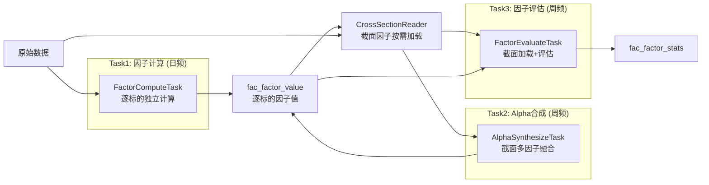
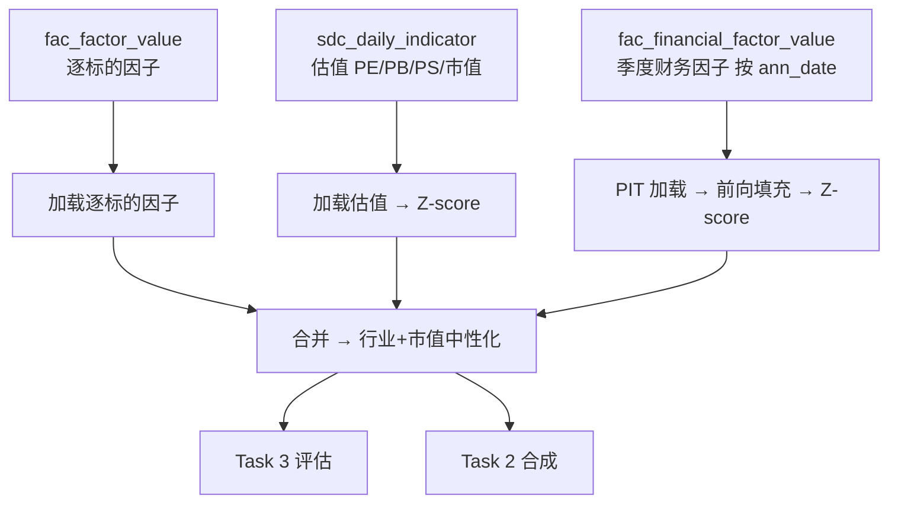
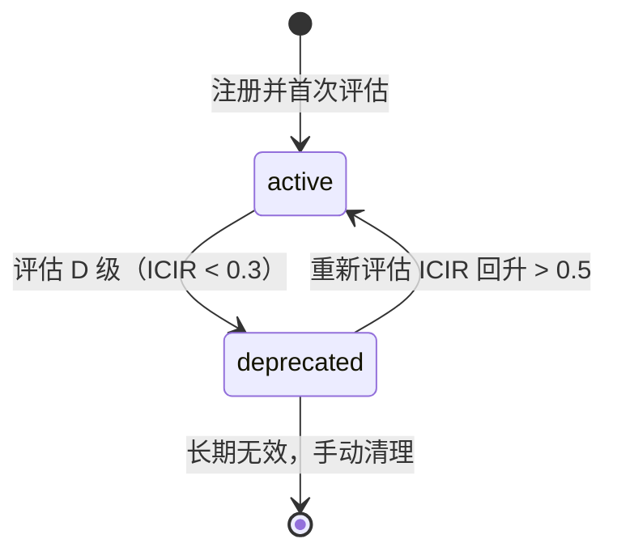

# xqtrader 因子系统技术架构（个人版）

> **版本**: v6.0
> **更新**: 2026-06-26（取代旧版，原文档已归档至 `docs/archive/factor-arch-v6-20260626/`）
> **依赖**: [factor-catalog.md](./factor-catalog.md) 因子规格目录
> **框架**: Pipeline 引擎 + Celery 插件 + DAL/ORM
> **定位**: **个人单机**量化平台的因子基础设施

---

## 0. 修订说明（个人版裁剪 + 文档治理）

本版以「个人使用、单机部署、维护人力≈1」为前提，对旧版机构级设计做系统性裁剪，并修复旧版**新旧内容拼接重复**的问题（旧版同一主题出现两套互相矛盾的章节）。

| 维度 | 旧版（机构级） | v6.0（个人版） | 落地状态 |
|------|----------------|----------------|----------|
| 因子生命周期 | 7 态状态机（Registered→Testing→Active→Watchlist→Deprecated→Dormant→Archived）+ 复活/冷却 | **2 态：active / deprecated** | 旧版 7 态**未实现**，代码已收敛为 2 态（移除 draft/testing） |
| 因子评估 ML 管线 | XGBoost 特征重要性 + MLP 非线性 IC + AutoEncoder/HDBSCAN 共线性诊断 | **移除**；共线性用相关系数矩阵去冗余 | ML 管线**未实现**（`src/` 无代码），安全移除；T9 已落地 `factor_dedup.py` |
| 存储分层 | 热/温/冷三层 + Parquet 归档 + 按因子类别差异化保留 | **单层 + TimescaleDB 自动压缩** | 三层归档**未实现**；5 年总量仅 ~4GB，无需归档 |
| 样本池 | 8 池（含行业/风格池）全量评估 | **默认 `all` + 1 个目标交易池**；其余按需开启 | T5 已落地：`pool_init.py` 默认 `all + idx_300` active，其余 deprecated |
| 因子合成 | 等权/IC/ICIR/ML 多方案 + Stacking 集成 | **默认等权（组内）+ ICIR 加权（跨组）**；ML 为远期可选 | ML 合成为远期可选；T9 组内去冗余已落地 |

> **个人版第一设计原则**：能用既有组件与简单统计方法解决的，不引入 ML/分层存储/复杂状态机。**简单即可维护**。

---

## 一、系统概述

因子系统负责因子的**计算、存储、评估、融合**。按计算模式拆分为三个独立管线任务，遵循 Pipeline + Celery 插件架构。

### 1.1 三任务架构



### 1.2 任务职责

| 任务 | 调度 | 粒度 | 核心职责 | 输入 | 输出 |
|------|------|------|---------|------|------|
| **Task 1** | 日频 17:00 | 逐标的 | 计算逐标的可独立计算因子 | OHLCV + 资金流 | fac_factor_value |
| **Task 2** | 周频 周六 | 逐样本池 | 多因子截面融合, Alpha 权重计算 | Task1 + CrossSectionReader | fac_factor_value (composite_*) |
| **Task 3** | 周频 周六 | 逐样本池 | 因子评估, 等级评定 | Task1 + CrossSectionReader | fac_factor_stats |

> 三任务拆分（逐标的预计算 → 截面合成 → 截面评估）与 Qlib（Handler→DataHandler→Model）/ Barra（原始计算→截面标准化）的分层一致，是该领域成熟划分，个人版保留。

---

## 二、Task 1: 因子计算 (FactorComputeTask)

> **调度**: 日频（工作日 17:00）| **粒度**: 逐标的 | **引擎**: FactorPlugin → PipelineEngine
> **输入**: `sdc_candlestick_daily` (OHLCV)、`sdc_fund_flow_individual` (资金流)
> **输出**: `fac_factor_value` (pool_id='all')
> **归属因子**: C 技术 + D1 Alpha101 + D2 Alpha158 + D3 资金流(逐标的) + A 风险(逐标的) + E1 缠论 + E2 K线聚合（详见 factor-catalog.md）

### 2.1 设计原则

只处理**逐标的可独立计算**的因子——每个标的仅依赖自身时序数据，无需全市场截面信息。截面因子（B 类基本面、A 类风险截面部分）由 CrossSectionReader 在 Task 2/3 按需加载，不在本任务计算。

### 2.2 数据加载策略

| 因子类型 | 加载策略 | 原因 |
|---------|---------|------|
| 有状态因子 (MACD/EMA/SAR) | **全量历史 K 线**，从首根 bar 计算 | 依赖递推状态，截断导致前期值不准 |
| 无状态因子 (动量/波动率) | **5 年 + 前 300 条补充** | 固定窗口回溯，300 条 ≈ 1.2 年覆盖回溯需求 |
| 资金流因子 | **5 年 + 前 300 条补充** | 部分需滚动窗口 |

### 2.3 管线流程

```
LoadStage  : 加载 K线/资金流（不含估值、财务）→ ctx: kline_df, flow_df
CalcStage  : 批量调用 FactorPlugin.compute() → ctx: {factor_id: value}
PersistStage: 截断 5 年 + upsert fac_factor_value → 持久化行数
```

> 截面标准化（去极值/Z-score/中性化）**不在 Task 1 执行**，在 Task 2/3 的 CrossSectionReader 中按需完成。Task 1 输出逐标的原始因子值。

---

## 三、Task 2: Alpha 合成 (AlphaSynthesizeTask)

> **调度**: 周频（周六 10:00，依赖 Task 3 评估完成）| **粒度**: 逐样本池
> **输入**: fac_factor_value + CrossSectionReader 截面因子
> **输出**: fac_factor_value (composite_* 因子) + 注册表合成权重
> **归属因子**: F 类合成因子 + D4 交互因子

### 3.1 合成方法（个人版）

两层合成，方法固定为简单稳健方案：

```
L1 组内合成：等权（同组因子高度共线，等权消除共线性、保留组 Alpha 方向）
L2 跨组合成：ICIR 加权（不同组代表不同 Alpha 维度，ICIR 兼顾预测力与稳定性；
            无足够 IC 历史时退化为等权）
```

| 层级 | factor_id | 输入因子（示例） | 方法 |
|------|-----------|------------------|------|
| L1 | composite_value | ep, bp, dp, ev_ebitda, sp | equal_weight |
| L1 | composite_momentum | mom_5d/20d/60d, barra_momentum, roc_10 | equal_weight |
| L1 | composite_volatility | hist_vol_*, atr_ratio, dastd, downside_vol | equal_weight |
| L1 | composite_liquidity | cs_turnover, turnover_f, cs_log_amount | equal_weight |
| L1 | composite_technical | rsi/kdj/macd/boll/chan/cdl/alpha101/158 | equal_weight |
| L1 | composite_fund_flow | cs_main_net_pct, huge_net_pct, big_net_pct | equal_weight |
| L2 | composite_alpha | 上述 6 个 L1 合成因子 | icir_weight |

### 3.2 截面预处理（合成前）

```
缺失值填充(行业均值) → MAD 去极值(n=5) → Z-score → 行业+市值中性化(回归取残差) → 再 Z-score
```

> 顺序严格：先去极值再标准化（否则极端值扭曲均值方差），先标准化再中性化（否则异常值影响回归系数）。

### 3.3 ML 合成（远期可选，个人版默认不启用）

如未来确有需求，可补充 XGBoost/LightGBM 的 Walk-Forward 合成（训练窗 120 日 / 重训 20 日 / Gap 5 日）。**个人版 MVP 不实施**：小样本易过拟合、个人难以持续验证与维护，等权 + ICIR 已足够稳健。

---

## 四、Task 3: 因子评估 (FactorEvaluateTask)

> **调度**: 周频（周六 08:00，先于 Task 2）| **粒度**: 逐样本池
> **输出**: fac_factor_stats + 注册表 factor_grade
> **说明**: 不产生新因子值，对所有因子统计评估

### 4.1 评估指标

| 指标 | 计算方式 | 阈值 |
|------|---------|------|
| IC | Spearman(factor_t, return_{t+1})，滚动 252 日 | \|IC\| > 0.03 |
| ICIR | IC_mean / IC_std | > 0.5 可用, > 1.0 优良 |
| 多空年化 | (Q5 - Q1) 年化 | > 5% |
| 换手率 | Σ\|w_t - w_{t-1}\| / 2 | < 70% |
| 衰减半衰期 | IC(h=1..20) 拟合 | > 3 日 |

### 4.2 因子等级（A/B/C/D）

| 等级 | 标准 | 用途 |
|------|------|------|
| A | ICIR > 1.0, 多空年化 > 10%, 换手 < 50% | 核心 Alpha, 必入合成池 |
| B | ICIR > 0.5, 多空年化 > 5%, 换手 < 70% | 辅助 Alpha, 可选入合成池 |
| C | ICIR > 0.3, 多空年化 > 3% | 弱 Alpha |
| D | ICIR < 0.3 | 无效, 标记 deprecated 停止计算 |

### 4.3 因子去冗余（替代旧版 ML 共线性诊断）

个人版不引入 AutoEncoder/聚类。冗余识别用**相关系数矩阵**：

```
1. 计算同组因子的截面值 Spearman 相关矩阵
2. 相关系数 > 0.9 视为冗余组
3. 每组保留 ICIR 最高者，其余在合成时排除（不删数据）
```

> 这与「L1 组内等权合成」天然互补：等权已能消化组内共线性，相关矩阵仅用于人工审视与精选合成输入。

---

## 五、CrossSectionReader — 截面因子加载器

> **定位**: Task 2 / Task 3 共用的截面因子统一加载服务
> **解决**: B 类基本面因子、A 类风险截面因子需全市场同日数据，无法在 Task 1 逐标的模式中计算

### 5.1 加载链路



### 5.2 财务因子 Point-in-Time（防未来函数）

财务数据季度发布且滞后 30~120 天，必须按**实际公告日 `ann_date`** 取值，否则误用未发布财报 = 未来函数。

**默认模式（ann_date 精确）**：

```sql
SELECT * FROM sdc_financial_indicator
WHERE symbol = ? AND ann_date <= :截面日
ORDER BY end_date DESC LIMIT 1
```

**兜底模式（report_lag_days，默认 120 天）**：仅当 `ann_date` 与 `f_ann_date` 均缺失时使用：

```sql
WHERE end_date <= (:截面日 - interval '120 days')
```

> Q4 年报最大滞后约 120 天；用固定 `lag_days=60` 会在 1~4 月误用年报（策略虚高）。`ann_date` 精确到个股，优于固定滞后。

**截面前向填充**（CrossSectionReader 应用层，非落库）：同一财报期内多个截面日，财务因子值保持不变，直到新财报 `ann_date` 到达才更新。

> **性能/存储**：财务因子按 `ann_date` 原始存储（5 年约 38~77 万行），应用层前向填充，相比预填充入 `fac_factor_value` 节省约 98% 存储，且 PIT 天然精确。

### 5.3 估值指标说明

`sdc_daily_indicator` 中的 PE/PB/PS 等已由数据源按日更新（市值每日变化），属 `cross_field` 直接读取，**不走 PIT**。PIT 仅适用于纯财务指标（ROE/ROA/毛利率等，分子分母均来自财报）。

---

## 六、Plugin 插件架构

### 6.1 FactorPlugin 策略模式

每个因子类继承 `FactorPlugin`，通过变体注册表管理同族因子（如 `ma_bias_5/10/20`）；`FactorRegistry` 自动发现并按 `factor_ids` 解析。一个插件可输出多个因子（组合因子，如 macd 的 dif/dea/hist）。

```
FactorPlugin (ABC)
  ├─ factor_id / category / compute(df, ctx) -> {factor_id: value}
  ├─ min_periods / dependencies
  └─ 子类: MABiasFactor / RSIDeltaFactor / Alpha101Factor / ...
FactorRegistry: auto_discover() / resolve(factor_ids)
```

### 6.2 目录结构

```
src/worker/plugins/factor_compute/     # 计算引擎（celery-plugin 自包含）
├── task.py                            # FactorComputeTask
├── stages/                            # Pipeline 阶段
│   ├── load_stage.py                  # 加载 K线/资金流/daily_indicator
│   ├── calc_stage.py                  # 批量 FactorPlugin.compute()
│   ├── preprocess_stage.py            # 透传（截面预处理在 CrossSectionReader）
│   └── persist_stage.py               # 截断 5yr + upsert fac_factor_value
└── factors/                           # FactorPlugin 实现
    ├── fundamental_profitability.py   # B2 盈利
    ├── fundamental_growth.py          # B3 成长
    ├── fundamental_quality.py         # B4 质量
    ├── fundamental_leverage.py        # B5 杠杆
    ├── momentum.py                    # C1 动量/反转
    ├── tech_trend.py                  # C2 趋势
    ├── tech_oscillator.py             # C3 超买超卖
    ├── tech_ma.py                     # C4 均线偏离
    ├── tech_volatility.py             # A3 波动率
    ├── alpha101.py                    # D1 Alpha101
    ├── alpha158.py                    # D2 Alpha158
    ├── fund_flow.py                   # D3 资金流（逐标的）
    ├── risk.py                        # A1/A3/A4 风险（逐标的）
    ├── chanlun.py                     # E1 缠论
    ├── candle_pattern.py              # E2 K线聚合
    └── return_factor.py               # 前向收益（评估标签）

src/worker/plugins/factor_synthesize/  # 合成任务
├── task.py                            # AlphaSynthesizeTask
└── factors.py                         # CompositeXxxFactor 声明（7 个合成因子）

src/worker/plugins/factor_quarterly/   # 季度财务因子任务
└── task.py                            # FactorQuarterlyTask → fac_financial_factor_value

src/xqtrader/domain/factor/            # 业务领域层
├── base.py                            # FactorPlugin / FactorDefinition（代码声明，唯一真相源）
├── models/                            # FacFactorValue / Registry / Stats / FinancialFactorValue / Pool
└── services/
    ├── cross_section_reader.py        # CrossSectionReader（截面预处理 + 面板加载）
    ├── factor_data_loader.py          # 估值/财务 PIT / 逐标的因子值 分流加载
    ├── alpha_synthesizer.py           # 两层合成（L1 等权 + L2 ICIR）
    ├── factor_dedup.py                # 相关矩阵去冗余
    ├── ic_calculator.py               # IC / ICIR / 显著性 / 衰减 / 换手
    ├── layered_backtest.py            # 分层回测（含成本）
    ├── grade_evaluator.py             # A/B/C/D 评级
    ├── registry.py                    # 自动发现 + 变体注册 + sync_to_registry
    └── pool_init.py                   # 样本池初始化
```

> **依赖方向**: `worker/plugins/` → `xqtrader/domain/`（单向，domain 不引用 worker）

---

## 七、存储模型

### 7.1 核心表

| 表 | 存储内容 | bind_key | 存储策略 |
|------|---------|----------|---------|
| `fac_factor_value` | 逐标的因子值（日频，含 pool_id） | stock | TimescaleDB 超表, 6 月后自动压缩 |
| `fac_financial_factor_value` | 财务因子值（季频，按 ann_date） | stock | 普通表, 数据量极小, 永久保留 |
| `fac_factor_registry` | 因子元数据 + 运行时状态 | research | 普通表, 代码声明 upsert 同步 |
| `fac_factor_stats` | 因子评估统计 | research | 普通表, 数据量极小, 永久保留 |
| `fac_factor_pool` | 样本池定义 | research | 普通表, 启动同步 |
| `fac_signal_value` | 信号值 | stock | 普通表 |

### 7.2 fac_factor_value（TimescaleDB）

```python
@timescale(time_column="trade_date", chunk_interval="6 month",
           compress_after="6 months", compress_segmentby="symbol")
class FacFactorValue(Base):
    __bind_key__ = "stock"
    symbol: Mapped[str]       # String(10), PK
    trade_date: Mapped[date]  # Date, PK
    factor_id: Mapped[str]    # String(32), PK
    pool_id: Mapped[str]      # String(16), PK, 默认 "all"
    factor_value: Mapped[float | None]
```

索引：`(trade_date, factor_id, pool_id)` 截面查询主索引；`(symbol, trade_date)` 单标的时序。

### 7.3 fac_financial_factor_value（季频，按 ann_date）

```python
class FacFinancialFactorValue(Base):
    __bind_key__ = "stock"
    symbol: Mapped[str]    # PK
    end_date: Mapped[date] # PK, 财报期
    factor_id: Mapped[str] # PK
    ann_date: Mapped[date] # PK, 公告日（PIT 依据）
    factor_value: Mapped[float | None]  # 原始值，标准化在 CrossSectionReader
```

索引：`(ann_date, factor_id)` PIT 主索引；`(symbol, end_date DESC)` 单标的最新财报。

### 7.4 存储策略：单层 + 压缩（个人版）

旧版的「热/温/冷三层 + Parquet 归档 + 差异化保留」已**移除**。理由——5 年全量压缩后总量仅约 4 GB，PostgreSQL 单实例轻松承载：

| 数据类型 | 5 年行数 | 5 年压缩大小 |
|---------|---------|-----------|
| 日频因子值 | ~8260 万行/年 × 5 | ~3.5 GB |
| 财务因子值 | ~77 万行/年 × 5 | ~35 MB |
| Alpha 因子值 | — | ~470 MB |
| 因子统计 | — | < 1 MB |
| **合计** | | **≈ 4 GB** |

> 个人版只需：`fac_factor_value` 6 个月后 TimescaleDB 自动压缩；其余普通表永久保留。**真正需关注的是查询性能（索引），而非存储容量**，无需归档层。

---

## 八、样本池（个人版收敛）

### 8.1 现状与建议

代码当前在 `pool_init.py` 配置 7 个池：`all` + `idx_50/idx_300/idx_500/idx_1000/idx_kcb50/idx_cybz`，每池均全量评估全部因子。

**个人版建议**：评估默认仅启用 **`all` + 1 个实际交易的目标池**（如 `idx_300`），其余池保留定义但默认不参与周频评估，避免 `N 池 × M 因子` 的无谓计算。可通过样本池的 `status` 或调度参数控制启用范围。

> 多池评估的价值（同因子在不同池预测力差异大）真实存在，但个人通常只交易 1~2 个池，无需为不交易的池持续算 IC。

### 8.2 样本池配置

| 字段 | 类型 | 说明 |
|------|------|------|
| pool_id | String(32) PK | 如 `idx_300` |
| pool_name | String(64) | 展示名 |
| pool_type | String(16) | market / index / industry / style |
| definition | JSONB | 选池规则（如 `{"index_code": "000300.SH"}`） |
| factor_scope | JSONB | 该池评估的因子范围（null=全量；include/exclude/category） |
| status | String(8) | active / deprecated |

> `factor_scope` 已支持按 include/exclude/category 收敛单池的评估因子，个人版可据此进一步缩小计算量。

---

## 九、因子生命周期（精简 2 态）

旧版 7 态状态机（含 Watchlist/Dormant/Archived/复活/冷却）**未实现且对个人过重**，本版采用 2 态：



| 状态 | 含义 | 计算行为 |
|------|------|---------|
| `active` | 有效，参与计算/合成 | 正常计算并写入 fac_factor_value |
| `deprecated` | 评估 D 级或人工停用 | CalcStage 跳过；历史数据**不删除**（供回测） |

- 等级 `factor_grade`（A/B/C/D）由 Task 3 评估动态写入注册表；`status` 据等级与人工判断切换。
- **代码声明（FactorDefinition）是静态属性唯一真相源**；注册表仅保存运行时状态（grade/status），Worker 启动时 upsert（静态以代码为准，运行时状态保留 DB 值）。

---

## 十、调度编排

```yaml
# 日频 — schedules/daily_pipeline.yml（个股 / 指数 / 申万行业 三个独立插件 + 因子计算）
steps:
  - stock_daily_collect      # market.daily_incremental_collect — 全市场个股
  - index_daily_collect      # market.index_daily_collect — 全市场指数
  - sw_daily_collect         # market.sw_daily_collect — 全市场申万行业
  - daily_factor_compute     # factor.compute_daily (depends_on: sw_daily_collect)
```

```yaml
# 周频 — schedules/weekly_factor_pipeline.yml
# 当前为 on_demand 模式（plugin.yaml 的 schedule 行被注释），手动触发 DAG：
steps:
  - factor_evaluate                        # Task 3 (先)
  - alpha_synthesize  (depends_on: factor_evaluate)   # Task 2
```

```yaml
# 季频 (每季首月 15 号 20:00) — schedules/quarterly_factor_pipeline.yml
steps:
  - financial_indicator_collect
  - income_statement_collect
  - balance_sheet_collect
  - cash_flow_collect
  - quarterly_factor_compute  (depends_on: [financial_indicator_collect, income_statement_collect, balance_sheet_collect])
```

> **周频任务当前为手动触发**：评估/合成任务单次执行可达 12h+（全 A 池），无人值守自动调度风险较高。`weekly_factor_pipeline.yml` 提供 DAG 编排（评估 → 合成依赖），通过 scheduler API 手动触发；如需启用自动调度，取消 `plugin.yaml` 中 `schedule` 行注释即可。
>
> 旧版的 `ml_evaluate_pipeline.yml`（ML 因子评估）已移除；日频的 `alpha_signal_compute` 步骤未实现（信号生成由规则/工作流引擎独立负责，不阻塞因子管线）。

---

## 十一、关键设计决策（保留）

| 决策 | 结论 | 理由 |
|------|------|------|
| 逐标的 vs 截面因子分离 | 逐标的入 Task 1；截面（估值/财务）由 CrossSectionReader 按需加载 | 截面标准化依赖全市场同日数据，与逐标的计算矛盾；避免冗余存储 |
| 因子元数据 | 代码声明（唯一真相源）+ DB 注册表（运行时状态） | 运行时查询/评估驱动/API 暴露需持久化 |
| 截面预处理时机 | 计算阶段存原始值，预处理在评估/合成阶段执行 | 不同池/截面日标准化结果不同，存原始值保唯一性 |
| 变化优先 | 技术因子取变化率/偏离度而非原始值 | 原始价格无截面可比性（与 Qlib/华泰一致） |
| 缠论连续值 | 随因子管线每日计算；离散买卖点由信号引擎独立计算 | 连续值有截面可比性可入库；离散信号不阻塞因子管线 |

---

## 附录

### A. 业界对照（保留有效部分）

| 业界方案 | 核心实践 | 本架构对应 |
|---------|---------|-----------|
| Barra CNE6 | 风险/Alpha 分离 + 行业市值中性化 | A 类风险 vs B/C/D Alpha + 预处理中性化 |
| WorldQuant | Alpha101 + IC 评估 | D1 Alpha101 + Task 3 评估 |
| Qlib | Handler 预计算 + 截面加载 + 评估 | Task1 + CrossSectionReader + Task3 |
| 华泰金工 | 标准化 + 资金流时段分化 + 交互因子 | 变化优先 + D3 + D4 |

> 个人版**不照搬**机构的 ML 评估、统计因子（PCA）、分层归档；这些列为远期可选。

### B. 与代码现状的关系

| 文档结论 | 代码现状 | 后续 |
|---------|---------|------|
| 2 态生命周期 | `registry.py` sync_to_registry 默认 `active`；评估/合成任务仅过滤 `active` | 一致 |
| 移除 ML 评估 | `src/` 无 ML 评估实现 | 一致 |
| 单层 + 压缩 | 无归档代码；`@timescale` 已配压缩 | 一致 |
| 样本池收敛 | `pool_init.py` 默认 `all + idx_300` active，其余 deprecated（T5 已落地） | 一致 |
| 周频调度 | `weekly_factor_pipeline.yml` 编排 DAG，但 `plugin.yaml` 的 schedule 注释禁用，手动触发 | 一致 |

---

*本文档定义个人版因子系统技术架构。因子规格与任务归属见 [factor-catalog.md](./factor-catalog.md)；机构级完整旧版见归档目录。*
