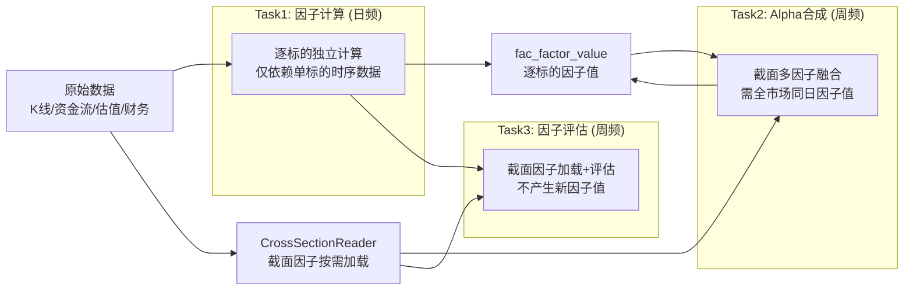

# xqtrader 因子规格目录

> **版本**: v7.0 | **更新**: 2026-06-13
> **定位**: 因子库顶层规格，按三任务管线分层组织，每个因子标注数据血缘与计算方法
> **参考**: Barra CNE6 (MSCI) / WorldQuant Alpha101 / Qlib Alpha158 (Microsoft) / 华泰金工

---

## 一、任务架构与因子归属

因子系统按计算模式拆分为三个独立管线任务，因子根据其计算特征归属到不同任务中：



### 1.1 三任务职责边界

| 任务 | 调度 | 粒度 | 因子归属 | 输入 | 输出 |
|------|------|------|---------|------|------|
| **Task 1: 因子计算** | 日频 17:00 | 逐标的 | C 技术因子, D1/D2 Alpha101/158, D3 资金流(逐标的), A 风险(逐标的), E 另类 | 原始 OHLCV + 资金流数据 | fac_factor_value |
| **Task 2: Alpha合成** | 周频 周六 | 逐样本池 | F 复合Alpha, D4 交互因子 | Task1产出 + CrossSectionReader | fac_factor_value (alpha_*) |
| **Task 3: 因子评估** | 周频 周六 | 逐样本池 | 不产生新因子，对所有因子评估 | Task1产出 + CrossSectionReader | fac_factor_stats |

> **业界参考**: Qlib 将因子处理拆为"Handler 预计算 + DataHandler 截面加载 + Model 训练评估"三个独立阶段。Barra 将因子分为"逐标的原始计算"和"截面标准化"两个时点。本架构与业界主流设计一致。

### 1.2 因子归属总览

| 分类 | 因子数 | 归属任务 | 说明 |
|------|--------|---------|------|
| C. 技术因子 | 34 | Task 1 | 逐标的，talib/numpy 计算 |
| D1. Alpha101 | 6 | Task 1 | 逐标的，WorldQuant 公式 |
| D2. Alpha158 | 10 | Task 1 | 逐标的，Qlib 公式 |
| D3. 资金流(逐标的) | 4 | Task 1 | 逐标的，占比形式，无截面操作 |
| A. 风险(逐标的) | 18 | Task 1 | 逐标的可独立计算部分 |
| E1. 缠论连续值 | 10 | Task 1 | 逐标的，时序计算（待实现） |
| E2. K线聚合 | 6 | Task 1 | 逐标的，统计聚合 |
| F. 复合Alpha | 6 | Task 2 | 截面融合，需全市场因子值 |
| D4. 交互因子 | 6 | Task 2 | 截面交互，需两个因子截面标准化 |
| D3. z_main_net_pct | 1 | Task 2 | 截面Z-score，需全市场换手率分布 |
| A. 风险(需截面) | 6 | CrossSectionReader | nl_size / beta / z_turnover / stom / stoq |
| B. 基本面因子 | 40 | CrossSectionReader | 估值+财务，从已有表按需加载 |
| **合计** | | **147** | 含评估标签3个(fwd_ret, 不入因子目录) + 非截面信号30个 |

---

## 二、Task 1: 因子计算 — 逐标的时间序列因子

> **调度**: 日频 (工作日 17:00) | **计算引擎**: FactorPlugin → PipelineEngine
> **设计原则**: 仅处理**逐标的可独立计算**的因子，每个标的仅依赖自身时序数据，无需全市场截面信息。
> **业界参考**: 等同 Qlib Alpha158 Handler 的逐标的预计算层，或 Barra 的"原始因子计算"阶段。

### 2.1 C 类 — 技术因子 (34个)

> **数据血缘**: `sdc_candlestick_daily` → open, high, low, close, volume, amount
> **计算引擎**: plugin (talib / numpy 向量化) | **标准化原则**: 变化优先 — 原始指标取比率/偏离度/变化率，确保截面可比
> **业界参考**: 华泰金工《技术因子标准化方法》(2020)、Qlib Alpha158 价格归一化策略

#### C1 动量/反转因子 (7个)

| factor_id | 展示名 | 方向 | 计算逻辑 | 血缘: 原始字段 |
|-----------|--------|------|----------|-------------|
| cs_pct_chg | 当日涨跌幅 | DESC | pct_chg 截面 | close → pct_change() |
| mom_5d | 5日动量 | DESC | close / close[-5] - 1 | close |
| mom_20d | 20日动量 | DESC | close / close[-20] - 1 | close |
| mom_60d | 60日动量 | DESC | close / close[-60] - 1 | close |
| roc_10 | 10日变化率 | DESC | talib.ROC(close, 10) | close |
| barra_momentum | Barra动量 | DESC | 12月收益剔除近1月, 半衰期126日 | close → pct_change() |
| barra_strev | Barra短期反转 | ASC | 近1月收益 × (-1) | close → pct_change() |

> Barra CNE6: momentum 取 12个月收益(剔除最近1月)的半衰期加权，strev 取最近1月反转。两者是不同现象。

#### C2 趋势因子 (10个)

| factor_id | 展示名 | 方向 | 计算逻辑 | 血缘: 原始字段 |
|-----------|--------|------|----------|-------------|
| macd_hist_ratio | MACD柱/价格 | DESC | HIST / close | close → MACD(12,26,9) → hist |
| macd_hist_delta | MACD柱变化率 | DESC | Δ(HIST / close) | 同上 |
| adx_14 | ADX趋势强度 | DESC | talib.ADX(high, low, close, 14) | high, low, close |
| adx_delta | ADX变化 | DESC | Δ(ADX(14)) | 同上 |
| adx_plus_di | +DI上升方向 | DESC | talib.PLUS_DI(high, low, close, 14) | high, low, close |
| adx_minus_di | -DI下降方向 | ASC | talib.MINUS_DI(high, low, close, 14) | high, low, close |
| boll_position | 布林带位置 | DESC | (close - lower) / (upper - lower) | close → BOLL(20,2) |
| boll_position_delta | 布林带位置变化 | DESC | Δ(boll_position) | 同上 |
| boll_width | 布林带宽度 | DESC | (upper - lower) / middle | close → BOLL(20,2) |
| sar_deviation | SAR偏离度 | DESC | Δ(SAR / close) | high, low → SAR |

#### C3 超买超卖因子 (12个)

| factor_id | 展示名 | 方向 | 计算逻辑 | 血缘: 原始字段 |
|-----------|--------|------|----------|-------------|
| rsi_6 | RSI(6) | DESC | talib.RSI(close, 6) | close |
| rsi_14 | RSI(14) | DESC | talib.RSI(close, 14) | close |
| rsi_24 | RSI(24) | DESC | talib.RSI(close, 24) | close |
| rsi_delta_14 | RSI(14)变化 | DESC | Δ(RSI(14)) | close |
| kdj_k | KDJ-K值 | DESC | talib.STOCH(high, low, close, 9, 3) | high, low, close |
| kdj_d | KDJ-D值 | DESC | MA(K, 3) | 同上 |
| kdj_j | KDJ-J值 | DESC | 3K - 2D | 同上 |
| bias_6 | BIAS(6)乖离率 | DESC | (C - MA6) / MA6 | close |
| bias_12 | BIAS(12)乖离率 | DESC | (C - MA12) / MA12 | close |
| bias_24 | BIAS(24)乖离率 | DESC | (C - MA24) / MA24 | close |
| cci_14 | CCI(14) | DESC | talib.CCI(high, low, close, 14) | high, low, close |
| wr_14 | WR(14)威廉指标 | ASC | talib.WILLR(high, low, close, 14) | high, low, close |

#### C4 均线偏离因子 (5个)

| factor_id | 展示名 | 方向 | 计算逻辑 | 血缘: 原始字段 |
|-----------|--------|------|----------|-------------|
| ma_bias_5 | MA5偏离度 | DESC | MA(5) / close - 1 | close |
| ma_bias_10 | MA10偏离度 | DESC | MA(10) / close - 1 | close |
| ma_bias_20 | MA20偏离度 | DESC | MA(20) / close - 1 | close |
| ma_bias_60 | MA60偏离度 | DESC | MA(60) / close - 1 | close |
| ma_bias_delta_20 | MA20偏离度变化 | DESC | Δ(MA(20) / close - 1) | close |

---

### 2.2 D 类 — 量价因子 (20个, Task 1)

#### D1 Alpha101 因子 (6个)

> **数据血缘**: `sdc_candlestick_daily` → open, high, low, close, volume, vwap
> **业界参考**: WorldQuant "101 Formulaic Alphas" (Kakushadze, 2015)

| factor_id | 展示名 | 方向 | 计算逻辑 | 血缘 |
|-----------|--------|------|----------|------|
| alpha_1 | 量价偏离极值日 | DESC | rank(ts_argmax((vwap-0.5×open)², 5)) | open, vwap |
| alpha_12 | 量增价跌反转 | DESC | sign(Δvolume) × (-Δ(close-open)) | close, open, volume |
| alpha_33 | 收开盘比衰减 | DESC | -rank(decay_linear(close/open, 5)) | close, open |
| alpha_41 | 几何均价VWAP偏离 | DESC | sqrt(high×low) - vwap | high, low, vwap |
| alpha_55 | 日内涨跌量相关 | DESC | -corr(rank(close-open), rank(volume), 5) | close, open, volume |
| alpha_101 | 日内K线形态 | DESC | (close-open)/(high-low+0.001) | open, high, low, close |

#### D2 Alpha158 因子 (10个)

> **数据血缘**: `sdc_candlestick_daily` → open, high, low, close, volume
> **业界参考**: Qlib Alpha158 因子集 (Microsoft, 2020), 158个标准化技术因子

| factor_id | 展示名 | 方向 | 计算逻辑 | 血缘 |
|-----------|--------|------|----------|------|
| kmid_5 | 5日K线实体均值 | DESC | MA(5, (C-O)/O) | open, close |
| klen_5 | 5日K线振幅均值 | DESC | MA(5, (H-L)/O) | open, high, low |
| kup2_5 | 5日上影线占比均值 | ASC | MA(5, (H-max(O,C))/(H-L)) | open, high, low, close |
| klow2_5 | 5日下影线占比均值 | DESC | MA(5, (min(O,C)-L)/(H-L)) | open, high, low, close |
| rsv_9 | 9日随机值 | DESC | (C-L9)/(H9-L9) | high, low, close |
| cntp_20 | 20日上涨天数占比 | DESC | count(C>C₁, 20)/20 | close |
| imax_20 | 20日最高价位置 | ASC | argmax(C, 20)/20 | close |
| roc5_close | 5日收盘变化率 | DESC | C/C[-5]-1 | close |
| std20_close | 20日收盘波动率 | ASC | STD(20, C)/C | close |
| corr_pv_10 | 10日价量相关 | ASC | corr(close, log(vol+1), 10) | close, volume |

#### D3 资金流因子 — 逐标的部分 (4个)

> **数据血缘**: `sdc_fund_flow_individual` → main_net_amt, huge_net_amt, big_net_amt, net_mf_amt
> **数据血缘**: `sdc_candlestick_daily` → amount (成交额)
> **核心原则**: 绝对金额无截面可比性，统一改为净流入/成交额占比。
> **业界参考**: 华泰金工《个股资金流向因子研究》— 尾盘信号 IR=0.78，优于开盘和全天

| factor_id | 展示名 | 方向 | 计算逻辑 | 血缘 |
|-----------|--------|------|----------|------|
| cs_main_net_pct | 主力净流入占比 | DESC | main_net_amt / amount | fund_flow.main_net_amt + kline.amount |
| cs_net_mf_pct | 全部净流入占比 | DESC | net_mf_amt / amount | fund_flow.net_mf_amt + kline.amount |
| huge_net_pct | 超大单净流入占比 | DESC | huge_net_amt / amount | fund_flow.huge_net_amt + kline.amount |
| big_net_pct | 大单净流入占比 | DESC | big_net_amt / amount | fund_flow.big_net_amt + kline.amount |

> **待实现**: main_net_pct_close (尾盘主力净流入占比) 和 main_net_pct_open (开盘主力净流入占比)
> 需要时段细分资金流数据源，当前 Tushare moneyflow 接口不提供时段细分，待数据源就绪后实现。

---

### 2.3 A 类 — 风险因子 逐标的部分 (18个)

> **数据血缘**: `sdc_candlestick_daily` → close, volume, amount
> **数据血缘**: `sdc_daily_indicator` → total_mv, turnover_rate, turnover_rate_f
> **业界参考**: Barra CNE6 (MSCI, 2018) — 风险因子用于解释收益方差，不做Alpha预测

#### A1 规模因子 (1个, Task 1)

| factor_id | 展示名 | 方向 | 计算逻辑 | 血缘 |
|-----------|--------|------|----------|------|
| cs_log_mv | 对数总市值 | DESC | log(1 + total_mv) | daily_indicator.total_mv |

#### A3 波动率因子 (10个, Task 1)

| factor_id | 展示名 | 方向 | 计算逻辑 | 血缘 |
|-----------|--------|------|----------|------|
| hist_vol_10 | 10日历史波动率 | ASC | STD(10, daily_ret) × √252 | close → pct_change() |
| hist_vol_20 | 20日历史波动率 | ASC | STD(20, daily_ret) × √252 | close → pct_change() |
| hist_vol_60 | 60日历史波动率 | ASC | STD(60, daily_ret) × √252 | close → pct_change() |
| downside_vol | 下行波动率 | ASC | STD(负收益日 daily_ret) × √252 | close → pct_change() |
| dastd | 日收益加权标准差 | ASC | EW_STD(252, daily_ret), 半衰期42日 | close → pct_change() |
| cmra | 累计收益范围 | ASC | log(1+max_cum) - log(1+min_cum), 12月 | close → pct_change() |
| atr_ratio | ATR/价格 | ASC | ATR(14) / close | high, low, close → ATR(14) |
| atr_ratio_delta | ATR/价格变化 | ASC | Δ(ATR(14) / close) | 同上 |
| natr_14 | 归一化ATR | ASC | NATR(14) | high, low, close |

> **注意**: boll_width (布林带宽度) 归属 C2 趋势因子（BOLL 组合子因子），不在此处重复列出。

#### A4 流动性因子 (7个, Task 1)

| factor_id | 展示名 | 方向 | 计算逻辑 | 血缘 |
|-----------|--------|------|----------|------|
| cs_turnover | 换手率 | DESC | turnover_rate | daily_indicator.turnover_rate |
| turnover_f | 流通换手率 | DESC | turnover_rate_f | daily_indicator.turnover_rate_f |
| amihud | Amihud非流动性 | ASC | abs(ret) / amount | close + amount |
| cs_log_amount | 对数成交额 | DESC | log(1 + amount) | amount |
| cs_volume_ratio | 量比 | DESC | volume / Mean(volume, 5) | volume |
| adv_20 | 20日均量偏离 | DESC | MA(volume, 20) / volume | volume |
| vol_osc | 量振荡 | DESC | MA(V, 5) / MA(V, 20) | volume |

---

### 2.4 E 类 — 另类因子 (16个)

#### E1 缠论连续值因子 (10个) — 待实现

> **数据血缘**: `sdc_candlestick_daily` → open, high, low, close
> **计算引擎**: plugin (chanpy / 自研缠论库)
> **标准化**: 价格相关值均除以 close，确保截面可比。离散买卖点信号归信号引擎。
> **业界参考**: 缠论 (缠中说禅, 2006-2008) — 本土化技术分析体系
> **实现状态**: ⏳ 待实现 — 需引入 Python 缠论计算引擎，前端已有缠论可视化框架

| factor_id | 展示名 | group_id | 方向 | 计算逻辑 | 血缘 |
|-----------|--------|----------|------|----------|------|
| chan_fractal_strength | 分型强度 | chan_fractal | DESC | 极值与两侧差之和 | high, low |
| chan_bi_length | 笔长度 | chan_bi | DESC | abs(顶H-底L) / close | high, low, close |
| chan_bi_kcount | 笔内K线数 | chan_bi | DESC | 笔内K线计数 | high, low |
| chan_bi_slope | 笔斜率 | chan_bi | DESC | (终点价-起点价) / K线数 / close | high, low, close |
| chan_bi_amplitude | 笔振幅 | chan_bi | ASC | 笔内最大回撤 / 笔长度 | high, low, close |
| chan_bi_strength | 笔强度 | chan_bi | DESC | 笔长度 / 笔内K线数 | high, low, close |
| chan_zs_height_ratio | 中枢高度比 | chan_zs | DESC | (ZG-ZD) / close | close |
| chan_zs_range | 中枢区间 | chan_zs | DESC | (ZG-ZD) / close | close |
| chan_divergence_ratio | 背驰强度 | chan_div | DESC | A_curr / A_prev 面积比 | close → MACD |
| chan_macd_area | MACD面积 | chan_div | DESC | 笔内|MACD柱|之和 / close | close → MACD |

#### E2 K线形态聚合因子 (6个)

> **数据血缘**: `sdc_candlestick_daily` → open, high, low, close
> **定位**: 单根K线形态识别为离散信号(归信号层)，此处为形态统计聚合，具有截面可比性。
> **业界参考**: TA-Lib CDL 形态识别引擎

| factor_id | 展示名 | group_id | 方向 | 计算逻辑 | 血缘 |
|-----------|--------|----------|------|----------|------|
| cdl_bull_freq_20 | 20日看涨形态频次 | cdl_agg | DESC | 20日内看涨形态出现次数 | OHLC → CDL识别 |
| cdl_bear_freq_20 | 20日看跌形态频次 | cdl_agg | ASC | 20日内看跌形态出现次数 | OHLC → CDL识别 |
| cdl_net_score_20 | 20日形态净得分 | cdl_agg | DESC | (看涨-看跌) / 总次数 | OHLC → CDL识别 |
| cdl_upper_shadow_ratio | 上影线占比均值 | cdl_agg | ASC | MA(20, (H-max(O,C))/(H-L)) | open, high, low, close |
| cdl_lower_shadow_ratio | 下影线占比均值 | cdl_agg | DESC | MA(20, (min(O,C)-L)/(H-L)) | open, high, low, close |
| cdl_body_ratio | 实体占比均值 | cdl_agg | DESC | MA(20, abs(C-O)/(H-L+0.001)) | open, high, low, close |

> **评估标签**: fwd_ret_1d / fwd_ret_5d / fwd_ret_20d (前向收益率) 作为因子评估的因变量存储于 fac_factor_value，但不入因子目录，不参与因子预处理和融合。

---

## 三、Task 2: Alpha合成 — 截面多因子合成

> **调度**: 周频 (周六 10:00, 依赖 Task 3 评估完成) | **计算模式**: 逐样本池(pool_id), 截面批量
> **输入**: Task 1 逐标的因子 + CrossSectionReader 截面因子 → 截面标准化 → 融合计算
> **设计原则**: Alpha合成负责权重计算和因子融合。合成结果写回 fac_factor_value (factor_id 以 alpha_ 前缀)。
> **业界参考**: Barra 因子合成 (IC加权正交化), Qlib Model 层 (XGBoost/LightGBM预测), 华泰金工《多因子合成方法比较》

### 3.1 F 类 — 复合Alpha因子 (6个)

> **血缘**: 全部 A级+B级 单因子 → 截面标准化 → 融合方法 → alpha_* 因子值

| factor_id | 展示名 | 融合方法 | 输入因子 | 说明 |
|-----------|--------|---------|---------|------|
| alpha_eq | 等权Alpha | 等权平均 | 全部A级因子 | 基线Alpha，Barra标准做法 |
| alpha_ic | IC加权Alpha | IC加权 | 全部A级因子 | 预测力自适应，华泰推荐 |
| alpha_icir | ICIR加权Alpha | ICIR加权 | 全部A级因子 | 稳健加权，兼顾预测力与稳定性 |
| alpha_xgb | XGBoost Alpha | Walk-Forward ML | 全部A级+B级因子 | 非线性Alpha, 业界主流ML融合 |
| alpha_lgb | LightGBM Alpha | Walk-Forward ML | 全部A级+B级因子 | 非线性Alpha, Qlib默认模型 |
| alpha_ensemble | 集成Alpha | Stacking | alpha_ic + alpha_icir + alpha_xgb + alpha_lgb | 最终融合Alpha |

> **ML Walk-Forward 规范** (参考 Qlib rolling training): 训练窗口120日, 重训间隔20日, Gap=5日防信息泄露, 标签=次日涨跌二分类。

### 3.2 D4 类 — 交互因子 (6个)

> **血缘**: 两两因子截面标准化后相乘 | **归属 Task 2 原因**: 交互项依赖两个因子的截面标准化值, 需在合成任务中计算
> **业界参考**: 华泰金工《因子交互项研究》— 交互因子可捕捉单一因子遗漏的非线性关系

| factor_id | 展示名 | 方向 | 计算逻辑 | 因子组合 |
|-----------|--------|------|----------|---------|
| mom_vol_cross | 动量×波动 | DESC | momentum × atr_ratio | C1 + A3 |
| adx_rsi_cross | ADX×RSI偏离 | DESC | ADX × (RSI-50)/50 | C2 + C3 |
| vol_ratio_mom_cross | 量比×动量 | DESC | cs_volume_ratio × momentum | A4 + C1 |
| rsi_bbands_cross | RSI×布林位置 | DESC | RSI × boll_position | C3 + C2 |
| macd_adx_cross | MACD×ADX | DESC | macd_hist_ratio × ADX | C2 + C2 |
| vol_mom_accel_cross | 波动×动量加速度 | DESC | atr_ratio × macd_hist_delta | A3 + C2 |

---

## 四、截面因子 — CrossSectionReader 按需加载

> **定位**: 以下因子不在 Task 1 中计算，而是通过 **CrossSectionReader** 在 Task 2 (Alpha合成) 和 Task 3 (因子评估) 中按需加载并截面标准化。
> **原因**: 截面因子需要全市场同日数据，与逐标的独立计算模式矛盾。分离后消除架构矛盾，避免估值/财务数据的冗余存储。
> **业界参考**: Qlib DataHandler 截面数据加载、Barra 截面标准化 (Z-score × 市值加权)

### 4.1 B 类 — 基本面因子 (40个)

> **数据血缘**: `sdc_daily_indicator` (估值指标, 日频), `sdc_fina_indicator` (财务指标, 季频)
> **加载策略**: 估值指标直接读取当日值; 财务指标 PIT 前向填充 (ann_date ≤ trade_date 的最新财报)
> **截面处理**: Z-score 标准化 → 行业+市值中性化 → 输出标准化因子值
> **业界参考**: Barra CNE6 价值/盈利/成长/质量/杠杆因子分类体系

#### B1 价值因子 (8个)

| factor_id | 展示名 | 方向 | 血缘: 原始字段 | 说明 |
|-----------|--------|------|-------------|------|
| ep_ttm | 盈利收益率TTM | DESC | daily_indicator.pe_ttm → 1/pe_ttm | Barra Earnings Yield |
| bp | 账面市值比 | DESC | daily_indicator.pb → 1/pb | Barra Book-to-Price |
| sp_ttm | 销售收益率TTM | DESC | daily_indicator.ps_ttm → 1/ps_ttm | 销售估值 |
| cfp | 现金收益率 | DESC | 经营现金流 / daily_indicator.total_mv | 现金收益率 |
| dv_ttm | 股息率TTM | DESC | daily_indicator.dv_ttm | 分红收益 |
| pe_ttm | 市盈率TTM | ASC | daily_indicator.pe_ttm | 高PE=高估值 |
| pb | 市净率 | ASC | daily_indicator.pb | 高PB=高估值 |
| ps_ttm | 市销率TTM | ASC | daily_indicator.ps_ttm | 高PS=高估值 |

#### B2 盈利因子 (8个)

| factor_id | 展示名 | 方向 | 血缘: 原始字段 |
|-----------|--------|------|-------------|
| roe | 净资产收益率 | DESC | fina_indicator.roe |
| roe_waa | 加权平均ROE | DESC | fina_indicator.roe_waa |
| roe_dt | ROE(扣非) | DESC | fina_indicator.roe_dt |
| roa | 总资产报酬率 | DESC | fina_indicator.roa |
| roic | 投入资本回报率 | DESC | fina_indicator.roic |
| grossprofit_margin | 销售毛利率 | DESC | fina_indicator.grossprofit_margin |
| netprofit_margin | 销售净利率 | DESC | fina_indicator.netprofit_margin |
| gp_to_assets | 资产毛利率 | DESC | 毛利润/总资产 |

#### B3 成长因子 (10个)

| factor_id | 展示名 | 方向 | 血缘: 原始字段 |
|-----------|--------|------|-------------|
| q_or_yoy | 营收同比增长 | DESC | fina_indicator.q_or_yoy |
| q_netprofit_yoy | 净利润同比增长 | DESC | fina_indicator.q_netprofit_yoy |
| q_dtprofit_yoy | 扣非净利润同比增长 | DESC | fina_indicator.q_dtprofit_yoy |
| q_op_yoy | 营业利润同比增长 | DESC | fina_indicator.q_op_yoy |
| q_ocf_yoy | 经营现金流同比增长 | DESC | fina_indicator.q_ocf_yoy |
| q_roe_yoy | ROE同比增长 | DESC | fina_indicator.q_roe_yoy |
| q_netprofitgrow_qoq | 净利润环比增长 | DESC | fina_indicator.q_netprofitgrow_qoq |
| q_orgrow_qoq | 营收环比增长 | DESC | fina_indicator.q_orgrow_qoq |
| q_opgrow_qoq | 营业利润环比增长 | DESC | fina_indicator.q_opgrow_qoq |
| q_roegrow_qoq | ROE环比增长 | DESC | fina_indicator.q_roegrow_qoq |

#### B4 质量因子 (8个)

| factor_id | 展示名 | 方向 | 血缘: 原始字段 |
|-----------|--------|------|-------------|
| ocf_to_profit | 经营现金流/净利润 | DESC | fina_indicator.ocf_to_profit |
| ocf_to_or | 经营现金流/营收 | DESC | fina_indicator.ocf_to_or |
| salescash_to_or | 销售收现/营收 | DESC | fina_indicator.salescash_to_or |
| dtprofit_to_profit | 扣非净利/净利润 | DESC | fina_indicator.dtprofit_to_profit |
| assets_turn | 总资产周转率 | DESC | fina_indicator.assets_turn |
| inv_turn | 存货周转率 | DESC | fina_indicator.inv_turn |
| ar_turn | 应收账款周转率 | DESC | fina_indicator.ar_turn |
| accra | 应计利润/总资产 | ASC | (净利润-经营现金流)/总资产 |

#### B5 杠杆因子 (6个)

| factor_id | 展示名 | 方向 | 血缘: 原始字段 |
|-----------|--------|------|-------------|
| debt_to_assets | 资产负债率 | ASC | fina_indicator.debt_to_assets |
| current_ratio | 流动比率 | DESC | fina_indicator.current_ratio |
| eqt_to_talcapital | 权益/投入资本 | DESC | fina_indicator.eqt_to_talcapital |
| ebit_to_interest | 利息保障倍数 | DESC | fina_indicator.ebit_to_interest |
| ocf_to_debt | 经营现金流/负债 | DESC | fina_indicator.ocf_to_debt |
| mlev | 市场杠杆 | ASC | (总市值+优先股+长债)/总市值 |

### 4.2 A 类 — 风险因子 截面部分 (5个)

> **归属 CrossSectionReader 原因**: 需要市场基准数据(beta)或全市场截面分布(z-score标准化)

| factor_id | 展示名 | 方向 | 计算逻辑 | 血缘 | 截面依赖 |
|-----------|--------|------|----------|------|---------|
| nl_size | 非线性规模 | ASC | (标准化 log_mv)³ 对 Size 正交化取残差 | daily_indicator.total_mv | 全市场截面回归 |
| beta_250 | 250日Beta | DESC | Cov(ret, mkt_ret)/Var(mkt_ret), 半衰期63日 | close + 指数收益 | 市场基准数据 |
| beta_down | 下行Beta | ASC | 负收益日 Cov(ret, mkt_ret)/Var(mkt_ret) | close + 指数收益 | 市场基准数据 |
| z_turnover | 换手率Z-score | DESC | 截面Z-score(cs_turnover) | daily_indicator.turnover_rate | 全市场截面分布 |
| stom | 月换手率 | DESC | log(Σ(21日, V_t/S_t)) | volume + total_mv | Barra计算, 需截面 |
| stoq | 季换手率 | DESC | log(mean(3月, exp(STOM))) | 衍生自STOM | Barra计算, 需截面 |

> Barra CNE6: 流动性因子 = STOM + STOQ + STOA 等权合成，需对 Size 正交化。

---

## 五、Task 3: 因子评估

> **调度**: 周频 (周六 08:00, 在 Alpha合成前) | **输入**: Task 1 因子值 + CrossSectionReader 截面因子
> **输出**: fac_factor_stats (IC/ICIR/分层回测/因子等级) | **粒度**: 逐样本池(pool_id)
> **业界参考**: WorldQuant BRAIN 平台自动 IC 评估, Qlib 内置 IC/ICIR 计算, 华泰金工《因子评估方法论》

### 5.1 评估指标

| 指标 | 计算公式 | 阈值标准 | 说明 |
|------|---------|---------|------|
| **IC** | Spearman(factor_t, return_{t+1}) | \|IC\| > 0.03 可用 | 因子预测能力，使用Spearman对极值鲁棒 |
| **ICIR** | IC_mean / IC_std | > 0.5 可用, > 1.0 优良 | 预测稳定性 |
| **IC胜率** | count(IC > 0) / T | > 55% | 预测方向一致性 |
| **多空年化** | (Q5组 - Q1组) 年化收益 | > 5% | 5分组多空回测 |
| **多空夏普** | (Q5-Q1)年化 / 年化波动 | > 1.0 | 风险调整后收益 |
| **换手率** | Σ\|w_t - w_{t-1}\| / 2 | < 70% 为佳 | 因子持仓稳定性 |
| **衰减半衰期** | IC(h=1..20) 拟合指数衰减 | > 3日 | 因子预测持续性 |
| **覆盖度** | 非空值占比 | > 80% | 数据可用性 |

### 5.2 因子等级

| 等级 | 标准 | 用途 |
|------|------|------|
| **A级** | ICIR > 1.0, 多空年化 > 10%, 换手率 < 50% | 核心Alpha因子，可独立使用，必入合成池 |
| **B级** | ICIR > 0.5, 多空年化 > 5%, 换手率 < 70% | 辅助Alpha因子，需组合使用，可选入合成池 |
| **C级** | ICIR > 0.3, 多空年化 > 3% | 弱Alpha因子，仅作ML特征 |
| **D级** | ICIR < 0.3 或 多空年化 < 3% | 无效因子，暂停计算，进入观望 |

### 5.3 预处理流水线 (评估前)

```
原始因子值 → 缺失值填充(行业均值) → 去极值(MAD, n=5) → 行业+市值中性化 → Z-score标准化 → 评估计算
```

> **顺序不可调换**: 先标准化再去极值会扭曲均值方差; 先中性化再处理异常值会影响回归系数。参考 Barra/华泰共识。

---

## 六、非截面信号 (30个, 不入因子库)

> **定位**: 非截面离散信号由**信号引擎**独立管理，不入因子库，不参与因子评估和融合。
> **信号→因子升级路径**: 信号聚合为连续值(频次/比率)后，经 IC/ICIR 评估 (ICIR > 0.3) 可升级为因子。

| 信号类别 | 数量 | 示例 |
|----------|------|------|
| 缠论离散信号 | 9 | 一买/三买/一卖/三卖, 多级别共振, 区间套, 周线趋势, 周线中枢位置 |
| K线形态信号 | 21 | 吞没/十字星/锤头线/启明星/黄昏星 等 |

---

## 附录 A: 数据血缘全景

### A.1 原始数据表 → 因子映射

| 原始数据表 | 更新频率 | 提供字段 | 产出因子 (数量) |
|-----------|---------|---------|--------------|
| `sdc_candlestick_daily` | 日频 | OHLCV + amount | C类技术(34) + D1(6) + D2(10) + A3波动率(10) + A4部分(5) + E1缠论(10) + E2形态(6) |
| `sdc_daily_indicator` | 日频 | total_mv, turnover_rate, pe_ttm, pb, ps_ttm, dv_ttm | A1规模(1) + A4部分(3) + A截面(4) + B1价值(8) |
| `sdc_fina_indicator` | 季频 | roe, roa, roic, 毛利率, 净利率, 同比增长率等 | B2盈利(8) + B3成长(10) + B4质量(8) + B5杠杆(6) |
| `sdc_fund_flow_individual` | 日频 | main_net_amt, huge_net_amt, big_net_amt, net_mf_amt | D3资金流(6) |
| `sdc_index_weight` | 日频 | 指数成分权重 | 样本池定义 (idx_300/idx_500等) |
| `sdc_sw_industry_member` | 日频 | 申万行业分类 | 行业中性化 |

### A.2 因子数量汇总

| 归属 | 分类 | 数量 |
|------|------|------|
| Task 1 | C 技术因子 | 34 |
| Task 1 | D1 Alpha101 | 6 |
| Task 1 | D2 Alpha158 | 10 |
| Task 1 | D3 资金流(逐标的) | 4 |
| Task 1 | A 风险(逐标的) | 18 |
| Task 1 | E1 缠论连续值 | 10 |
| Task 1 | E2 K线聚合 | 6 |
| Task 2 | F 复合Alpha | 6 |
| Task 2 | D4 交互因子 | 6 |
| CrossSectionReader | B 基本面 | 40 |
| CrossSectionReader | A 风险(截面) | 6 |
| CrossSectionReader | D3 z_main_net_pct | 1 |
| **合计** | | **147** |

---

## 附录 B: factor_id 命名规范

| 前缀 | 含义 | 示例 |
|------|------|------|
| cs_ | 截面直取/比值 | cs_pct_chg, cs_turnover, cs_log_mv |
| z_ | 截面 Z-score | z_turnover, z_main_net_pct |
| ma_bias_ | 均线偏离度 | ma_bias_5, ma_bias_20 |
| bias_ | 乖离率 | bias_6, bias_12 |
| hist_vol_ | 历史波动率 | hist_vol_20 |
| macd_ | MACD相关 | macd_hist_ratio, macd_hist_delta |
| boll_ | 布林带相关 | boll_position, boll_width |
| atr_ | ATR相关 | atr_ratio, atr_ratio_delta |
| rsi_ | RSI相关 | rsi_14, rsi_delta_14 |
| adx_ | ADX相关 | adx_14, adx_delta |
| chan_ | 缠论 | chan_bi_slope, chan_zs_height_ratio |
| alpha_ | Alpha101/复合Alpha | alpha_1, alpha_ic |
| cdl_ | K线形态聚合 | cdl_bull_freq_20 |
| mom_ | 动量 | mom_5d, mom_20d |
| barra_ | Barra标准因子 | barra_momentum, barra_strev |

**规则**: 小写字母+数字+下划线; 全局唯一; 注册前系统校验。

---

## 附录 C: 业界平台对照

| 业界平台 | 核心实践 | 本系统对应 |
|---------|---------|-----------|
| **Barra CNE6** (MSCI) | 风险因子/Alpha因子分离 + 行业市值中性化 + 因子正交化 | A类风险 vs B/C/D类Alpha, PreprocessStage |
| **WorldQuant** | Alpha101 表达式引擎, BRAIN 平台自动 IC 评估 | D1 Alpha101, Task 3 评估管线 |
| **Qlib** (Microsoft) | Alpha158 Handler 预计算 + DataHandler 截面加载 + Model 训练 | Task 1 逐标的 + CrossSectionReader + Task 2 ML融合 |
| **华泰金工** | 因子标准化(变化优先), 资金流时段分化, 交互因子 | C类变化率, D3 尾盘/开盘, D4 交互因子 |
| **DolphinDB** | 流批一体 + 分区时序存储 | TimescaleDB chunk + 压缩 |

---

*本文档定义因子规格与任务归属。技术架构与数据流设计见 [factor-architecture.md](./factor-architecture.md)。*

---

## 三、非截面信号层

### 3.1 信号层定位

非截面信号由**信号引擎**独立管理，不入因子库，不参与因子评估和融合。

```
信号引擎 (Signal Engine)
├── 缠论信号
│   ├── 顶/底分型识别 (chan_fractal_top/bottom)
│   ├── 分型确认 (chan_fractal_confirmed)
│   ├── 包含合并标志 (chan_inclusion_merged)
│   ├── 笔方向 (chan_bi_direction)
│   ├── 买卖信号 (chan_signal_buy1/buy3/sell1/sell3)
│   ├── 周线趋势方向 (chan_weekly_trend)
│   ├── 多级别共振 (chan_multi_resonance)
│   ├── 区间套信号 (chan_interval_signal)
│   └── 周线中枢位置 (chan_weekly_position)
│
├── K线形态信号
│   ├── 看涨形态 (cdl_engulfing_bull, cdl_hammer, cdl_morning_star, ...)
│   ├── 看跌形态 (cdl_engulfing_bear, cdl_hanging_man, cdl_evening_star, ...)
│   └── 中性形态 (cdl_doji, cdl_spinning_top, ...)
│
└── 信号输出
    ├── signal_id (信号唯一标识)
    ├── signal_type (信号类型)
    ├── signal_value (0/1 或枚举)
    ├── signal_strength (信号强度评分，0-100)
    └── signal_context (信号上下文：趋势环境、位置等)
```

### 3.2 信号与因子的关系

- 信号可**聚合**为因子（频次、比率、强度评分）
- 因子**不可**还原为信号（聚合不可逆）
- 信号可直接驱动交易策略，不必须经过因子层

---

## 四、因子评估体系

### 4.1 评估指标

| 指标 | 公式 | 阈值标准 | 说明 |
|------|------|---------|------|
| **IC** | Spearman秩相关(因子值, 下期收益) | \|IC\| > 0.03 可用 | 因子预测能力 |
| **ICIR** | IC_mean / IC_std | ICIR > 0.5 可用, > 1.0 优良 | 预测稳定性 |
| **IC胜率** | IC > 0 的期数 / 总期数 | > 55% | 预测一致性 |
| **因子换手率** | Σ\|w_t - w_{t-1}\| / 2 | < 70% 为佳 | 因子稳定性 |
| **因子衰减** | IC(h=1,2,...,20) | 衰减半衰期 > 3日 | 预测持续性 |
| **分层收益单调性** | 5分层多空收益单调递增/递减 | 多空年化 > 5% | 因子区分度 |
| **因子覆盖度** | 非空值占比 | > 80% | 数据可用性 |
| **因子共线性** | 与已有因子的秩相关 | \|ρ\| < 0.7 | 因子独立性 |

### 4.2 评估流程

```
因子候选
  │
  ▼
① 预处理
  缺失值填充(行业均值) → 去极值(MAD, n=5) → 行业+市值中性化 → Z-score标准化
  │
  ▼
② IC/ICIR 检验
  滚动252日IC序列 → 计算IC_mean, IC_std, ICIR, IC胜率
  │
  ├── ICIR < 0.3 → 淘汰
  │
  ▼
③ 分层回测
  5分位 → 各层收益/风险 → 多空收益/夏普
  │
  ├── 多空年化 < 3% → 淘汰
  │
  ▼
④ 衰减分析
  IC(h=1..20) → 半衰期
  │
  ├── 半衰期 < 2日 → 降级为日内因子
  │
  ▼
⑤ 共线性检验
  与已有因子秩相关 → |ρ| > 0.7 → 考虑合并或正交化
  │
  ▼
⑥ 入库 / 降级 / 淘汰
```

### 4.3 因子等级

| 等级 | 标准 | 用途 |
|------|------|------|
| **A级** | ICIR > 1.0, 多空年化 > 10%, 换手率 < 50% | 核心Alpha因子，可独立使用 |
| **B级** | ICIR > 0.5, 多空年化 > 5%, 换手率 < 70% | 辅助Alpha因子，需组合使用 |
| **C级** | ICIR > 0.3, 多空年化 > 3% | 弱Alpha因子，仅作ML特征 |
| **D级** | ICIR < 0.3 或 多空年化 < 3% | 无效因子，淘汰或降级为信号 |

---

## 五、因子预处理流水线

### 5.1 标准流程（华泰/Barra 共识）

```
原始因子值
  │
  ▼
① 缺失值处理
  行业均值填充 或 丢弃
  │
  ▼
② 去极值 (Winsorize)
  MAD法: |x - median| > 5×MAD → clip
  （MAD法比3σ法更稳健，不受极端值影响）
  │
  ▼
③ 行业+市值中性化
  因子值对行业哑变量 + log(市值) 回归取残差
  （基本面因子必做，技术因子建议做，资金流因子必做）
  │
  ▼
④ 标准化 (Z-score)
  (x - μ) / σ，截面标准化
  │
  ▼
⑤ 正交化 (可选，Barra规范)
  对风险因子回归取残差，消除风险暴露
  正交化顺序：Size → Beta → Momentum → Volatility → ...
  │
  ▼
加工因子值 → 用于融合
```

> **顺序不可调换**：先标准化再去极值会扭曲均值方差；先中性化再处理异常值会影响回归系数。

### 5.2 融合方法

| 方法 | 公式 | 优点 | 缺点 | 适用场景 |
|------|------|------|------|---------|
| **等权** | α = (1/N) Σ f_i | 简单稳健 | 忽略因子质量差异 | 因子数量少、质量相近 |
| **IC加权** | α = Σ(IC_i × f_i) / Σ\|IC_i\| | 赋权与预测力成正比 | IC不稳定时权重波动 | 因子IC稳定 |
| **ICIR加权** | α = Σ(ICIR_i × f_i) / Σ\|ICIR_i\| | 兼顾预测力与稳定性 | 需较长IC历史 | 因子ICIR分化明显 |
| **ML融合** | XGBoost/LightGBM/NN | 捕捉非线性 | 过拟合风险 | 因子数量多、交互复杂 |

### 5.3 复合Alpha因子评估

复合Alpha因子同样须经 IC/ICIR/分层回测评估，且标准更高：

| 指标 | 复合Alpha阈值 | 单因子阈值 |
|------|-------------|-----------|
| ICIR | > 1.5 | > 0.5 |
| 多空年化 | > 15% | > 5% |
| 多空夏普 | > 2.0 | > 1.0 |
| 最大回撤 | < 10% | < 20% |

---

## 六、因子统计指标存储

### 6.1 统计指标表设计

| 字段 | 类型 | 说明 |
|------|------|------|
| factor_id | string | 因子标识 |
| pool_id | string | 样本池标识 |
| calc_date | date | 计算日期 |
| window | int | 滚动窗口(交易日) |
| ic_mean | float | IC均值 |
| ic_std | float | IC标准差 |
| icir | float | ICIR = ic_mean / ic_std |
| ic_win_rate | float | IC胜率 |
| turnover | float | 因子换手率 |
| decay_half_life | float | IC衰减半衰期 |
| long_short_annual_ret | float | 多空年化收益 |
| long_short_sharpe | float | 多空夏普比率 |
| coverage | float | 因子覆盖度 |
| factor_grade | string | 因子等级(A/B/C/D) |

### 6.2 IC计算规范

```
IC_t = SpearmanRankCorr(factor_value_t, return_{t+1})
IC序列 = {IC_1, IC_2, ..., IC_T}
IC_mean = mean(IC序列)
IC_std  = std(IC序列)
ICIR    = IC_mean / IC_std
IC胜率  = count(IC > 0) / T
```

- 使用 **Spearman秩相关**（非Pearson），对极值和分布形态更鲁棒
- 收益期为 **下一交易日收益**，可扩展至 h=1,5,10,20 日
- 滚动窗口默认 **252个交易日**（约1年）
- 行业中性化后的因子值计算IC

### 6.3 分层回测规范

```
1. 每个截面日，按因子值将股票分为5组（Q1最小 ~ Q5最大）
2. 计算各组等权组合的日收益
3. 多空收益 = Q5收益 - Q1收益（方向为DESC时）
4. 统计多空组合的年化收益、夏普、最大回撤
5. 检验Q1~Q5收益是否单调（Spearman > 0.8）
```

---

## 七、因子总览

### 7.1 截面因子统计

| 大类 | 子类 | 因子数 | 说明 |
|------|------|--------|------|
| A. 风险因子 | A1 规模 | 2 | Size + 非线性规模 |
| | A2 Beta | 2 | Beta + 下行Beta |
| | A3 波动率 | 10 | 历史波动/Barra波动/ATR比率/NATR |
| | A4 流动性 | 7 | 换手率/Amihud/量比/Barra流动性 |
| B. 基本面因子 | B1 价值 | 8 | EP/BP/SP/CFP/DV + PE/PB/PS |
| | B2 盈利 | 8 | ROE/ROA/ROIC/毛利率/净利率/GP |
| | B3 成长 | 10 | 同比/环比增长 |
| | B4 质量 | 8 | 现金流/周转率/应计利润 |
| | B5 杠杆 | 6 | 资产负债率/流动比率/MLEV/FMLEV |
| C. 技术因子 | C1 动量/反转 | 7 | 动量/Barra动量/反转 |
| | C2 趋势 | 10 | MACD标准化/ADX/BOLL位置/SAR偏离 |
| | C3 超买超卖 | 12 | RSI(6/14/24)+变化/KDJ/BIAS/CCI/WR |
| | C4 均线偏离 | 5 | MA偏离度+偏离度变化 |
| D. 量价因子 | D1 Alpha101 | 6 | WQ代表子集 |
| | D2 Alpha158 | 10 | Qlib代表子集 |
| | D3 资金流 | 5 | 占比形式(4已实现+2待实现) |
| | D4 交互 | 6 | 因子交叉项 |
| E. 另类因子 | E1 缠论连续值 | 10 | 笔/中枢/背驰标准化指标（待实现） |
| | E2 K线聚合 | 6 | 形态频次/影线/实体比 |
| F. 复合Alpha | — | 6 | 等权/IC/ICIR/ML/集成 |
| **合计** | | **134** | |

### 7.2 非截面信号统计

| 信号类别 | 信号数 | 说明 |
|----------|--------|------|
| 缠论离散信号 | 9 | 分型/买卖点/共振/区间套/趋势方向/中枢位置 |
| K线形态信号 | 21 | 吞没/十字星/锤头线等 |
| **合计** | **30** | 由信号引擎管理 |

---

## 附录 A：factor_id 命名规范

| 前缀 | 含义 | 示例 |
|------|------|------|
| cs_ | 截面直取/变换 | cs_pct_chg, cs_turnover, cs_log_mv |
| z_ | 截面 Z-score | z_turnover, z_main_net_pct |
| ma_bias_ | 均线偏离度 | ma_bias_5, ma_bias_20 |
| bias_ | 乖离率 | bias_6, bias_12 |
| hist_vol_ | 历史波动率 | hist_vol_20 |
| macd_ | MACD相关 | macd_hist_ratio, macd_hist_delta |
| boll_ | 布林带相关 | boll_position, boll_width |
| atr_ | ATR相关 | atr_ratio, atr_ratio_delta |
| rsi_ | RSI相关 | rsi_14, rsi_delta_14 |
| adx_ | ADX相关 | adx_14, adx_delta |
| chan_ | 缠论 | chan_bi_slope, chan_zs_height_ratio |
| alpha_ | Alpha101/复合Alpha | alpha_1, alpha_ic |
| cdl_ | K线形态聚合 | cdl_bull_freq_20, cdl_net_score_20 |
| mom_ | 动量 | mom_5d, mom_20d |
| barra_ | Barra标准因子 | barra_momentum, barra_strev |

**规则**：小写字母+数字+下划线；全局唯一；注册前系统校验。

---

## 附录 B：因子与信号的数据模型差异

| 维度 | 因子 (Factor) | 信号 (Signal) |
|------|--------------|---------------|
| 存储表 | fac_factor_value | fac_signal_value |
| 值类型 | float (连续实数) | int/enum (离散值) |
| 截面可比 | 是 | 否 |
| 评估方式 | IC/ICIR/分层回测 | 胜率/盈亏比/信号回测 |
| 融合方式 | 加权/ML合成 | 逻辑组合/规则叠加 |
| 更新频率 | 日频 | 实时/日频 |
| 生命周期 | 持续存在 | 事件驱动，瞬时或持续N日 |

---

## 附录 C：行业中性化方法

### 方法一：行业均值减去法

```
f_neutral = f_raw - f_industry_mean
```

简单直观，适用于行业间因子分布差异不大的场景。

### 方法二：行业+市值回归法（推荐）

```
f_raw = β₁×industry_dummies + β₂×log(market_cap) + α + ε
f_neutral = ε  (残差即中性化因子)
```

华泰/Barra 标准做法，同时消除行业和规模效应。

### 方法三：Barra 正交化

```
f_neutral = f_raw - Σ(w_risk × f_risk)
```

对风险因子做正交化，消除风险暴露。用于构造纯Alpha因子。正交化顺序：Size → Beta → Momentum → Volatility → 其余。

---

*本文档定义因子库顶层架构。因子注册表字段、计算实现、流水线设计见 factor-architecture.md。*
