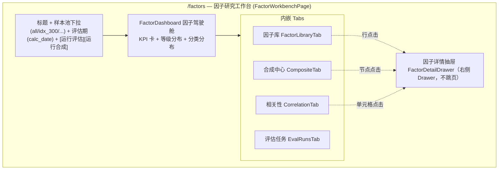
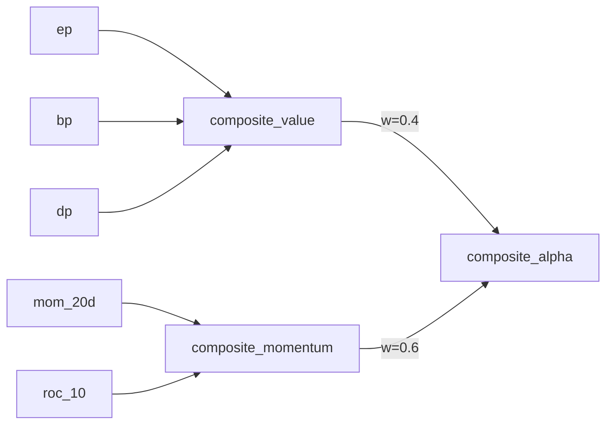

# xqtrader 因子研究前端产品设计（个人版）

> **版本**: v1.0
> **创建**: 2026-06-26
> **关联**: [factor-architecture.md](./factor-architecture.md)（因子管线）、[factor-catalog.md](./factor-catalog.md)（因子规格）、[factor-system-improvement-plan.md](./factor-system-improvement-plan.md)（评估改进）、[trading-product-design.md](./trading-product-design.md)（前端范式）
> **定位**: 个人量化平台**因子研究终端**前端权威口径。解决「用户看不到因子价值、不知哪些因子有效/可用/可合成、评估结果如何」的问题
> **范式**: 沿用交易工作台「**单页工作台 + 内嵌 Tab + 抽屉详情，不跳页**」模式

---

## 0. 背景与目标

当前因子的计算/评估/合成任务已在 `worker` 落地，后端查询 API（`/api/v1/factors/*`）已就绪，但**前端零界面、无导航入口**，用户完全无法感知因子价值。

### 0.1 要回答的核心问题（产品目标）

| 用户问题 | 由哪个视图回答 |
|----------|----------------|
| 我有哪些因子？分布如何？ | 因子驾驶舱（KPI + 等级/分类分布） |
| 哪些因子**有效、可用**？ | 因子库（IC/ICIR/多空收益/等级排序 + 筛选） |
| 单个因子表现如何、为什么这个等级？ | 因子详情抽屉（IC 时序/分层收益/衰减/多池对比/血缘） |
| 哪些因子**可以合成**？怎么合成的？ | 合成中心（合成候选 + 血缘树 + 权重 + 合成结果等级） |
| 因子之间是否冗余？ | 相关性（同组热力图 + 冗余组识别） |
| 评估/合成跑过没有？要重跑？ | 评估任务（运行记录 + 手动触发） |

### 0.2 设计原则

1. **一体化、不跳页**：单一 `/factors` 工作台，内嵌 Tab + 右侧抽屉详情，全局样本池/评估期切换覆盖所有视图。
2. **据实对齐**：复用既有 `/api/v1/factors/*` 与 `web/src/api/factor`；新增能力标注 `🔧 需后端`，并与 improvement-plan 的依赖打通。
3. **专业但克制**：对标 Qlib report / Alphalens tearsheet / Wind 因子分析的呈现，但只取个人版高性价比子集，不引入机构级多页。
4. **复用设计系统**：Ant Design 5 + Lucide + ECharts + `themes.css` 设计令牌，不引入新色板。

---

## 1. 信息架构与落位

### 1.1 导航落位（推荐方案）

新增**一级导航项 `因子`**（`nav.factor`），单一路由 `/factors` → `FactorWorkbenchPage`。

```ts
// navigation.ts 新增（图标 FlaskConical / Sigma 任一）
{ id: 'factor', labelKey: 'nav.factor', path: '/factors', icon: FlaskConical }
```
```tsx
// router/index.tsx 新增
{ path: 'factors', element: <FactorWorkbenchPage /> }
```

> **落位取舍**：因子同时服务「选股(strategy)」与「交易信号」，是独立的研究域，故采用**独立一级入口**（与 `trading` 工作台对称），而非嵌入 `strategy`。备选：作为 `strategy` 下的 `factors` Tab；本设计推荐独立入口，理由是因子研究是高频、长时停留的独立工作流。

### 1.2 页面内结构



---

## 2. 全局控制区（Header）

| 元素 | 说明 | 数据源 |
|------|------|--------|
| 样本池下拉 | `all / idx_50 / idx_300 / idx_500 / idx_1000 / idx_kcb50 / idx_cybz`，切换即刷新全页 | `fetchPools`（已有） |
| 评估期 | 显示该池最近一次 `calc_date`；可选历史快照 | 各 stats 接口 `calc_date` |
| 运行评估 | 触发 `factor.evaluate_weekly`，展示运行状态 | scheduler API（已有） |
| 运行合成 | 触发 `factor.synthesize_weekly` | scheduler API（已有） |

> 样本池是因子价值的关键维度（同因子在不同池预测力差异大），因此设为**全局上下文**，所有 Tab 与抽屉随之联动。

---

## 3. 因子驾驶舱（FactorDashboard）

顶部 KPI + 分布概览，回答「我有哪些因子、整体质量如何」。

| KPI 卡 | 含义 | 来源 |
|--------|------|------|
| 因子总数 | active/testing 因子数 | overview 聚合 |
| A 级 / B 级数 | 核心/辅助 Alpha 数量 | 按 grade 聚合 |
| 可用率 | (A+B) / 总数 | 计算 |
| 平均 ICIR | 当前池 ICIR 均值（绝对值） | stats 聚合 |
| 最近评估 | 最新 `calc_date` + 距今天数 | stats |

辅助图：
- **等级分布条**：A/B/C/D 堆叠条（A 绿、B 蓝、C 灰、D 红，见 §7 等级色）。
- **分类分布**：各 `category`（技术/动量/波动/估值/基本面/资金流/合成…）因子数柱状，点击 → 因子库按该类筛选。

> 🔧 需后端：新增 `GET /factors/dashboard?pool_id=` 返回上述聚合（避免前端拉全量自算）。MVP 阶段可由 `/factors/categories` + 前端聚合临时实现。

---

## 4. Tab 1：因子库（FactorLibraryTab）— 核心

主表格 + 筛选，回答「**哪些因子有效、可用**」。这是工作台的主屏。

### 4.1 表格列

| 列 | 字段 | 呈现 |
|----|------|------|
| 因子 | display_name + factor_id | 名称为主，ID 次级灰字 |
| 类别 | category | Tag |
| 方向 | direction | ↑ASC / ↓DESC |
| 等级 | factor_grade | 等级 Tag（A/B/C/D 色，见 §7） |
| IC | ic_mean | 数值 + 迷你色块（\|IC\|>0.03 高亮） |
| ICIR | icir | 数值（>1 优良、>0.5 可用） |
| 多空年化 | long_short_annual_ret | 百分比，红涨绿跌 |
| 夏普 | long_short_sharpe | 数值 |
| 换手 | turnover | 百分比（>70% 警示色） |
| 半衰期 | decay_half_life | 天 |
| 覆盖度 | coverage | 百分比进度条 |
| 状态 | status | active/testing/deprecated Tag |
| 合成 | is_composite | 复合因子图标 |

### 4.2 筛选与排序

- **筛选 chips**：类别（多选）、等级（A/B/C/D）、状态、是否合成、关键字搜索。
- **快捷视图**：「可用因子(A+B)」「失效(D/deprecated)」「未评估」一键切换。
- **排序**：默认按 ICIR 绝对值降序；各数值列可排序。
- 行点击 → 右侧 `FactorDetailDrawer`（不跳页）。

### 4.3 数据来源（关键缺口）

现有 `GET /factors`（列表）**只返回注册表**（含全局 `factor_grade`），**不含 IC/ICIR/收益/换手等 per-pool 统计**。表格要同时展示元数据 + 当前池评估指标，需：

> 🔧 需后端：新增 `GET /factors/overview?pool_id=&category=&grade=&status=&keyword=&page=`，**注册表 LEFT JOIN 该池最新 stats**，一次性返回表格所需全部列（分页）。这是前端落地的第一阻塞项。

MVP 退化方案（不改后端）：列表用 `/factors` + 对可见行逐个 `/factors/{id}/stats/latest?pool_id=` 批量并发拉取（页大小受限，性能差），仅作演示，**正式版必须做 overview 端点**。

---

## 5. Tab 2：合成中心（CompositeTab）— 回答「哪些可合成、结果如何」

分三区，呈现两层合成（L1 组内等权 → L2 跨组 ICIR 加权）。

### 5.1 合成结果卡片（顶部）

每个 `composite_*`（value/momentum/volatility/liquidity/technical/fund_flow/alpha）一张卡：等级 Tag、ICIR、多空年化、合成方法（equal_weight/icir_weight）、输入因子数。点击卡 → 详情抽屉。

### 5.2 合成血缘图（中部）

桑基图 / 树图展示：输入因子 → 组内合成因子（composite_value 等）→ 最终 composite_alpha，边宽/标注表示**跨组 ICIR 权重**。



数据：`is_composite=1` 因子的 `composite_factor_ids`（血缘）+ `composite_method`（已有，注册表）。跨组权重为合成时动态计算，需持久化或重算。

### 5.3 合成候选池（底部）

按组（value/momentum/…）列出当前池 **A/B 级**因子作为合成候选，标注「入选 / 未入选（等级不足或冗余）」。回答「哪些因子可以进合成」。

> 🔧 需后端：
> - `GET /factors/composites?pool_id=` 返回合成因子 + 血缘 + 各输入因子在该池等级 + 跨组权重；
> - 跨组 ICIR 权重当前仅在合成过程内存在，建议落库（如 stats 扩展或独立 `fac_composite_weight` 表）以供展示。

---

## 6. Tab 3：相关性与去冗余（CorrelationTab）

- **同组相关性热力图**：选定类别，展示成员因子截面值 Spearman 相关矩阵。
- **冗余组识别**：相关 >0.9 的因子聚为冗余组，标注每组**保留的 ICIR 最高者**（呼应 factor-architecture §4.3）。

> 🔧 需后端：新增 `GET /factors/correlation?pool_id=&category=`（或 `factor_ids=`）。该能力对应 [improvement-plan T9](./factor-system-improvement-plan.md) 的「相关矩阵去冗余」，**前后端联动落地**。本 Tab 在 T9 完成前显示「待评估」占位。

---

## 7. 因子详情抽屉（FactorDetailDrawer）— 不跳页

右侧 Drawer（宽 ~720px），从任意 Tab 点击因子打开。分区：

| 区块 | 内容 | 数据 | 就绪度 |
|------|------|------|--------|
| 元数据头 | 名称/ID/类别/方向/血缘(dependencies)/状态/全局等级/描述 | `/factors/{id}` | ✅ |
| 当前池快照 | IC/ICIR/胜率/多空年化/夏普/换手/半衰期/覆盖度/等级 | `/factors/{id}/stats/latest?pool_id=` | ✅ |
| IC 趋势图 | 各评估期 `ic_mean` 折线（周频快照趋势） | `/factors/{id}/stats?pool_id=` | ✅（粗粒度） |
| 分层收益柱状 | Q1–Q5 各组年化收益（验证单调性） | — | 🔧 stats 未存 group_returns，需扩展持久化 |
| IC 衰减曲线 | IC(h=1..20) 曲线 | — | 🔧 仅存半衰期标量，需存曲线或前端按 values 重算 |
| 多池对比 | 同因子在 all/idx_300/… 的 ICIR/等级对比 | 多次 `stats/latest` 或批量端点 | ✅/🔧（建议批量端点） |
| 截面值分布 | 选定日因子值直方图 | `/factors/{id}/values?trade_date=&pool_id=` | ✅ |

> 抽屉内「分层收益」「衰减曲线」是专业评估的关键可视化，但当前 `fac_factor_stats` 只存标量摘要。建议在评估任务持久化 `group_returns`（JSONB）与 `ic_decay_curve`（JSONB），供前端直接渲染（小数据量、永久保留）。

---

## 8. Tab 4：评估任务（EvalRunsTab）

- 评估/合成任务**运行记录**（时间/池/因子数/状态/耗时）+ 进度。
- **手动触发**：运行评估（`factor.evaluate_weekly`）、运行合成（`factor.synthesize_weekly`），可选样本池/因子范围。

> 复用既有 scheduler / worker 任务触发与状态查询 API（与 `data` 模块任务卡一致的范式）。

---

## 9. 设计令牌与组件规范

### 9.1 等级色（新增语义，复用现有令牌）

| 等级 | 含义 | 色 |
|------|------|-----|
| A | 核心 Alpha | `--color-fall`（绿，正向优良；与 A 股红涨绿跌区分语义，等级用「绿=好」更直觉，需在 i18n/图例标注） |
| B | 辅助 Alpha | `--accent-primary`（蓝） |
| C | 弱 Alpha | `--text-secondary`（灰） |
| D | 无效 | `--color-warning`（橙） / deprecated `--color-fall-muted` |

> ⚠️ 决策点：等级色与「红涨绿跌」可能冲突。**建议**：表格收益列严格红涨绿跌，等级 Tag 用独立色板（A=蓝/B=青/C=灰/D=红），避免歧义。最终配色在实现时与现有 `themes.css` 校准并在图例显式说明。

### 9.2 复用组件

- KPI 卡复用 backtest `PerformanceGrid` 栅格思路。
- 图表统一 ECharts（项目已用）：折线（IC 趋势）、柱状（分层）、热力图（相关）、桑基（血缘）。
- 空状态 Ant `Empty`，文案走 i18n。
- 数值格式复用 `utils/format.ts`。

### 9.3 响应式

沿用 `AppLayout`；≥1280px KPI 横排 + 表格全列；1024–1279 KPI 2×2、表格次要列收起；<1024 单栏。桌面优先，不做移动端。

---

## 10. API 对接清单

### 10.1 ✅ 已就绪（直接复用）

| 用途 | API |
|------|-----|
| 因子列表（注册表） | `GET /factors` |
| 分类聚合 | `GET /factors/categories` |
| 因子详情 | `GET /factors/{id}` |
| 截面因子值 | `GET /factors/{id}/values` |
| 评估统计时序 | `GET /factors/{id}/stats` |
| 最新评估快照 | `GET /factors/{id}/stats/latest` |
| 样本池列表 | `GET /selection/pools`（`fetchPools`） |

### 10.2 🔧 需后端新增 / 扩展

| 优先级 | 端点 | 用途 | 依赖 |
|--------|------|------|------|
| **P0** | `GET /factors/overview?pool_id=...` | 注册表 JOIN 当前池最新 stats，驱动因子库表格 | 前端落地阻塞项 |
| **P0** | `GET /factors/dashboard?pool_id=` | 驾驶舱 KPI/分布聚合 | — |
| P1 | `GET /factors/composites?pool_id=` | 合成因子 + 血缘 + 输入因子等级 + 跨组权重 | 权重落库 |
| P1 | stats 扩展持久化 `group_returns`、`ic_decay_curve`（JSONB） | 详情抽屉分层/衰减图 | 改评估任务 + 表结构 |
| P1 | `GET /factors/stats/latest/batch?factor_ids=&pool_id=` | 多池对比/批量快照 | — |
| P2 | `GET /factors/correlation?pool_id=&category=` | 相关性热力图/去冗余 | improvement-plan T9 |

> 所有新增端点遵循既有分页/响应规范（`build_paginated_response`），改表结构用 db-tools 验证。

---

## 11. 文件结构（规划）

```
web/src/
├── pages/factor/                          # 🔧 因子研究工作台（单页 + 内嵌组件）
│   ├── FactorWorkbenchPage.tsx            # 主页（Header + Dashboard + 4 Tab + Drawer）
│   ├── utils/factor.ts                    # 等级色、指标格式、阈值常量
│   └── components/
│       ├── FactorDashboard.tsx            # 驾驶舱（KPI + 分布）
│       ├── FactorLibraryTab.tsx           # 因子库表格 + 筛选
│       ├── CompositeTab.tsx               # 合成中心（卡片 + 血缘图 + 候选）
│       ├── CorrelationTab.tsx             # 相关性热力图
│       ├── EvalRunsTab.tsx                # 评估任务运行/触发
│       ├── FactorDetailDrawer.tsx         # 详情抽屉
│       ├── IcTrendChart.tsx               # IC 趋势（ECharts）
│       ├── LayeredReturnChart.tsx         # 分层收益柱状
│       └── FactorLineageChart.tsx         # 合成血缘桑基/树
├── api/factor/index.ts                    # ✅ 已有，补充 overview/dashboard/composites/correlation 类型与函数
└── config/navigation.ts · router/index.tsx  # 🔧 新增 /factors 入口
```

---

## 12. 实施计划（分阶段，闭环交付）

> 每阶段遵循：设计 → 实施 → 质量测试（mypy/ruff + 重启服务 API 黑盒）→ 验收 → 更新本文档。前端阶段需后端对应端点先行。

### 阶段一：MVP — 看见因子价值（依赖后端 P0 端点）

| 任务 | 内容 | 验收 |
|------|------|------|
| B1 | 后端 `GET /factors/overview`、`GET /factors/dashboard` | 黑盒返回正确分页与聚合 |
| F1 | 导航 + 路由 + `FactorWorkbenchPage` 骨架 + 样本池全局上下文 | 页面可达、池切换刷新 |
| F2 | `FactorDashboard` + `FactorLibraryTab`（表格/筛选/排序/快捷视图） | 能筛出 A/B 可用因子并排序 |
| F3 | `FactorDetailDrawer`（元数据 + 快照 + IC 趋势 + 截面分布） | 点击行打开详情，不跳页 |

> 阶段一即可回答「我有哪些因子、哪些有效可用、单因子表现如何」——覆盖用户最核心诉求。**注意**：因子库指标依赖 [improvement-plan 阶段一](./factor-system-improvement-plan.md)（修复评级单位 Bug、补财务/估值加载），否则表格里等级/基本面因子不可信。**建议先做评估侧 P0 修复，再上前端**。

### 阶段二：合成与多池

| 任务 | 内容 |
|------|------|
| B2 | `GET /factors/composites`；跨组权重落库 |
| F4 | `CompositeTab`（合成卡片 + 血缘图 + 候选池） |
| B3+F5 | stats 扩展 group_returns/decay_curve；抽屉补分层/衰减图、多池对比 |

### 阶段三：相关性与任务

| 任务 | 内容 |
|------|------|
| B4 | `GET /factors/correlation`（联动 improvement-plan T9） |
| F6 | `CorrelationTab` 热力图 + 冗余组 |
| F7 | `EvalRunsTab` 运行记录 + 手动触发 |

---

## 13. 与改进计划的依赖关系（务必先行）

本前端展示的「因子价值」**直接取决于评估质量**。以下 improvement-plan 项是前端可信的前提：

| improvement-plan 项 | 对前端的影响 |
|----------------------|--------------|
| 阶段一 T1（评级单位 Bug） | 不修则因子库等级几乎全 D，界面误导 |
| 阶段一 T2（财务/估值加载） | 不修则基本面因子在库里无指标、无法评估 |
| T9（相关矩阵） | 相关性 Tab 的数据来源 |
| group_returns/decay 持久化 | 详情抽屉分层/衰减图的数据来源 |

> **推进顺序建议**：improvement-plan 阶段一 → 本设计阶段一（B1/F1–F3）→ 其余并行。

---

*本文档为个人版因子研究前端权威设计。因子管线见 factor-architecture.md；评估改进见 factor-system-improvement-plan.md。落地后据实更新本文件实现状态。*
