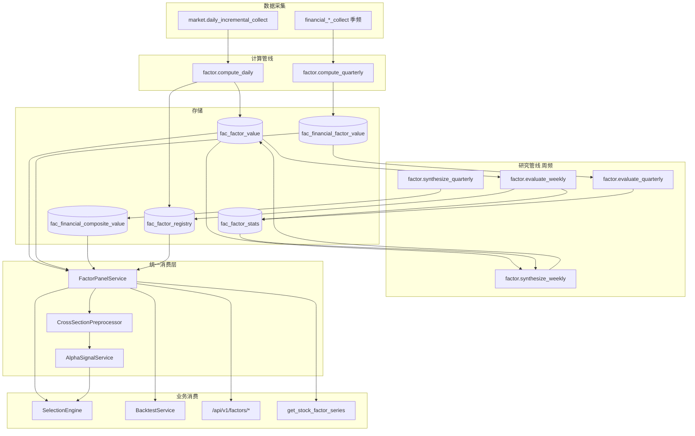
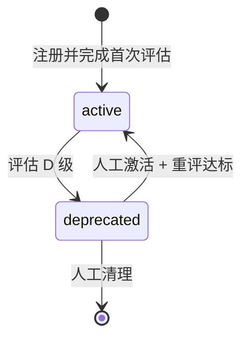
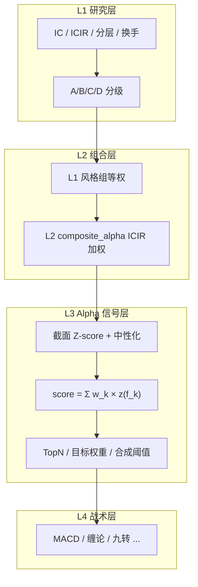
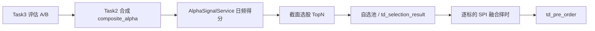

# xqtrader 因子系统设计

> **版本**: v7.2  
> **更新**: 2026-07-07  
> **定位**: 个人单机量化平台的因子基础设施权威设计  
> **关联**: [factor-catalog.md](./factor-catalog.md)（因子规格与清单）

---

## 一、系统定位

因子系统负责因子的**定义、计算、存储、评估、合成与统一消费**，为截面选股、时序回测、Agent 研究提供一致的因子数据与元数据。

设计参考：

- **Barra CNE6**（MSCI）：风险因子分层、截面标准化与行业市值中性化流程
- **Microsoft Qlib**：Handler 预计算 + DataHandler 截面加载 + Model 评估的三阶段分离
- **WorldQuant Alpha101**：插件化因子表达式与变体注册

个人版约束：维护人力 ≈ 1，单机部署，优先简单稳健方案（等权 + ICIR 合成，无 ML 合成管线）。

---

## 二、设计原则

| 原则 | 说明 |
|------|------|
| 单一身份源 | 每个经济含义对应唯一 `factor_id`，全系统共用 |
| 单一消费入口 | 业务模块通过 `FactorPanelService` 获取因子面板，禁止旁路直读 DB |
| 计算与预处理分离 | Task1 存逐标的原始值；截面预处理在消费/评估/合成时按需执行 |
| 研究生产一致 | 评估、选股、回测对同一 `factor_id` 使用同一计算定义与可声明的预处理策略 |
| 生命周期可执行 | `deprecated` 因子停止日频计算，注册表同步不覆盖运行时状态 |
| 形态决定能力 | 因子时间稠密度（dense/sparse/discrete）决定可评估性与合成 eligibility |

---

## 三、概念模型

### 3.1 因子（Factor）

具备稳定 `factor_id`、可复现计算逻辑、可落库或可按需计算的量化特征。因子值存储于 `fac_factor_value`（日频/周频合成）或 `fac_financial_factor_value`（季频 PIT）。

### 3.2 信号（Signal）

事件触发型离散输出（0/1 或枚举），用于时序交易规则触发。信号不入因子评估与 Alpha 合成，由 `OnDemandComputeRegistry` 在回测/决策时按需计算。

### 3.3 因子元数据维度

每个因子在 `FactorDefinition` 与 `fac_factor_registry` 中声明以下正交维度：

| 字段 | 取值 | 含义 |
|------|------|------|
| `compute_mode` | `precomputed` / `on_demand` | 预计算落库 / 消费时实时计算 |
| `density` | `dense` / `sparse` / `discrete` | 日频稠密 / 事件稀疏 / 离散信号 |
| `usage` | `cross_section` / `time_series` / `both` | 截面选股 / 时序回测 / 两者 |
| `preprocess_policy` | `cross_section_standard` / `raw` | 截面消费时的预处理策略 |
| `update_freq` | `daily` / `weekly` / `quarterly` | 因子值更新频率 |
| `compute_engine` | `plugin` / `synthesize` / `cross_section` | 计算引擎归属 |
| `data_origin` | 见 §8.3 | 原始数据路由 |
| `status` | `active` / `deprecated` | 生命周期（DB 运行时字段） |
| `factor_grade` | `A` / `B` / `C` / `D` | 评估等级（DB 运行时字段） |

**密度与能力映射**：

| density | 标准 IC 评估 | Alpha 合成 | 截面选股 | 时序回测 |
|---------|-------------|-----------|---------|---------|
| `dense` | ✅ | ✅ | ✅ | ✅ |
| `sparse` | ❌（事件研究除外） | ❌ | ⚠️ 仅展示 | ✅ 原始值 |
| `discrete` | ❌ | ❌ | ❌ | ✅ 信号规则 |

### 3.4 命名规范

- 全局唯一：`^[a-z][a-z0-9_]*$`
- 禁止同一经济含义多个 ID（如禁止同时存在 `rsi` 与 `rsi_14`）
- 变体通过参数化注册：`rsi_14`、`mom_20d`、`hist_vol_20`
- 前缀语义见 [factor-catalog.md §命名规范](./factor-catalog.md)

---

## 四、总体架构



### 4.1 三任务 + 季频管线

| 任务 | 调度 | 输入 | 输出 |
|------|------|------|------|
| **Task1** 日频计算 | 工作日 17:00 | OHLCV、资金流、日指标 | `fac_factor_value` |
| **Task3** 周频评估 | 周六（手动 DAG） | Task1 产出 + 截面加载 | `fac_factor_stats`、`factor_grade` |
| **Task2** 周频合成 | 周六（依赖 Task3） | A/B 因子 + ICIR 权重 | `composite_*` → `fac_factor_value` |
| **TaskQ1** 季频计算 | 每季首月 15 日 | 财务四表 | `fac_financial_factor_value` |
| **TaskQ3** 季频评估 | 季后 | 季频因子 PIT 面板 | `fac_financial_factor_stats` |
| **TaskQ2** 季频合成 | 季后（依赖 Q3） | 季频 A/B 因子 | `fac_financial_composite_value` |

> 参考：Qlib 将因子处理拆为 Handler 预计算、DataHandler 截面加载、Model 训练评估三阶段；Barra 将逐标的原始计算与截面标准化分为两个时点。本架构与上述划分一致。

---

## 五、FactorPanelService（统一消费层）

### 5.1 职责

`FactorPanelService`（`src/xqtrader/domain/factor/services/factor_panel_service.py`）是所有业务模块获取因子数据的唯一入口。

```python
class FactorPanelService:
    async def load_cross_section_panel(
        self,
        factor_ids: list[str],
        symbols: list[str],
        signal_date: date,
        pool_id: str = "all",
    ) -> pd.DataFrame:
        """截面选股：加载 + cross_section_standard 预处理。"""

    async def load_time_series_panel(
        self,
        factor_ids: list[str],
        symbol: str,
        start_date: date,
        end_date: date,
        pool_id: str = "all",
    ) -> pd.DataFrame:
        """时序回测：加载原始值；on_demand 因子实时计算。"""

    async def load_factor_series(
        self,
        factor_ids: list[str],
        symbol: str,
        start_date: date,
        end_date: date,
    ) -> pd.DataFrame:
        """Agent/API 宽表时序：原始值 + 元数据。"""
```

### 5.2 加载路由

`FactorPanelService` 根据注册表元数据路由：

| compute_mode | data_origin | 加载方式 |
|--------------|-------------|---------|
| `precomputed` | `computed` / `fund_flow` | `fac_factor_value` |
| `precomputed` | `fina_indicator` | `fac_financial_factor_value` + PIT ffill |
| `precomputed` | `daily_indicator` | `sdc_daily_indicator` |
| `precomputed` | `computed` + quarterly | `fac_financial_composite_value` + PIT ffill |
| `precomputed` | `update_freq=weekly` | `fac_factor_value` + 日频 ffill |
| `cross_section` | `cross_section_compute` | `CrossSectionFactorCalculator` 实时算 |
| `on_demand` | — | `OnDemandFactorRegistry` 插件实时算 |

### 5.3 预处理策略

| preprocess_policy | 执行时机 | 流程 |
|-------------------|---------|------|
| `cross_section_standard` | `load_cross_section_panel` | 缺失填充(行业均值) → MAD(n=5) → Z-score → 行业+市值中性化 → 再 Z-score |
| `raw` | `load_time_series_panel` | 不执行截面预处理 |

> 参考：Barra CNE6 / 华泰金工《技术因子标准化方法》(2020) — 先去极值再标准化，先标准化再中性化。

### 5.4 on_demand 因子白名单

仅注册表中 `compute_mode=on_demand` 的因子允许消费时实时计算，不走 DB：

| factor_id | 引擎 | usage |
|-----------|------|-------|
| `chan_buy_point` | chanpy | time_series |
| `chan_sell_point` | chanpy | time_series |
| `chan_bi_direction` | chanpy | time_series |
| `td_seq_buy` / `td_seq_sell` / `td_seq_count` | 自研 | time_series |
| `donchian_high_20` / `donchian_low_10` | talib | time_series |
| `close` / `volume` | OHLCV 直取 | both |

**禁止**对 `fac_factor_registry` 中已存在的 `precomputed` 因子在业务层重复实现（如 talib 版 `rsi_14`）。

---

## 六、因子注册

### 6.1 代码为静态元数据唯一源

`FactorPlugin` 子类声明静态属性 → `get_definition()` → `FactorDefinition`。

运行时字段（`factor_grade`、`status`、`report_lag_days`）仅存 DB，`sync_to_registry()` **不得覆盖**。

```python
# sync_to_registry update_fields（不含 status / factor_grade）
update_fields = [
    "display_name", "category", "direction", "scope",
    "compute_mode", "density", "usage", "preprocess_policy",
    "dependencies", "min_periods", "data_origin", "update_freq",
    "compute_engine", "is_composite", "composite_factor_ids", ...
]
```

### 6.2 活跃因子解析

```python
async def resolve_active_factors(factor_ids: list[str] | None) -> list[FactorPlugin]:
    """内存插件 ∩ DB status='active'。"""
```

Task1 计算、Task3 评估均调用 `resolve_active_factors`，跳过 `deprecated` 因子。

### 6.3 变体注册

参数化变体通过 `_FACTOR_VARIANTS` 注册：`mom_5d/20d/60d`、`rsi_6/14/24`、`ma_bias_5/10/20/60` 等。

---

## 七、数据采集

### 7.1 日频原始数据

| 任务 | 数据表 | 字段 | 用途 |
|------|--------|------|------|
| `market.daily_incremental_collect` | `sdc_candlestick_daily` | OHLCV, amount | C/D/E 类因子 |
| 同上 | `sdc_fund_flow_individual` | 主力/大单/net_mf | D3 资金流 |
| 同上 | `sdc_daily_indicator` | PE/PB/市值/换手率 | A/B1 因子 |

### 7.2 季频原始数据

| 任务 | 数据表 | 用途 |
|------|--------|------|
| `financial_indicator_collect` 等 | `sdc_fina_indicator` | B2–B5 |
| 同上 | `sdc_income` / `sdc_balance` / `sdc_cash_flow` | B3 成长 |

### 7.3 水位管理

`WatermarkAspect` 绑定 `factor_compute` / 采集任务，增量跳过已最新日期。

---

## 八、Task1：日频因子计算

### 8.1 归属因子

C 技术、D1/D2 Alpha、D3 资金流（逐标的）、A 风险（逐标的）、E2 K 线聚合。

缠论连续值（L1）、离散信号（L0）**不在 Task1 执行** — 仅注册定义，业务按需实时计算（§十三）。

B 类基本面、F 类合成、截面风险因子（`compute_engine=cross_section`）**不在 Task1 执行**。

### 8.2 管线阶段

```
LoadStage   → K线/资金流/日指标（不含财务）
CalcStage   → FactorPlugin.compute()，数据门控
PersistStage → 5 年截断 + upsert fac_factor_value (pool_id='all')
```

### 8.3 数据加载策略

| 因子类型 | 加载策略 |
|---------|---------|
| 有状态（MACD/EMA/SAR/缠论） | 全量历史 K 线 |
| 无状态（动量/波动率） | 5 年 + 前 300 bar warmup |

### 8.4 data_origin 路由

| data_origin | 说明 |
|-------------|------|
| `computed` | Task1 计算产出 |
| `fund_flow` | 资金流衍生 |
| `daily_indicator` | 估值指标直读 |
| `fina_indicator` | 季频财务（TaskQ1） |
| `cross_section_compute` | 评估/合成时按需截面计算 |
| `derived` | 从 base_factor 截面 Z-score |

---

## 九、CrossSectionPreprocessor

`CrossSectionPreprocessor`（原 `CrossSectionReader` 预处理部分）封装 §5.3 流程，供 `FactorPanelService`、`AlphaSynthesizer`、评估任务共用。

### 9.1 财务因子 PIT

按 `ann_date ≤ trade_date` 取最新财报，应用层前向填充至日频截面。

```sql
SELECT * FROM sdc_fina_indicator
WHERE symbol = ? AND ann_date <= :截面日
ORDER BY end_date DESC LIMIT 1
```

> 参考：Point-in-Time 数据库实践 — 公告日驱动防未来函数；Q4 年报最大滞后约 120 天，固定 `lag_days=60` 会在 1–4 月误用年报。

### 9.2 样本池 PIT 成分

指数池按 `sdc_index_weight.report_date` 构建 `{trade_date: symbols}` 映射，评估时过滤非成分股。

### 9.3 可交易性过滤

评估与分层回测排除：

- ST / *ST / PT（`RISK_WARNING_PREFIXES`）
- 当日停牌（`suspend_status = 'S'`）
- 涨跌停不可成交（收盘价触及涨跌停且未打开）

---

## 十、Task3：因子评估

### 10.1 评估 eligibility

```python
_EVALUABLE = (
    status == "active"
    and density == "dense"
    and category not in EXCLUDED_CATEGORIES
    and update_freq != "quarterly"  # 季频走 TaskQ3
)
```

`EXCLUDED_CATEGORIES = ("return", "composite_group", "composite_cross", "interaction")`

合成因子 `composite_alpha` 等单独做 **OOS 验证评估**（独立 category `composite_output`），与普通 Alpha 因子评估分开统计。

### 10.2 评估指标

| 指标 | 计算 | 阈值（A 股个人版） |
|------|------|-------------------|
| IC | Spearman(factor_t, fwd_ret_{t+1}) | — |
| ICIR | mean(IC) / std(IC)，末 504 日 | A: >0.3, B: >0.15, C: >0.05 |
| 多空年化 | Q5−Q1 年化，扣双边 0.3% | A: >0, B: >0 |
| 换手率 | 对称差异比例 | A: <50% |
| 多 horizon IC | 5d/10d/20d | 持久化至 stats |

> 参考：504 交易日（≈2 年）IC 统计窗口 — 1 年样本量不足导致 ICIR 不稳定（华泰金工 A 股因子实践）。

### 10.3 因子等级

| 等级 | 标准 | 行为 |
|------|------|------|
| A | ICIR>0.3 + 多空>0 + 换手<50% | 必入合成池 |
| B | ICIR>0.15 + 多空>0 | 纳入 L1 组候选 |
| C | ICIR>0.05 或 多空>0 | 观察 |
| D | 其余 | 连续 **2** 次评估为 D → `deprecated`，Task1 停止计算 |

**全局等级**取目标池 `idx_300` 的等级（非多池最优）。

### 10.4 评估样本池

**Tier1（驱动合成与全局生命周期）**：

```
idx_300          # 全局 grade 基准
all              # 覆盖度监控
```

**Tier2（扩展评估，写入 fac_factor_stats）**：

15 个风格标签池（§14.3）+ `idx_500`、`idx_1000`。

合成因子权重仍锚定 Tier1；Tier2 池级 stats 供池适配选股与前端多池对比。

> 评估 → 合成 → Alpha 信号完整方法论见 **§十八**。

### 10.5 并发与性能

- 预加载 computed 类因子宽表，8 并发 CPU 评估
- 单因子滚动加载，峰值内存 = concurrency × 单因子面板

---

## 十一、Task2：Alpha 合成

### 11.1 两阶段合成

> 参考：Barra 多因子合成 — 组内等权消除共线性，跨组 ICIR 加权兼顾预测力与稳定性。

| 层级 | factor_id | 方法 | 输入示例 |
|------|-----------|------|---------|
| L1 | `composite_value` | 等权 | ep, bp, dp, ev_ebitda, sp |
| L1 | `composite_momentum` | 等权 | mom_5d/20d/60d, barra_momentum, ... |
| L1 | `composite_volatility` | 等权 | hist_vol_*, atr_ratio, dastd, ... |
| L1 | `composite_liquidity` | 等权 | cs_turnover, cs_log_amount, ... |
| L1 | `composite_technical` | 等权 | rsi_14, kdj_k, macd_hist_ratio, ... |
| L1 | `composite_fund_flow` | 等权 | cs_main_net_pct, ... |
| L2 | `composite_alpha` | ICIR 加权 | 上述 6 个 L1 |
| D4 | `*_cross` 交互因子 | Z-score 相乘 | mom_20d×atr_ratio 等 |

### 11.2 组内去冗余

合成前对组内因子做截面 Spearman 相关矩阵（时间均值），`|ρ| > 0.9` 的冗余组保留 ICIR 最高者。

### 11.3 合成样本池

合成因子写入 `fac_factor_value`，生产池：

```
all, idx_300, idx_1000
```

`update_freq=weekly`，回测/选股消费时 ffill 至日频。

### 11.4 合成因子 OOS 评估

`composite_alpha` 及 L1 合成因子纳入 `composite_output` category，执行独立 IC/分层/衰减评估，结果写入 `fac_factor_stats`，不参与子因子评估循环。

> 合成权重更新与 L3 信号消费见 **§18.3 ~ §18.4**。

---

## 十二、季频财务管线

### 12.1 TaskQ1 计算

B2 盈利、B3 成长、B4 质量、B5 杠杆 → `fac_financial_factor_value`（`ann_date` PIT，不做落库前向填充）。

### 12.2 TaskQ3 评估

IC horizon：1Q/2Q/4Q；统计窗口：8/12/16/20 季度。

### 12.3 TaskQ2 合成

| L1 | factor_id |
|----|-----------|
| 成长 | `composite_growth` |
| 质量 | `composite_quality` |
| 杠杆 | `composite_leverage` |
| 效率 | `composite_efficiency` |
| L2 | `composite_alpha_quarterly` |

---

## 十三、缠论与信号体系

缠论相关产出分为 **L0 离散信号** 与 **L1 分析特征**，均不属于 Alpha 因子库，**仅注册定义、不入库、不参与评估与合成**。

### 13.1 分类

| 层级 | 类型 | density | 注册表 | 持久化 | 评估 | 合成 | 计算方式 |
|------|------|---------|--------|--------|------|------|---------|
| L0 | 离散信号 | discrete | `SignalDefinition` | ❌ | ❌ | ❌ | on_demand |
| L1 | 分析特征 | sparse | `AnalysisFeatureDefinition` | ❌ | ❌ | ❌ | on_demand |

> L0/L1 定义登记在 catalog 中供文档与 API 发现，**不写入** `fac_factor_registry`（Alpha 因子注册表）与 `fac_factor_value`。

### 13.2 L0 离散信号

| signal_id | 用途 |
|-----------|------|
| `chan_buy_point` / `chan_sell_point` | 缠论买卖点触发（0/1） |
| `chan_bi_direction` | 笔方向（+1/-1/0） |
| `chan_multi_resonance` / `chan_interval_signal` | 多级别共振、区间套 |
| `td_seq_buy` / `td_seq_sell` / `td_seq_count` | 神奇九转 |
| `donchian_high_20` / `donchian_low_10` | 唐奇安通道 |

由 `OnDemandComputeRegistry` 在时序回测/决策时通过 chanpy 或 talib **按需计算**。

### 13.3 L1 缠论分析特征

10 个 `chan_*` 连续值（分型强度、笔属性、中枢属性、背驰强度等）：值仅在事件 bar 写入，截面覆盖率 ≈ 6%，不满足标准 IC 评估。

**按需计算路径**：

- 时序回测：`OnDemandComputeRegistry` + chanpy
- Agent/可视化：MCP `get_stock_chanlun`、个股详情服务
- **不进入** Task1 日频批处理，**不写入** `fac_factor_value`

一次 chanpy 调用可同时输出 L0 信号与 L1 特征，避免重复计算。

### 13.4 与 Alpha 因子库的边界

| 维度 | Alpha 因子 | L0/L1 缠论 |
|------|-----------|-----------|
| 注册 | `fac_factor_registry` | `SignalDefinition` / `AnalysisFeatureDefinition` |
| 存储 | `fac_factor_value` | 无（按需算） |
| 选股/合成 | ✅ | ❌ |
| 回测规则 | 可引用 DB 因子 | 引用 signal_id |

---

## 十四、样本池与风格标签

### 14.1 池类型

| pool_type | 标的来源 | PIT 成分 |
|-----------|---------|---------|
| `market` | `sdc_security` | 否 |
| `index` | `sdc_index_weight` | 是 |
| `style` | `sdc_stock_tag` + `sdc_tag_definition` | 否（标签按 effective_date 生效） |

### 14.2 指数池

| pool_id | 说明 |
|---------|------|
| `all` | 全 A 股 |
| `idx_300` / `idx_500` / `idx_1000` | 沪深300 / 中证500 / 中证1000 |

### 14.3 风格标签池（`sdc_tag_definition` → `sdc_stock_tag`）

标签定义表 `stock.sdc_tag_definition` 共 **15** 个 active 标签（2026-05-30 批次），分三个 dimension：

**style（风格因子，4 个）**

| tag_key | 名称 | 规则摘要 | 覆盖标的数 |
|---------|------|---------|-----------|
| `growth` | 成长股 | Growth Score > 70 分位 且 Value Score < 50 分位 | 885 |
| `value` | 价值股 | Value Score > 70 分位 且 Growth Score < 50 分位 | 852 |
| `core` | 核心风格 | Value 与 Growth Score 均 > 50 分位（重叠区） | 1,212 |
| `momentum` | 动量股 | 12M 收益（剔除近 1M）> 70 分位 | 1,569 |

**quality（质量/行业，8 个）**

| tag_key | 名称 | 规则摘要 | 覆盖标的数 |
|---------|------|---------|-----------|
| `blue_chip` | 蓝筹股 | 市值>500亿 + ROE>10% + 股息率>1.5% + 龙头 + 流动性 | 364 |
| `white_horse` | 白马股 | 连续3年 ROE>12% + 营收/利润双增 + 盈利质量 | 89 |
| `dividend` | 红利股 | 近3年股息率>3% + 连续5年分红 + 盈利稳定 | 1,683 |
| `tech` | 科技股 | 科技行业 + 研发投入/营收>3% | 1,200 |
| `consumption` | 消费股 | 消费行业 + ROE>12% + 毛利率高于行业中位 | 596 |
| `cyclical` | 周期股 | 周期行业 + 营收/利润高波动 | 552 |
| `high_vol` | 高波动股 | 250日波动率 > 全A 70 分位 | 1,569 |
| `low_vol` | 低波动股 | 250日波动率 < 全A 30 分位 | 1,568 |

**size（市值，3 个）**

| tag_key | 名称 | 规则摘要 | 覆盖标的数 |
|---------|------|---------|-----------|
| `large_cap` | 大盘股 | 总市值 > 全A 80 分位 | 1,048 |
| `mid_cap` | 中盘股 | 总市值 30~80 分位 | 2,618 |
| `small_cap` | 小盘股 | 总市值 < 全A 30 分位 | 1,570 |

**风格标签评估池（`fac_factor_pool`，15 标签一一对应）**：

| pool_id | tag_key | 名称 |
|---------|---------|------|
| `style_growth` | growth | 成长股 |
| `style_value` | value | 价值股 |
| `style_core` | core | 核心风格 |
| `style_momentum` | momentum | 动量股 |
| `style_blue_chip` | blue_chip | 蓝筹股 |
| `style_white_horse` | white_horse | 白马股 |
| `style_dividend` | dividend | 红利股 |
| `style_tech` | tech | 科技股 |
| `style_consumption` | consumption | 消费股 |
| `style_cyclical` | cyclical | 周期股 |
| `style_high_vol` | high_vol | 高波动股 |
| `style_low_vol` | low_vol | 低波动股 |
| `style_large_cap` | large_cap | 大盘股 |
| `style_mid_cap` | mid_cap | 中盘股 |
| `style_small_cap` | small_cap | 小盘股 |

`pool_type=style`，`definition={"tag_key": "<tag_key>"}`。标签可多选并存（单股常见 3~7 个）。

### 14.4 factor_scope

`fac_factor_pool.factor_scope` 支持 `include` / `exclude` / `category` 收敛单池评估因子范围。

---

## 十五、存储模型

### 15.1 表结构

| 表 | Schema | 时间键 | 用途 |
|----|--------|--------|------|
| `fac_factor_registry` | research | — | 元数据 + grade/status |
| `fac_factor_value` | stock | trade_date | 日频/周频合成因子值 |
| `fac_factor_stats` | research | calc_date | 评估统计 |
| `fac_financial_factor_value` | stock | ann_date | 季频 PIT 因子值 |
| `fac_financial_composite_value` | stock | ann_date | 季频合成 |
| `fac_financial_factor_stats` | research | calc_date | 季频评估 |
| `fac_factor_pool` | research | — | 样本池 |

### 15.2 fac_factor_value 主键

`(symbol, trade_date, factor_id, pool_id)`

- Task1 产出：`pool_id='all'`
- Task2 合成产出：按目标 pool_id 写入
- 保留策略：5 年 + TimescaleDB 自动压缩（1 year）

---

## 十六、生命周期



| 状态 | Task1 计算 | 历史数据 |
|------|-----------|---------|
| `active` | ✅ | 保留 |
| `deprecated` | ❌ 跳过 | 保留（供回测） |

等级变更由 Task3 写入 `factor_grade`；D 级自动设 `status=deprecated`（可通过配置关闭自动 deprecated，默认开启）。

---

## 十七、调度编排

```yaml
# schedules/daily_pipeline.yml
steps:
  - stock_daily_collect
  - index_daily_collect
  - sw_daily_collect
  - daily_factor_compute    # depends_on: sw_daily_collect

# schedules/weekly_factor_pipeline.yml（手动触发 DAG）
steps:
  - factor_evaluate_weekly
  - factor_synthesize_weekly  # depends_on: factor_evaluate_weekly

# schedules/quarterly_factor_pipeline.yml
steps:
  - financial_indicator_collect
  - income_statement_collect
  - balance_sheet_collect
  - cash_flow_collect
  - factor_compute_quarterly
  - factor_evaluate_quarterly
  - factor_synthesize_quarterly

# schedules/daily_pipeline.yml — L3 Alpha 信号（按需，不持久化全市场快照）
steps:
  - alpha_signal_compute   # depends_on: daily_factor_compute；ffill 最新 composite 权重
```

---

## 十八、业界方法论：评估 → 合成 → Alpha 信号

> 对齐 Barra CNE6 / Qlib / WorldQuant 共识：**因子研究、组合构建、战术择时分层**；优质因子经评估与合成后，以**截面得分**进入信号层，而非原始因子阈值触发买卖。

### 18.1 四层分离

| 层级 | 机构典型名称 | 本系统模块 | 频率 | 核心问题 |
|------|-------------|-----------|------|---------|
| **L1 研究** | Factor Research | Task3 / TaskQ3 + `grade_evaluator` | 周 / 季 | 因子是否有效、是否入库 |
| **L2 组合** | Alpha Model | Task2 / TaskQ2 + `alpha_synthesizer` | 周 / 季 | 多因子如何加权合成 |
| **L3 Alpha 信号** | Portfolio Signal | `AlphaSignalService` | 日 | 全市场相对强弱 → 排序/权重 |
| **L4 战术 overlay** | Timing / Execution | SPI 插件 + 决策流 | 日 | 池内标的何时买卖 |



**范围边界**：L2 采用等权 + ICIR 合成（无 ML 合成、无 mean-variance 优化器）；L3 以 ICIR 加权排序 + TopN；L4 为 SPI 插件融合。

### 18.2 因子评估设计（Task3）

#### 18.2.1 评估哲学

| 维度 | 机构做法 | 本系统 |
|------|---------|--------|
| 预测目标 | 截面相对收益（rank IC） | Spearman IC vs `fwd_ret_1d/5d/20d` |
| 统计窗口 | 2 年+ 滚动 | 504 交易日 |
| 样本空间 | 可投资 universe + 行业中性检验 | 样本池 + ST/停牌/涨跌停过滤（§9.3） |
| 分级用途 | 决定是否入模 | A/B → 合成候选；C → 观察；D → 停算 |
| 多池评估 | Barra 全 A + 策略池分层 | Tier1 锚定 grade；Tier2 供池适配 |

#### 18.2.2 评估流程

```
resolve_active_factors
  → CrossSectionPreprocessor.load_panel(pool_id, signal_date)
  → ic_calculator: 滚动 IC 序列
  → layered_backtest: Q5-Q1 多空、换手
  → grade_evaluator: A/B/C/D
  → 写入 fac_factor_stats + fac_factor_registry.factor_grade
```

#### 18.2.3 等级与下游行为

| 等级 | 合成 eligibility | 截面选股 | Task1 | 生命周期 |
|------|-----------------|---------|-------|---------|
| A | 必纳入 L1 组候选 | ✅ 高权重 | ✅ | active |
| B | 纳入 L1 组候选 | ✅ | ✅ | active |
| C | ❌ | ⚠️ 研究/展示 | ✅ | active |
| D | ❌ | ❌ | ❌ 停算 | 连续 2 次 D → deprecated |

**全局 `factor_grade`** 锚定 Tier1 池 `idx_300`（与 Barra 全市场基准一致，避免在多池中取最优导致过拟合）。

#### 18.2.4 因子衰减监控

- 滚动 63 日 IC 均值 < 全样本 IC 均值的 50% → 前端告警「衰减」
- 连续 2 次周评 D 级 → 自动 deprecated（§16）
- 合成因子 `composite_output` 独立 OOS 评估，与子因子评估解耦（§11.4）

### 18.3 Alpha 合成设计（Task2）

#### 18.3.1 合成哲学

| 步骤 | 机构做法 | 本系统 |
|------|---------|--------|
| 组内 | 风格维度等权 / 正交化 | L1 六组等权 + `\|ρ\|>0.9` 去冗余（§11.2） |
| 跨组 | ICIR 加权 | L2 `composite_alpha` ICIR 加权（锚定 idx_300） |
| 更新 | 周频重估权重 | Task2 周六，`update_freq=weekly` |
| 消费 | 日频 ffill 最新合成值 | 选股/信号层 PIT 取最近一周合成值 |

#### 18.3.2 合成输入 eligibility

```python
_SYNTH_CANDIDATE = (
    factor_grade in ("A", "B")
    and density == "dense"
    and status == "active"
    and not is_composite  # 子因子，非 composite_* 自身
)
```

每组 L1 至少保留 2 个有效因子；不足时该组跳过，权重按比例重分至其余组。

#### 18.3.3 合成产出与持久化

| factor_id | 层级 | 写入表 | pool_id |
|-----------|------|--------|---------|
| `composite_value` … `composite_fund_flow` | L1 | `fac_factor_value` | all, idx_300, idx_1000 |
| `composite_alpha` | L2 | `fac_factor_value` | all, idx_300, idx_1000 |
| `composite_alpha_quarterly` | L2 季频 | `fac_financial_composite_value` | all |

权重向量持久化至 `fac_factor_registry.params`（或专用 `fac_composite_weight` 表），供 L3 信号层读取。

### 18.4 Alpha 信号层（AlphaSignalService）

> **核心原则**：机构不把 `main_net_pct_chg > 0` 当买卖规则；而是先合成 → 截面标准化 → 得到**相对得分**，再转为排序、权重或合成阈值。

#### 18.4.1 服务职责

`AlphaSignalService`（`src/xqtrader/domain/factor/services/alpha_signal_service.py`）在 L2 合成与 L4 战术层之间，负责日频 Alpha 信号产出：

```python
class AlphaSignalService:
    async def compute_cross_section_scores(
        self,
        signal_date: date,
        pool_id: str,
        method: str = "icir_weighted",  # icir_weighted | composite_alpha
        factor_ids: list[str] | None = None,
    ) -> pd.DataFrame:
        """返回 columns: symbol, score, rank, weight。"""

    async def rank_universe(
        self, signal_date: date, pool_id: str, top_n: int = 10, **kwargs
    ) -> list[dict]:
        """模式 A：截面选股 TopN。"""

    async def load_alpha_series(
        self, symbol: str, start: date, end: date, factor_id: str = "composite_alpha"
    ) -> pd.Series:
        """模式 B：单标的合成 Alpha 时序（供表达式规则 / 研究）。"""
```

#### 18.4.2 三种信号输出模式

| 模式 | 公式 / 逻辑 | 场景 | 再平衡频率 |
|------|------------|------|-----------|
| **A 截面排序** | `score_i = Σ w_k × z(f_k,i)`，取 Top decile / Top N | SelectionEngine、Morning Brief 候选 | 双周~月度 |
| **B 合成阈值** | `composite_alpha` 已 Z-score；`buy: score > θ_buy` | 表达式规则 `ts_composite_alpha_threshold` | 日频更新，中低频交易 |
| **C 目标权重** | `weight_i = max(0, score_i) / Σ max(0, score)` | 配仓 / `PositionSizing` | 月度 |

**模式 A 计算步骤**（与 Qlib TopkDropout 同构）：

1. `FactorPanelService.load_cross_section_panel` — 截面标准化 + 中性化
2. 读取 Task3 产出的 ICIR 权重（或等权）
3. 加权求和 → `score`
4. 行业 caps、单票上限、最小流动性过滤（可配置）
5. 输出 `td_selection_result` TopN

- 仅允许 `composite_alpha` / `composite_alpha_quarterly` 等 **composite_output**
- 阈值 θ 由 Walk-Forward 或分层回测标定
- 不得叠加原始 A/B 因子组；合成得分已涵盖子因子信息

#### 18.4.3 日频 Alpha 信号

| 任务 | 调度 | 输入 | 输出 |
|------|------|------|------|
| `alpha_signal_compute` | 工作日 17:45（Task2 后或 ffill 最新权重） | composite 权重 + 当日截面面板 | `AlphaSignalService` 内存面板 |

全市场 Alpha 得分由 `AlphaSignalService` **按需计算**，不持久化至 DB。

### 18.5 战术信号层（SPI）与 Alpha 的分工

| 维度 | Alpha 信号（L3） | 战术信号（L4） |
|------|-----------------|---------------|
| 输入 | A/B 因子、composite_alpha | on_demand SPI（MACD/缠论/九转） |
| 语义 | 「谁更好」 | 「何时买卖」 |
| 范围 | 全 pool 截面 | 单标的时序 |
| 评估 | IC/ICIR | 回测 Sharpe / 交易次数 |
| 融合 | ICIR 加权 / TopN | 组内 or + 组间 weighted_vote |

**推荐实盘链路**：

```
Task3(A/B) → Task2(composite) → AlphaSignalService TopN（低频）
  → 自选池 / watchlist
  → SymbolSignalWorker SPI 融合（日频）
  → PositionSizing → td_pre_order
```

### 18.6 风格标签与策略适配

15 个 `sdc_tag_definition` 标签（§14.3）驱动 Tier2 评估池；**标签只约束 universe 与评估分层，不引入额外语义叠加**。

| 标签维度 | 典型 tag_key | Alpha 再平衡建议 | SPI 战术建议 |
|----------|-------------|-----------------|-------------|
| style | growth, momentum | 双周~月度 | 趋势组（MACD/ADX/量价） |
| style | value, core | 月度~季度 | 均值回归（RSI/BIAS） |
| quality | dividend, low_vol | 季度 | 低波 + 红利，慎用纯趋势 |
| quality | high_vol, cyclical | 双周 | 突破/动量 |
| size | large_cap, idx_300 | 月度 | 趋势 + 资金面 |
| size | small_cap | 双周 | 高波动突破，严控仓位 |

L4 SPI 策略组按标签维度配置默认模板（见上表），同一 pool 内不得强制共用单一战术插件组合。

### 18.7 设计约束

| 约束 | 说明 |
|------|------|
| Alpha 因子不得直接作时序阈值 | 原始 A/B 因子表达截面相对强弱，须经标准化与合成后再进入信号层 |
| 时序表达式仅引用 composite | `category=timing` + `expression` 只允许 `composite_alpha*` |
| 战术指标走 on_demand | SPI 插件经 `OnDemandComputeRegistry`，与 Alpha 因子库分离 |
| sparse/discrete 不入评估合成 | 缠论 L1、离散信号仅 catalog 定义，按需计算 |
| 截面与战术分层消费 | L3 定 universe/权重，L4 定买卖时机 |
| 自选池与截面选股分离 | 截面 TopN 输出候选；决策流 universe 来自 watchlist（见 trading-system-design §3.6） |

### 18.8 与业界参考对照

| 机构/框架 | 评估 | 合成 | 信号 |
|-----------|------|------|------|
| **Barra CNE6** | 因子暴露 + 风险归因 | 风格组合成 | 组合权重优化（非单因子阈值） |
| **WorldQuant BRAIN** | IC/Sharpe/Fitness | Alpha 表达式组合 | 截面 rank → 组合 |
| **Qlib** | Model IC / 分层 | Handler 因子集 | TopK _dropout 再平衡 |
| **xqtrader** | Task3 ICIR + 分层 | Task2 L1 等权 + L2 ICIR | AlphaSignalService TopN + composite 阈值 + SPI overlay |

---

## 十九、与交易系统的接口契约

> 完整方法论见 **§十八**。本节定义模块边界与校验规则。

### 19.1 截面选股（SelectionEngine）

- 依赖：`FactorPanelService.load_cross_section_panel` + `AlphaSignalService.rank_universe`（§18.4 模式 A）
- 规则 `category=cross_section` 的 `factor_ids` 须满足 `usage ∈ {cross_section, both}` 且 `density=dense`
- 输入因子须 `factor_grade ∈ {A, B}` 或显式引用 `composite_*` / `composite_alpha`
- 禁止对原始 A/B 因子做未标准化的截面排序

### 19.2 Alpha 择时信号（表达式规则）

- 允许引用 **`composite_alpha`**、**`composite_alpha_quarterly`**（§18.4 模式 B）
- 不得将原始 A/B 单因子注册为 `category=timing` 表达式规则
- 加载路径：`FactorPanelService.load_time_series_panel`，合成因子按 PIT ffill 至日频

### 19.3 战术信号（BacktestService / 决策流 SPI）

- 依赖：`OnDemandComputeRegistry` + SPI 插件（MACD/KDJ/缠论/九转等）
- 规则 `category=timing` + `rule_type=plugin` 引用 `signal_id`
- `BacktestService` 统一经 `OnDemandComputeRegistry` 加载战术指标

### 19.4 端到端工作流（与 trading-system-design 对齐）



- **低频（Alpha）**：截面再平衡 — 双周~月度，由 `composite_alpha` 或 ICIR 加权排序驱动
- **日频（战术）**：自选池内 SPI 融合 — `watchlist_after_close_decision_flow`

### 19.5 规则注册校验

| 规则类型 | 允许引用 | 禁止 |
|----------|---------|------|
| `cross_section` | `composite_*`、A/B dense 因子 | on_demand signal_id、sparse/discrete |
| `timing` + `expression` | `composite_alpha`、`composite_alpha_quarterly` | 原始 A/B 单因子阈值 |
| `timing` + `plugin` | SPI / signal_id | `fac_factor_registry` 中 precomputed 因子 |

---

## 二十、API 与 MCP

| 端点 | 说明 |
|------|------|
| `GET /factors` | 注册表列表（含 density/usage/compute_mode） |
| `GET /factors/series/{symbol}` | 单标的宽表时序（FactorPanelService.load_factor_series） |
| `GET /factors/{id}/values` | 截面因子值（FactorPanelService.load_cross_section_panel） |
| `GET /factors/{id}/stats` | 评估时序 |
| `POST /factors/alpha/rank` | 截面 Alpha 排序 TopN（AlphaSignalService） |
| MCP `get_stock_factor_series` | 同 series API |

---

## 二十一、代码目录

```
src/xqtrader/domain/factor/
├── base.py                          # FactorDefinition, FactorPlugin
├── models/                          # ORM 6+1 表
└── services/
    ├── registry.py                  # 发现、变体、sync（不覆盖 status/grade）
    ├── factor_panel_service.py      # 统一消费入口
    ├── cross_section_preprocessor.py # 截面预处理
    ├── factor_data_loader.py        # raw 数据加载
    ├── cross_section_factor_calculator.py
    ├── on_demand_factor_registry.py # 战术指标 on_demand
    ├── ic_calculator.py
    ├── grade_evaluator.py
    ├── layered_backtest.py
    ├── alpha_synthesizer.py
    ├── alpha_signal_service.py      # L3 Alpha 信号
    ├── factor_dedup.py
    ├── factor_series_service.py
    └── pool_init.py

src/worker/plugins/
├── factor_compute/                  # Task1
├── factor_evaluate/                 # Task3
├── factor_synthesize/               # Task2
├── alpha_signal_compute/            # L3 日频 Alpha 信号
├── factor_quarterly/                # TaskQ1
├── factor_evaluate_quarterly/       # TaskQ3
└── factor_synthesize_quarterly/     # TaskQ2
```

---

*因子规格与完整清单见 [factor-catalog.md](./factor-catalog.md)。*
