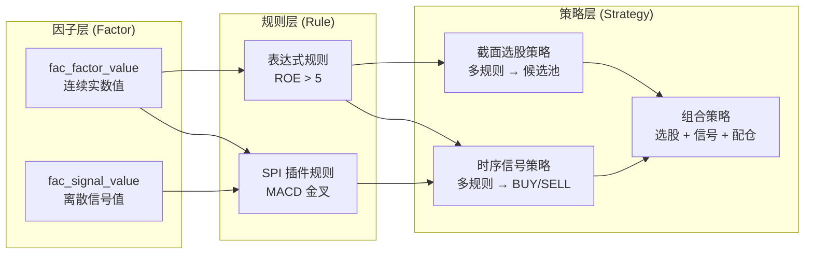
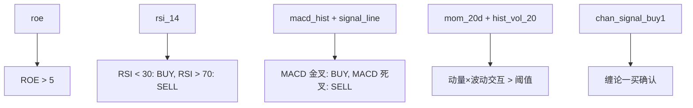
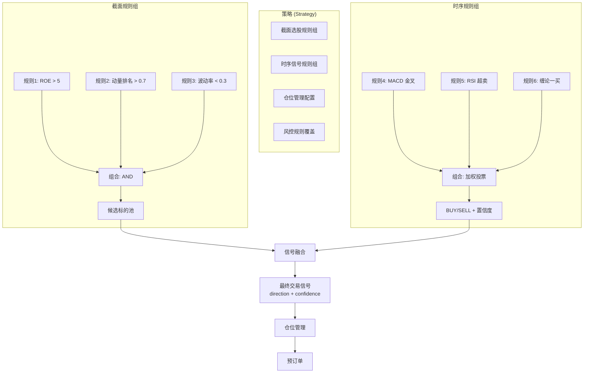
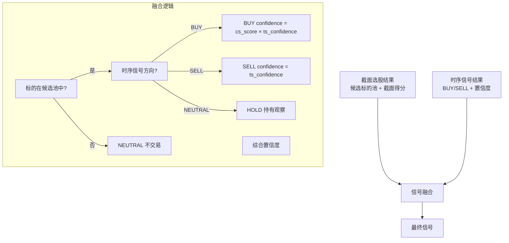
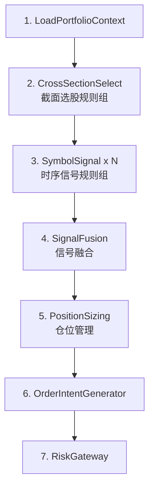
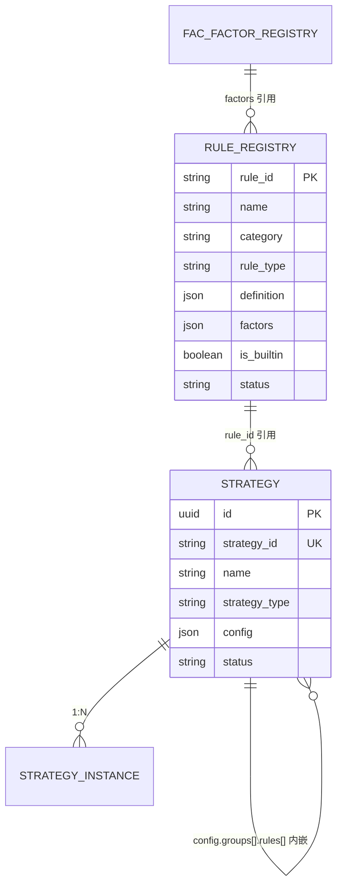
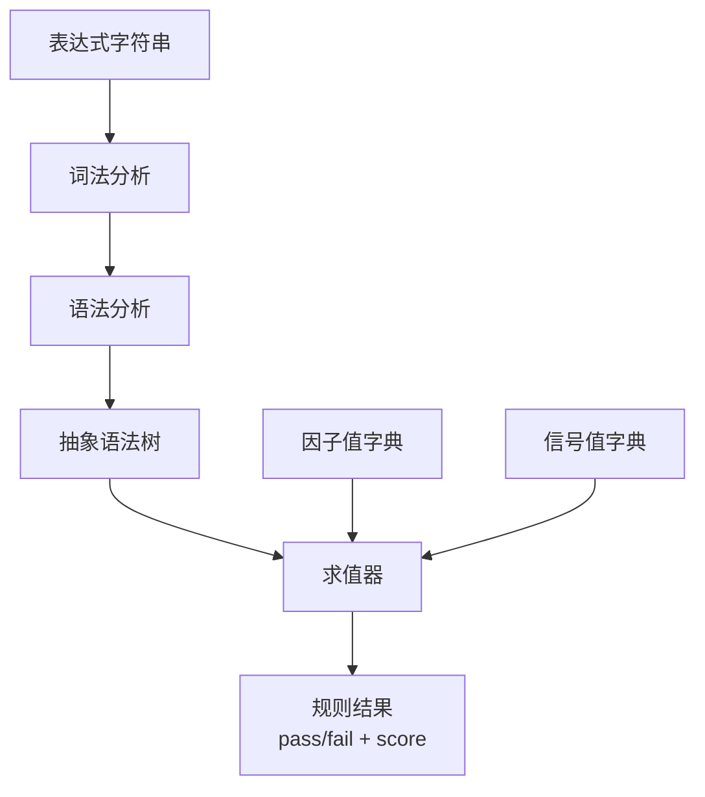
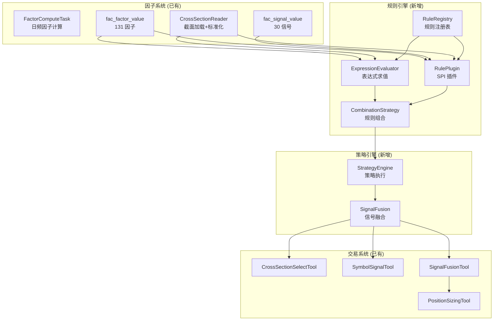
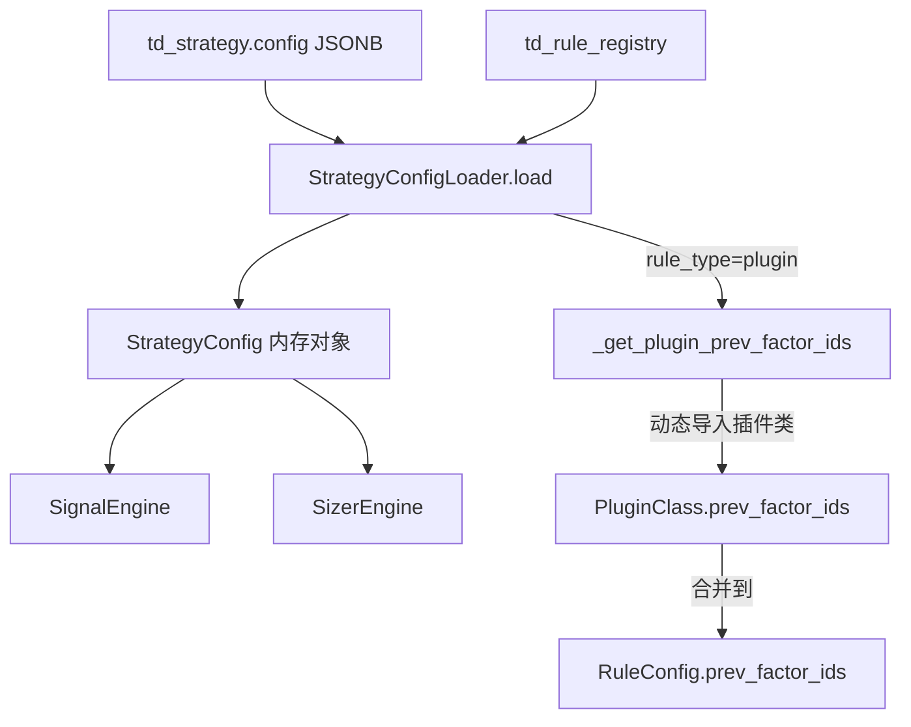

# xq-trader 因子→规则→策略 架构设计

> **更新**: 2026-06-23
> **前置**: [factor-system-design.md](./factor-system-design.md)（因子系统）、[trading-system-design.md](./trading-system-design.md)（交易系统）
> **参考**: Qlib Pipeline / WorldQuant BRAIN / Zipline Pipeline API / Quantopian Factor-Classifier-Filter

---

## 一、设计目标

| 目标 | 说明 |
|------|------|
| 因子→规则→策略三层分离 | 因子是数值特征，规则是因子上的判断逻辑，策略是多规则的组合与决策 |
| 双引擎规则 | 表达式规则（类 Qlib/WorldQuant）+ SPI 插件规则（MACD 金叉、布林带等） |
| 截面/时序规则分离 | 截面选股规则 vs 时序信号规则，不同算子、不同输出 |
| 信号带方向+置信度 | 每条规则产出 BUY/SELL/NEUTRAL + confidence，而非二元布尔 |
| 多规则组合 | AND/OR 逻辑、加权评分、投票多数决、IC 加权等 |
| 可配置可复用 | 规则与策略均为数据库配置，前端可编辑，策略实例可复用 |

---

## 二、核心概念

### 2.1 三层模型



### 2.2 概念定义

| 概念 | 定义 | 产出 | 示例 |
|------|------|------|------|
| **因子** | 从原始数据提取的数值特征 | 连续实数值 | `roe=12.5`, `rsi_14=65.3` |
| **规则** | 对因子/信号施加的判断逻辑 | 方向 + 置信度 | `RSI > 70 → SELL(0.8)` |
| **策略** | 多规则的组合 + 决策逻辑 | 最终交易信号 | 3 条规则投票 → BUY |

### 2.3 规则 vs 因子的关系

**每条规则至少依赖一个因子**：



---

## 三、规则引擎设计

### 3.1 规则类型

| 类型 | 实现方式 | 适用场景 | 业界参考 |
|------|---------|---------|---------|
| **表达式规则** | 声明式表达式引擎，类 Qlib/WorldQuant | 阈值判断、排名筛选、因子组合 | Qlib Alpha158, WQ BRAIN FastExpression |
| **SPI 插件规则** | Python 类继承 RulePlugin，编码实现 | 复杂模式识别、交叉检测、多因子联合判断 | vnpy CtaTemplate, TradingView Pine Script |

### 3.2 表达式规则

**语法设计**（参考 WorldQuant FastExpression + Qlib 表达式引擎）：

```
# 基本比较
roe > 5
rsi_14 < 30
pe_ttm < 30 and roe > 10

# 截面排名
rank(mom_20d) > 0.8          # 动量排名前 20%
rank(ep_ttm) > 0.7           # 盈利收益率排名前 30%

# 时序算子
delta(rsi_14, 5) > 10        # RSI 5日变化 > 10
cross_above(macd_dif, macd_dea)  # MACD 金叉
cross_below(macd_dif, macd_dea)  # MACD 死叉

# 组合表达式
rank(mom_20d) > 0.7 and rank(ep_ttm) > 0.5 and hist_vol_20 < 0.3
```

**表达式算子**：

| 类别 | 算子 | 说明 |
|------|------|------|
| 比较 | `>`, `<`, `>=`, `<=`, `==`, `!=` | 阈值判断 |
| 逻辑 | `and`, `or`, `not` | 条件组合 |
| 截面 | `rank(x)`, `zscore(x)`, `percentile(x)` | 截面排名/标准化 |
| 时序 | `delta(x, n)`, `ma(x, n)`, `std(x, n)` | 时序变化/均值/标准差 |
| 交叉 | `cross_above(a, b)`, `cross_below(a, b)` | 金叉/死叉检测 |
| 数学 | `abs(x)`, `log(x)`, `sign(x)`, `max(a,b)`, `min(a,b)` | 数学运算 |

**表达式规则配置**：

```json
{
  "rule_id": "r_roe_filter",
  "name": "ROE 过滤",
  "category": "cross_section",
  "type": "expression",
  "expression": "roe > 5 and rank(roe) > 0.5",
  "factors": ["roe"],
  "signal_mapping": {
    "true": {"direction": "LONG", "confidence_expr": "zscore(roe)"},
    "false": {"direction": "NEUTRAL", "confidence": 0}
  }
}
```

**关键设计**：`signal_mapping` 定义表达式结果到信号的映射：
- 表达式为 `true` → 产生信号（方向 + 置信度）
- 表达式为 `false` → NEUTRAL（无信号）
- `confidence_expr` 支持表达式计算置信度（如 `zscore(roe)` 表示 ROE 的 Z-score 作为置信度）

### 3.3 SPI 插件规则

**基类设计**：

```python
class RulePlugin(ABC):
    """规则插件基类。"""

    rule_id: str           # 规则唯一标识
    name: str              # 规则名称
    factor_ids: list[str]  # 依赖因子列表
    prev_factor_ids: list[str]  # 需要前一日值的因子（引擎自动注入 {factor}_prev）

    @abstractmethod
    def evaluate(self, ctx: RuleContext) -> RuleResult:
        """评估规则，返回结果。"""

    def get_config_schema(self) -> dict:
        """返回配置参数 JSON Schema（前端动态渲染表单）。"""
        return {}
```

> **设计说明**: 文档早期版本使用 `factors` 属性名，实现中改为 `factor_ids` 以与 `RuleConfig.factor_ids` 保持一致。`category` 属性不再由插件类声明，改为由 `td_rule_registry.category` DB 字段管理。新增 `prev_factor_ids` 支持前值因子自动注入。

**RuleContext**：

```python
@dataclass
class RuleContext:
    """规则执行上下文。"""
    symbol: str                       # 当前标的
    signal_date: date                 # 信号日（对应文档早期版本的 trade_date）
    factor_values: dict[str, float | None]  # 因子值 {factor_id: value}，含前值 {fid}_prev
    factor_series: dict[str, pd.Series]     # 因子时序数据（可选，规则可访问历史窗口）
    cross_section_df: pd.DataFrame | None   # 同日多标的截面数据（截面选股专用）
    config: dict                      # 规则配置参数
```

**RuleResult**：

```python
@dataclass
class RuleResult:
    """规则执行结果。"""
    rule_id: str         # 规则编码
    passed: bool         # 是否触发
    score: float         # 得分（强度），范围 [0, 1]
    direction: str       # 方向 — 时序: buy/sell/neutral；截面: bullish/bearish/neutral
    confidence: float    # 置信度 [0, 1]
    reason: str          # 触发原因文本
    detail: dict         # 详细诊断数据（因子值快照等）
```

> **设计说明**: 文档早期版本使用 `RuleSignal`（direction=BUY/SELL/NEUTRAL 大写），实现中统一为 `RuleResult`（direction=buy/sell/neutral 小写），并新增 `passed` 和 `score` 字段以支持截面选股评分场景。`RuleContext.trade_date` 重命名为 `signal_date` 以与交易系统 `signal_date` 语义对齐。

**SPI 插件示例 — MACD 柱扩张/金叉死叉**：

```python
class MACDPlugin(RulePlugin):
    rule_id = "macd_expansion"
    name = "MACD柱扩张+金叉死叉"
    factor_ids = ["macd", "signal", "hist", "hist_slope", "hist_area"]
    prev_factor_ids = ["hist", "hist_area"]  # 引擎自动注入 hist_prev, hist_area_prev

    def evaluate(self, ctx: RuleContext) -> RuleResult:
        hist = ctx.factor_values.get("hist")
        hist_prev = ctx.factor_values.get("hist_prev")
        hist_slope = ctx.factor_values.get("hist_slope")
        hist_area = ctx.factor_values.get("hist_area")
        hist_area_prev = ctx.factor_values.get("hist_area_prev")

        # 金叉：hist 由负转正
        if hist_prev is not None and hist is not None:
            if hist_prev <= 0 and hist > 0:
                return RuleResult(rule_id=self.rule_id, passed=True, direction="buy",
                    confidence=0.7, reason=f"金叉买入: hist由正转负 ...")

        # 红柱扩张买入
        if hist and hist_slope and hist_slope > 0 and hist_area and hist_area_prev:
            if hist_area > hist_area_prev:
                return RuleResult(rule_id=self.rule_id, passed=True, direction="buy",
                    confidence=0.7, reason=f"红柱扩张买入: ...")

        # 绿柱扩张卖出 / 死叉卖出（类似逻辑）
        # ...

        return RuleResult(rule_id=self.rule_id, passed=False, direction="neutral",
            score=0.0, reason="OR: 无信号")
```

> **设计说明**: 实际实现中 MACD 插件使用 `prev_factor_ids` 声明需要前值的因子，引擎在每 bar 自动注入 `{factor}_prev` 键值对（如 `hist_prev`、`hist_area_prev`），插件无需自行访问历史 K 线数据。

**SPI 插件示例 — 布林带规则**：

```python
class BollingerBandRule(RulePlugin):
    rule_id = "bollinger_band"
    name = "布林带突破"
    category = "time_series"
    factors = ["boll_position", "boll_width"]

    def get_config_schema(self) -> dict:
        return {
            "oversold_threshold": {"type": "number", "default": 0.1, "title": "超卖阈值"},
            "overbought_threshold": {"type": "number", "default": 0.9, "title": "超买阈值"},
        }

    def evaluate(self, ctx: RuleContext) -> RuleResult:
        pos = ctx.factor_values.get("boll_position")
        width = ctx.factor_values.get("boll_width")
        oversold = ctx.config.get("oversold_threshold", 0.1)
        overbought = ctx.config.get("overbought_threshold", 0.9)

        if pos is None:
            return RuleResult(rule_id=self.rule_id, passed=False, direction="neutral",
                score=0.0, reason="数据不足")

        if pos < oversold:
            conf = min((oversold - pos) / oversold, 1.0)
            return RuleResult(rule_id=self.rule_id, passed=True, direction="buy",
                confidence=conf, reason=f"布林带超卖 pos={pos:.2f}")

        if pos > overbought:
            conf = min((pos - overbought) / (1 - overbought), 1.0)
            return RuleResult(rule_id=self.rule_id, passed=True, direction="sell",
                confidence=conf, reason=f"布林带超买 pos={pos:.2f}")

        return RuleResult(rule_id=self.rule_id, passed=False, direction="neutral",
            score=0.0, reason="布林带中性区间")
```

### 3.4 规则类别

| 类别 | 说明 | 输出 | 执行时机 |
|------|------|------|---------|
| **cross_section** | 截面选股规则 | 是否入选 + 截面得分 | T 日决策流（步骤 2 CrossSectionSelect） |
| **time_series** | 时序信号规则 | BUY/SELL/NEUTRAL + 置信度 | T 日决策流（步骤 3 SymbolSignal） |

**截面规则**：在全市场标的上执行，筛选出候选池。规则产出为 `pass/fail` + `score`。

**时序规则**：在候选池标的上逐标的执行，产生交易信号。规则产出为 `BUY/SELL/NEUTRAL` + `confidence`。

### 3.5 规则注册表

规则通过数据库表管理，支持前端配置和动态加载：

| 字段 | 类型 | 说明 |
|------|------|------|
| rule_id | String(64) PK | 规则唯一标识 |
| name | String(128) | 规则名称 |
| category | Enum | `cross_section` / `time_series` |
| type | Enum | `expression` / `spi` |
| expression | Text | 表达式规则的表达式字符串（type=expression 时） |
| spi_class | String(256) | SPI 插件类路径（type=spi 时），如 `xqtrader.trading.rules.macd_cross.MACDCrossRule` |
| factors | JSON | 依赖因子列表 `["roe", "rsi_14"]` |
| signal_mapping | JSON | 信号映射配置（表达式规则专用） |
| config_schema | JSON | 参数 JSON Schema（前端动态渲染） |
| default_config | JSON | 默认配置参数 |
| description | Text | 规则说明 |
| is_builtin | Boolean | 是否内置规则 |
| status | Enum | `active` / `deprecated` |

---

## 四、策略引擎设计

### 4.1 策略结构



### 4.2 策略配置

策略配置存储在 `td_strategy.config` JSONB 字段中，采用内嵌结构而非关系表：

```json
{
  "strategy_id": "alpha_rebalance_01",
  "name": "Alpha 再平衡策略",
  "strategy_type": "timing",
  "config": {
    "groups": [
      {
        "group_id": "macd_group",
        "name": "MACD信号组",
        "rules": [
          {"rule_id": "ts_macd_cross", "weight": 0.5, "params": {}},
          {"rule_id": "ts_rsi_signal", "weight": 0.5, "params": {"oversold": 30, "overbought": 70}}
        ],
        "fusion": {"method": "weighted_vote", "buy_threshold": 0.5, "sell_threshold": 0.5}
      }
    ],
    "group_fusion": {"method": "or"},
    "position_config": {
      "plugin_class": "xqtrader.domain.trading.backtest.sizer.plugins.atr_position.ATRPositionPlugin",
      "params": {"atr_period": 14, "risk_budget_pct": 0.02},
      "factor_ids": []
    }
  }
}
```

> **设计决策**: 文档早期版本定义了 `strategy_rule_group` + `strategy_rule_binding` 两张关系表，实现中改为 `td_strategy.config` JSONB 内嵌 `groups[].rules[]`。理由：(1) 规则组与绑定是策略的私有配置，无需独立查询；(2) JSONB 内嵌减少 JOIN 开销；(3) 策略加载时一次性读取，无需多次查询。规则定义仍通过 `rule_id` 引用 `td_rule_registry`，避免规则配置重复。

### 4.3 规则组合方式

#### 方式一：AND 逻辑组合

所有规则必须通过：

```
result = rule1.pass AND rule2.pass AND rule3.pass
score = min(rule1.score, rule2.score, rule3.score)
```

适用场景：严格筛选，如"ROE > 5 AND PE < 30 AND 动量排名 > 0.7"

#### 方式二：OR 逻辑组合

任一规则通过即可：

```
result = rule1.pass OR rule2.pass OR rule3.pass
score = max(rule1.score, rule2.score, rule3.score)
```

适用场景：宽松筛选，如"MACD 金叉 OR RSI 超卖 OR 缠论一买"

#### 方式三：加权评分

各规则加权得分求和：

```
score = Σ(w_i × rule_i.score)
result = score ≥ threshold
```

适用场景：截面选股，如"ROE 得分 × 0.3 + 动量得分 × 0.4 + 波动率得分 × 0.3 ≥ 0.5"

#### 方式四：加权投票

各规则投票，BUY=+1, SELL=-1, NEUTRAL=0：

```
vote = Σ(w_i × direction_i)    # BUY=+1, SELL=-1, NEUTRAL=0
confidence = |vote| / Σ(w_i)   # 归一化置信度

if vote > buy_threshold:  → BUY(confidence)
if vote < sell_threshold: → SELL(confidence)
else:                     → NEUTRAL
```

适用场景：时序信号，如"MACD 金叉(0.3) + RSI 超卖(0.3) + 缠论一买(0.2) + 布林超卖(0.2)"

#### 方式五：IC 加权

使用因子历史 IC 作为权重（仅截面选股）：

```
w_i = ICIR_i / Σ|ICIR_j|    # ICIR 归一化权重
score = Σ(w_i × zscore(rule_i.factor_value))
```

适用场景：机构级多因子选股，权重随因子评估自动更新。

### 4.4 信号融合

截面选股与时序信号的融合：



**融合规则**：

| 截面结果 | 时序信号 | 最终信号 | 说明 |
|---------|---------|---------|------|
| 入选 + 高分 | BUY | BUY(confidence = cs_score × ts_conf) | 强买入 |
| 入选 + 低分 | BUY | BUY(confidence = cs_score × ts_conf) | 弱买入 |
| 入选 | SELL | SELL(confidence = ts_conf) | 卖出（不看截面得分） |
| 入选 | NEUTRAL | HOLD | 持有观察 |
| 未入选 | BUY | NEUTRAL | 不在候选池，不买入 |
| 未入选 | SELL | SELL(confidence = ts_conf) | 不在候选池，卖出 |
| 未入选 | NEUTRAL | NEUTRAL | 不交易 |

### 4.5 置信度计算

**单规则置信度**：

| 规则类型 | 置信度计算 |
|---------|-----------|
| 表达式规则 | `confidence_expr` 表达式计算（如 `zscore(roe)`） |
| SPI 插件规则 | 插件 `evaluate()` 返回的 `confidence` 字段 |

**多规则组合置信度**：

| 组合方式 | 置信度公式 |
|---------|-----------|
| AND | `min(conf_1, conf_2, ...)` |
| OR | `max(conf_1, conf_2, ...)` |
| 加权评分 | `Σ(w_i × conf_i) / Σ(w_i)` |
| 加权投票 | `|Σ(w_i × direction_i × conf_i)| / Σ(w_i)` |
| IC 加权 | `Σ(ICIR_i × zscore_i) / Σ|ICIR_i|` |

**最终信号置信度**：

```
final_confidence = cross_section_score × time_series_confidence
```

最终置信度用于仓位管理：`target_weight = sizing_strategy(final_confidence, ...)`

---

## 五、与交易系统集成

### 5.1 在 trading_decision 流中的位置



| 步骤 | 使用规则 | 说明 |
|------|---------|------|
| 步骤 2 CrossSectionSelect | 截面规则组 | 执行截面选股规则，产出候选标的池 |
| 步骤 3 SymbolSignal | 时序规则组 | 逐标的执行时序规则，产出 BUY/SELL 信号 |
| 步骤 4 SignalFusion | 融合逻辑 | 截面得分 × 时序置信度 → 最终信号 |

### 5.2 CrossSectionSelectTool 实现

```python
class CrossSectionSelectTool:
    """截面选股工具节点。"""

    async def execute(self, state: dict) -> dict:
        strategy = await self.load_strategy(state["instance_id"])
        cross_section_rules = strategy.cross_section_rules

        # 1. 加载全市场因子截面
        factor_df = await self.cross_section_reader.load(
            trade_date=state["signal_date"],
            factor_ids=self._collect_factor_ids(cross_section_rules),
            pool_id=strategy.universe_pool
        )

        # 2. 逐规则评估
        scores = {}
        for rule_config in cross_section_rules.rules:
            rule = self.rule_registry.get(rule_config.rule_id)
            rule_results = rule.evaluate_cross_section(factor_df, rule_config.config)
            for symbol, result in rule_results.items():
                scores.setdefault(symbol, {})[rule_config.rule_id] = result

        # 3. 组合
        combination = self._get_combination(cross_section_rules.combination)
        selected = combination.combine(scores, cross_section_rules)

        # 4. 写入 selection_result
        await self.persist_selection(state, selected)
        return {"selected_symbols": list(selected.keys())}
```

### 5.3 SymbolSignalTool 实现

```python
class SymbolSignalTool:
    """逐标的信号生成工具节点。"""

    async def execute(self, state: dict) -> dict:
        strategy = await self.load_strategy(state["instance_id"])
        ts_rules = strategy.time_series_rules
        symbols = state["selected_symbols"]

        signals = {}
        for symbol in symbols:
            # 1. 加载标的因子值 + K线
            ctx = await self.build_context(symbol, state["signal_date"], ts_rules)

            # 2. 逐规则评估
            rule_signals = {}
            for rule_config in ts_rules.rules:
                rule = self.rule_registry.get(rule_config.rule_id)
                signal = rule.evaluate(ctx)
                rule_signals[rule_config.rule_id] = signal

            # 3. 组合
            combination = self._get_combination(ts_rules.combination)
            final_signal = combination.combine(rule_signals, ts_rules)
            signals[symbol] = final_signal

        # 4. 写入 trading_signal
        await self.persist_signals(state, signals)
        return {"signals": signals}
```

---

## 六、领域模型

### 6.1 ER 关系



> **设计决策**: 文档早期版本定义了 `strategy_rule_group` + `strategy_rule_binding` + `rule_factor_dep` 三张关系表，实现中简化为 `td_strategy.config` JSONB 内嵌 + `td_rule_registry` 单表。`rule_factor_dep` 由 `td_rule_registry.factors` JSONB 数组替代。

### 6.2 表定义

#### strategy（策略定义）

| 字段 | 类型 | 说明 |
|------|------|------|
| id | UUID PK | |
| strategy_id | String(64) unique | 策略编码 |
| name | String(128) | 策略名称 |
| description | Text | 策略说明 |
| strategy_type | Enum | `selection`（截面选股）/ `timing`（时序回测） |
| config | JSONB | 策略主配置（groups + group_fusion + 类型特有配置） |
| status | Enum | `draft` / `active` / `deprecated` |

**config JSONB 结构**（按 strategy_type 不同）：

- `selection`: `{groups, group_fusion, top_n}`
- `timing`: `{groups, group_fusion, position_config}`

#### rule_registry（规则注册表）

| 字段 | 类型 | 说明 |
|------|------|------|
| rule_id | String(64) PK | 规则唯一标识 |
| name | String(128) | 规则名称 |
| description | Text | 规则说明 |
| category | Enum | `selection` / `timing` / `both` |
| rule_type | Enum | `expression` / `plugin` |
| definition | JSONB | 规则定义（按 rule_type 不同） |
| factors | JSONB | 依赖因子 `["pe", "roe"]` |
| is_builtin | Boolean | 是否内置 |
| status | Enum | `active` / `deprecated` |

**definition JSONB 结构**：

- `rule_type=expression, category=timing`: `{"buy_expr": "rsi < 30", "sell_expr": "rsi > 70", "prev_factors": []}`
- `rule_type=expression, category=selection`: `{"bullish_expr": "...", "bearish_expr": "...", "score_expr": "..."}`
- `rule_type=plugin`: `{"plugin_class": "...", "default_params": {...}}`

---

## 七、内置规则

### 7.1 截面选股规则

| rule_id | 名称 | 类型 | 表达式/逻辑 | 依赖因子 |
|---------|------|------|------------|---------|
| `cs_roe_filter` | ROE 过滤 | expression | `roe > {threshold}` | roe |
| `cs_pe_filter` | PE 过滤 | expression | `pe_ttm < {threshold}` | pe_ttm |
| `cs_momentum_rank` | 动量排名 | expression | `rank(mom_20d) > {top_pct}` | mom_20d |
| `cs_value_momentum` | 价值动量组合 | expression | `rank(ep_ttm) > 0.5 and rank(mom_20d) > 0.5` | ep_ttm, mom_20d |
| `cs_low_volatility` | 低波过滤 | expression | `hist_vol_20 < {max_vol}` | hist_vol_20 |
| `cs_fund_flow` | 资金流过滤 | expression | `cs_main_net_pct > 0 and rank(cs_main_net_pct) > 0.6` | cs_main_net_pct |
| `cs_quality_growth` | 质量成长 | expression | `roe > 10 and q_or_yoy > 20` | roe, q_or_yoy |

### 7.2 时序信号规则

| rule_id | 名称 | 类型 | 逻辑 | 依赖因子 |
|---------|------|------|------|---------|
| `ts_rsi_signal` | RSI 超买超卖 | expression | `rsi_14 < {oversold}: BUY, rsi_14 > {overbought}: SELL` | rsi_14 |
| `ts_boll_signal` | 布林带突破 | expression | `boll_position < {lower}: BUY, boll_position > {upper}: SELL` | boll_position |
| `ts_momentum_signal` | 动量突破 | expression | `delta(mom_20d, 5) > {threshold}: BUY` | mom_20d |
| `ts_macd_cross` | MACD 金叉死叉 | spi | MACD 柱由负转正/由正转负 | macd_hist_ratio |
| `ts_kdj_cross` | KDJ 金叉死叉 | spi | K 线上穿/下穿 D 线 | kdj_k, kdj_d |
| `ts_bollinger_band` | 布林带规则 | spi | 位置 < 阈值: BUY, 位置 > 阈值: SELL | boll_position, boll_width |
| `ts_chan_buy1` | 缠论一买 | spi | 缠论一买信号确认 | chan_signal_buy1 |
| `ts_chan_sell1` | 缠论一卖 | spi | 缠论一卖信号确认 | chan_signal_sell1 |
| `ts_cdl_pattern` | K线形态组合 | spi | 看涨/看跌形态频次判断 | cdl_bull_freq_20, cdl_bear_freq_20 |
| `ts_volume_break` | 放量突破 | spi | 量比 > 阈值 + 价格突破 | cs_volume_ratio, mom_20d |

### 7.3 双类别规则（截面 + 时序）

| rule_id | 名称 | 截面用法 | 时序用法 |
|---------|------|---------|---------|
| `ts_rsi_signal` | RSI | 截面排名 RSI 最低的标的 | RSI < 30: BUY, RSI > 70: SELL |
| `ts_momentum_signal` | 动量 | 截面排名动量最高的标的 | 动量由负转正: BUY |
| `ts_bollinger_band` | 布林带 | 截面排名布林位置最低的标的 | 位置 < 0.1: BUY, 位置 > 0.9: SELL |

---

## 八、表达式引擎实现

### 8.1 架构



### 8.2 表达式语法

```
expression := or_expr
or_expr    := and_expr ('or' and_expr)*
and_expr   := cmp_expr ('and' cmp_expr)*
cmp_expr   := primary (('>=' | '<=' | '>' | '<' | '==' | '!=') primary)?
primary    := NUMBER | FACTOR_ID | FUNC_CALL | '(' expression ')'
FUNC_CALL  := FUNC_NAME '(' arg_list ')'
FUNC_NAME  := 'rank' | 'zscore' | 'delta' | 'ma' | 'std' |
              'cross_above' | 'cross_below' | 'abs' | 'log' | 'sign' |
              'max' | 'min' | 'percentile'
FACTOR_ID  := [a-z_][a-z0-9_]*    # 匹配 factor_registry 中的 factor_id
NUMBER     := [0-9]+('.'[0-9]+)?
```

### 8.3 求值器

```python
class ExpressionEvaluator:
    """表达式求值器。"""

    def evaluate(self, expr: str, factor_values: dict, kline_df: DataFrame = None) -> bool | float:
        ast = self.parse(expr)
        return self._eval_node(ast, factor_values, kline_df)

    def _eval_node(self, node, factors, kline):
        if node.type == "FACTOR_ID":
            return factors[node.value]
        if node.type == "NUMBER":
            return node.value
        if node.type == "COMPARE":
            left = self._eval_node(node.left, factors, kline)
            right = self._eval_node(node.right, factors, kline)
            return self._compare(left, right, node.op)
        if node.type == "FUNC_CALL":
            args = [self._eval_node(a, factors, kline) for a in node.args]
            return self._call_func(node.name, args, factors, kline)
        # ... and, or, not
```

### 8.4 cross_above / cross_below 实现

这两个算子需要前一日数据：

```python
def cross_above(self, current, previous):
    """当前值上穿：前一日 < 参考值，当日 >= 参考值。"""
    if previous is None or current is None:
        return False
    return previous < 0 and current >= 0  # 用于 MACD 柱

def cross_above_series(self, series_a, series_b):
    """序列 A 上穿序列 B：前一日 A < B，当日 A >= B。"""
    prev_a, prev_b = series_a.iloc[-2], series_b.iloc[-2]
    curr_a, curr_b = series_a.iloc[-1], series_b.iloc[-1]
    return prev_a < prev_b and curr_a >= curr_b
```

---

## 九、目录结构

```
src/xqtrader/domain/trading/
├── backtest/                            # 回测引擎
│   ├── core.py                          # RuleContext, RuleResult, RuleConfig, RuleGroupConfig,
│   │                                    # StrategyConfig, FusionConfig, RulePlugin ABC
│   ├── engine.py                        # SignalEngine — 规则评估 + 融合
│   ├── runner.py                        # run_backtest — 数据准备 + cerebro 运行
│   ├── service.py                       # BacktestService — API 入口 + 数据加载 + on_demand 因子计算委托
│   ├── performance.py                   # 绩效指标提取
│   ├── backtrader_ext.py                # Backtrader 适配层 (XqTraderStrategy, PluginSizer, create_factor_datafeed)
│   ├── fusion/                          # 信号融合策略
│   │   ├── base.py                      # FusionStrategy ABC
│   │   ├── and_or.py                    # AND/OR 逻辑组合
│   │   ├── weighted.py                  # 加权评分 + 加权投票
│   │   └── ic_weighted.py              # IC 加权
│   ├── plugins/                         # SPI 规则插件
│   │   ├── macd.py                      # MACD 柱扩张 + 金叉死叉
│   │   └── expression.py               # 表达式规则求值器
│   └── sizer/                           # 仓位管理
│       ├── engine.py                    # SizerEngine
│       ├── config.py                    # PositionConfig
│       ├── context.py                   # PositionContext
│       ├── plugin.py                    # PositionPlugin ABC
│       └── plugins/
│           ├── atr_position.py          # ATR 风险定仓
│           └── kelly.py                 # 凯利分数
├── rules/                               # 规则引擎（截面选股 + 通用表达式）
│   ├── base.py                          # RulePlugin ABC (旧版，待迁移)
│   ├── expression/                      # 表达式引擎
│   │   ├── lexer.py                     # 词法分析
│   │   ├── parser.py                    # 语法分析
│   │   ├── evaluator.py                 # 求值器
│   │   └── operators.py                 # 内置算子
│   └── plugins/
│       └── multi_factor_resonance.py    # 多因子共振插件
├── selection/                           # 截面选股引擎
│   └── engine.py
├── loaders/
│   └── strategy_loader.py              # StrategyConfigLoader — DB Strategy → StrategyConfig
├── models/
│   ├── strategy.py                      # td_strategy (单表 JSONB)
│   ├── rule.py                          # td_rule_registry (单表 JSONB)
│   ├── backtest.py                      # td_backtest_run, td_backtest_result
│   └── ...
└── enums.py                             # 所有枚举定义
```

---

## 十、前端交互设计

### 10.1 规则管理页

```
┌─ 规则管理 ────────────────────────────────────────────────────────────────┐
│  [截面规则] [时序规则] [全部]                                               │
│  筛选: [类型▼ 表达式/SPI] [状态▼]                                         │
├──────────────────────────────────────────────────────────────────────────┤
│  rule_id       名称          类型    类别      依赖因子         状态      │
│  cs_roe_filter ROE过滤       表达式  截面      roe             active    │
│  ts_macd_cross MACD金叉死叉  SPI     时序      macd_hist_ratio active    │
│  ts_rsi_signal RSI超买超卖   表达式  时序      rsi_14          active    │
│  ...                                                                      │
│  [+ 新建表达式规则] [+ 新建 SPI 规则]                                      │
└──────────────────────────────────────────────────────────────────────────┘
```

### 10.2 新建表达式规则

```
┌─ 新建表达式规则 ─────────────────────────────────────────────────────────┐
│  规则 ID: [cs_custom_01        ]                                         │
│  名称:   [自定义价值动量规则    ]                                         │
│  类别:   [截面选股 ▼]                                                     │
│                                                                          │
│  表达式:                                                                 │
│  ┌──────────────────────────────────────────────────────────────────┐  │
│  │ rank(ep_ttm) > 0.5 and rank(mom_20d) > 0.5 and hist_vol_20 < 0.3│  │
│  └──────────────────────────────────────────────────────────────────┘  │
│  可用因子: [ep_ttm] [mom_20d] [hist_vol_20] [roe] [pe_ttm] ...         │
│  可用算子: [rank()] [zscore()] [delta()] [ma()] [cross_above()] ...     │
│                                                                          │
│  信号映射:                                                               │
│  条件为 true:  方向 [LONG ▼]  置信度表达式 [zscore(ep_ttm) + zscore(mom_20d)] │
│  条件为 false: 方向 [NEUTRAL ▼] 置信度 [0]                               │
│                                                                          │
│  [验证表达式]  [保存]                                                     │
└──────────────────────────────────────────────────────────────────────────┘
```

### 10.3 策略配置页（驾驶舱"自选&策略" Tab 中）

```
┌─ 策略配置: Alpha-Rebalance-01 ──────────────────────────────────────────┐
│                                                                          │
│  ┌─ 截面选股规则 ─────────────────────────────────────────────────────┐  │
│  │ 组合方式: [加权评分 ▼]  通过阈值: [0.5]                             │  │
│  │                                                                    │  │
│  │ 规则              权重    配置                         [↑↓] [×]    │  │
│  │ ROE 过滤          0.3    threshold=5                        [×]    │  │
│  │ 动量排名          0.4    top_pct=0.3                        [×]    │  │
│  │ 低波过滤          0.3    max_vol=0.3                        [×]    │  │
│  │ [+ 添加规则]                                                       │  │
│  └────────────────────────────────────────────────────────────────────┘  │
│                                                                          │
│  ┌─ 时序信号规则 ─────────────────────────────────────────────────────┐  │
│  │ 组合方式: [加权投票 ▼]  买入阈值: [0.5]  卖出阈值: [-0.5]          │  │
│  │                                                                    │  │
│  │ 规则              权重    配置                         [↑↓] [×]    │  │
│  │ MACD 金叉死叉     0.3    (默认)                              [×]    │  │
│  │ RSI 超买超卖      0.3    oversold=30, overbought=70         [×]    │  │
│  │ 缠论一买/一卖     0.2    (默认)                              [×]    │  │
│  │ 布林带规则        0.2    oversold=0.1, overbought=0.9        [×]    │  │
│  │ [+ 添加规则]                                                       │  │
│  └────────────────────────────────────────────────────────────────────┘  │
│                                                                          │
│  ┌─ 仓位管理 ────────────────────────────────────────────────────────┐  │
│  │ 策略: [ATR 风险 ▼]  ATR周期: [14]  风险预算: [2%]                  │  │
│  └────────────────────────────────────────────────────────────────────┘  │
│                                                                          │
│  [保存配置]  [回测验证]  [上线运行]                                       │
└──────────────────────────────────────────────────────────────────────────┘
```

---

## 十一、与因子系统的数据流



---

## 十二、回测引擎 on_demand 战术指标

回测引擎加载数据时，因子分两类来源（docs/factor-system-design.md §5.4 / §19.3）：
  - **DB 预计算因子**：因子库 `fac_factor_value` 已有 precomputed 版本的因子（`rsi_14` / `bias_6` / `mom_5d` / `mom_20d` / `kdj_k` / `kdj_d` / `kdj_j` / `adx_14` / `adx_plus_di` / `adx_minus_di` / `boll_width` 等），直接从 DB 加载，**禁止业务层重复实现**。
  - **on_demand 实时计算因子**：因子库无 precomputed 版本的战术指标，由 `OnDemandComputeRegistry` 统一计算（SPI 插件 + compute 函数），`BacktestService._load_data` 委托注册表计算后注入 DataFrame。

### 12.1 on_demand 因子列表

注册表 `ON_DEMAND_FACTOR_IDS`（`on_demand_registration.py`）共 25 个因子，按计算组分组：

| 计算组 | 因子 ID | 计算方式 | 依赖 |
|--------|---------|---------|------|
| macd | `macd` / `signal` / `hist` / `hist_slope` / `hist_area` | TA-Lib MACD fast=12 slow=26 signal=9；hist=2×(MACD−Signal) | close |
| ma | `ma_short` / `ma_long` | SMA5 / SMA20 | close |
| bollinger | `boll_upper` / `boll_middle` / `boll_lower` | middle=SMA20, upper/lower=middle±2×std | close |
| volume | `vol_ma_20` / `vol_ratio` | 20日均量 / 当日量÷5日均量 | volume |
| mom_10d | `mom_10d` | `close / close.shift(10) - 1` | close |
| atr_14 | `atr_14` | TA-Lib ATR timeperiod=14（绝对值） | high/low/close |
| donchian | `donchian_high_20` / `donchian_low_10` | 20日最高 / 10日最低 | high/low |
| chanlun | `chan_buy_point` / `chan_sell_point` / `chan_bi_direction` | chanpy 笔/中枢/背驰 | OHLCV |
| td_sequential | `td_seq_buy` / `td_seq_sell` / `td_seq_count` | 自研神奇九转 | close |
| ohlcv | `close` / `volume` | OHLCV 直取 | close/volume |

> **命名规范**：因子库已有 precomputed 版本的因子统一使用因子库命名（`rsi_14` 而非 `rsi`，`bias_6` 而非 `bias`，`mom_5d` 而非 `mon_5d`，`adx_14` 而非 `adx`）。on_demand 注册表不重复注册这些因子，避免双轨命名。

### 12.2 预热期处理

EMA 类指标（MACD）需要约 33 个 bar 的历史数据才能产生有效值；缠论/唐奇安等需要历史笔/中枢/通道。`BacktestService._load_data` 检测到 on_demand 因子时，向前扩展 120 个交易日（日历日 × 2）作为预热期，委托 `registry.compute_factors()` 计算后截取到目标日期范围。

### 12.3 列名冲突防护

`_load_data` 通过 `registry.is_on_demand_factor(fid)` 区分 on_demand 因子和 DB 因子：
  - DB 因子从 `fac_factor_value` 加载（按 `update_freq` 分流日频/季频）
  - on_demand 因子在 DB 加载之后由注册表统一计算注入，避免 `df.merge()` 产生 `_x/_y` 后缀
  - 缺失因子列填充 NaN（`0.0` 是合法因子值，可能错误触发 `>= 0` 类信号，不使用 `fillna(0.0)`）

### 12.4 StrategyConfigLoader

`StrategyConfigLoader` 负责将 DB `td_strategy` 的 JSONB 配置转换为内存 `StrategyConfig` 对象：



关键逻辑：
- 批量加载 `rule_id` 引用的 `RuleRegistry` 记录
- 合并 rule 默认 `definition` + 策略中的覆盖参数
- 对 plugin 类型规则，通过 `_get_plugin_prev_factor_ids` 从插件类读取 `prev_factor_ids` 类属性并合并

---

## 十三、业界参考

| 平台 | 借鉴点 | xq-trader 对应 |
|------|--------|---------------|
| WorldQuant BRAIN | FastExpression 表达式即策略 | 表达式规则引擎 + signal_mapping |
| Qlib | 因子表达式 + ML 模型端到端 | 表达式引擎 + SPI 插件双引擎 |
| Zipline Pipeline | Factor/Classifier/Filter 三类型 | 截面规则(Filter) + 时序规则(Factor→Signal) |
| AQR / Two Sigma | ICIR 加权 + IR = IC × √N | IC 加权组合方式 |
| vnpy | CTA 信号交叉检测 | SPI 插件规则 (MACD/KDJ/布林) |
| TradingView | Pine Script 布尔逻辑 | 表达式 AND/OR + cross_above/cross_below |
| DolphinDB | 流批一体 + CEP 事件规则 | SPI 插件支持复杂事件检测 |
