# xq-trader 交易架构设计

> **版本**: v1.1 | **更新**: 2026-06-09  
> **关联**: [trading-product-design.md](./trading-product-design.md)（前端 UI 设计）、[factor-architecture.md](./factor-architecture.md)（因子管线）  
> **状态**: 设计阶段，尚未实施

---

## 一、设计目标

| 目标 | 说明 |
|------|------|
| 生产级 | 数据、状态、结果全落库（`trading` schema），禁止 JSON 文件契约 |
| 四套环境统一 | 研究 / 回测 / 模拟 / 实盘共享同一策略语义与执行链路 |
| Workflow 编排 | 策略执行采用 `framework/workflow`（LangGraph）九步 DAG |
| Broker 复用 | 包装现有 QMT 代理（`QmtConnection` / `QmtTrader`），不重写 |
| 风控 fail-closed | 任一规则异常即拒绝，不静默放行 |
| 人机协同默认 | 实盘默认人工审批，全自动需显式开启 |
| 仓位管理显式化 | 选股信号与仓位 sizing 分离；支持 ATR/凯利/等权/波动率目标等可插拔策略 |
| 决策/执行分层 | 日频因子决策（收盘后）+ 盘内执行监控（分钟级），二者职责不混用 |

---

## 二、系统上下文

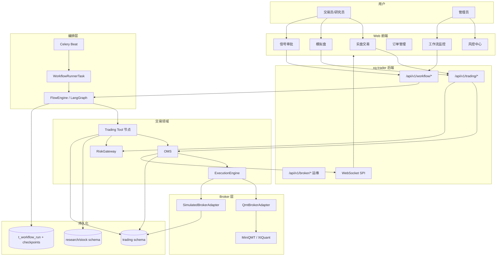

---

## 三、双层持久化模型

业务权威在 `trading` schema；Workflow checkpoint 仅负责编排恢复。

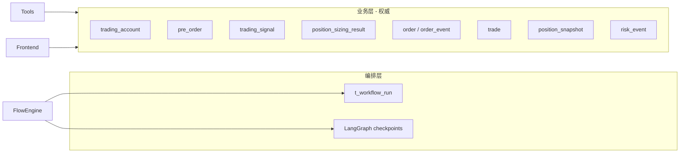

**强制规则**：

1. 每个 Tool 节点执行完毕必须写入 `trading` 表
2. 所有业务实体携带 `workflow_run_id` + `node_id` + `strategy_instance_id`
3. 前端/API 查询订单、信号、持仓只读 `trading` schema
4. `state.variables` 仅作节点间传递摘要，不作业务真相源

---

## 四、策略执行工作流（十步 DAG）

> **职责边界**：步骤 1–5 为**日频决策层**（消费收盘后因子/信号，产出目标权重）；步骤 6–10 为**执行层**（预订单 → 风控 → 审批 → 下单）。盘内分钟级行情**不参与**步骤 1–5 重算，仅服务于步骤 8–10 的执行监控与风控（见第十六章）。

### 4.1 流程总览

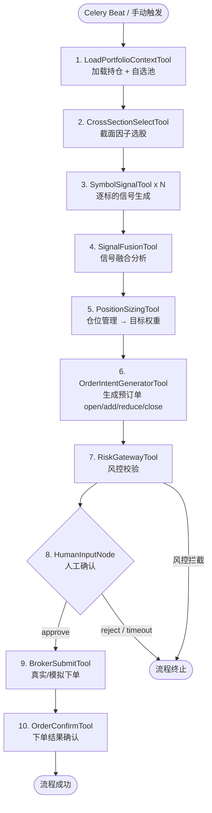

### 4.2 并行分支（步骤 3）

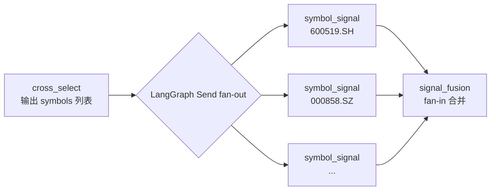

### 4.3 仓位管理（步骤 5 — PositionSizingTool）

原设计在 `OrderIntentGeneratorTool` 中隐含「目标权重」，但未定义权重如何计算。**仓位管理是选股（What）与下单（How much）之间的独立环节**，与 QuantConnect `PortfolioConstructionModel`、vnpy `TargetPosModule`、Barra 组合优化层同级。

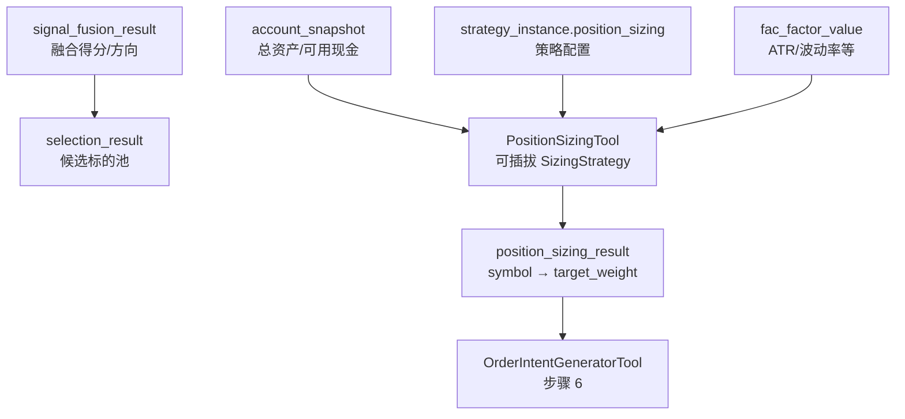

#### 4.3.1 内置仓位管理策略

| 策略 ID | 名称 | 公式/逻辑 | 典型场景 | 业界参考 |
|---------|------|-----------|----------|----------|
| `equal_weight` | 等权 | `w_i = 1/N`（N=入选标的数） | 多因子 Top-N 等权再平衡 | QuantConnect EqualWeighting |
| `signal_weight` | 信号加权 | `w_i ∝ max(score_i, 0)` 归一化 | Alpha 信号强度差异化配仓 | WorldQuant 分层权重 |
| `inverse_volatility` | 逆波动率 | `w_i ∝ 1/σ_i`，σ 为 N 日历史波动率 | 低波动高配，控制组合波动 | Risk Parity 简化版 |
| `volatility_target` | 波动率目标 | 缩放全组合使预测波动 → `target_vol`（默认 15% 年化） | 机构组合波动率约束 | AQR / Barra |
| `atr_risk` | ATR 风险平价 | `w_i = (risk_budget/N) / (ATR_i × price_i × multiplier)` | 趋势/CTA 风格，按真实波动定仓 | Turtle Trading / Van Tharp |
| `kelly_fraction` | 凯利分数 | `f* = (p×b - q)/b`，`w_i = kelly_fraction × f*`（默认 fraction=0.25 半凯利） | 有历史胜率/盈亏比估计时 | Kelly Criterion |
| `fixed_fraction` | 固定比例 | 每标的固定 `fixed_pct`（默认 10%，受 max_position_pct 约束） | 简单规则型策略 | 经典固定分数法 |
| `max_position_cap` | 上限截断 | 任意策略输出后 `w_i = min(w_i, max_position_pct)` | 与 RiskGateway 双重保险 | 券商/私募合规 |

**默认策略**：`equal_weight`；Promote 至 Live 前须在 Paper 实例显式配置 sizing 策略并跑满观察期。

#### 4.3.2 策略配置（`strategy_instance.config.position_sizing`）

```json
{
  "strategy": "atr_risk",
  "params": {
    "atr_period": 14,
    "risk_budget_pct": 0.02,
    "atr_multiplier": 2.0,
    "max_single_weight": 0.10
  },
  "fallback": "equal_weight"
}
```

| 字段 | 说明 |
|------|------|
| `strategy` | SizingStrategy 注册 ID |
| `params` | 策略专有参数（见上表） |
| `fallback` | 主策略缺数据（如无 ATR）时的降级策略；**禁止** silent 默认，必须显式配置 |

#### 4.3.3 数据依赖

| 策略 | 读取来源 | 说明 |
|------|----------|------|
| `equal_weight` / `signal_weight` | `selection_result` + `signal_fusion_result` | 仅依赖 Workflow 上游 |
| `inverse_volatility` / `volatility_target` | `fac_factor_value`（如 `volatility_20d`）或 LoadStage K 线 | 因子库 A 类风险因子 |
| `atr_risk` | `fac_factor_value`（`atr_14`）或 talib ATR | 与 [factor-catalog.md](./factor-catalog.md) 技术因子对齐 |
| `kelly_fraction` | `strategy_instance` 历史统计或 `paper_session` 滚动胜率/盈亏比 | Live 默认用 Paper 期统计，无数据则 fail |

#### 4.3.4 输出契约

写入 `trading.position_sizing_result`：

| 字段 | 类型 | 说明 |
|------|------|------|
| `symbol` | string | 标的 |
| `target_weight` | float | 目标权重 0–1，全组合之和 ≤ 1 |
| `target_qty` | int | 按 account 总资产折算的目标股数（100 股整数倍） |
| `sizing_strategy` | string | 使用的策略 ID |
| `sizing_params` | json | 快照参数（审计用） |
| `raw_score` | float | 策略中间量（如 ATR、Kelly f*） |

四套环境（回测 / 模拟 / 实盘）**共用同一 SizingStrategy 接口**，保证 Promote 后配仓逻辑一致。

### 4.4 预订单语义（步骤 6）

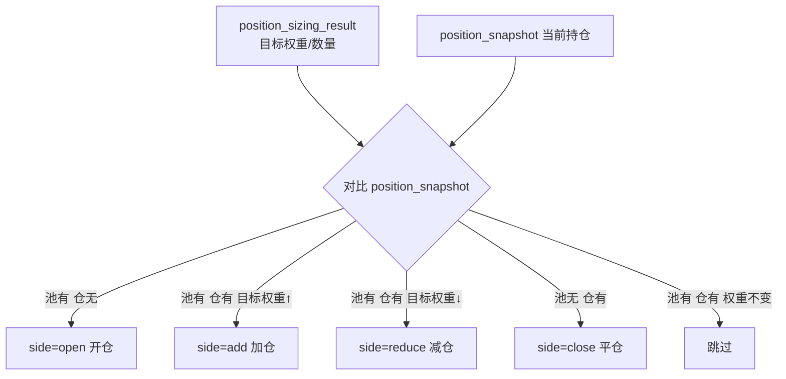

| side | 条件 |
|------|------|
| `open` | 目标池有、持仓无 |
| `add` | 两者都有，目标权重 > 当前 |
| `reduce` | 两者都有，目标权重 < 当前 |
| `close` | 持仓有、目标池无 |

写入 `trading.pre_order` 表，供 HumanInput 表单展示。预订单携带 `target_weight`、`sizing_strategy` 供审批 UI 展示依据。

### 4.5 人工确认时序（步骤 8-10）

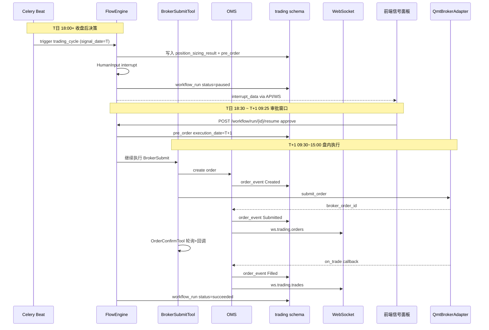

---

## 五、OMS 订单状态机

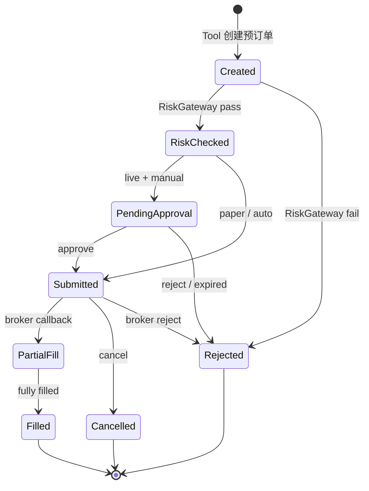

- **幂等键**: `{instance_id}:{signal_id}:{symbol}:{side}`
- **双 ID**: `platform_order_id`（UUID）+ `broker_order_id`（QMT）
- **事件溯源**: 所有变迁写入 `order_event`，投影到 `order` 读模型

---

## 六、Broker 适配层

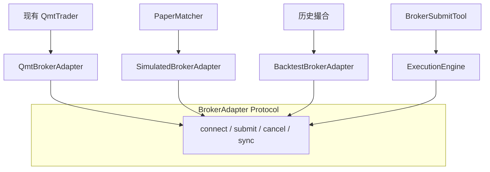

| 实现 | 场景 | 说明 |
|------|------|------|
| `QmtBrokerAdapter` | 实盘 | 包装现有 `QmtTrader`，长连接复用 `QmtConnection` |
| `SimulatedBrokerAdapter` | 模拟盘 | 本地 Tick 撮合，不连 QMT |
| `BacktestBrokerAdapter` | 回测 Phase D | 事件驱动历史撮合 |

现有 `/api/v1/broker/*` 保留为**运维调试**，生产策略走 Workflow Tool 节点。

---

## 七、RiskGateway 规则

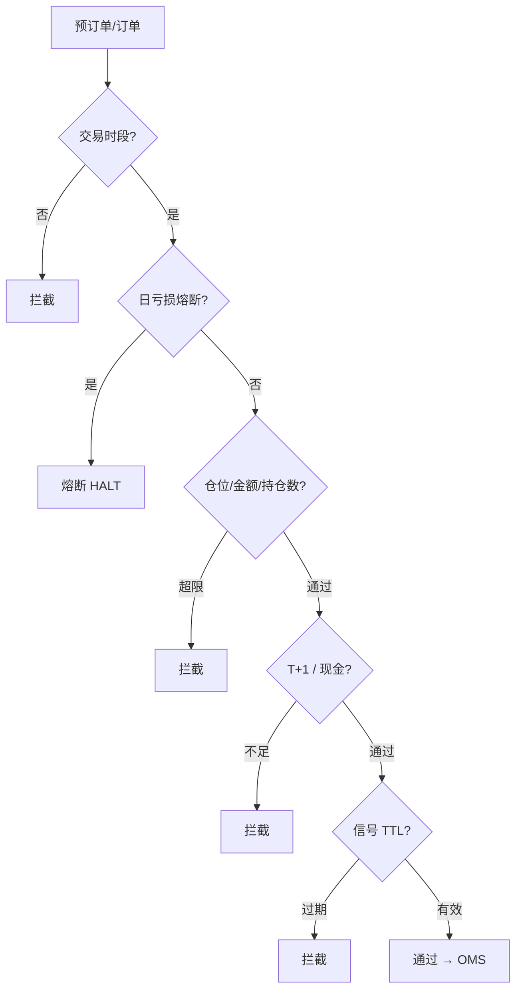

| 规则 | 默认 |
|------|------|
| 日亏损熔断 | today_pnl_pct ≤ -2% → HALT |
| 单笔仓位 | max_position_pct = 10% |
| 持仓数量 | max_positions = 10 |
| 单笔金额 | max_order_amount = 50 万 |
| T+1 卖出 | sell_qty ≤ available_qty |
| 现金充足 | buy_amount ≤ cash |
| 信号 TTL | 5 分钟 |
| 交易时段 | 9:30-11:30, 13:00-15:00 |

规则存 `risk_rule` 表，支持 per-account / per-instance 覆盖。  
任一规则异常 → **fail-closed**，写 `risk_event` 并终止流程。

---

## 八、四套环境 Promotion


| 阶段 | Broker | 撮合 | 审批 |
|------|--------|------|------|
| 回测 | BacktestBrokerAdapter | 历史 bar/tick | 无 |
| 模拟 | SimulatedBrokerAdapter | 实时 Tick 本地 | 可跳过 |
| 实盘 | QmtBrokerAdapter | 券商真实 | 默认 HumanInput |

**同一 `flow/trading_cycle.json`**，通过 `run_mode` 切换 Adapter 与是否经过 HumanInput。

---

## 九、与因子管线衔接

> 因子系统完整设计见 [factor-architecture.md](./factor-architecture.md)。本节定义交易模块**何时消费**因子产出，以及**信号日/执行日**语义。

### 9.1 日频时间轴（A 股默认）

```mermaid
gantt
    title T 交易日 — 决策与执行分离
    dateFormat HH:mm
    axisFormat %H:%M

    section T日收盘后决策
    15:00 收盘           :milestone, m1, 15:00, 0min
    17:00 数据采集+因子计算 :crit, a1, 17:00, 60min
    17:30~18:00 Alpha信号  :crit, a2, after a1, 30min
    18:00~18:30 trading_cycle :active, a3, after a2, 30min
    18:30~次日09:25 人工审批 :a4, after a3, 900min

    section T+1日盘内执行
    09:25 集合竞价前      :milestone, m2, 09:25, 0min
    09:30~15:00 下单+监控  :active, b1, 09:30, 330min
```

| 时刻 | 任务 | 产出 | 消费方 |
|------|------|------|--------|
| **T 15:00** | A 股收盘 | 当日完整 K 线 | — |
| **T 17:00** | `daily_factor_pipeline` 启动 | K 线/指标/资金流采集 | 因子系统 |
| **T 17:00~17:30** | `factor.compute_daily` | `fac_factor_value` | CrossSectionReader |
| **T 17:30~18:00** | `factor.alpha_signal_daily` | `fac_signal_value` | CrossSectionSelect / SymbolSignal |
| **T 18:00~18:30** | `trading_cycle` Workflow | `selection_result` → `position_sizing_result` → `pre_order` | 审批 UI |
| **T 18:30 ~ T+1 09:25** | HumanInput 审批窗口 | 已批准 pre_order | — |
| **T+1 09:30~15:00** | BrokerSubmit + 盘内监控 | `order` / `trade` | Live/Paper UI |

**关键语义**：

- **`signal_date` = T**（因子/信号所用截面日，即最近一个完整交易日）
- **`execution_date` = T+1**（预订单实际下单日；审批通过前不得发单）
- `trading_cycle` 的 Celery 调度为 **`depends_on: alpha_signal_compute`**，不得硬编码早于信号任务完成的时间

### 9.2 决策层 vs 执行层（回答「是否盘内分钟级算因子」）

| 层次 | 频率 | 职责 | 数据来源 | 是否重算因子 |
|------|------|------|----------|-------------|
| **决策层** | 日频（收盘后 1 次） | 选股、信号融合、**仓位管理**、生成预订单 | `fac_factor_value` / `fac_signal_value` | 是（仅此时） |
| **执行层** | 盘内（秒~分钟） | 下单、成交确认、持仓同步、日内风控 | QMT Tick/分钟 K 线、WS 推送 | **否** |

**结论**：

1. **日线因子/信号在 T 日收盘后批量分析**（17:00–18:00），不在盘内重复计算。
2. **实盘盘内使用分钟级（或 Tick）行情**，用途限于：订单撮合反馈、OrderConfirm 轮询、日内熔断/止损监控、PaperMatcher 定价、持仓市值刷新——**不是**重新跑 CrossSectionSelect 或 PositionSizing。
3. 若未来扩展** intraday 策略**，应新增独立 `trading_cycle_intraday` Workflow 与 intraday 因子任务，不与日频管线混用。

### 9.3 管线依赖图

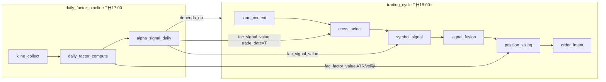

因子管线负责「算什么」；Workflow 负责「怎么选、**配多少仓**、怎么下单」。

---

## 十、领域模型（trading schema）

| 表 | 职责 |
|----|------|
| `trading_account` | 账户（paper/live, broker_type, 费率配置） |
| `strategy_instance` | 策略实例（run_mode, config, workflow 绑定） |
| `paper_session` | 模拟盘会话 |
| `selection_result` | 截面选股结果 |
| `trading_signal` | 逐标的交易信号 |
| `signal_fusion_result` | 融合分析结果 |
| `position_sizing_result` | 仓位管理输出（目标权重/数量/策略快照） |
| `pre_order` | 预订单（open/add/reduce/close, approval_status, target_weight） |
| `order` / `order_event` | 订单及事件溯源 |
| `trade` | 成交记录 |
| `position_snapshot` | 持仓快照 |
| `account_snapshot` | 资金快照 |
| `risk_rule` / `risk_event` | 风控规则与事件 |

公共关联字段：`workflow_run_id`, `strategy_instance_id`, `trade_date`, `signal_date`, `execution_date`, `node_id`

---

## 十一、盘内执行监控（Intraday Monitor）

日频决策完成后，实盘/模拟盘在 **T+1 交易时段** 启动盘内监控服务（非 Workflow 节点，独立轻量任务）：

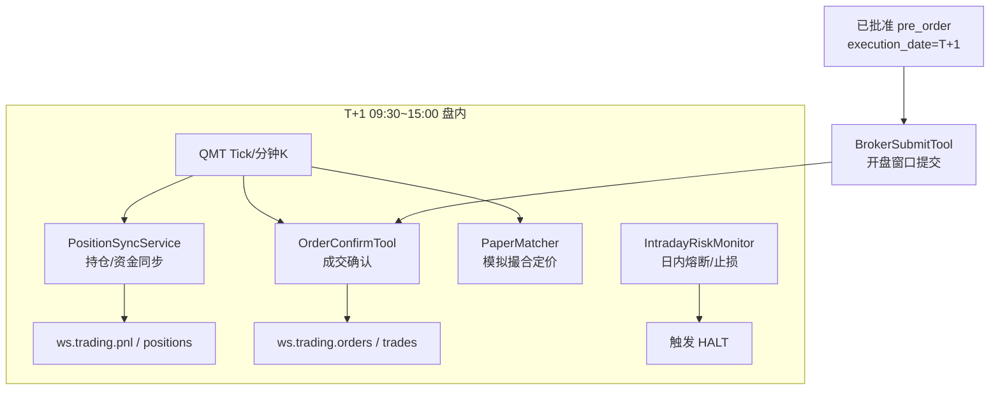

| 组件 | 频率 | 职责 |
|------|------|------|
| `PositionSyncService` | 1~5 分钟 | 从 QMT 同步持仓/资金，更新 `position_snapshot` |
| `OrderConfirmTool` | 事件 + 30s 轮询 | 跟踪 Submitted → Filled，写 `order_event` |
| `IntradayRiskMonitor` | 1 分钟 | 日内亏损、单票暴跌、偏离目标权重告警（**不**重新 sizing） |
| `PaperMatcher` | Tick | 模拟盘撮合；使用与 Live 同源实时行情 |

**分钟 K 线用途**：执行层定价与监控；**不**用于重算 `fac_factor_value` 或 `fac_signal_value`。

---

## 十二、WebSocket Topics

| Topic | 数据 |
|-------|------|
| `ws.broker.status` | 连接状态（已有） |
| `ws.trading.pnl` | 账户资产（已有） |
| `ws.trading.signals` | 待审批信号 |
| `ws.trading.orders` | 订单状态变更 |
| `ws.trading.trades` | 成交流 |
| `ws.trading.positions` | 持仓变更 |
| `ws.trading.workflow` | 工作流 run 状态 |

---

## 十三、目录结构（目标）

```
src/xqtrader/
├── domain/trading/models/       # ORM
├── trading/
│   ├── tools/                   # Workflow Tool 节点（十步）
│   ├── sizing/                  # PositionSizingTool + SizingStrategy 插件
│   │   ├── strategies/          # equal_weight, atr_risk, kelly_fraction...
│   │   └── registry.py
│   ├── oms/
│   ├── risk/
│   ├── execution/
│   ├── paper/
│   ├── monitor/                 # IntradayRiskMonitor, PositionSyncService
│   └── runner/                  # WorkflowRunnerTask
├── broker/adapters/             # QmtBrokerAdapter 等
└── api/v1/trading/

flow/
└── trading_cycle.json           # 策略执行工作流定义
```

---

## 十四、框架缺口与扩展（实施前）

| 缺口 | 方案 |
|------|------|
| Workflow HTTP 同步阻塞 | Celery `WorkflowRunnerTask` 后台执行 |
| HumanInput timeout 未实现 | 补全 timeout + 扫描 paused run |
| 与 Celery 无集成 | Beat 调度 / pipeline depends_on |
| 步骤 9 等待成交 | OrderConfirmTool 轮询 + QMT 回调 |
| flow JSON 未入库 | 纳入版本管理 |
| PositionSizing 未实现 | T4 前实现 SizingStrategy 插件 + `position_sizing_result` 表 |
| 盘内监控未实现 | T2 后实现 PositionSync + IntradayRiskMonitor |
| signal/execution 日期 | Workflow context 显式写入 `signal_date` / `execution_date` |

---

## 十五、业界参考

| 平台 | 借鉴点 |
|------|--------|
| QuantConnect Lean | 同一 Algorithm，环境切换 Brokerage；`PortfolioConstructionModel` 仓位层 |
| VeighNa | Gateway 适配器 + PaperAccount；`TargetPosModule` 目标仓位 |
| FinRL-X | 权重/意图契约，研究-执行一致 |
| 衡泰 xQuant | 策略全生命周期 + 前中后风控 |
| Proof OMS | 事件序列 + OMS 状态机 |
| CASE-AI | 信号 → 人工授权 → 下单（Workflow HumanInput 替代 JSON 审批） |
| Van Tharp / Turtle | ATR 风险定仓、固定风险比例 |
| Kelly / Thorp | 凯利公式；Live 默认半凯利（fraction=0.25） |

---

## 十六、分阶段实施

| 阶段 | 内容 | 验收 |
|------|------|------|
| T1 | trading ORM + QmtBrokerAdapter + OMS | API 下单全生命周期落库 |
| T2 | RiskGateway + HumanInput 审批 + 盘内 PositionSync | approve 后 QMT 真下单；持仓与 broker 同步 |
| T3 | PaperEngine + SimulatedBrokerAdapter | 模拟撮合更新持仓 |
| T4 | trading_cycle Workflow + PositionSizingTool + Celery | 十步全流程 + 仓位结果落库 |
| T5 | BacktestEngine Phase D | 回测页面对接；回测复用 SizingStrategy |
