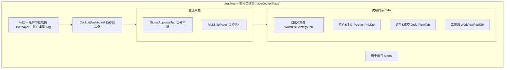
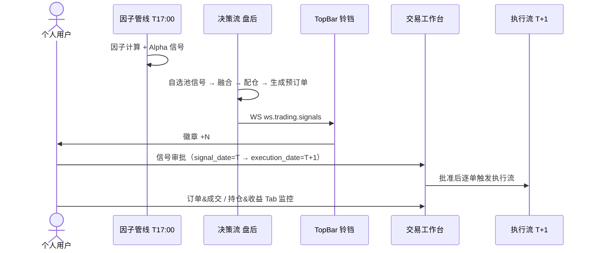
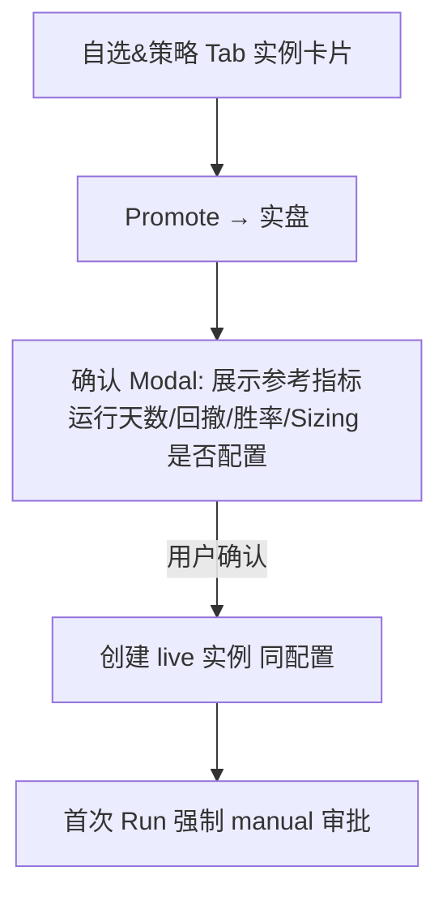

# xq-trader 交易模块前端产品设计（个人版）

> **版本**: v2.0
> **更新**: 2026-06-26（取代旧版，原文档已归档至 `docs/archive/trading-product-20260623/`）
> **关联**: [trading-system-design.md](./trading-system-design.md)（后端架构）、[factor-system-design.md](./factor-system-design.md)（因子系统）
> **定位**: **个人**量化交易终端前端，本文档为前端**权威口径**

---

## 0. 修订说明（据实对齐 + 个人版裁剪）

旧版定义了多个独立交易页面与导航项，与实际前端**严重不符**。实际为**单页交易工作台 + 账户切换 + 内嵌 Tab**。本版据实重写，并据此统一全项目导航口径。

| 维度 | 旧版（设计稿） | v2.0（据实） | 代码现状 |
|------|----------------|--------------|----------|
| 交易入口 | `/trading/live` + `/trading/paper` 双页 | **单页 `/trading`** + 账户下拉切换 live/paper | ✅ `router/index.tsx` 仅 `{path:'trading'}` |
| 独立页 | `/trading/orders`、`/trading/risk`、`/trading/workflow` | **全部内嵌为 Tab / 侧栏**，无独立路由 | ✅ 无对应路由 |
| 导航项 | liveTrading/paperTrading/orders/risk/workflow 等 6~7 项 | **单项 `nav.trading`** | ✅ `navigation.ts` 仅 1 项 |
| 页面结构 | 多页线框 | 工作台 = 仪表盘 + 信号审批/风控双栏 + 4 内嵌 Tab | ✅ `LiveCockpitPage.tsx` |
| 前端 API 类型 | ⏳ `api/trading` 待实现 | ✅ 已实现 | ✅ `web/src/api/trading` |

> 个人版原则：**单工作台、不跳页、账户切换覆盖实盘/模拟**。删除多页拆分（个人无需多页并行操作），保留设计令牌、审批 HITL、组件规范等有效内容。

---

## 一、设计原则

### 1.1 与现有 Web 一致

沿用 `web/src/styles/themes.css` 设计令牌，**不引入新色板**；组件库 Ant Design 5；图标 Lucide React；布局沿用 `AppLayout`（TopBar + SideNav + Workspace + StatusBar + 可选 AgentPanel）。

| 令牌 | 用途 |
|------|------|
| `--accent-primary` | 主操作、Live 标签、链接、running 状态 |
| `--color-rise` | 涨/盈利/买入/open/add（A 股红涨）、熔断 |
| `--color-fall` | 跌/亏损/卖出/reduce/close、succeeded |
| `--color-warning` | 告警、paused、部分成交、偏离超阈值 |
| `--color-live` | 实盘标识 |
| `--bg-card` / `--bg-workspace` / `--border-subtle` | 卡片/工作区/边框 |

### 1.2 决策与执行分层（必读）

| 层次 | 何时 | 用户可见 | 分钟 K 线用途 |
|------|------|----------|---------------|
| **日频决策** | T 日收盘后 | 工作流 Run、预订单审批 | 不用 |
| **盘内执行** | T+1 9:30–15:00 | 委托成交、持仓刷新、日内告警 | 成交监控、PnL 刷新 |

- 因子/Alpha 信号在 T 日收盘后批量计算，**不在盘内重算**。
- 预订单 `signal_date=T`，`execution_date=T+1`；审批界面须同时展示两日期，避免误以为「当晚立即成交」。

---

## 二、信息架构（据实）

### 2.1 单一交易入口

`navigation.ts` 中交易域仅一项：

```
{ id: 'trading', labelKey: 'nav.trading', path: '/trading', icon: Radio }
```

`router/index.tsx` 中交易域仅一条路由：`{ path: 'trading', element: <LiveCockpitPage /> }`。

> **无** `/trading/live`、`/trading/paper`、`/trading/orders`、`/trading/risk`、`/trading/workflow`。实盘/模拟通过**账户下拉**切换；订单/风控/工作流为**内嵌 Tab / 侧栏**。

### 2.2 页面内结构



---

## 三、全局组件

### 3.1 TopBar 信号铃铛（占位，待对接）

- 徽章数：`td_pre_order.approval_status=pending` 计数，WS `ws.trading.signals` 推送。
- 点击条目 → 打开工作台信号审批（见 §4.3）。
- 条目左侧色条：`open/add` → `--color-rise`，`reduce/close` → `--color-fall`。

### 3.2 StatusBar（已有 broker + pnl）

`● QMT 已连接 │ 总资产 │ 当日 +x% │ 风控:正常 │ WF: pending`。新增风控段、Workflow 状态段，点击跳转工作台对应区域。

---

## 四、交易工作台页面 `/trading`（据实）

> 实现：`web/src/pages/trading/LiveCockpitPage.tsx`，标题「交易工作台」。

### 4.1 整体布局

```
┌──────────┬──────────────────────────────────────────────────────────────┐
│ SideNav  │ 交易工作台   [账户 ▼ LIVE/PAPER #id 名称 (broker)] [类型 Tag] │
│          ├──────────────────────────────────────────────────────────────┤
│          │  CockpitDashboard（KPI + 风险状态 + Workflow 状态）            │
│          ├───────────────────────────────┬──────────────────────────────┤
│          │  SignalApprovalTab 信号审批    │  RiskSidePanel 风控侧栏       │
│          ├───────────────────────────────┴──────────────────────────────┤
│          │  [自选&策略] [持仓&收益] [订单&成交] [工作流]   ← 内嵌 Tabs   │
│          │  （Tab 内容区）                                                │
│          └──────────────────────────────────────────────────────────────┘
```

### 4.2 顶部：账户切换 + 仪表盘

| 元素 | 说明 | 数据源 |
|------|------|--------|
| 账户下拉 | `LIVE/PAPER #id 名称 (broker)`，切换即切换全页上下文 | `fetchAccounts` |
| 类型 Tag | `live` 红 / `paper` 蓝 | account.account_type |
| `CockpitDashboard` | KPI 四卡（总资产/可用/市值/当日收益）+ 风险状态 + Workflow 状态 | `account_snapshot` + WS `ws.trading.pnl` |

> 默认选中 paper 账户（无则取第一个）。资产数据经 `tradingStore` 由 WS `ws.trading.pnl` 实时更新。

### 4.3 主区双栏：信号审批 + 风控

| 区域 | 组件 | 职责 |
|------|------|------|
| 信号审批 | `SignalApprovalTab` | 展示当前决策实例待审批预订单，逐条/批量审批；绑定 `activeDecisionInstanceId` |
| 风控侧栏 | `RiskSidePanel` | 风控状态、规则、事件；打开历史信号 |

**预订单审批交互（核心 HITL）**：

| 元素 | 规范 |
|------|------|
| side 标签 | `open/add` 红底；`reduce/close` 绿底（`SIGNAL_SIDE_COLOR`/`SIGNAL_SIDE_LABEL`，见 `pages/trading/utils/trading.ts`） |
| 信号/执行日 | 同时展示 `signal_date` → `execution_date` |
| 配仓依据 | 展示 `sizing_strategy` + `target_weight` + 当前权重 |
| 逐条审批 | `POST /trading/approval/{id}` body `{action: approve/reject, comment}` |
| 批量审批 | `POST /trading/approval/batch` |
| 修改后审批 | `PUT /trading/pre-orders/{id}` → `POST /trading/approval/{id}` |

### 4.4 内嵌 Tabs（4 个）

| Tab key | 组件 | 内容 | 数据源 |
|---------|------|------|--------|
| watchlist 自选&策略 | `WatchlistStrategyTab` | 自选池管理 + 策略实例卡片 + 仓位配置入口 + Promote | watchlist / strategy_instance |
| positions 持仓&收益 | `PositionPnLTab` | 持仓明细（目标 vs 实际权重偏离）+ 收益曲线 + 收益日历 | position_snapshot / account_snapshot |
| orders 订单&成交 | `OrderFlowTab` | 当日委托/成交/历史订单，撤单 | td_order / td_trade |
| workflow 工作流 | `WorkflowRunTab` | 决策/执行流 Run 列表 + 节点进度 + 手动触发 | t_workflow_run |

> 持仓表偏离列：实际 - 目标，超阈值（±1%）`--color-warning` 高亮。订单方向行：买红卖绿左边框（`utils/trading.ts` 的 `SIDE_ROW_CLASS`/`STATUS_COLOR`）。

### 4.5 历史信号 Modal

工作台内 `Modal`（非独立页），表格展示历史 `td_pre_order`（信号日/标的/方向/审批状态/审批人/目标权重/审批时间），由信号审批或风控侧栏触发。

### 4.6 仓位管理配置抽屉

> `PositionSizingConfigDrawer`，从「自选&策略」Tab 打开。

| 策略 | UI 暴露参数 |
|------|-------------|
| 等权 | 无 |
| 信号加权 | 最小权重阈值 |
| ATR 风险 | period / risk_budget_pct / multiplier / max_single_weight |
| 凯利 | kelly_fraction（默认 0.25）/ 统计窗口 |
| 波动率目标 | target_vol / 估计窗口 |
| 固定比例 | fixed_pct |

配置写入 `strategy_instance.config.position_sizing`；含必填 `fallback`（降级策略）。Paper → Live Promote 时整包复制。

---

## 五、关键交互流

### 5.1 日频交易完整流程（用户视角）



### 5.2 Paper → Live Promote（个人版：提示而非强制）



> 验证指标仅作 **warning 提示**，不强制 block，由用户自行判断（个人版裁剪机构级晋升门禁）。

---

## 六、组件规范

### 6.1 KPI 卡

复用 backtest `PerformanceGrid` 栅格思路；盈亏色 `--color-rise`/`--color-fall`。

### 6.2 表格行样式

```css
.order-row--buy  { border-left: 3px solid var(--color-rise); }
.order-row--sell { border-left: 3px solid var(--color-fall); }
```

### 6.3 状态 Tag 映射

| 业务状态 | Ant Tag | 色 |
|----------|---------|-----|
| running | processing | `--accent-primary` |
| paused | warning | `--color-warning` |
| succeeded / filled | success | `--color-fall` |
| failed | error | `--color-rise` |
| pending | gold | `--color-warning` |

### 6.4 空状态

Ant Design `Empty`，文案走 i18n。

---

## 七、响应式与布局

| 断点 | 行为 |
|------|------|
| ≥1280px | KPI 横排；双栏 + 多 Tab |
| 1024–1279px | KPI 2×2；双栏可堆叠 |
| <1024px | 单栏堆叠；SideNav 折叠 |

沿用 `AppLayout`，**不单独做移动端交易终端**（个人桌面使用为主）。

---

## 八、API 对接清单

> 前端 API 类型已实现：`web/src/api/trading/`（`fetchAccounts` / `fetchAccountSnapshot` / `fetchPreOrders` / `fetchAccountDecisionWorkflowInstance` 等）。

| 区域 | API | WS Topic |
|------|-----|----------|
| 仪表盘 KPI | `GET /trading/accounts/{id}/snapshot` | `ws.trading.pnl` |
| 持仓表 | `GET /trading/positions` | `ws.trading.positions` |
| 信号审批 | `GET /trading/pre-orders?status=pending` | `ws.trading.signals` |
| 审批提交 | `POST /trading/approval/{id}` · `approval/batch` | — |
| 订单/成交 | `GET /trading/orders` · `/trading/trades` | `ws.trading.orders` · `trades` |
| 风控 | `GET /trading/risk/rules` · `risk/events` | `ws.trading.risk` |
| 工作流 | `GET /workflow/run/{id}` · `POST /workflow/run` | `ws.trading.workflow` |
| 仓位配置 | `PUT /trading/instances/{id}/position-sizing` | — |

---

## 九、文件结构（据实）

```
web/src/
├── pages/trading/                       # 🔧 交易工作台（单页 + 内嵌组件）
│   ├── LiveCockpitPage.tsx              # ✅ 工作台主页（账户切换 + 双栏 + 4 Tab + 历史 Modal）
│   ├── utils/trading.ts                 # ✅ SIGNAL_SIDE_LABEL/COLOR、STATUS_COLOR 等
│   └── components/
│       ├── CockpitDashboard.tsx         # ✅ 顶部仪表盘
│       ├── AccountKpiCards.tsx          # ✅ KPI 四卡
│       ├── SignalApprovalTab.tsx        # ✅ 信号审批（主区左）
│       ├── RiskSidePanel.tsx            # ✅ 风控侧栏（主区右）
│       ├── WatchlistStrategyTab.tsx     # ✅ 自选&策略 Tab
│       ├── PositionPnLTab.tsx           # ✅ 持仓&收益 Tab
│       ├── OrderFlowTab.tsx             # ✅ 订单&成交 Tab
│       ├── WorkflowRunTab.tsx           # ✅ 工作流 Tab
│       ├── PnlCalendar.tsx              # ✅ 收益日历
│       └── PositionSizingConfigDrawer.tsx  # ✅ 仓位配置抽屉
├── api/trading/                         # ✅ 交易 API 类型（已实现）
├── stores/tradingStore.ts               # ✅ 交易状态（资产/PnL）
└── config/navigation.ts · router/index.tsx  # ✅ 单一 /trading 入口
```

---

## 十、实施状态与待完善

| 状态 | 项 |
|------|-----|
| ✅ 已实现 | 工作台主页、账户切换、信号审批、风控侧栏、4 内嵌 Tab、KPI、收益日历、仓位配置抽屉、交易 API 类型 |
| 🔧 待完善 | TopBar 铃铛对接 `ws.trading.signals`、StatusBar 风控/WF 段、盘内实时数据（依赖后端 §9 盘内监控） |
| ⏳ 依赖后端 | 持仓/订单实时刷新依赖盘内监控服务（见 trading-system-design §9） |

---

*本文档为个人版交易前端权威设计（单页工作台口径）。后端架构见 trading-system-design.md；机构级多页旧版见归档目录。*
