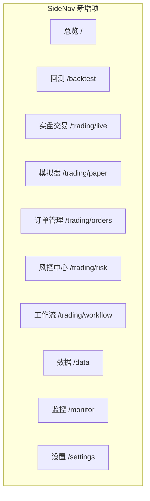
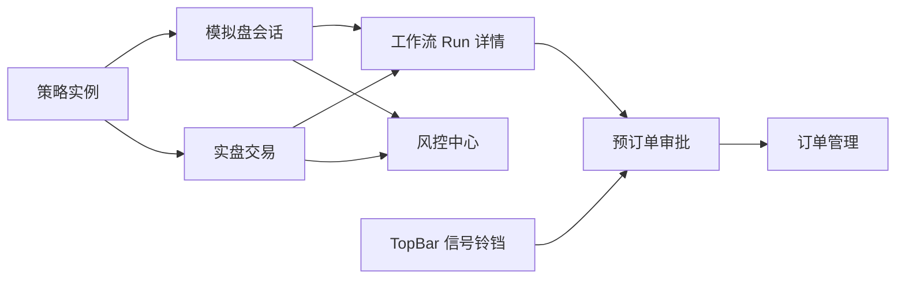
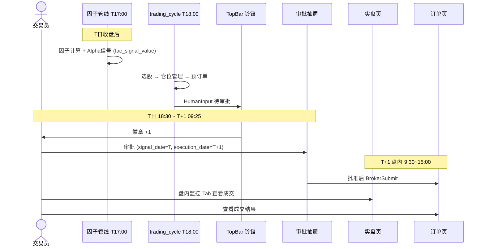
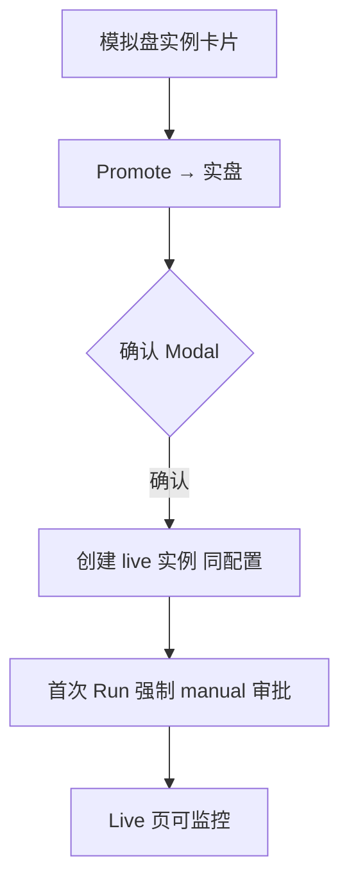
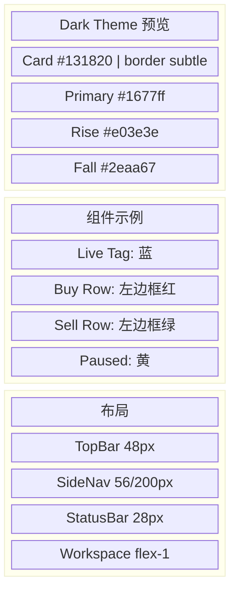

# xq-trader 交易模块前端产品设计

> **版本**: v1.1 | **更新**: 2026-06-09  
> **关联**: [trading-architecture.md](./trading-architecture.md)（后端架构）、[factor-architecture.md](./factor-architecture.md)（因子管线）  
> **状态**: 设计阶段，尚未实施

---

## 一、设计原则

### 1.1 业界参考

| 产品/平台 | UI 模式 | xq-trader 采纳 |
|-----------|---------|----------------|
| **Bloomberg Terminal** | 多面板、状态栏实时推送、快捷键 | StatusBar 连接/资产；TopBar 信号铃铛 |
| **QuantConnect** | 策略实例 + Paper/Live 切换 + 订单流 | 策略实例卡片 + run_mode 标签 |
| **VeighNa Trader** | 左侧导航 + 中央工作区 + 日志/委托面板 | 现有 AppLayout 三段式 |
| **衡泰 xQuant** | 策略生命周期 + 前中后风控仪表盘 | 风控中心独立页 |
| **CASE-AI 量化系统** | sim/real 双视图 + 授权面板 | 实盘/模拟 Tab + 预订单审批抽屉 |
| **QuantConnect PCM** | PortfolioConstruction 仓位层 | 策略实例配置 position_sizing |

### 1.3 决策与执行分层（必读）

| 层次 | 何时 | 用户可见 | 分钟 K 线用途 |
|------|------|----------|---------------|
| **日频决策** | T 日收盘后 17:00–18:30 | 工作流 Run、预订单审批 | **不用** |
| **盘内执行** | T+1 日 9:30–15:00 | 委托成交、持仓刷新、日内告警 | 成交监控、PnL 刷新 |

- 日线因子/Alpha 信号在 **T 日收盘后** 批量计算（见 [factor-architecture.md](./factor-architecture.md)），**不在盘内重算**。
- 实盘页展示的分钟级行情变化用于 **持仓市值、订单状态、日内风控**，不是新的选股/配仓信号。
- 预订单 `signal_date=T`，`execution_date=T+1`；审批抽屉需展示两日期，避免用户误以为「当晚立即成交」。

---

### 1.2 与现有 Web 一致

沿用 [`web/src/styles/themes.css`](../web/src/styles/themes.css) 设计令牌，**不引入新色板**。

| 令牌 | Dark | Light | 用途 |
|------|------|-------|------|
| `--accent-primary` | `#1677ff` | `#1677ff` | 主操作、Live 标签、链接 |
| `--bg-card` | `#131820` | `#ffffff` | 卡片背景 |
| `--bg-workspace` | `#0f1218` | `#f1f5f9` | 工作区背景 |
| `--text-primary` | `#eef2f8` | `#0f172a` | 主文字 |
| `--text-secondary` | `#9aaabe` | `#475569` | 次要文字 |
| `--color-rise` | `#e03e3e` | `#cf1322` | 涨/盈利/买入（A 股） |
| `--color-fall` | `#2eaa67` | `#389e0d` | 跌/亏损/卖出 |
| `--color-warning` | `#faad14` | `#d48806` | 告警、部分成交 |
| `--color-live` | `#1677ff` | `#1677ff` | 实盘标识 |
| `--border-subtle` | `rgba(255,255,255,0.07)` | `rgba(15,23,42,0.08)` | 卡片边框 |

**组件库**: Ant Design 5（与回测页 [`BacktestPage`](../web/src/pages/backtest/BacktestPage.tsx) 一致）  
**图标**: Lucide React（与 SideNav 一致）  
**布局**: 现有 `AppLayout`（TopBar + SideNav + Workspace + StatusBar + 可选 AgentPanel）

---

## 二、信息架构

### 2.1 导航扩展

在 [`navigation.ts`](../web/src/config/navigation.ts) 新增交易域入口：



| 路由 | 页面 | 图标建议 |
|------|------|----------|
| `/trading/live` | 实盘交易 | `Radio` / `Zap` |
| `/trading/paper` | 模拟盘 | `FlaskConical` |
| `/trading/orders` | 订单管理 | `ListOrdered` |
| `/trading/risk` | 风控中心 | `Shield` |
| `/trading/workflow` | 工作流监控 | `GitBranch` |
| `/trading/instances` | 策略实例 | `Cpu`（可合入 paper 子 Tab） |

i18n 键已存在于 [`zh-CN.json`](../web/src/i18n/locales/zh-CN.json)（`nav.liveTrading`, `nav.paperTrading` 等）。

### 2.2 页面关系



---

## 三、全局组件

### 3.1 TopBar 信号铃铛（已有占位，需对接 Workflow）

```
┌─────────────────────────────────────────────────────────────────┐
│ [≡] XQ Trader  [🔍 全局搜索]          [📓] [🌙] [🌐] [🔔 3] [Agent] │
└─────────────────────────────────────────────────────────────────┘
                                              │
                                              ▼ Popover
                              ┌───────────────────────────────┐
                              │ 待审批预订单 (3)    [查看全部 →] │
                              ├───────────────────────────────┤
                              │ ● 600519.SH  开仓  +10%  2分钟前 │
                              │ ● 000858.SZ  减仓  -5%   5分钟前 │
                              │ ● 601318.SH  平仓       1分钟前 │
                              ├───────────────────────────────┤
                              │        [批量审批 →]            │
                              └───────────────────────────────┘
```

- 徽章数：`pre_order.status=pending_approval` 计数，WS `ws.trading.signals` 推送
- 点击条目 → 打开「预订单审批抽屉」（见 5.2）
- 配色：条目左侧色条，`open/add` 用 `--color-rise`，`reduce/close` 用 `--color-fall`

### 3.2 StatusBar 扩展（已有 broker + pnl）

```
┌──────────────────────────────────────────────────────────────────────────┐
│ ● QMT 已连接 │ 总资产 ¥1,234,567 │ 当日 +1.2% │ Workflow: paused @审批 │
└──────────────────────────────────────────────────────────────────────────┘
```

- 新增 Workflow 状态段：running / paused / succeeded / failed
- 颜色：running=`--accent-primary`，paused=`--color-warning`，failed=`--color-rise`

---

## 四、页面线框

### 4.1 实盘交易 `/trading/live`

**参考**: CASE-AI real 视图 + Bloomberg 账户面板

```
┌──────────┬──────────────────────────────────────────────────────────────┐
│ SideNav  │  实盘交易                    [账户 ▼ 实盘-001] [● Live]        │
│          ├──────────────────────────────────────────────────────────────┤
│          │ ┌─────────┐ ┌─────────┐ ┌─────────┐ ┌─────────┐              │
│          │ │总资产    │ │可用资金  │ │持仓市值  │ │当日收益  │  ← 4 卡 KPI │
│          │ │¥1.23M   │ │¥456K    │ │¥778K    │ │+1.2% ↑  │              │
│          │ └─────────┘ └─────────┘ └─────────┘ └─────────┘              │
│          ├───────────────────────────────┬──────────────────────────────┤
│          │  持仓收益明细 (Table)          │  收益日历 (Heatmap)           │
│          │  代码 名称 权重 成本 现价 盈亏   │  ■ ■ □ ■ ...                │
│          ├───────────────────────────────┴──────────────────────────────┤
│          │  [委托成交] [工作流 Run] [信号面板] [盘内监控]    ← Tabs       │
│          │  ┌─────────────────────────────────────────────────────┐  │
│          │  │ 时间  代码  方向  数量  价格  状态  策略              │  │
│          │  │ ...                                                  │  │
│          │  └─────────────────────────────────────────────────────┘  │
└──────────┴──────────────────────────────────────────────────────────────┘
```

| 区域 | 组件 | 数据源 |
|------|------|--------|
| KPI 四卡 | Ant Design `Statistic` + `Card` | `account_snapshot` / WS pnl |
| 持仓表 | `Table`，涨红跌绿 | `position_snapshot` |
| 收益日历 | 日历热力图（参考 backtest EquityCurve 色系） | `account_snapshot` 按日 |
| 委托成交 Tab | `Table` + 状态 Tag | `order` / `trade` |
| 工作流 Run Tab | Run 列表 + 节点进度 Step | `t_workflow_run` |
| 信号面板 Tab | 待审批列表 + 操作按钮 | `pre_order` |
| 盘内监控 Tab | 当日执行进度、偏离目标权重告警、QMT 连接 | `order` + WS pnl/positions |

**盘内监控 Tab**（T+1 9:30–15:00 活跃）：展示已批准预订单的执行状态、部分成交进度、相对 `position_sizing_result` 的权重偏离；**不**展示新因子信号。

**Live 标签**: `Tag` color=`--color-live`，与 paper 的 `Tag` default 区分。

### 4.2 模拟盘 `/trading/paper`

**参考**: QuantConnect Paper Trading + vnpy PaperAccount

```
┌──────────┬──────────────────────────────────────────────────────────────┐
│ SideNav  │  模拟盘                                                      │
│          ├──────────────────────────────────────────────────────────────┤
│          │  [策略实例] [会话列表] [收益分析]                    ← Tabs     │
│          ├──────────────────────────────────────────────────────────────┤
│          │  ┌─ 策略实例卡片 ─────────────────────────────────────────┐  │
│          │  │ Alpha-Rebalance-01    [模拟盘] [运行中]               │  │
│          │  │ 账户: paper-001  │  配仓: ATR风险  │  [停止]         │  │
│          │  │ 累计收益 +8.3%  │  最大回撤 -2.1%                      │  │
│          │  │ [查看 Run 详情]  [Promote → 实盘]                     │  │
│          │  └──────────────────────────────────────────────────────┘  │
│          │  ┌─ 会话卡片 ───────────────────────────────────────────┐  │
│          │  │ session-20260609  │  循环 12 次  │  [查看]             │  │
│          │  └──────────────────────────────────────────────────────┘  │
│          │  [+ 新建实例]  [+ 新建会话]                                 │
│          └──────────────────────────────────────────────────────────────┘
```

- 卡片背景：`--bg-card`，边框：`--border-subtle`，hover：`--bg-hover`
- Promote 按钮：二次确认 Modal，引用 `paper_to_live` 流程
- 实例卡片展示 `position_sizing.strategy`（如 ATR风险 / 等权 / 凯利半仓）

### 4.2.1 仓位管理配置（策略实例）

**参考**: QuantConnect Portfolio Construction + vnpy 目标仓位模块

```
┌─ 策略实例 — 仓位管理 ────────────────────────────────────────┐
│  配仓策略:  [ATR 风险定仓 ▼]                                  │
│  ATR 周期:  [14]   风险预算: [2%]   单票上限: [10%]           │
│  降级策略:  [等权 ▼]  （主策略缺数据时使用，必填）              │
│  [保存]                                                       │
└──────────────────────────────────────────────────────────────┘
```

| 策略 | UI 暴露参数 |
|------|-------------|
| 等权 | 无 |
| 信号加权 | 最小权重阈值 |
| ATR 风险 | period / risk_budget_pct / multiplier / max_single_weight |
| 凯利 | kelly_fraction（默认 0.25）/ 统计窗口 |
| 波动率目标 | target_vol / 估计窗口 |
| 固定比例 | fixed_pct |

配置写入 `strategy_instance.config.position_sizing`，Paper 与 Live Promote 时 **整包复制**。

### 4.3 预订单审批抽屉（核心 HITL）

**参考**: CASE-AI 授权面板 + 衡泰审批流

```
                    ┌─ 预订单审批 ───────────────── × ─┐
                    │ Workflow: run-abc  │  剩余 4:32   │
                    │ 信号日 T: 2026-06-09  →  执行日 T+1: 2026-06-10 │
                    ├──────────────────────────────────┤
                    │ ☑ 全选                           │
                    │ ┌──────────────────────────────┐ │
                    │ │☑ 600519.SH 贵州茅台  [开仓]  │ │
                    │ │  建议 100股 @ ¥1680  限价     │ │
                    │ │  目标权重 12%  当前 0%         │ │
                    │ │  配仓: ATR风险(14)  可用现金 ¥500K │ │
                    │ │  依据: Alpha信号 Top1         │ │
                    │ └──────────────────────────────┘ │
                    │ ┌──────────────────────────────┐ │
                    │ │☑ 000858.SZ 五粮液   [减仓]    │ │
                    │ │  建议 200股 @ 市价            │ │
                    │ └──────────────────────────────┘ │
                    │ 备注: [________________]          │
                    ├──────────────────────────────────┤
                    │  [拒绝]              [确认下单 →] │
                    └──────────────────────────────────┘
```

| 元素 | 规范 |
|------|------|
| side 标签 | open/add → Tag 红底；reduce/close → Tag 绿底 |
| 倒计时 | TTL 剩余秒数，`≤60s` 时文字变 `--color-warning` |
| 信号/执行日 | 醒目展示 `signal_date` → `execution_date` |
| 配仓依据 | 展示 `sizing_strategy` + `target_weight` |
| 确认下单 | `Button type="primary"` 色 `--accent-primary` |
| 拒绝 | `Button danger` |
| 提交 | `POST /workflow/run/{run_id}/resume` |

### 4.4 订单管理 `/trading/orders`

**参考**: 券商交易终端委托查询

```
┌──────────┬──────────────────────────────────────────────────────────────┐
│          │  订单管理                                                    │
│          │  [当日委托] [当日成交] [历史订单]              ← Tabs         │
│          │  筛选: [账户▼] [状态▼] [日期范围]  [刷新]                    │
│          ├──────────────────────────────────────────────────────────────┤
│          │  Table                                                       │
│          │  委托号  代码  方向  数量  成交价  状态  时间  策略  [撤单]   │
│          └──────────────────────────────────────────────────────────────┘
```

- 方向列：使用 [`SIDE_ROW_CLASS`](../web/src/utils/trading.ts) 红买绿卖行样式
- 状态 Tag：复用 [`STATUS_COLOR`](../web/src/utils/trading.ts) 映射
- 撤单：仅 `submitted/partial_filled` 可撤，调 `/trading/orders/{id}/cancel`

### 4.5 风控中心 `/trading/risk`

**参考**: 衡泰 xQuant 前中后一体化风控

```
┌──────────┬──────────────────────────────────────────────────────────────┐
│          │  风控中心                                                    │
│          ├──────────────────────────────────────────────────────────────┤
│          │ ┌─ 熔断器 ──────┐ ┌ KPI ──────────────────────────────────┐ │
│          │ │ ⚠ 已触发       │ │ 今日拦截 3 │ 告警 1 │ 活跃规则 12     │ │
│          │ │ 日亏损 -2.3%   │ └─────────────────────────────────────┘ │
│          │ │ [解除熔断]     │                                         │
│          │ └───────────────┘                                         │
│          │  [规则配置] [事件日志]                           ← Tabs     │
│          │  Table: 规则代码  名称  级别  启用  参数  [编辑]            │
│          └──────────────────────────────────────────────────────────────┘
```

- 熔断触发：卡片边框 `--color-rise`，背景 `color-mix(--color-rise 8%)`
- 级别 Tag：info=default, warn=warning, critical/fatal=error

### 4.6 工作流监控 `/trading/workflow`

**参考**: Dify 工作流运行详情

```
┌──────────┬──────────────────────────────────────────────────────────────┐
│          │  工作流监控                     [+ 手动触发 trading_cycle]   │
│          ├──────────────────────────────────────────────────────────────┤
│          │  Run 列表                                                    │
│          │  run_id  flow  状态  当前节点  开始时间  耗时  [详情]        │
│          ├──────────────────────────────────────────────────────────────┤
│          │  Run 详情: run-abc                                           │
│          │  Steps: ● load → ● select → ● signal → ● fusion → ● sizing → ○ intent → ... │
│          │  ┌─ 节点输出 ──────────────────────────────────────────┐   │
│          │  │ cross_select: { symbols: [600519.SH, ...] }          │   │
│          │  └──────────────────────────────────────────────────────┘   │
│          │  [恢复] [停止]  ← paused 时显示恢复                        │
│          └──────────────────────────────────────────────────────────────┘
```

- Steps 组件：Ant Design `Steps`，当前节点 `--accent-primary`，失败 `--color-rise`
- 节点输出：JSON 折叠面板，完整数据链接到 trading 表记录

---

## 五、关键交互流

### 5.1 日频交易完整流程（用户视角）



### 5.2 Paper → Live Promote



---

## 六、组件规范

### 6.1 卡片 KPI 四格

复用 backtest [`PerformanceGrid`](../web/src/pages/backtest/components/PerformanceGrid.tsx) 栅格思路：

```css
.trading-kpi-card {
  background: var(--bg-card);
  border: 1px solid var(--border-subtle);
  border-radius: 8px;
  padding: 16px;
}
.trading-kpi-card__value--profit { color: var(--color-profit); }
.trading-kpi-card__value--loss   { color: var(--color-loss); }
```

### 6.2 表格行样式

```css
.order-row--buy  { border-left: 3px solid var(--color-rise); }
.order-row--sell { border-left: 3px solid var(--color-fall); }
```

### 6.3 状态 Tag 映射

| 业务状态 | Ant Design Tag | 色 |
|----------|----------------|-----|
| 运行中 running | processing | `--accent-primary` |
| 暂停 paused | warning | `--color-warning` |
| 成功 succeeded | success | `--color-fall` |
| 失败 failed | error | `--color-rise` |
| 待审批 pending | gold | `--color-warning` |
| 已成交 filled | success | `--color-fall` |

### 6.4 空状态

使用 Ant Design `Empty`，文案走 i18n（如 `trading.paper.noSessions`）。

---

## 七、响应式与布局

| 断点 | 行为 |
|------|------|
| ≥1280px | KPI 四卡横排；持仓表 + 日历双栏 |
| 1024-1279px | KPI 2×2；日历下移 |
| <1024px | 单栏堆叠；SideNav 折叠（现有行为） |

与 [`AppLayout`](../web/src/layouts/AppLayout.tsx) 一致，不单独做移动端交易终端。

---

## 八、API 对接清单

| 页面 | API | WS Topic |
|------|-----|----------|
| 实盘 KPI | `GET /trading/accounts/{id}/snapshot` | `ws.trading.pnl` |
| 持仓表 | `GET /trading/positions` | `ws.trading.positions` |
| 预订单审批 | `GET /trading/pre-orders?status=pending` | `ws.trading.signals` |
| 审批提交 | `POST /workflow/run/{id}/resume` | — |
| 订单列表 | `GET /trading/orders` | `ws.trading.orders` |
| 成交列表 | `GET /trading/trades` | `ws.trading.trades` |
| 风控规则 | `GET /trading/risk/rules` | — |
| 工作流 Run | `GET /workflow/run/{id}` | `ws.trading.workflow` |
| 仓位管理结果 | `GET /trading/position-sizing?run_id=` | — |
| 策略配仓配置 | `PUT /trading/instances/{id}/position-sizing` | — |
| 手动触发 | `POST /workflow/run` | — |

---

## 九、文件结构（前端目标）

```
web/src/
├── pages/trading/
│   ├── LiveTradingPage.tsx
│   ├── PaperTradingPage.tsx
│   ├── OrdersPage.tsx
│   ├── RiskPage.tsx
│   ├── WorkflowMonitorPage.tsx
│   └── components/
│       ├── AccountKpiCards.tsx
│       ├── PositionTable.tsx
│       ├── PnlCalendar.tsx
│       ├── PreOrderApprovalDrawer.tsx
│       ├── StrategyInstanceCard.tsx
│       ├── PositionSizingForm.tsx
│       ├── WorkflowRunSteps.tsx
│       └── OrderFlowTable.tsx
├── api/trading/
│   └── index.ts
├── styles/trading.css          # 交易页专用，引用 themes.css 变量
└── config/navigation.ts        # 扩展 NAV_ITEMS
```

---

## 十、实施优先级

| 优先级 | 页面/组件 | 依赖后端 |
|--------|-----------|----------|
| P0 | PreOrderApprovalDrawer + TopBar 铃铛 | T2 Workflow + pre_order |
| P0 | LiveTradingPage KPI + 持仓 | T1 account_snapshot |
| P1 | OrdersPage | T1 OMS |
| P1 | WorkflowMonitorPage | T4 WorkflowRunner |
| P1 | PositionSizingForm（实例配置） | T4 PositionSizingTool |
| P2 | PaperTradingPage 实例/会话 | T3 PaperEngine |
| P2 | RiskPage | T2 RiskGateway |
| P3 | PnlCalendar 热力图 | T1 历史 snapshot |

---

## 十一、视觉参考板



配色以 [`themes.css`](../web/src/styles/themes.css) 为唯一来源；图表（收益曲线、日历）复用 backtest 页 ECharts 主题，series 色使用 `--color-rise` / `--color-fall` / `--accent-primary`。
