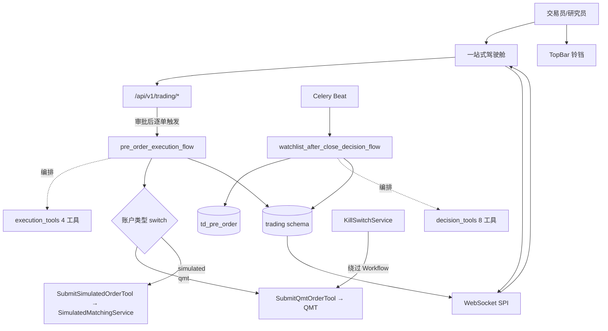
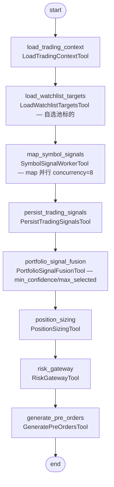
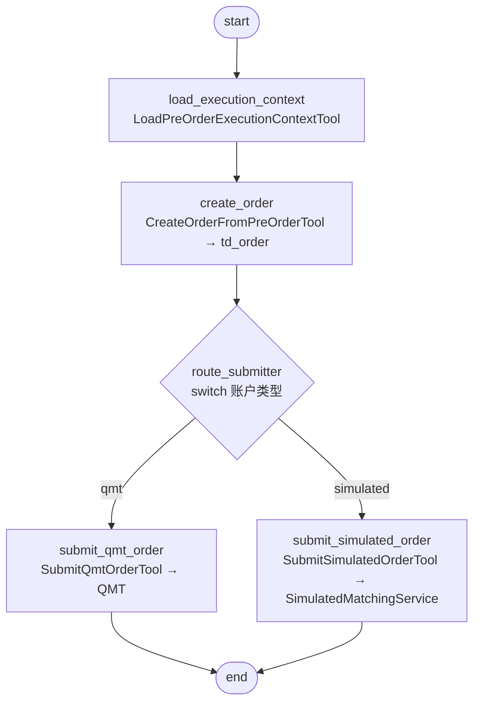
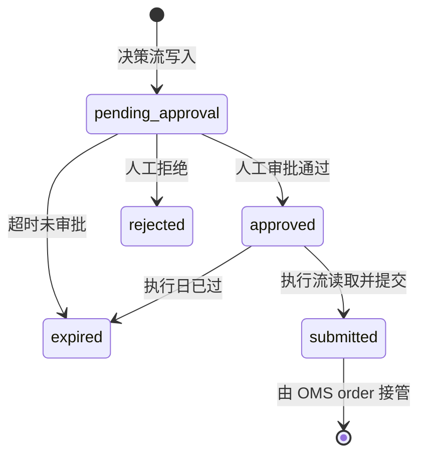
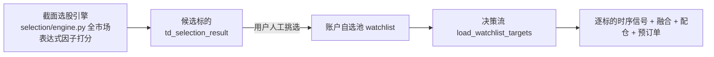
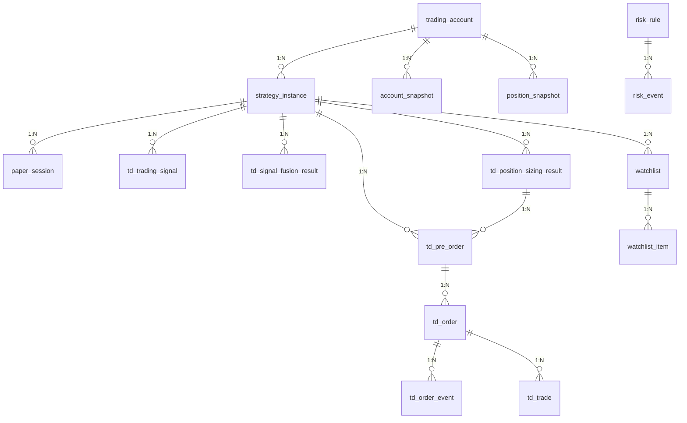
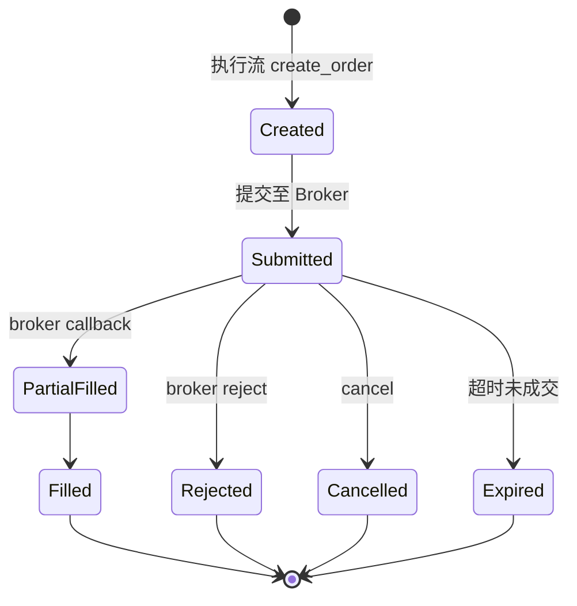

# xq-trader 交易系统 — 架构与设计（个人版）

> **版本**: v2.1
> **更新**: 2026-06-27（v2.1 据实修订 §4.2/§6/§7.1/§8/§12/§14 + 新增 §17~§22 平台章程与机构方法论模块设计；v2.0 取代旧版，原文档已归档至 `docs/archive/trading-system-20260623/`）
> **定位**: A 股**个人**量化交易终端（参考业界机构方法论，详见 [§17 平台目标章程](#十七平台目标章程)）
> **前置**: [factor-architecture.md](./factor-architecture.md)（因子管线）
> **前端**: 页面交互详见 [trading-product-design.md](./trading-product-design.md)

---

## 0. 修订说明（据实对齐 + 个人版裁剪）

旧版（v1，2026-06-23）大量章节与实际代码**严重不符**：决策/执行流的流名、节点、工具名均为设计稿，目录结构整段标「待实现」但代码已落地。本版**据实重写**并按个人场景裁剪。

| 维度 | 旧版（设计稿） | v2.0（据实 + 个人版） | 代码现状 |
|------|----------------|------------------------|----------|
| 决策流 | `trading_decision`，含 `CrossSectionSelectTool` 截面选股 | **`watchlist_after_close_decision_flow`**，**自选池驱动**（无截面选股节点），`map` 并行算信号 | ✅ 已实现 |
| 执行流 | `trading_execution`，批量读 approved + PreTradeRiskCheck + OrderConfirm | **`pre_order_execution_flow`**，**单 pre_order 驱动** + `switch` 账户分支（qmt/simulated） | ✅ 已实现 |
| 工具命名 | LoadPortfolioContextTool / OrderIntentGeneratorTool... | 实际类名见 §3（LoadTradingContextTool / GeneratePreOrdersTool...） | ✅ 已实现 |
| 表名 | `selection_result` / `order`... | **`td_` 前缀**：`td_selection_result` / `td_*` | ✅ 已实现 |
| 后端组织 | `services/oms/risk/execution/paper/monitor` 各独立目录（全标⏳） | 集中在 **`domain/trading/workflow/`** 包 | ✅ 已实现 |
| Kill Switch / 模拟撮合 / 交易 API | ⏳ 待实现 | ✅ 已实现（`KillSwitchService` / `SimulatedMatchingService` / `api/v1/trading`） | ✅ 已实现 |
| 盘内监控（事中风控/对账/持仓同步/订单确认） | 设计为常驻服务 | **未实现**；个人版按优先级分期，事后对账简化为日终一次核对 | ⏳ 未实现 |
| Promote 验证清单 | 强制 block（30天/胜率等） | 改为**提示性 warning**，个人自行判断 | — |

> 个人版原则：保留「两流分离 + pre_order 交接 + 人工审批 + Kill Switch」核心（对个人有真实价值），裁剪机构级的事后合规对账强制化、晋升强制门禁。

---

## 一、设计目标

| 目标 | 说明 |
|------|------|
| 生产级落库 | 数据、状态、结果全落 `trading` schema（`td_` 前缀），禁止 JSON 文件契约 |
| 四套环境统一 | 研究 / 回测 / 模拟 / 实盘共享同一策略语义与执行链路 |
| 两流分离 | 日频决策流与盘内执行流独立，`td_pre_order` 表为交接契约 |
| 风控常驻 | 事前风控 + 前端三层可见性（StatusBar + 驾驶舱风险卡 + 风控 Tab） |
| 一站式驾驶舱 | 核心操作不跳页，6 Tab 覆盖完整链路 |
| 仓位管理显式化 | 选股/信号与仓位 sizing 分离，可插拔策略 |
| 人机协同默认 | 实盘默认人工审批，全自动需显式开启 |
| Kill Switch | 紧急全平能力，绕过 Workflow 直连 Broker |

---

## 二、系统上下文



> 编排引擎为 **FlowEngine**（自研，参考 Dify 封装 LangGraph），flow 定义见 `flow/*.json`。

---

## 三、两流分离架构

决策流与执行流独立运行，以 `td_pre_order` 表为交接契约。

### 3.1 决策流：`watchlist_after_close_decision_flow`（自选池驱动）

> **flow 定义**: `flow/watchlist_after_close_decision_flow.json`
> **服务**: `workflow/service.py::WatchlistDecisionWorkflowService`
> **触发**: Celery Beat T 日盘后（依赖 `alpha_signal_compute`）或手动
> **输入**: `instance_id, signal_date, execution_date, lookback_days, min_confidence, max_selected`



| 节点 | 工具类（`workflow.tools.decision_tools`）| 职责 / 落库 |
|------|------|------|
| load_trading_context | `LoadTradingContextTool` | 加载实例/账户/持仓/资金上下文 |
| load_watchlist_targets | `LoadWatchlistTargetsTool` | 从**自选池**加载候选标的（非全市场截面选股） |
| map_symbol_signals | `SymbolSignalWorkerTool` | `map` 节点并行（concurrency=8）逐标的算信号 |
| persist_trading_signals | `PersistTradingSignalsTool` | 落 `td_trading_signal` |
| portfolio_signal_fusion | `PortfolioSignalFusionTool` | 融合 + 按 `min_confidence/max_selected` 筛选，落 `td_signal_fusion_result` |
| position_sizing | `PositionSizingTool` | 配仓 → 目标权重/数量，落 `td_position_sizing_result` |
| risk_gateway | `RiskGatewayTool` | 事前风控预检，标记 `risk_check_passed` |
| generate_pre_orders | `GeneratePreOrdersTool` | 落 `td_pre_order`（status=pending_approval） |

> 与旧版关键差异：**没有 `CrossSectionSelectTool` 截面选股节点**——个人版以**自选池**为投资域，标的来自用户维护的 watchlist。`td_selection_result` 表保留（供独立的截面选股引擎 `selection/engine.py` 使用），但本决策流不写它。

### 3.2 执行流：`pre_order_execution_flow`（单预订单 + 账户分支）

> **flow 定义**: `flow/pre_order_execution_flow.json`
> **服务**: `workflow/execution_service.py::PreOrderExecutionWorkflowService`
> **触发**: 审批通过后**逐个 pre_order** 触发（输入 `pre_order_id, operator`）



> 与旧版关键差异：执行流**按单个 pre_order 驱动**（非批量读 approved），通过 `switch` 节点按 `submitter`（qmt/simulated）分支，复用同一执行流覆盖实盘/模拟。盘前风控终检由 `TradingValidator` 在工具内完成，无独立 PreTradeRiskCheck 节点。

### 3.3 交接契约：`td_pre_order`

决策流产出 `pending_approval` 预订单 → 人工审批 API → `approved` → 执行流逐单提交。



### 3.4 审批机制（即时 API，独立于工作流）

| 操作 | API |
|------|-----|
| 逐条审批 | `POST /trading/approval/{pre_order_id}` body: `{action: approve/reject, comment}` |
| 批量审批 | `POST /trading/approval/batch` |
| 修改后审批 | `PUT /trading/pre-orders/{id}` → `POST /trading/approval/{id}` |
| 查询待审批 | `GET /trading/pre-orders?status=pending_approval` |

审批结果写入 `td_pre_order.approval_status/approved_by/approved_at/approval_comment`。

### 3.5 日频时间轴

```
T 日 15:00 收盘 → 17:00 数据采集+因子计算 → 17:30 Alpha 信号
    → 盘后 决策流 → td_pre_order(pending_approval)
    → 盘后~次日盘前 人工审批
T+1 09:25+ 逐单触发执行流 → 下单 → (盘内监控，见 §9)
```

### 3.6 投资域来源：截面选股 ↔ 自选池（HITL 选股）

决策流的 universe 来自账户**自选池**（`watchlist`），而非全市场截面选股。两者通过**人工选股**桥接：



- **设计取向**：截面选股（低频选篮子）与自选池时序信号（日频择时）**松耦合高内聚**，可在 FlowEngine 重组。"截面选股 → 自动入池 → 自动调仓"的全自动形态可通过**新编排一条 flow** 实现，**现阶段刻意不做**——个人不愿频繁调仓（换手成本/税费/精力）。
- **必须明确的代价（HITL 选股固有）**：回测验证的是「截面选股组合」的统计表现；实盘跑的是「人工从截面结果挑的子集 + 时序择时」。**人工挑选注入了主观 alpha/bias，因此回测净值不能直接为实盘最终结果背书**。个人可接受，但不能把回测曲线当作实盘预期。

### 3.7 调仓频率原则（后期做自动调仓时遵循）

若未来编排自动调仓 flow，**应低频再平衡，不应每交易日全量调仓**：

| 论据 | 说明 |
|------|------|
| alpha 衰减半衰期 | 多因子截面（价值/质量/低波/成长）IC 半衰期以周~月计，日度调仓只在噪声里摩擦 |
| 换手成本（决定性） | A 股单次调仓双边约 0.3%~0.6%；日度年换手数十倍吞掉 alpha，月度 ≤12 倍可控 |
| 税费确定性 | 卖出印花税单边，频繁卖出=确定性亏损 |
| 个人容量/精力 | 小资金无算法拆单，频繁调仓冲击成本与盯盘精力不划算 |

**推荐：两层调仓体系 + 三机制**

- **底层/低频（截面再平衡）**：月度/双周重选篮子 + 重置目标权重 —— 由截面选股承担
- **上层/日频（择时与风控）**：已持仓标的的止损/减仓/加仓微调 —— 由当前 `watchlist + timing 策略 + 决策流` 承担
- **三机制**：① **阈值带（no-trade band）**：偏离目标权重超阈值（如 ±3%）才调；② **最小持有期**：单票 N 日防抖动翻动；③ **事件驱动例外**：再平衡可低频，但停牌/退市风险/暴雷/止损/熔断须日度~盘中事件驱动

| 策略类型 | 建议常规调仓频率 |
|----------|------------------|
| 多因子截面（价值/质量/低波） | 月度 / 季度 |
| 动量/趋势截面 | 双周 / 月度 |
| 量价反转、事件驱动 | 周度 |
| 风控/止损层 | 日度~盘中（事件驱动，不计入常规换手） |

> AI/LLM 在决策流中的应用边界与旁路设计，见 [ai-in-trading-design.md](./ai-in-trading-design.md)。

---

## 四、领域模型（`trading` schema，`td_` 前缀）

### 4.1 ER 关系（核心）



### 4.2 表清单（已实现）

> **据实说明（2026-06-27 修订）**：旧版部分表名漏 `td_` 前缀（如 `trading_account` / `risk_rule`），实际代码全部统一用 `td_` 前缀。

| 表（ORM 类） | 表名 | 说明 |
|------|------|------|
| `TradingAccount` / `AccountSnapshot` | td_account / td_account_snapshot | 账户 + 资金快照 |
| `StrategyInstance` / `PaperSession` | td_strategy_instance / td_paper_session | 策略实例 + 模拟盘会话 |
| `Watchlist` / `WatchlistItem` | td_watchlist / td_watchlist_item | 自选池（决策流标的来源） |
| `SelectionResult` | td_selection_result | 截面选股结果（选股引擎用，watchlist 决策流不写） |
| `TradingSignal` | td_trading_signal | 逐标的信号 |
| `SignalFusionResult` | td_signal_fusion_result | 信号融合结果 |
| `PositionSizingResult` | td_position_sizing_result | 仓位管理输出 |
| `PreOrder` | td_pre_order | **交接契约**，含审批字段 + `idempotency_key` |
| `Order` / `OrderEvent` / `Trade` | td_order / td_order_event / td_trade | 订单 + 事件溯源 + 成交 |
| `PositionSnapshot` | td_position_snapshot | 持仓快照（含目标权重偏离） |
| `RiskRule` / `RiskEvent` | td_risk_rule / td_risk_event | 风控规则 + 事件 |
| `Strategy` / `RuleRegistry` | td_strategy / td_rule_registry | 策略 / 规则注册（单表 JSONB） |
| `BacktestRun` / `BacktestResult` | td_backtest_run / td_backtest_result | 回测运行 + 结果 |

> **四张中间结果表保留**（信号/融合/配仓/选股）：逐步落库对个人复盘价值真实，不合并。事件溯源 `td_order_event` 同样保留——这是排查实盘问题的关键。

公共审计字段：`workflow_run_id` / `instance_id` / `signal_date` / `execution_date`（pre_order/order）/ `node_id`。

---

## 五、OMS 订单状态机



`td_pre_order(approved)` → 执行流 `create_order` 转为 `td_order(Created)` → 后续由 OMS 事件链路（`td_order_event`）管理。

---

## 六、Broker 适配层

| 实现 | 场景 | 撮合 | 状态 |
|------|------|------|------|
| QMT 提交（`SubmitQmtOrderTool` + `OrderTypeConverter` + `QmtTrader`） | 实盘 | 券商真实，QMT callback | ✅ 已实现 |
| `SimulatedMatchingService`（`SubmitSimulatedOrderTool`） | 模拟盘 | 本地撮合 | ✅ 已实现 |
| 回测撮合（`backtest/` Backtrader） | 回测 | 历史 bar/tick | ✅ 已实现 |

> **据实说明（2026-06-27 修订）**：旧版称「`broker.py` 提供适配骨架，三套环境各自实现」表述含糊。实际 `broker.py` 定义的 `BrokerAdapter` Protocol（含 `OrderRequest`/`OrderResponse`/`BrokerPosition`/`AccountInfo`/`BrokerCapability` 接口）**是未接线的骨架**——实盘走 `QmtTrader` 直连 xtquant，模拟走 `SimulatedMatchingService`，均绕过该 Protocol。执行流通过 `switch(submitter)` 在 qmt/simulated 间分支，回测走独立的 `backtest/` 引擎。三套环境订单生命周期统一由 OMS 事件链路（`td_order_event`）承载。
>
> 待整改：要么补齐三环境接线（兑现「四套环境统一抽象」承诺），要么删除 `broker.py` 避免死代码。纳入 `trading-improvement-plan.md` Phase 5 架构整改。

---

## 七、风控体系

### 7.1 事前风控（部分实现，待补全）

决策流 `RiskGatewayTool`（`workflow/service.py::run_risk_gateway`）+ `TradingValidator.validate_pre_order` 执行事前预检，拦截结果写 `risk_event` 并标记 `td_pre_order.risk_check_passed`。

> **据实说明（2026-06-27 修订）**：旧版把 8 条命名规则全标 ✅ 与代码不符。`run_risk_gateway` 实际硬编码 4 条检查，未从 `RiskRule` 注册表加载；`TradingValidator` 另做账户启用/类型/审批/数量/限价/reduce_only 等基础校验。`cash_sufficient` / `t_plus_1_sell` 仅在模拟撮合路径有校验，实盘 QMT 路径依赖 broker 拒单兜底。

| 规则编码 | 类别 | 默认参数 | 状态 | 实现位置 |
|----------|------|---------|------|----------|
| `blacklisted` | compliance | 黑名单标的 | ✅ | `run_risk_gateway` |
| `max_single_weight_exceeded` | position | 单标的权重上限 | ✅ | `run_risk_gateway` |
| `max_total_weight_exceeded` | position | 组合总权重上限（≤0.95 预留现金） | ✅ | `run_risk_gateway` |
| `account_reduce_only` | capital | 仅减仓校验 | ✅ | `run_risk_gateway` + `TradingValidator` |
| `trading_session` | timing | 09:30-11:30, 13:00-15:00 | ⏳ 待实现 | 风控网关层缺，需补 |
| `daily_loss_circuit` | circuit_breaker | -2% | ⏳ 待实现 | 需 `IntradayRiskMonitor`（见 §9） |
| `max_positions` | position | 10 只 | ⏳ 待实现 | 风控网关层缺，需补 |
| `max_order_amount` | capital | 50 万 | ⏳ 待实现 | 风控网关层缺，需补 |
| `t_plus_1_sell` | capital | available_qty | ⏳ 待实现（实盘路径） | 模拟撮合已有，实盘需补 |
| `cash_sufficient` | capital | cash ≥ buy_amount | ⏳ 待实现（实盘路径） | 模拟撮合已有，实盘需补 |
| `signal_ttl` | timing | 5 分钟 | ⏳ 待实现 | 风控网关层缺，需补 |

> 待补全规则统一纳入 `trading-improvement-plan.md` Phase 1。

### 7.2 事中 / 事后风控（⏳ 未实现，个人版按需）

| 层 | 旧版设计 | 个人版处置 |
|----|---------|-----------|
| 事中 `IntradayRiskMonitor` | 常驻 1 分钟轮询：日内亏损/单票暴跌/权重偏离/部分成交超时 | 分期实现（见 §9 优先级）；先做日内亏损熔断 + 权重偏离告警 |
| 事后 `ReconciliationService` | T+1 持仓对账 + 成交校验 + 异常扫描 + 审计归档 | **简化为日终一次核对**（QMT vs `td_*`），差异写 `risk_event(warning)`，不做合规级归档 |

### 7.3 Kill Switch（✅ 已实现）

> **服务**: `workflow/kill_switch_service.py::KillSwitchService`

触发：驾驶舱「紧急全平」按钮 / `POST /trading/accounts/{id}/kill-switch` / 风控 `fatal` 自动触发。
逻辑：写 `risk_event(kill_switch)` → 账户 `reduce_only=true` → 撤所有 `submitted` 订单 → 生成 close 预订单**绕过 Workflow 直连 QMT** → 前端红色告警。

---

## 八、仓位管理（PositionSizingTool）

> **据实说明（2026-06-27 修订）**：旧版称「决策流 `PositionSizingTool` 调用 sizer 注册表，回测复用 `backtest/sizer/`」与代码不符。实际决策流 `PositionSizingTool`（`workflow/service.py::size_positions`）使用自实现 `_build_target_weights`，仅 3 个模式：`watchlist_target_weight` / `confidence_weighted` / `equal_weight`（兜底），**未路由到 `backtest/sizer/plugins/` 的 `atr_position.py` / `kelly.py`**。回测与决策流 sizing 不一致，破坏「四套环境统一」原则，待整改。

### 8.1 决策流实际实现（3 模式）

| 模式 | 公式 | 状态 |
|------|------|------|
| `watchlist_target_weight` | 沿用 watchlist 配置的目标权重 | ✅ `PositionSizingTool` |
| `confidence_weighted` | `w_i ∝ max(score_i,0)` 归一化 | ✅ `PositionSizingTool` |
| `equal_weight` | `w_i = 1/N` 兜底 | ✅ `PositionSizingTool` |

### 8.2 回测 sizer 插件（已实现但未与决策流接线）

| 策略 ID | 公式 | 状态 |
|---------|------|------|
| `atr_risk` | ATR 风险平价 | ✅ `sizer/plugins/atr_position.py` |
| `kelly_fraction` | 凯利分数 | ✅ `sizer/plugins/kelly.py` |
| `equal_weight` / `signal_weight` / `inverse_volatility` / `volatility_target` / `fixed_fraction` / `max_position_cap` | — | 🔧 注册表声明，待实现 |

### 8.3 组合约束层（部分实现）

| 约束 | 状态 | 实现位置 |
|------|------|----------|
| 组合总权重上限（≤0.95 预留现金） | ✅ | `run_risk_gateway::max_total_weight_exceeded` |
| 单标的权重上限 | ✅ | `run_risk_gateway::max_single_weight_exceeded` |
| 行业集中度 | ⏳ 待实现 | — |
| 组合波动率 | ⏳ 待实现 | — |
| 流动性约束 | ⏳ 待实现 | — |
| `fallback` 降级 + `risk_event(warning)` + WS 推送 | ⏳ 待实现 | — |

> 待补全 sizing 插件接线 + 组合约束层纳入 `trading-improvement-plan.md` Phase 5 架构整改。

---

## 九、盘内监控（⏳ 未实现 — 个人版分期）

旧版设计为常驻服务（PositionSync/OrderConfirm/PaperMatcher/IntradayRiskMonitor/Reconciliation），目前**未实现**。个人版按价值排优先级分期：

| 优先级 | 组件 | 频率 | 个人价值 |
|--------|------|------|---------|
| P1 | `OrderConfirmService` 成交确认 | 事件 + 30s 轮询 | 最高：实盘必须知道成交结果 |
| P1 | `PositionSyncService` 持仓/资金同步 | 1~5 分钟 | 高：实际 vs 目标偏离 |
| P2 | `IntradayRiskMonitor` 日内亏损熔断 + 权重偏离告警 | 1 分钟 | 中：防当日大亏 |
| P3 | `ReconciliationService` 日终一次核对 | T+1 收盘后 1 次 | 低：QMT 已有对账，简化即可 |

> 监控服务为独立轻量后台任务（非 Workflow 节点），仅交易时段运行；以已审批 `td_pre_order` 的目标权重为「只读剧本」。

---

## 十、WebSocket Topics

| Topic | 数据 | 频率 |
|-------|------|------|
| `ws.broker.status` | QMT 连接状态 | 变更时 |
| `ws.trading.pnl` | 账户资产/盈亏 | 2s 轮询 + 变更 |
| `ws.trading.signals` | 待审批信号 / 审批状态 | 变更时 |
| `ws.trading.orders` / `ws.trading.trades` | 订单 / 成交 | 变更时 |
| `ws.trading.positions` | 持仓 / 权重偏离告警 | 1~5 分钟 |
| `ws.trading.workflow` | 工作流 run 状态 | 变更时 |
| `ws.trading.risk` | 风控事件 / 熔断 / Kill Switch | 变更时 |

> 推送频率高的（pnl/positions）依赖 §9 盘内监控落地后才有实时数据源。

---

## 十一、前端（概览）

**单页交易工作台 `/trading`（`LiveCockpitPage`）**：账户下拉切换 live/paper + 顶部仪表盘（KPI/风控/Workflow 状态）+ 主区双栏（信号审批 + 风控侧栏）+ 4 内嵌 Tab（自选&策略 / 持仓&收益 / 订单&成交 / 工作流）+ 历史信号 Modal。订单/风控/工作流均为内嵌组件，**无独立路由**。

> **完整页面交互、布局、设计令牌见 [trading-product-design.md](./trading-product-design.md)**（前端权威口径）。本文档不再重复 UI 细节，避免两份文档漂移。
>
> 导航口径已统一：交易域**单一 `/trading` 入口**，实盘/模拟由账户切换，其余内嵌 Tab/侧栏（与实际 `router/index.tsx`、`navigation.ts` 一致）。

---

## 十二、API（`/api/v1/trading/*`，部分实现）

> `src/xqtrader/api/v1/trading/router.py` + `schemas.py`

> **据实说明（2026-06-27 修订）**：旧版把全部端点标 ✅ 与代码不符。下列端点在 `router.py` 中实际不存在：`instances/promote`、`orders/{id}/cancel`、`GET /trading/trades`、`circuit-breaker/reset`。风控路径实际用连字符（`risk-rules` / `risk-events`）非子路径。

| 分组 | 代表端点 | 状态 |
|------|---------|------|
| 账户 | `GET/POST /trading/accounts`、`GET /trading/accounts/{id}/snapshot` | ✅ |
| 策略实例 | `GET/POST/PUT /trading/instances`、`start/pause/stop` | ✅ |
| 策略晋升 | `POST /trading/instances/{id}/promote` | ⏳ 待实现（`PaperSession.promote_to_live` 字段已有，API 缺） |
| 自选池 | `GET /trading/watchlists/{instance_id}`、`items` 增删改 | ✅ |
| 预订单 & 审批 | `GET/PUT /trading/pre-orders`、`POST /trading/approval/{id}`、`approval/batch` | ✅ |
| 订单 | `GET /trading/orders` | ✅ |
| 订单撤单 | `POST /trading/orders/{id}/cancel` | ⏳ 待实现 |
| 成交查询 | `GET /trading/trades` | ⏳ 待实现 |
| 持仓 | `GET /trading/positions`、`positions/snapshot` | ✅ |
| 风控规则 | `GET/PUT /trading/risk-rules`（连字符，非 `/risk/rules`） | ✅ |
| 风控事件 | `GET /trading/risk-events`（连字符，非 `/risk/events`） | ✅ |
| Kill Switch | `POST /trading/accounts/{id}/kill-switch` | ✅ |
| 熔断器重置 | `POST /trading/circuit-breaker/reset` | ⏳ 待实现（依赖 `IntradayRiskMonitor`） |
| 工作流 | `POST /workflow/run`、`GET /workflow/run/{id}`、`run/{id}/stop` | ✅ |

> 待补全端点纳入 `trading-improvement-plan.md` Phase 1/2。

---

## 十三、目录结构（据实）

### 后端

```
src/xqtrader/domain/trading/
├── workflow/                            # ✅ 决策流/执行流编排（核心）
│   ├── service.py                       # WatchlistDecisionWorkflowService（决策流）+ WorkflowDates
│   ├── execution_service.py             # PreOrderExecutionWorkflowService（执行流）
│   ├── kill_switch_service.py           # KillSwitchService（紧急全平）
│   ├── simulated_matching_service.py    # SimulatedMatchingService（模拟撮合）
│   ├── trading_validator.py             # TradingValidator（事前风控/校验）
│   ├── order_type_converter.py          # OrderTypeConverter + QmtOrderConstants
│   ├── trading_serializer.py            # TradingSerializer
│   └── tools/
│       ├── decision_tools.py            # 决策流 8 工具（LoadTradingContext...GeneratePreOrders）
│       └── execution_tools.py           # 执行流 4 工具（LoadCtx/CreateOrder/SubmitSimulated/SubmitQmt）
├── backtest/                            # ✅ 回测引擎（engine/runner/service/fusion/sizer/plugins）
├── rules/                               # ✅ 规则引擎（expression lexer/parser/evaluator + plugins）
├── selection/                          # ✅ 截面选股引擎（engine.py）
├── loaders/                            # ✅ StrategyConfigLoader
├── models/                             # ✅ ORM（account/instance/watchlist/decision/order/position/risk/...）
├── broker.py                           # 🔧 Broker 适配骨架
├── enums.py                            # ✅ 枚举
│
│   # ──── 待实现 ────
│   # monitor/                          # ⏳ 盘内监控（OrderConfirm/PositionSync/IntradayRisk/Reconciliation）

flow/
├── watchlist_after_close_decision_flow.json   # ✅ 决策流定义
└── pre_order_execution_flow.json              # ✅ 执行流定义

src/xqtrader/api/v1/trading/          # ✅ 交易域 API（router.py + schemas.py）
```

### 前端

```
web/src/pages/trading/
├── LiveCockpitPage.tsx                  # 🔧 实盘驾驶舱
└── components/                          # AccountKpiCards/CockpitDashboard/SignalApprovalTab/
                                         # RiskSidePanel/WorkflowRunTab/... (🔧 进行中)
# ⏳ PaperTradingPage 等见 product-design 规划
```

---

## 十四、四套环境 Promotion


| 阶段 | 撮合 | 审批 | 状态 |
|------|------|------|------|
| 回测 | 历史 bar/tick | 无 | ✅ |
| 模拟 | 本地撮合 | 可跳过 | ✅ |
| 实盘人工 | QMT 真实 | 必须 | ✅ |
| 实盘自动 | QMT 真实 | 自动（显式开启） | ⏳ 未实现 |

> **据实说明（2026-06-27 修订）**：
> - `RunMode.LIVE_AUTO` 枚举存在，但执行流 `TradingValidator.validate_pre_order` 强制要求 `approval_status=APPROVED`，**无自动审批旁路**，LIVE_AUTO 实际不可用。
> - `PaperSession.promote_to_live` 字段存在，但 **`promote` API 缺失**（`router.py` 无该端点）。
> - **Promote 验证清单**（个人版改为提示性 warning，不强制 block）：运行天数、最大回撤、Sizing 是否显式配置、风控是否设置、信号胜率——展示供参考，由用户自行决定是否晋升。当前**无出口**，待补 promote API 后才有展示载体。
>
> 同一对 flow 定义，通过 `run_mode` / 账户 `submitter` 切换撮合与审批模式。待补全纳入 `trading-improvement-plan.md` Phase 3。

---

## 十五、与因子管线衔接

```
daily_factor_pipeline (T日17:00): kline_collect → daily_factor_compute → alpha_signal_compute
                                                                              │ depends_on
决策流 (盘后): load_context → load_watchlist → map_symbol_signals → fusion → sizing → risk → pre_orders
```

- 决策层（日频，收盘后 1 次）：算信号、融合、配仓、生成预订单——**会读因子值**（`fac_factor_value` ATR/vol 等）。
- 执行层（盘内，逐单）：下单、（待实现）成交确认/持仓同步——**不重算因子**。

---

## 十六、业界参考

| 平台 | 借鉴点 |
|------|--------|
| QuantConnect LEAN | 同一环境切换；PortfolioConstruction 仓位层 |
| VeighNa | Gateway 适配器 + PaperAccount |
| Bloomberg / 衡泰 xQuant | 状态栏实时推送；三层风控（个人版仅取事前+按需事中） |
| IB TWS | Pre-Trade 校验；可定制工作区 |
| Brinson-Hood-Beebower (BHB) | 三因子归因（配置/选股/交互效应） |
| 机构 Morning Brief | 盘前自动化产出宏观+行业+个股短名单 |
| 策略生命周期管理 (PM 标配) | 孵化→纸面→试用→生产→退役 + KPI 自动迁移 |
| Walk-Forward (Pardo) | IS/OOS ratio 过拟合检验 |

> 个人版**不照搬**机构的强制合规对账、多角色审批、OMS/EMS 物理分离。

---

## 十七、平台目标章程

> 本章节为平台开发纲领，明确"参考业界机构方法论，打造适合个人投资者的量化平台"的目标定位与取舍原则。后续所有功能演进须符合本章程。

### 17.1 平台定位

> **xq-trader 是参考业界机构方法论（Barra / WorldQuant / Qlib / 华泰 / Brinson / BHB），面向 A 股个人投资者的单机量化平台。**

核心矛盾是「机构严谨性 vs 个人轻量化」，平衡原则：**用机构的方法论保证严谨性，用个人版的轻量工程控制复杂度**。

### 17.2 三层目标定义

| 层级 | 定位 | 不可妥协原则 |
|------|------|--------------|
| **L1 实盘安全底线** | 实盘不亏大钱、能看见每笔成交、扛得住跳空与盘中大跌 | 决策/执行分离 + pre_order 交接 + HITL 审批 + Kill Switch + 事前风控 + 盘内监控 |
| **L2 机构方法论复刻** | 用机构的方法论保证决策严谨与可解释 | Brinson 归因 + 策略生命周期 + Walk-Forward + Morning Brief + 分级告警 |
| **L3 体验与 AI 增强** | 个人友好、AI 旁路守门 | 单页驾驶舱 + Promote 提示性 warning + LLM 旁路（红线禁止进主信号） |

### 17.3 三条核心矛盾与平衡

| 矛盾 | 机构做法 | 个人约束 | 平衡原则 |
|---|---|---|---|
| 严谨性 vs 运维成本 | 多角色审批、合规对账、热温冷分层、ML 评估管线 | 维护人力 ≈ 1、单机部署 | 保留方法论（Brinson/IC/中性化/HITL），裁剪强制合规、ML 重型管线 |
| 能力广度 vs 实盘安全 | 截面+时序+盘内+事中+事后全栈 | 个人踩雷一次就崩盘 | 优先级：盘内安全 > 决策质量 > 归因复盘 > 体验增强 |
| 自动化 vs 可控性 | 全自动调仓、机器决策、算法拆单 | 个人要看见每笔单子 | 默认 HITL，自动模式需显式开启且仅限已验证策略 |

### 17.4 不照搬清单（显式裁剪）

- ❌ ML 重型合成管线（XGBoost+MLP+AutoEncoder/HDBSCAN）—— `factor-architecture v6.0` 已移除
- ❌ 7 态因子生命周期状态机 —— 简化为 2 态（active/deprecated）
- ❌ 热/温/冷三层存储 + Parquet 归档 —— 单层 TimescaleDB 自动压缩
- ❌ 强制合规对账、多角色审批、OMS/EMS 物理分离
- ❌ LLM 直接预测 T+1 涨跌（红线禁止进主信号链路）

---

## 十八、Brinson 归因（⏳ 待实现）

> **定位**：L2 机构方法论复刻 —— 实盘复盘必备，价值最高。
> **参考**：BHB (Brinson-Hood-Beebower) 三因子公式 + 示例代码 `attribution/brinson.py` + `lib/brinson_real.py`。

### 18.1 设计要点

- **三因子公式**：
  - Allocation Effect (AE) = `Σ(Wp − Wb) × Rb`（配置效应：超配/低配行业带来的超额）
  - Selection Effect (SE) = `ΣWb × (Rp − Rb)`（选股效应：同行业内选股 alpha）
  - Interaction Effect (IE) = `Σ(Wp − Wb) × (Rp − Rb)`（交互效应）
- **基准侧**：沪深300 等权（避免市值加权掩盖小行业 alpha），行业分类用申万一级。
- **组合侧**：持仓 mv 加权算行业权重 Wp + 行业收益 Rp。
- **三数据源**：
  - `source=sim`：读 `td_account_snapshot` + `td_position_snapshot`（模拟盘）
  - `source=real`：QMT 实盘账户只读取持仓（复用 `QmtQueryService`）
  - `source=csv`：券商交割单 mark-to-market 期末市值
- **OTHER_BUCKET**：ETF/QDII/港股归组，避免污染 A 股行业归因。

### 18.2 与现有架构衔接

| 复用 | 说明 |
|------|------|
| `td_account_snapshot` / `td_position_snapshot` | 组合侧持仓与资金来源 |
| `sw_industry` 模型 | 申万一级行业映射（已有 ORM） |
| `QmtQueryService` | 实盘持仓只读查询 |
| FlowEngine | 编排 `brinson_attribution_flow`（load_positions → build_industry_map → calc → persist） |

### 18.3 个人版裁剪

- 不做机构级多基准对比（沪深300 / 中证500 / 自定义基准三选一即可）
- 不做多频归因（仅做日/周/月频，不做日内归因）
- 归因结果落 `td_attribution_result`（新增表），不引入第三方归因系统

### 18.4 API 设计

| 端点 | 说明 |
|------|------|
| `POST /trading/attribution/brinson` | body: `{account_id, start_date, end_date, source: sim/real/csv, benchmark: hs300}` |
| `GET /trading/attribution/results` | 查询历史归因结果 |

---

## 十九、Morning Brief 晨会（⏳ 待实现）

> **定位**：L2 机构方法论复刻 —— 盘前决策辅助。
> **参考**：示例代码 `morning_brief/graph.py` LangGraph 4 节点 DAG + SSE 流式推送。

### 19.1 设计要点

- **编排**：复用 FlowEngine 编排 `morning_brief_flow`（替代示例的 LangGraph）。
- **4 节点 DAG**：
  1. `industry_rotation`：行业轮动 + 拐点检测（MOM_21 / RS_60 / VOL_RATIO 三因子 z-score 加权 + PHASE_BONUS）
  2. `stock_picker`：候选个股筛选（`filter_tradable` 排 ST/退市/上市<250天 + 因子打分 + MAD去极值 + Z-score + 行业中性化）
  3. `report_build`：拼 Markdown + 转 HTML 落盘
  4. `push`：多渠道推送（控制台 + WebSocket + 可选钉钉/企微）
- **触发**：Celery Beat 每个交易日 09:00 盘前自动 + 手动 API。
- **SSE 流式**：复用现有 WebSocket SPI 推送节点进度（progress / node_done / done / error）。

### 19.2 与现有架构衔接

| 复用 | 说明 |
|------|------|
| FlowEngine + flow/*.json | 编排晨会 DAG |
| `factor/` 因子管线 | MOM/RS/VOL/REV/LIQ/TURN/RSI/BIAS 因子值来源 |
| `security/stock_tag` | ST/退市/上市状态过滤 |
| WebSocket SPI | 节点进度推送（`ws.morning_brief.progress`） |
| Celery Beat | 定时触发 |

### 19.3 个人版裁剪

- 不做机构级宏观面分析（个人无宏观研究能力，聚焦行业+个股）
- 推送渠道默认仅控制台 + WS，钉钉/企微作为可选配置
- 候选个股短名单与决策流 `watchlist` 松耦合（人工挑选入池，不自动入池）

### 19.4 API 设计

| 端点 | 说明 |
|------|------|
| `POST /trading/morning-brief/run` | 手动触发晨会 |
| `GET /trading/morning-brief/stream` | SSE 流式订阅节点进度 |
| `GET /trading/morning-brief/latest` | 获取最近一份晨会报告 |

---

## 二十、策略生命周期管理（⏳ 待实现）

> **定位**：L2 机构方法论复刻 —— 策略上下线治理。
> **参考**：示例代码 `strategy_lifecycle/registry.py` 5 阶段状态机 + KPI 自动迁移。

### 20.1 设计要点

- **5 阶段状态机**：`INCUBATING`（孵化）→ `PAPER`（纸面）→ `PROBATION`（试用）→ `PRODUCTION`（生产）→ `RETIRED`（退役）。
- **KPI dataclass**：`rolling_30d_sharpe` / `return` / `maxdd` / `days_since_promotion` / `consecutive_low_sharpe_days` / `walk_forward_is_oos_ratio`。
- **自动迁移规则**：
  - INCUBATING → PAPER：WF IS/OOS ratio ≥ 0.7（过拟合检验通过）
  - PAPER → PROBATION：20 天 + return > 0 + maxdd < 5%
  - PROBATION → PRODUCTION：20 天 + sharpe > 0.5
  - PRODUCTION → RETIRED：连续低 sharpe 14 天
  - 任何阶段 maxdd > 20% → 强制退役
- **资金预算建议**：INCUBATING/PAPER = 0、PROBATION = 5%、PRODUCTION = 30%、RETIRED = 0。
- **ABTest**：两策略 30 天比 Sharpe，差距 < 0.2 tie，否则胜者升 PRODUCTION。

### 20.2 与现有架构衔接

| 复用 | 说明 |
|------|------|
| `td_strategy_instance` | 策略实例（已有 `run_mode` 字段） |
| `td_paper_session` | 模拟盘会话（已有 `promote_to_live` 字段） |
| `td_backtest_run` / `td_backtest_result` | KPI 数据来源 |
| Walk-Forward（§21） | IS/OOS ratio 数据来源 |
| Celery Beat | 周期评估 `evaluate_and_migrate` |

### 20.3 个人版裁剪

- 不做机构级多 PM 评审委员会（自动迁移 + 个人确认）
- 不做策略上下线发布流程（DB 字段变更即生效）
- 资金预算仅作建议，不强制（个人可自行调整）

### 20.4 API 设计

| 端点 | 说明 |
|------|------|
| `GET /trading/strategies/{id}/lifecycle` | 查询策略生命周期状态 + KPI |
| `POST /trading/strategies/lifecycle/evaluate` | 手动触发评估 + 迁移 |
| `POST /trading/strategies/abtest` | 启动两策略 AB 测试 |

### 20.5 与 Promote 的关系

策略生命周期是 Promote（§14）的**前置门禁**：只有达到 PRODUCTION 阶段的策略才允许 promote_to_live。当前 `promote` API 缺失（见 §14），生命周期落地后一并补全。

---

## 二十一、Walk-Forward 过拟合检验（⏳ 待实现）

> **定位**：L2 机构方法论复刻 —— 策略上线前的过拟合检验。
> **参考**：示例代码 `routes/review.py` 的 `/walk_forward` + `parameter_tuning/walk_forward.py`。

### 21.1 设计要点

- **滚动窗口**：训练窗口 IS（如 252 日）+ 测试窗口 OOS（如 63 日），步长 21 日滚动。
- **过拟合评分**：
  - `is_oos_ratio = 1 - (OOS_return / IS_return)`（越接近 1 越好）
  - `overfit_score` 分级：< 0.3 ok / < 0.7 warn / ≥ 0.7 danger
- **指标矩阵**：每个窗口的 sharpe / return / maxdd / win_rate，算 IS/OOS 相关性。
- **结果落库**：`td_walk_forward_result`（新增表），含窗口序列 + IS/OOS 指标 + 过拟合评分。

### 21.2 与现有架构衔接

| 复用 | 说明 |
|------|------|
| `backtest/` 回测引擎 | 每个窗口跑一次回测 |
| `td_backtest_run` | 每个窗口的回测记录 |
| 策略生命周期（§20） | IS/OOS ratio 作为 INCUBATING → PAPER 迁移条件 |

### 21.3 个人版裁剪

- 不做机构级参数网格搜索 + 遗传算法优化（个人算力有限）
- 仅做固定参数的滚动窗口检验，验证策略稳定性
- 不引入 Optuna/Hyperopt 等超参优化框架

### 21.4 API 设计

| 端点 | 说明 |
|------|------|
| `POST /trading/strategies/{id}/walk-forward` | body: `{train_days, test_days, step_days}` |
| `GET /trading/strategies/{id}/walk-forward/results` | 查询 WF 检验结果 |

---

## 二十二、分级告警路由（⏳ 待实现）

> **定位**：L2 机构方法论复刻 —— 复用现有 WebSocket SPI，补全分级告警。
> **参考**：示例代码 `alerting/alert_router.py` 4 级 + 4 渠道 + 聚合。

### 22.1 设计要点

- **4 级告警**（`AlertLevel` IntEnum）：
  - `INFO=0`：入 deque 队列，后台 30 分钟聚合推送（避免轰炸）
  - `WARN=1`：立即推 WebSocket
  - `CRITICAL=2`：立即推 WebSocket + 钉钉/企微
  - `FATAL=3`：立即推全渠道 + 重试 3 次
- **4 渠道**：`ConsoleChannel` / `WebSocketChannel`（复用现有 WS SPI）/ `DingTalkChannel` / `WeComChannel`（可选）。
- **业务触发点**：
  - `force_clear_all=True`（Kill Switch 触发）→ CRITICAL
  - `pause_buying=True`（暂停买入）→ WARN
  - 日内亏损熔断（`IntradayRiskMonitor`）→ CRITICAL/FATAL
  - 持仓权重偏离超阈值 → WARN
  - QMT 断线 → CRITICAL
  - 僵尸订单 → CRITICAL

### 22.2 与现有架构衔接

| 复用 | 说明 |
|------|------|
| `framework/ws/` | WebSocket 基础设施（ConnectionManager / Publisher / RedisListener） |
| `ws/spi/` | SPI 插件框架（新增 `AlertSpi`） |
| `td_risk_event` | 告警事件落库 |
| `KillSwitchService` / `IntradayRiskMonitor` | 告警触发源 |

### 22.3 个人版裁剪

- 不做机构级 NOC 大屏（个人驾驶舱已有风控侧栏）
- 钉钉/企微作为可选配置（默认仅控制台 + WS）
- 不做机构级告警降噪（如相同告警 5 分钟内合并）—— deque 聚合足够

### 22.4 API 设计

| 端点 | 说明 |
|------|------|
| `GET /trading/alerts` | 查询告警历史（含分级过滤） |
| `PUT /trading/alerts/channels` | 配置告警渠道（启用/禁用钉钉/企微） |
| `POST /trading/alerts/test` | 发送测试告警 |

---

## 附录：实现状态总表

> **据实说明（2026-06-27 修订）**：旧版把事前风控/仓位管理/交易域 API 全标 ✅ 与代码不符，已据实降级；新增 L2 机构方法论模块（§18~§22）。

| 模块 | 状态 | 位置 | 说明 |
|------|------|------|------|
| 决策流（自选池驱动） | ✅ | `workflow/service.py` + `flow/watchlist_after_close_decision_flow.json` | 生产级 |
| 执行流（单单 + 账户分支） | ✅ | `workflow/execution_service.py` + `flow/pre_order_execution_flow.json` | 生产级 |
| 决策/执行流工具 | ✅ | `workflow/tools/{decision,execution}_tools.py` | 生产级 |
| Kill Switch | ✅ | `workflow/kill_switch_service.py` | 生产级（绕过 Workflow 直连 QMT） |
| 模拟撮合 | ✅ | `workflow/simulated_matching_service.py` | 生产级（滑点/佣金/印花税/T+1） |
| QMT 实盘适配 | ✅ | `broker/services/qmt_*.py` | 生产级（超时/重连/回调/僵尸订单补偿） |
| 事前风控/校验 | 🔧 部分 | `RiskGatewayTool` + `trading_validator.py` | 仅 4 条（黑名单/单标的权重/组合权重/reduce_only），待补 7 条（见 §7.1） |
| 仓位管理（决策流） | 🔧 部分 | `workflow/service.py::PositionSizingTool` | 仅 3 模式（watchlist_target_weight/confidence_weighted/equal_weight），未接 sizer 插件 |
| 仓位管理（回测 sizer） | ✅ | `backtest/sizer/plugins/{atr_position,kelly}.py` | 已实现但未与决策流接线 |
| 交易域 API | 🔧 部分 | `api/v1/trading/` | 缺 promote / orders/{id}/cancel / trades / circuit-breaker/reset（见 §12） |
| 回测/规则/选股引擎 | ✅ | `backtest/`、`rules/`、`selection/` | 生产级 |
| 前端驾驶舱 | 🔧 | `web/src/pages/trading/` | 进行中 |
| 盘内监控（成交确认/持仓同步/事中风控/对账） | ⏳ | 规划见 §9 | P1/P2/P3 分期 |
| Broker 适配 Protocol | 🔧 骨架 | `domain/trading/broker.py` | 已定义未接线，待整改 |
| LIVE_AUTO / Promote | ⏳ | — | 枚举/字段已有，API 与自动审批旁路缺 |
| **Brinson 归因** | ⏳ | 规划见 §18 | L2 机构方法论 |
| **Morning Brief 晨会** | ⏳ | 规划见 §19 | L2 机构方法论 |
| **策略生命周期管理** | ⏳ | 规划见 §20 | L2 机构方法论 |
| **Walk-Forward 过拟合检验** | ⏳ | 规划见 §21 | L2 机构方法论 |
| **分级告警路由** | ⏳ | 规划见 §22 | L2 机构方法论（复用 WS SPI） |

*本文档据实描述个人版交易系统架构。前端见 trading-product-design.md；机构级旧版见归档目录。*
